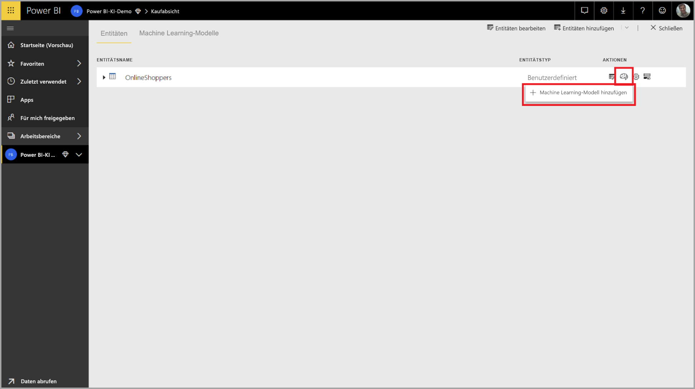
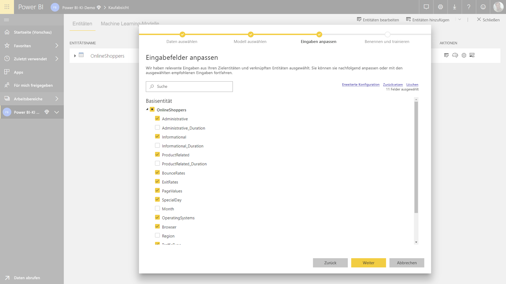
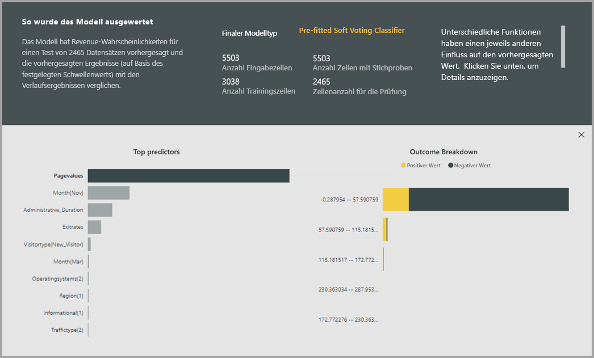
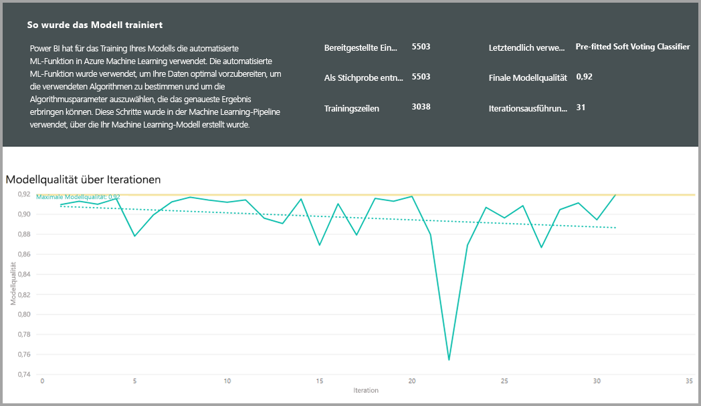
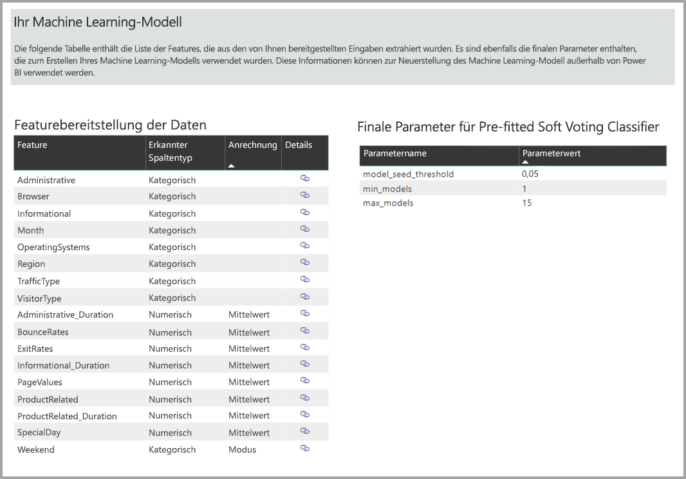
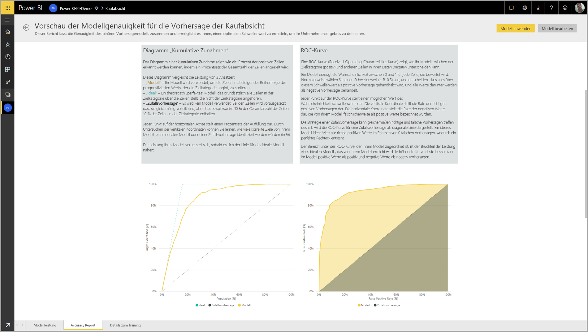
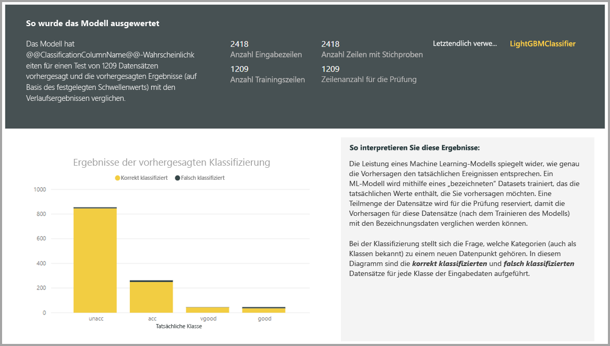
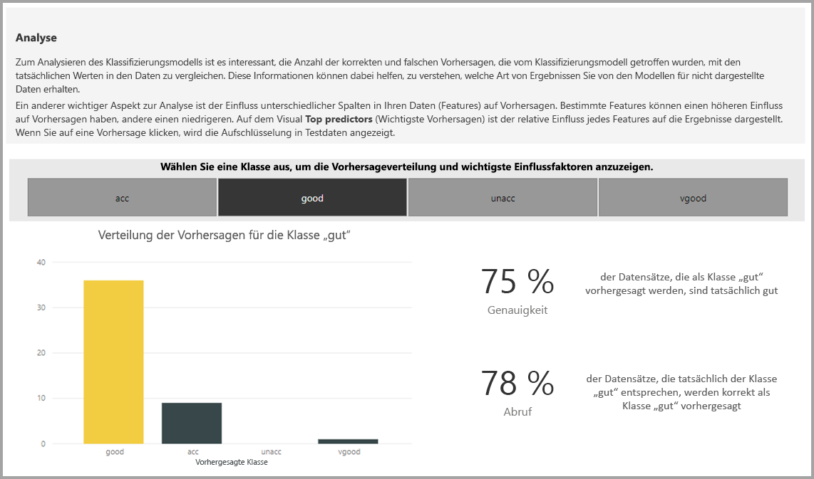
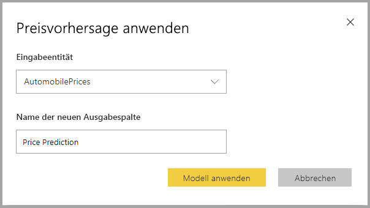

# Automatisiertes Machine Learning in Power BI (Vorschauversion)

Automatisierte für maschinelles lernen (AutoML) für Datenflüsse kann Wirtschaftsanalytiker zum Trainieren, zu überprüfen, und rufen Sie Machine Learning-Modelle direkt in Power BI. Es enthält eine einfache Oberfläche zum Erstellen eines neuen ML-Modells, in dem Analysten die Datenflüsse verwenden können, um die Eingabedaten zum Trainieren des Modells anzugeben. Der Dienst automatisch extrahiert die wichtigsten Funktionen, einen entsprechenden Algorithmus ausgewählt und optimiert und überprüft das ML-Modell. Nachdem ein Modell trainiert ist, generiert Power BI automatisch einen Bericht, der die Ergebnisse der Überprüfung, die erklärt, die Leistung und Analysten Ergebnisse enthält. Das Modell kann dann für alle neuen oder aktualisierten Daten in den Datenfluss aufgerufen werden.

Automatisierte Machine Learning ist verfügbar für Datenflüsse, die auf Power BI Premium und Embedded-Kapazitäten gehostet werden. In dieser Vorschau kann AutoML Sie Machine Learning-Modelle für binäre Vorhersage, Klassifizierung und Regression-Modelle zu trainieren.

## Arbeiten mit AutoML

[Power BI-Datenflüsse](service-dataflows-overview.md) Self-Service Data Prep für big Data bieten. AutoML können Sie Ihre Data Prep Aufwand zum Erstellen von Machine Learning-Modellen, direkt in Power BI zu nutzen.

AutoML in Power BI kann Datenanalysten Datenflüsse zu verwenden, um das Erstellen von Machine Learning-Modelle mit einer vereinfachten Oberfläche, mit nur Power BI-Fertigkeiten. Die meisten der Data Science hinter die Erstellung von ML-Modellen wird von Power BI mit Sicherungen, um sicherzustellen, dass das Modell erstellt guter Qualität und Transparenz für die vollständige einen Einblick in den Prozess zum Erstellen Ihrer ML-Modells geben automatisiert.

AutoML unterstützt die Erstellung von **binäre Vorhersage**, **Klassifizierung**, und **Regression** Modelle für Datenflüsse. Dies sind die Typen von überwachten Machine Learning-Modellen, was bedeutet, dass sie aus die bekannte Ergebnisse der letzten Beobachtungen Vorhersage der Ergebnisse von anderen Beobachtungen lernen. Das Eingabedataset für das training eines Modells AutoML ist eine Gruppe von Datensätzen, die **mit der Bezeichnung** mit den bekannten Ergebnissen.

AutoML in Power BI integriert [automatisierte ML](https://docs.microsoft.com/azure/machine-learning/service/concept-automated-ml) aus der [Azure Machine Learning-Dienst](https://docs.microsoft.com/azure/machine-learning/service/overview-what-is-azure-ml) die ML-Modelle zu erstellen. Allerdings benötigen Sie ein Azure-Abonnement Sie AutoML in Power BI verwenden, nicht an. Der Prozess der Trainings- und Hosten der ML-Modelle wird vollständig von Power BI-Dienst verwaltet.

Nachdem ein ML-Modell trainiert ist, generiert AutoML automatisch einen Power BI-Bericht, der die Leistung wahrscheinliche Ihre ML-Modell erläutert. AutoML betont Explainability, durch die wichtigen Einflussfaktoren für Ihre Eingaben, die beeinflussen, die zurückgegeben werden, indem Sie Ihr Modell Vorhersagen hervorheben. Der Bericht enthält auch wichtige Metriken für das Modell, abhängig vom Modelltyp ML.

Andere Seiten des generierten Berichts zeigen die statistische Zusammenfassung des Modells und die Training-Details. Die statistische Zusammenfassung ist relevant für Benutzer, die die Data Science-Measures der Leistung für das Modell anzeigen möchten. Die Details des Trainings werden alle Iterationen, die ausgeführt wurden, um Ihr Modell zu erstellen, mit den zugehörigen Modellierung Parametern zusammengefasst. Es wird beschrieben, wie jede Eingabe zum Erstellen des ML-Modells verwendet wurde.

Sie können dann Ihre ML-Modell auf Ihre Daten für die Bewertung anwenden. Wenn der Datenfluss aktualisiert wird, werden die Vorhersagen aus dem ML-Modell auf Ihre Daten automatisch angewendet. Powerbi enthält auch eine individuelle Erläuterung für jeden bestimmten Vorhersageergebnis, die von der ML-Modell erstellt.

## Erstellen eines Machine Learning-Modells

Dieser Abschnitt beschreibt, wie Sie ein AutoML-Learning-Modell zu erstellen. 

### Die datenvorbereitung für die Erstellung eines ML-Modells

Um ein Machine Learning-Modell in Power BI zu erstellen, müssen Sie zunächst einen Datenfluss für die Daten mit historischen Ergebnisinformationen verwendet, erstellen die zum Trainieren des Modells ML verwendet wird. Weitere Informationen zum Konfigurieren Ihres Datenflusses finden Sie unter [in Power BI für die Vorbereitung von Self-service-](service-dataflows-overview.md).

In der aktuellen Version verwendet Power BI Daten aus nur einer einzigen Entität, um den ML-Modell zu trainieren. Also wenn Ihre historischen Daten von mehreren Entitäten bestehen zu können, müssen Sie manuell die Daten in eine einzelne Dataflow-Entität verknüpfen. Sie sollten auch berechnete Spalten für alle Geschäftsmetriken hinzufügen, die starke Indikatoren für das Ergebnis sein können, die Sie vorhersagen möchten.

AutoML gelten bestimmte Daten zum Trainieren eines Machine learning-Modell. Diese Anforderungen werden in den folgenden Abschnitten beschrieben basierend auf den jeweiligen Modelltypen.

### Konfigurieren die Eingaben der ML-Modell

Um ein AutoML-Modell zu erstellen, wählen Sie das Symbol "ML" in der **Aktionen** Spalte die Datenfluss-Entität mit dem historischen Daten, und wählen **ein Machine Learning-Modell hinzufügen**.

Eine vereinfachte Umgebung wird gestartet, bestehend aus einen Assistenten, der Sie durch den Prozess zum Erstellen des ML-Modells geleitet. Der Assistent umfasst die folgenden einfachen Schritte.

1. Wählen Sie die Entität mit dem der historischen Ergebnisdaten und das Feld für das eine Vorhersage werden soll
2. Wählen Sie ein Modell basierend auf den Typ der Vorhersage, die Sie, finden Sie unter möchten
3. Wählen Sie die Eingaben, die Sie das Modell als predictive Signalen verwendet werden soll
4. Benennen Sie Ihr Modell, und speichern Sie Ihre Konfiguration

Das Feld Verlauf Ergebnis identifiziert das Bezeichnungsattribut "für das Trainieren von ML-Modell, in der folgenden Abbildung dargestellt.

Wenn Sie das Feld Verlauf Ergebnis angeben, wird AutoML analysiert die bezeichnungsdaten zum Identifizieren von ML-Modellen, die für diese Daten trainiert werden können, und schlägt vor der wahrscheinlich ML-Modell-Typ, der trainiert werden kann. 

> [!NOTE]
> Einige Modelltypen möglicherweise nicht für die Daten unterstützt werden, die Sie ausgewählt haben.

AutoML analysiert auch alle Felder in der ausgewählten Entität zum Vorschlagen von Eingaben, die zum Trainieren des Modells ML verwendet werden können. Dieser Prozess ist ein ungefährer Wert und basiert auf statistischen Analysen, sodass Sie die Eingaben verwendet berücksichtigen. Alle Eingaben, die das Feld Verlauf Ergebnis (oder das Bezeichnungsfeld) abhängig sind, sollte nicht verwendet werden, für das training von der ML-Modell, da sie die Leistung auswirkt.

Im letzten Schritt können Sie nennen Sie das Modell und seine Einstellungen zu speichern.

Zu diesem Zeitpunkt werden Sie aufgefordert, den Datenfluss, das Training zu für den ML-Modell beginnt zu aktualisieren.

### ML-modelltrainings

Trainieren von Modellen für AutoML ist Teil der Aktualisierung der Datenfluss. AutoML wird zuerst die Daten für das Training vorbereitet.

AutoML teilt die historischen Daten, die Sie in einen Trainings- und testdatasets bereitstellen. Das Test-Dataset ist ein Dataset mit zurückgehaltenen, die zum Überprüfen der Leistung nach dem Training des Modells verwendet wird. Diese werden als realisiert **Trainings- und Testsätze** Entitäten in den Datenfluss. AutoML verwendet die kreuzvalidierung für die modellvalidierung.

Als Nächstes jedes Eingabefeld wird analysiert und angewendet wird, die fehlenden Werte durch ersetzt Werte ersetzt. Eine Reihe von Strategien für die verschiedenen Imputation von AutoML verwendet werden. Anschließend werden alle erforderlichen Sampling und die Normalisierung auf Ihre Daten angewendet.

AutoML betrifft mehrere Transformationen sind die einzelnen ausgewählten Eingabefelds basierend auf den Datentyp und der statistischen Eigenschaften. AutoML verwendet diese Transformationen, um Funktionen für die Verwendung beim training des Modells ML zu extrahieren.

Der Trainingsprozess für AutoML Modelle bestehen aus bis zu 50 Iterationen mit verschiedenen Modellierung-Algorithmen und Hyperparameter-Einstellungen, um das Modell mit der besten Leistung ermitteln. Die Leistung jedes dieser Modelle wird durch das Test-Dataset für Zurückgehaltene Daten die Überprüfung bewertet. Während dieses Schritts Training erstellt AutoML mehrere Pipelines für Trainings-und validierungsdatasets und von diesen Iterationen. Der Prozess des bewertens von der Leistung der Modelle kann an einer beliebigen Stelle von ein paar Stunden, je nach Größe Ihres Datasets und die verfügbaren Ressourcen für dedizierte Kapazität, die einige Minuten dauern.

In einigen Fällen können Sie das endgültige Modell generierten Ensemble learning, in denen mehrere Modelle verwendet werden, um besser vorhersagbare Leistung zu erzielen.

### AutoML Modell explainability

Nachdem das Modell trainiert wurde, analysiert AutoML die Beziehung zwischen die Eingabefeatures und die Ausgabe des Modells. Es bewertet die Größe und Richtung der Änderung, die die Ausgabe des Modells für das Test-Dataset von zurückgehaltenen Daten für jede Eingabe-Funktion. Dies bezeichnet man als den *feature Wichtigkeit*.

### AutoML Modellbericht

AutoML generiert Power BI-Berichten, die die Leistung des Modells bei der Validierung, zusammen mit der globalen funktionsgewichtung zusammenfasst. Der Bericht enthält eine Zusammenfassung der Ergebnisse aus das ML-Modell für die Testdaten für Zurückgehaltene Daten anwenden und die Vorhersagen mit die bekannte Ergebniswerte vergleichen.

Sie können den Modellbericht, um die Leistung nachzuvollziehen überprüfen. Sie können auch überprüfen, dass die wichtigen Einflussfaktoren des Modells mit Business Informationen zu den bekannten Ergebnissen ausgerichtet sind.

Die Diagramme und Measures verwendet, um die Leistung des Modells im Bericht zu beschreiben, hängen von den Typ des Modells ab. Diese Leistungsdiagramme und die Measures werden in den folgenden Abschnitten beschrieben.

Zusätzliche Seiten im Bericht unter Umständen die statistischen Measures über das Modell von Data Science-Perspektive beschreiben. Z. B. die **binäre Vorhersage** Bericht enthält ein Diagramm erhalten und die ROC-Kurve für das Modell.

Die Berichte beinhalten auch einen **Schulungsdetails** Seite, die auch eine Beschreibung, wie das Modell trainiert wurde, und enthält ein Diagramm, beschreibt die Leistung des Modells für alle Iterationen ausgeführt wird.

Einem anderen Abschnitt auf dieser Seite beschreibt, wie die Imputation-Methode verwendet für das Ausfüllen der fehlender Werten für die Eingabefelder, auch wie jedes Eingabefeld transformiert wurde, um die im Modell verwendeten Funktionen zu extrahieren. Darüber hinaus die von dem endgültigen Modell verwendeten Parameter.

Wenn das Modell erzeugt Ensemble Learning verwendet die **Schulungsdetails** Seite enthält auch einen Abschnitt, der die Gewichtung jedes einzelnen Modells in dem Ensemble als auch die Parameter beschreibt.

## Das Modell AutoML anwenden

Wenn Sie die Leistung der ML-Modell erstellt haben, zufrieden sind, können Sie es auf neue oder aktualisierte Daten anwenden, Ihres Datenflusses aktualisiert wird. Sie können dazu den Modellbericht durch Auswählen der **übernehmen** Schaltfläche in der oberen rechten Ecke.

Um den ML-Modell anwenden zu können, müssen Sie den Namen der Entität, die angewendet werden muss, und ein Präfix für die Spalten angeben, die an dieser Entität für die Ausgabe des Modells hinzugefügt werden. Das Standardpräfix für die Spaltennamen ist der Name des Modells. Die *übernehmen* Funktion kann zusätzliche Parameter für den Typ des Modells enthalten.

Anwenden der ML-Modell erstellt Sie eine neue Dataflow-Entität mit dem Suffix **erweitert < Model_name >** . Z. B. Wenn Sie anwenden der _PurchaseIntent_ Modell der _OnlineShoppers_ Entität, die Ausgabe generiert die **OnlineShoppers bereichert PurchaseIntent**.

Derzeit kann nicht die Ausgabe-Entität verwendet werden, um eine Vorschau der Ergebnisse des ML-Modell im Power Query-Editor anzeigen. Die Ausgabespalten zeigen als Ergebnis immer null. Zum Anzeigen der Ergebnisse ausgeben eine Sekunde Entität mit dem Suffix **erweitert < Model_name > Vorschau** wird erstellt, wenn das Modell angewendet wird.

Sie müssen den Datenfluss aus, um eine Vorschau der Ergebnisse im Abfrage-Editor aktualisieren.

Wenn Sie das Modell anwenden, speichert AutoML immer Ihre Vorhersagen auf dem neuesten Stand der Datenfluss aktualisiert wird.

AutoML enthält auch eine individuelle Erläuterung für jede Zeile, die er bewertet, in der Ausgabe-Entität.

Um die Einblicke und Prognosen aus dem ML-Modell in Power BI-Berichten verwenden möchten, können Sie mit der Ausgabe-Entität verbinden, von der Verwendung von Power BI Desktop die **Datenflüsse** Connector.

## Binäre Vorhersagemodelle

Binäre Vorhersagemodelle, früher mehr als **binärer klassifizierungsmodelle**, werden verwendet, um ein Dataset in zwei Gruppen zu klassifizieren. Sie werden verwendet, um Ereignisse vorherzusagen, die stehen ein binäres Ergebnisses, z. B., ob eine Verkaufschance konvertieren wird, ob ein Konto abwandern werden, ob eine Rechnung Zeit bezahlt wird; Gibt an, ob eine Transaktion betrügerische usw. ist.

Da das Ergebnis in Binärreihenfolge vorliegt, Power BI erwartet, dass die Bezeichnung für ein Modell binäre Vorhersage ein boolescher Wert, mit bekannten Ergebnissen wird mit der Bezeichnung **"true"** oder **"false"** . Z. B. in einem Modell Absatzmöglichkeiten Konvertierung Verkaufschancen, die gewonnen wurden, sind "true" gekennzeichnet, die verloren gegangen sind "false" gekennzeichnet, und der offenen Verkaufschancen tragen die Bezeichnung null.

Die Ausgabe eines Modells für binäre Vorhersage ist eine wahrscheinlichkeitsbewertung, die die Wahrscheinlichkeit gibt an, dass das Ergebnis entsprechend dem Label-Wert "true" wird erreicht werden.

### Trainieren eines Modells für binäre Vorhersage

Um ein Modell für die binäre Vorhersage erstellen zu können, müssen die Eingabe-Entität mit den Trainingsdaten ein boolesches Feld als Ergebnisfeld historische, um den letzten bekannten Ergebnissen zu bestimmen.

Voraussetzungen:

* Ein boolesches Feld muss als der historische Ergebnisfeld verwendet werden
* Mindestens 50 Zeilen mit Verlaufsdaten ist erforderlich für jede Klasse von Ergebnissen

Wenn die letzten Ergebnisse, die durch die Felder mit einem anderen Datentyp identifiziert werden, können Sie in der Regel eine berechnete Spalte aus, um diese in einen booleschen Wert, der mithilfe von Power Query Transformation hinzufügen.

Der Prozess der Erstellung für ein Modell für die binäre Vorhersage gleich folgt wie andere AutoML Modelle im Abschnitt beschriebenen Schritte **konfigurieren die Eingaben der ML-Modell** oben.

### Binäre vorhersagebericht Modell

Das binäre Vorhersage-Modell, die als Ausgabe erzeugt einer Wahrscheinlichkeit, dass ein Datensatz auf das Ergebnis durch den booleschen Label-Wert "true" fest definierten erreicht wird. Der Bericht enthält einen Slicer für den wahrscheinlichkeitsschwellenwert, der wodurch beeinflusst, wie die Ergebnisse über und unter dem wahrscheinlichkeitsschwellenwert interpretiert werden.

Der Bericht zeigt die Leistung des Modells hinsichtlich der *wahren positiven Ergebnissen*, *falsch positive Ergebnisse*, *WAHR negativ* und *falsche negative*. "True" und "true" negativer Ergebnisse sind richtig vorhergesagten Ergebnisse für die beiden Klassen in den Ergebnisdaten. Falsch positive Ergebnisse sind die Ergebnisse, die die Bezeichnung der tatsächlichen booleschen Wert "false", das aber als "true" vorhergesagt wurden. Im Gegensatz dazu sind falsch negative Ergebnisse Ergebnisse, in denen die jeweiligen Beschriftungswert boolesche "true", aber als "false" vorhergesagt wurden.

Measures, z. B. Präzision und Sensitivität besteht, werden die Auswirkungen der wahrscheinlichkeitsschwellenwert für die vorhergesagten Ergebnisse beschrieben. Die Wahrscheinlichkeit Schwellenwert Slicer können Sie einen Schwellenwert wählen, der einen ausgewogenen Kompromiss zwischen Präzision und Sensitivität erzielt.

Die **Genauigkeit Bericht** Seite des Berichts Modell enthält die *Kumulative Zunahmen* Diagramm und die ROC-Kurve für das Modell. Hierbei handelt es sich um statistische Messwerte der Leistung des Modells. Die Berichte enthalten Beschreibungen der Diagramme angezeigt.

### Anwenden eines Modells für binäre Vorhersage

Um eine binäre Vorhersage Modell anwenden zu können, müssen Sie die Entität mit den Daten angeben, die Vorhersagen aus dem ML-Modell angewendet werden soll. Andere Parameter umfassen das Namenspräfix des Ausgabe-Spalte und der wahrscheinlichkeitsschwellenwert für das vorhergesagte Ergebnis zu klassifizieren.

Wenn eine binäre Vorhersage Modell angewendet wird, werden die Ausgabe der erweiterten Entität drei Ausgabespalten hinzugefügt. Dies sind die **PredictionScore**, **PredictionOutcome** und **PredictionExplanation**. Die Spaltennamen in der Entität haben das Präfix angegeben werden, wenn das Modell angewendet wird.

Die **PredictionOutcome** Spalte enthält das vorhergesagte Ergebnis. Datensätze mit den Wahrscheinlichkeiten der Schwellenwert überschritten werden vorhergesagt, wie wahrscheinlich das Ergebnis zu erzielen, und die darunter werden vorhergesagt, wie es unwahrscheinlich, dass das Ergebnis zu erzielen.

Die **PredictionExplanation** Spalte enthält eine Erläuterung mit bestimmten auswirken, die die eingegebenen Merkmale mussten, auf die **PredictionScore**. Dies ist eine JSON-formatierte-Auflistung von Gewichtungen von die eingegebenen Merkmale für die Vorhersage.

## klassifizierungsmodelle

Klassifizierungsmodelle werden verwendet, um ein Dataset in mehrere Gruppen oder Klassen zu klassifizieren.  Sie werden verwendet, um Ereignisse vorherzusagen, die eine der mehrere mögliche Ergebnisse geben, z. B. ein Kunde wahrscheinlich ein sehr hoch, hoch, Mittel oder niedriger Wert für die Lebensdauer haben kann; Gibt an, ob das Risiko für standardmäßige hoch "," Mittel "," Niedrig "oder" sehr niedrig ist. Und so weiter.

Die Ausgabe eines Klassifizierungsmodells des Typs ist eine wahrscheinlichkeitsbewertung, die die Wahrscheinlichkeit angibt, dass ein Datensatz die Kriterien für eine bestimmte Klasse erreicht wird.

### Trainieren eines Klassifizierungsmodells des Typs

Die Eingabe-Entität, die Ihre Daten Trainieren eines Klassifizierungsmodells des Typs enthält muss eine Zeichenfolge oder ein numerisches Feld als Ergebnisfeld historische verfügen, die den letzten bekannten Ergebnissen identifiziert.

Voraussetzungen:

* Mindestens 50 Zeilen mit Verlaufsdaten ist erforderlich für jede Klasse von Ergebnissen

Der Prozess der Erstellung für ein Klassifizierungsmodells des Typs identisch folgt wie andere AutoML Modelle im Abschnitt beschriebenen Schritte **konfigurieren die Eingaben der ML-Modell** oben.

### Klassifikationsbericht-Modell

Die Klassifizierung, die Modellbericht erstellt wird, durch Anwenden von ML-Modell auf die zurückgehaltenen Daten Testen von Daten und vergleichen die vorhergesagte Klasse für einen Datensatz mit der tatsächlichen bekannte-Klasse.

Der Modellbericht enthält ein Diagramm, das die Aufschlüsselung der Datensätze für jede bekannte Klasse richtig und falsch klassifizierter Daten enthält.

Eine weitere mandantenklassen geltenden schemaanpassungen Drilldown ermöglicht eine Analyse der, wie die Vorhersagen für eine bekannte Klasse verteilt werden. Dies schließt die anderen Klassen, die in die Datensätze, die bekannt Klasse falsch klassifiziert werden wahrscheinlich sind.

Die Erklärung "Modell" im Bericht enthält auch die oberen prädiktoren für jede Klasse.

Das Modell klassifikationsbericht enthält auch eine Schulungsdetails-Seite, die zu den Seiten für andere Modelltypen, ähnlich wie beschrieben im Abschnitt **AutoML Modellbericht** weiter oben in diesem Artikel.

### Anwenden eines klassifizierungsmodells des Typs

Um eine Klassifizierung ML-Modell anwenden zu können, müssen Sie die Entität mit den Eingabedaten und die Ausgabe-Spaltennamenpräfix angeben.

Wenn ein klassifizierungsmodell angewendet wird, fügt es hinzu, dass drei Ausgabe der Spalten für die Ausgabe der erweiterten Entität. Dies sind die **PredictionScore**, **PredictionClass** und **PredictionExplanation**. Die Spaltennamen in der Entität haben das Präfix angegeben werden, wenn das Modell angewendet wird.

Die **PredictionClass** Spalte enthält, die in den meisten Fällen vorhergesagte Klasse für den Datensatz. Die **PredictionScore** Spalte enthält die Liste der Bewertungen der Wahrscheinlichkeit für den Datensatz für jede mögliche-Klasse.

Die **PredictionExplanation** Spalte enthält eine Erläuterung mit bestimmten auswirken, die die eingegebenen Merkmale mussten, auf die **PredictionScore**. Dies ist eine JSON-formatierte-Auflistung von Gewichtungen von die eingegebenen Merkmale für die Vorhersage.

## regressionsmodelle

Regressionsmodelle werden verwendet, um einen Wert ein, z. B. den Umsatz wahrscheinlich realisiert werden, ein Maß Umsätze, den Wert für die Lebensdauer eines Kontos ein, die Menge an eine empfangende Rechnung, die wahrscheinlich zu dem Datum gezahlt werden, auf dem eine Rechnung bezahlt werden möglicherweise, von Vorhersagen Und so weiter.

Die Ausgabe eines Regressionsmodells ist der vorhergesagte Wert.

### Trainieren eines Regressionsmodells

Die Eingabe-Entität, enthält die Trainingsdaten für ein Regressionsmodell benötigen ein numerisches Feld als der historische Ergebnisfeld, der die letzten bekannten Ergebniswerte identifiziert.

Voraussetzungen:

* Mindestens 100 Zeilen mit Verlaufsdaten muss zu einem Regressionsmodell

Der Prozess der Erstellung für ein Regressionsmodell die gleiche folgt als andere AutoML Modelle im Abschnitt beschriebenen Schritte **konfigurieren die Eingaben der ML-Modell** oben.

### Regression Model-Bericht

Der Regression Bericht basiert wie die anderen AutoML Modell Berichte auf die Ergebnisse des Anwendens des Modells für die Testdaten für Zurückgehaltene Daten verwendet wird.

Der Modellbericht enthält, ein Diagramm, in dem die vorhergesagten Werte mit dem Istwert verglichen wird. In diesem Diagramm gibt der Abstand zwischen der diagonale den Fehler der Vorhersage.

Residual Fehler Diagramm zeigt die Verteilung des Prozentsatzes von durchschnittlichen Fehler für verschiedene Werte im testdataset Zurückgehaltene Daten. Die horizontale Achse stellt den Mittelwert der den tatsächlichen Wert für die Gruppe mit der Größe der Blase wird die Häufigkeit oder die Anzahl der Werte in diesem Bereich angezeigt. Die vertikale Achse ist der durchschnittliche residual-Fehler.

Die Regression Model-Bericht enthält auch eine Schulungsdetails-Seite wie die Berichte für andere Modelltypen, wie beschrieben im Abschnitt **AutoML Modellbericht** oben.

### Anwenden eines Regressionsmodells

Um eine Regression ML-Modell anwenden zu können, müssen Sie die Entität mit den Eingabedaten und die Ausgabe-Spaltennamenpräfix angeben.

Wenn ein Regressionsmodell angewendet wird, werden die erweiterten Ausgabe Entität zwei Ausgabespalten hinzugefügt. Dies sind die **PredictionValue**, und **PredictionExplanation**. Die Spaltennamen in der Entität haben das Präfix angegeben werden, wenn das Modell angewendet wird.

Die **PredictionValue** Spalte enthält den vorhergesagten Wert für den Datensatz basierend auf den Eingabefeldern. Die **PredictionExplanation** Spalte enthält eine Erläuterung mit bestimmten auswirken, die die eingegebenen Merkmale mussten, auf die **PredictionValue**. Dies ist eine JSON-formatierte-Auflistung von Gewichtungen von die eingegebenen Merkmale.

## Nächste Schritte

Dieser Artikel enthält eine Übersicht über automatisierte Machine Learning für Datenflüsse im Power BI-Dienst. In den folgenden Artikeln können auch nützlich sein.

* [Tutorial: Erstellen eines Machine Learning-Modells in Power BI (Vorschau)](service-tutorial-build-machine-learning-model.md)
* [Tutorial: Verwenden von Cognitive Services in Power BI](service-tutorial-use-cognitive-services.md)
* [Tutorial: Aufrufen eines Machine Learning Studio-Modells in Power BI (Vorschau)](service-tutorial-invoke-machine-learning-model.md)
* [Cognitive Services in Power BI (Vorschau)](service-cognitive-services.md)
* [Azure Machine Learning-Integration in Power BI (Vorschau)](service-machine-learning-integration.md)

Weitere Informationen zu Dataflows finden Sie in den folgenden Artikeln:
* [Erstellen und Verwenden von Dataflows in Power BI](service-dataflows-create-use.md)
* [Verwenden berechnete Elemente in Power BI Premium](service-dataflows-computed-entities-premium.md)
* [Verwenden Datenflüsse mit lokalen Datenquellen](service-dataflows-on-premises-gateways.md)
* [Entwicklerressourcen für Power BI-Datenflüsse](service-dataflows-developer-resources.md)
* [Dataflows und Integration in Azure Data Lake (Vorschauversion)](service-dataflows-azure-data-lake-integration.md)

