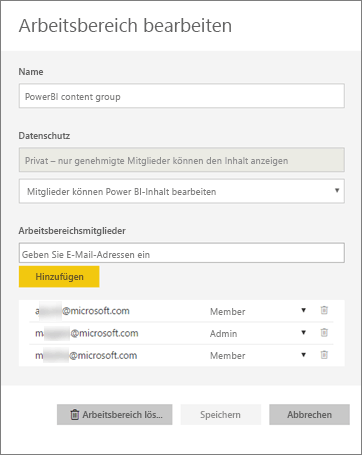
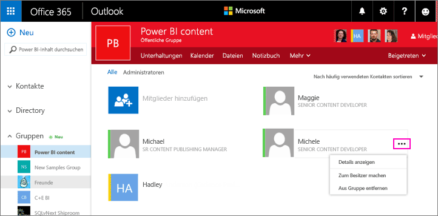
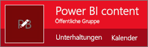
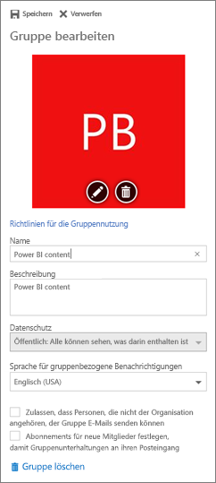

# Verwalten Ihres App-Arbeitsbereichs in Power BI und Office 365
Als Ersteller oder Administrator eines [App-Arbeitsbereichs in Power BI](service-create-distribute-apps.md) oder in Office 365 verwalten Sie einige Aspekte des Arbeitsbereichs in Power BI. Andere Aspekte werden in Office 365 verwaltet. 

> [!NOTE]
> Die Vorschauversion der neuen Arbeitsbereiche ändert die Beziehung zwischen Power BI-Arbeitsbereichen und Office 365-Gruppen. Office 365-Gruppen werden nicht jedes Mal automatisch erstellt, wenn Sie einen dieser neuen Arbeitsbereiche erstellen. Erfahren Sie mehr über [das Erstellen der neuen Arbeitsbereiche (Vorschau)](service-create-the-new-workspaces.md).

**In Power BI** können Sie folgende Aktionen ausführen:

* Hinzufügen oder Entfernen von App-Arbeitsbereichsmitgliedern, einschließlich Hinzufügen eines Administrators
* Bearbeiten des Namens des App-Arbeitsbereichs
* Löschen des App-Arbeitsbereichs

**In Office 365** können Sie folgende Aktionen ausführen:

* Hinzufügen oder Entfernen von Gruppenmitgliedern im Arbeitsbereich der App und Festlegen eines Mitglieds als Administrator.
* Bearbeiten des Gruppennamens, des Images, der Beschreibung und anderer Einstellungen.
* Anzeigen der E-Mail-Adresse der Gruppe
* Löschen der Gruppe

Sie benötigen eine [Power BI Pro](service-features-license-type.md)-Lizenz, damit Sie Administrator oder Mitglied eines App-Arbeitsbereichs sein können. Ihre App-Benutzer benötigen ebenfalls eine Power BI Pro-Lizenz, es sei denn, der App-Arbeitsbereich befindet sich in einer Power BI Premium-Kapazität. Details finden Sie unter [Was ist Power BI Premium?](service-premium.md).

## Verwalten Ihres App-Arbeitsbereichs in Power BI
1. Wählen Sie im Power BI-Dienst den Pfeil neben **Arbeitsbereiche** aus, wählen Sie die Auslassungspunkte (**...**) neben dem Namen Ihres Arbeitsbereichs aus, und wählen Sie **Arbeitsbereich bearbeiten** aus. 
   
   
   
   > [!NOTE]
   > Die Option **Arbeitsbereich bearbeiten** wird nur dann angezeigt, wenn Sie ein Administrator des App-Arbeitsbereichs sind.
   > 
   > 
2. Hier können Sie Mitglieder umbenennen, hinzufügen oder entfernen bzw. den App-Arbeitsbereich löschen. 
   
   
3. Wählen Sie **Speichern** oder **Abbrechen**aus.

## Bearbeiten von Eigenschaften des Power BI-App-Arbeitsbereichs in Office 365
1. Wählen Sie im Power BI-Dienst den Pfeil neben **Arbeitsbereiche** aus, wählen Sie die Auslassungspunkte (**...**) neben dem Namen Ihres Arbeitsbereichs aus, und wählen Sie **Mitglieder** aus. 
   
   
   
   Daraufhin wird die Outlook für Office 365-Gruppenansicht Ihres App-Arbeitsbereichs geöffnet.
   
   Sie müssen sich möglicherweise mit Ihrem Geschäftskonto anmelden.
2. Tippen Sie auf die Auslassungspunkte (**...**) neben dem Namen eines Mitglieds, um das Mitglied als Administrator hinzuzufügen oder aus dem App-Arbeitsbereich zu löschen. 
   
   

## Hinzufügen eines Bilds und Festlegen anderer Eigenschaften des Arbeitsbereichs in der Office 365-Gruppe
Wenn Sie Ihre App aus dem App-Arbeitsbereich verteilen, wird das Bild, das Sie hier hinzufügen, das Bild für Ihre App sein. Weitere Informationen finden Sie im Abschnitt [Hinzufügen eines Bilds zu Ihrer App](service-create-workspaces.md#add-an-image-to-your-office-365-app-workspace-optional) im Artikel [Create the new workspaces (Erstellen der neuen Arbeitsbereiche)](service-create-workspaces.md).

1. Wählen Sie in der Outlook für Office 365-Ansicht Ihres App-Arbeitsbereichs das Gruppenbild aus, um die Eigenschaften des Gruppenarbeitsbereichs zu bearbeiten.
   
   
2. Sie können den Namen, die Beschreibung und die Sprache bearbeiten, ein Bild hinzufügen und andere Eigenschaften festlegen.
   
   
3. Wählen Sie **Speichern** oder **Verwerfen**.

## Nächste Schritte
* [Veröffentlichen von Apps mit Dashboards und Berichten in Power BI](service-create-distribute-apps.md)
* Weitere Fragen? [Wenden Sie sich an die Power BI-Community](http://community.powerbi.com/)

