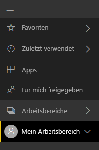
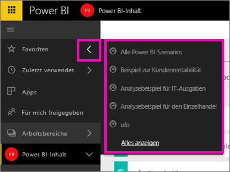
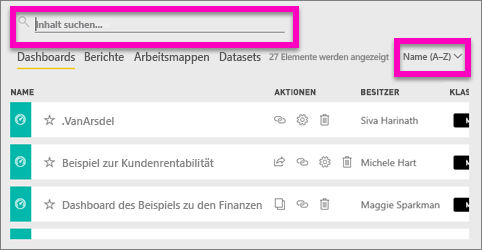
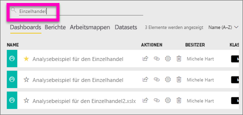
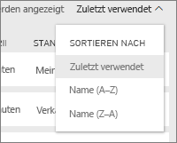

# Suchen und Sortieren von Inhalten in Power BI
Die Kombination von automatisierter Power BI-Organisation, Benutzermarkierung, Suchen und Sortieren ermöglicht es Ihnen, schnell die gewünschten Elemente im Power BI-Dienst zu finden.

## So erleichtert Ihnen Power BI das Navigieren in Inhalten
Der Power BI-Dienst organisiert Inhalte auf verschiedene Weise.  Erstens werden die Inhalte in Dashboards, Berichten, Arbeitsmappen und Datasets aufgeteilt. Viele der Power BI-Bildschirme sind auf diese Weise organisiert. Außerdem klassifiziert der Power BI-Dienst die Inhalte so, dass Sie das Gesuchte einfacher und schnell finden. Betrachten Sie den linken Navigationsbereich.

Inhalte, die Sie zur eigenen Verwendung erstellen, sind in **Mein Arbeitsbereich** verfügbar, Inhalte, die Sie erstellen und für eine Gruppe freigeben, sind in einem **App-Arbeitsbereich** verfügbar, Inhalte, auf die Sie schnell zugreifen möchten, werden in **Favoriten** gespeichert, Inhalte, die für Sie freigegeben wurden, sind in **Für mich freigegeben verfügbar**, und die Inhalte, die Sie zuletzt angezeigt haben, sind außerdem in **Zuletzt verwendet** verfügbar.

Weitere Informationen finden Sie unter [Power BI – Grundkonzepte des Power BI-Diensts](service-basic-concepts.md).

> **HINWEIS:** Eine weitere Möglichkeit zum Organisieren Ihrer Inhalte besteht darin, das Dashboard auszuwählen, das Sie voraussichtlich am häufigsten anzeigen, und als *ausgewähltes* Dashboard festzulegen. Immer wenn Sie den Power BI-Dienst öffnen, wird dieses Dashboard zuerst angezeigt. Weitere Informationen finden Sie unter [Ausgewählte Dashboards in Power BI](service-dashboard-featured.md).
> 
> 

## Als Favoriten festgelegte Dashboards und Apps
Haben Sie eine Reihe von Dashboards und Apps, die Sie häufig aufrufen? Sie können sie [als Favoriten *festlegen*](service-dashboard-favorite.md), damit sie im linken Navigationsbereich immer verfügbar sind.

.

Das Arbeiten mit Favoriten wird im Artikel [Als Favoriten gespeicherte Dashboards im Power BI-Dienst](service-dashboard-favorite.md) ausführlicher beschrieben.

## Suchen und Sortieren in Arbeitsbereichen
Ein Arbeitsbereich verfügt über vier Registerkarten für Inhalte: Dashboards, Berichte, Arbeitsmappen und Datasets.  Jede dieser Registerkarten enthält ein Suchfeld und eine Sortierschaltfläche.  Wenn Sie gerade mit der Verwendung des Power BI-Diensts beginnen, finden Sie diese eventuell nicht hilfreich, da jede Registerkarte nur ein oder zwei Elemente enthält.  Im Lauf der Zeit können die Inhalte jedoch zu umfangreichen Listen anwachsen.  Mit den Such- und Sortierfunktionen können Sie leicht die gewünschten Elemente finden.

* Geben Sie einen Suchbegriff ein, um im aktuellen Bildschirm eine Übereinstimmung zu finden.
  
   
* Wählen Sie die Sortierschaltfläche aus, um Optionen für die aktuelle Seite anzuzeigen. Sie können nach Name oder Besitzer sortieren.
  
   

## Zu beachtende Aspekte und Problembehandlung
* Für Datasets kann mit der Option **Sortieren nach** nicht nach Besitzer sortiert werden.

## Nächste Schritte
[Power BI – Grundkonzepte](service-basic-concepts.md)

Weitere Fragen? [Wenden Sie sich an die Power BI-Community](http://community.powerbi.com/)

