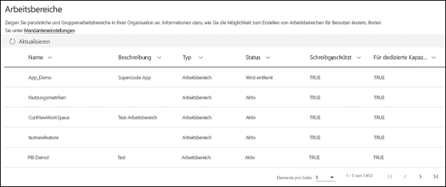

# Organisieren Sie Aufgaben in die neue Arbeitsbereiche in Power BI

 *Arbeitsbereiche* stellen einen Ort für die Zusammenarbeit mit Kollegen zum Erstellen von Sammlungen von Dashboards, Berichten und paginierten Berichten. Die neue Oberfläche für den Arbeitsbereich können Sie den Zugriff auf Inhalte besser zu verwalten. Dieser Artikel beschreibt die neue Arbeitsbereiche, und wie sie in der klassischen Arbeitsbereichen unterscheiden.  Wie bei klassischen Arbeitsbereiche weiterhin Sie diese zum Erstellen und Verteilen von apps verwenden. Erfahren Sie, wie Sie [erstellen Sie eine neue Benutzeroberfläche für den Arbeitsbereich](service-create-the-new-workspaces.md).

Die neue Oberfläche für den Arbeitsbereich allgemein verfügbar (GA) erreicht hat, und ist jetzt der Standard-Arbeitsbereich. Sie können weiterhin erstellen und Verwenden von [klassischen Arbeitsbereiche](service-create-workspaces.md) basierend auf Office 365-Gruppen. 

> [!NOTE]
> Um die Sicherheit auf Zeilenebene (RLS) für Power BI Pro-Benutzer Durchsuchen des Inhalts in einem Arbeitsbereich zu erzwingen, verwenden Sie weiterhin [klassischen Arbeitsbereiche](service-create-workspaces.md). Wählen Sie die **Mitglieder können Power BI-Inhalte nur anzeigen** Option. Sie können auch Veröffentlichen einer Power BI-app für diese Benutzer, oder verwenden freigeben, um Inhalt zu verteilen. Die bevorstehende-Viewer-Rolle ermöglicht dieses Szenario in Zukunft neue Arbeitsbereich Erfahrung Arbeitsbereiche.

Mit der neue Arbeitsbereiche können Sie folgende Aktionen ausführen:

- Arbeitsbereichsrollen Benutzergruppen zuweisen: Sicherheitsgruppen, Verteilerlisten, Office 365-Gruppen und Einzelpersonen.
- Einen Arbeitsbereich in Power BI erstellen, ohne eine Office 365-Gruppe zu erstellen.
- Genauere Arbeitsbereichsrollen für flexiblere Verwaltung von Berechtigungen in einem Arbeitsbereich verwenden.

Wenn Sie einen der neuen Arbeitsbereiche erstellen, erstellen Sie keine zugrunde liegende, zugehörige Office 365-Gruppe. Die gesamte Arbeitsbereichsverwaltung findet in Power BI statt, nicht in Office 365. In der neuen Oberfläche Arbeitsbereich können Sie jetzt eine Office 365-Gruppe in den Arbeitsbereich Publication Access List, um den Vorgang fortzusetzen, Verwalten des Benutzerzugriffs auf Inhalt über Office 365-Gruppen hinzufügen.

## Neuen Arbeitsbereich Erfahrung Arbeitsbereiche verwalten
Verwaltung für neue Arbeitsbereiche der Arbeitsbereichs-Erfahrung ist jetzt in Power BI, Power BI-Administratoren festlegen, die in einer Organisation Arbeitsbereiche erstellen können. Sie können auch verwalten und Arbeitsbereich wiederherstellen. Zu diesem Zweck müssen sie das Power BI-Verwaltungsportal oder die PowerShell-CmdLets verwenden. Für klassische Arbeitsbereiche auf Grundlage von Office 365-Gruppen weiterhin Verwaltung in Office 365-Verwaltungsportal und Azure Active Directory auftreten.

In **arbeitsbereichseinstellungen** im Verwaltungsportal, Administratoren können die erstellen-Arbeitsbereiche (neuen Arbeitsbereich Oberfläche) festlegen, um alle Benutzer oder niemand in einer Organisation zu ermöglichen, um neuen Arbeitsbereich Erfahrung Arbeitsbereiche zu erstellen. Sie können auch die Erstellung von Mitgliedern bestimmter Sicherheitsgruppen beschränken.

> [!NOTE]
> Die erstellen-Arbeitsbereiche (neuen Arbeitsbereich Oberfläche), die Standardeinstellungen werden nur erlauben Benutzern, die Office 365-Gruppen zum Erstellen von neuen Arbeitsbereichen in Power BI erstellen können. Achten Sie darauf, einen Wert festzulegen, in der Power BI-Verwaltungsportal, um sicherzustellen, dass die entsprechenden Benutzer neuen Arbeitsbereich Erfahrung Arbeitsbereiche erstellen können.

Die [Arbeitsbereiche Liste](service-admin-portal.md#workspaces) im Power BI-Verwaltungsportal. 

## Neue Arbeitsbereiche gleichzeitig mit klassischen Arbeitsbereichen

Neue und aktualisierte Arbeitsbereiche und klassischen Arbeitsbereichen parallel, und Sie können entweder erstellen. Die neue Oberfläche für den Arbeitsbereich ist der Standard-Arbeitsbereich-Typ. Powerbi wird weiterhin in der alle Office 365-Gruppen der Benutzer angehört, in der Power BI, um zu vermeiden, ändern die vorhandenen Workflows ist. Gewusst wie: Erstellen eines neuen Arbeitsbereichs finden unter [erstellen neue Arbeitsbereiche](service-create-the-new-workspaces.md). Gewusst wie: Erstellen eines klassischen Arbeitsbereichs finden unter [erstellen Sie die klassische Arbeitsbereiche](service-create-workspaces.md).

## Rollen in den neuen Arbeitsbereichen

Um den Zugriff auf einen neuen Arbeitsbereich zu gewähren, fügen Sie Gruppen oder Einzelpersonen, die auf eine der Arbeitsbereichsrollen: Elemente, Mitwirkenden oder Administratoren. Allen Mitgliedern einer Benutzergruppe wird die von Ihnen festgelegte Rolle zugewiesen. Wenn eine Person in mehreren Benutzergruppen ist, erhalten sie die höchste Ebene der Berechtigung, die bereitgestellt werden, durch die Rollen, die sie zugewiesen sind.

Mit Rollen können Sie verwalten, wer welche Aktionen in einem Arbeitsbereich durchführen kann. So können Teams zusammenarbeiten. Mithilfe der neuen Arbeitsbereiche können Sie Einzelpersonen und Benutzergruppen Rollen zuweisen: Sicherheitsgruppen, Office 365-Gruppen und Verteilerlisten. 

Wenn Sie einer Benutzergruppe Rollen zuweisen, verfügen die Personen in der Gruppe über Zugriffsberechtigungen für Inhalte. Wenn Sie Benutzergruppen schachteln, verfügen alle Benutzer über die Berechtigung. Ein Benutzer, der in mehreren Benutzergruppen mit verschiedenen Rollen Mitglied ist, erhält die höchsten ihm zugewiesenen Berechtigungen. 

Die neuen Arbeitsbereiche bieten drei Rollen: Administratoren, Mitglieder und Mitwirkende.

|Funktion   | Administrator  | Mitglied  | Mitwirkender  | 
|---|---|---|---|
| Den Arbeitsbereich aktualisieren und löschen.  | X  |   |   |
| Personen hinzufügen/entfernen (einschließlich anderer Administratoren).  | X  |   |   |
| Mitglieder oder andere Benutzer mit niedrigeren Berechtigungen hinzufügen.  |  X | X  |   |
| Apps veröffentlichen und aktualisieren. |  X | X  |   |
| Elemente und Apps freigeben. |  X | X  |   |
| Anderen erlauben, Elemente erneut freizugeben. |  X | X  |   |
| Inhalte im Arbeitsbereich erstellen, bearbeiten und löschen.  |  X | X  | X  |
| Berichte im Arbeitsbereich veröffentlichen und Inhalt löschen. |  X | X  | X  |
 
 
## Lizenzierung
Alle Benutzer, die Sie einem Arbeitsbereich hinzufügen, benötigen eine Power BI Pro-Lizenz. Im Arbeitsbereich ist die Zusammenarbeit aller Beteiligten beim Erstellen von Dashboards und Berichten möglich, die Sie für eine größere Zielgruppe oder sogar die gesamte Organisation veröffentlichen möchten. Wenn Sie Inhalte an andere Personen in Ihrer Organisation verteilen möchten, können Sie diesen Benutzern Power BI Pro-Lizenzen zuweisen oder den Arbeitsbereich in einer Power BI Premium-Kapazität hinzufügen.

> [!NOTE]
> Veröffentlichen von Berichten auf dem neuen Arbeitsbereich Benutzeroberfläche hat strengere Erzwingung vorhandene Regeln-Lizenzierung. Benutzer, die sich von Power BI Desktop oder anderen Clients veröffentlichen Tools ohne eine Pro-Lizenz finden Sie unter den Fehler "nur Benutzer mit Power BI Pro-Lizenzen können für diesen Arbeitsbereich veröffentlichen."

## Inwiefern unterscheiden sich die neuen Arbeitsbereiche von den aktuellen Arbeitsbereichen?

Mit den neuen Arbeitsbereichen werden einige Features neu gestaltet. Hier sind die Änderungen, die Sie erwarten können, um Sie permanent sein. 

* Erstellen diese Arbeitsbereiche erstellt nicht, Office 365-Gruppen wie klassische Arbeitsbereiche. Allerdings nun können eine Office 365-Gruppe Sie Benutzern Zugriff auf Ihren Arbeitsbereich gewähren, indem Sie ihm eine Rolle zuweisen. 
* In klassischen Arbeitsbereiche können Sie die Elemente und die Admin-Listen nur Personen hinzufügen. In den neuen Arbeitsbereichen können Sie zu diesen Listen mehrere AD-Sicherheitsgruppen, Verteilerlisten oder Office 365-Gruppen hinzufügen, um die Benutzerverwaltung zu vereinfachen. 
- Sie können ein organisationsbezogenen Inhaltspakets aus einem klassischen Arbeitsbereich erstellen. Über den neuen Arbeitsbereich können Sie diese nicht erstellen.
- Sie können ein organisationsbezogenen Inhaltspakets aus einem klassischen Arbeitsbereich nutzen. Über den neuen Arbeitsbereich können Sie dieses nicht nutzen.

## Arbeitsbereich-Kontaktliste
Die neue **Kontaktliste** Feature können Sie angeben, welche Benutzer, die eine Benachrichtigung zu Problemen, die in den Arbeitsbereich auftreten. Angegeben wird standardmäßig alle Benutzer oder Gruppen als Arbeitsbereich Administrator benachrichtigt wird, aber Sie können die Liste anpassen. Benutzer oder Gruppen in der Kontaktliste werden in der Benutzeroberfläche (UI) können angezeigt, dass Benutzer die Hilfe im Zusammenhang mit dem Arbeitsbereich abrufen. 

Erfahren Sie mehr über die [Festlegen der Kontaktliste Arbeitsbereich](service-create-the-new-workspaces.md#workspace-contact-list).

## Arbeitsbereich OneDrive
Die Arbeitsbereich OneDrive-Funktion können Sie eine Office 365-Gruppe konfigurieren, dessen SharePoint-Dokumentbibliothek Dateispeicher Workspace-Benutzern zur Verfügung steht. Die Gruppe muss außerhalb von Power BI erstellt werden. 

Nicht synchronisiert Powerbi Berechtigungen von Benutzern oder Gruppen, die konfiguriert sind, mit der Office 365-Gruppe Mitgliedschaft Arbeitsbereich zugreifen. Die bewährte Methode besteht darin Workspace-Zugriff über die gleichen Office 365-Gruppe verwalten, deren Dateispeicher, die Sie in dieser Einstellung zu konfigurieren. 

Erfahren Sie, wie Sie [festlegen und Zugriff auf die Arbeitsbereich-OneDrive](service-create-the-new-workspaces.md#workspace-onedrive).  
   
## Überwachung
Die folgenden Aktivitäten werden für neue Arbeitsbereich Erfahrung Arbeitsbereiche von Power BI überwacht.

| Anzeigename |   Vorgangsname |
|---|---|
| Created Power BI folder (Power BI-Ordner erstellt) | CreateFolder |
| Deleted Power BI folder (Power BI-Ordner gelöscht) | DeleteFolder |
| Updated Power BI folder (Power BI-Ordner aktualisiert) | UpdateFolder |
| Updated Power BI folder access (Ordnerzugriff für Power BI aktualisiert)| UpdateFolderAccess |

Erfahren Sie mehr über [Power BI-Überwachung](service-admin-auditing.md#activities-audited-by-power-bi).

## Einschränkungen und Überlegungen

Zu beachtende Einschränkungen:

- Arbeitsbereiche können maximal 1.000 Datasets oder 1.000 Berichte pro Dataset enthalten. 
- Eine Person mit einer Power BI Pro-Lizenz kann es sich um ein Mitglied einer maximal 1.000 Arbeitsbereiche sein.
- Power BI Publisher für Excel wird nicht unterstützt.

## Arbeitsbereichsfeatures mit geänderter Funktionsweise

Einige Features funktionieren in den neuen Arbeitsbereichen anders als in den aktuellen Arbeitsbereichen. Diese Unterschiede sind beabsichtigt, basierend auf Feedback, die wir von Kunden erhalten haben, und aktivieren einen noch flexibleren Ansatz für die Zusammenarbeit mit Arbeitsbereichen:

- Lizenzierungserzwingung: Veröffentlichen von Berichten auf benutzerfreundlichere Arbeitsbereich erzwingt vorhandene Lizenzierungsregeln, die eine Power BI Pro-Lizenz für Benutzer in Arbeitsbereichen zusammenarbeiten oder die Freigabe von Inhalten für andere Personen in Power BI-Dienst benötigen. Benutzer ohne eine Pro-Lizenz finden Sie unter den Fehler "nur Benutzer mit Powre BI Pro-Lizenzen können für diesen Arbeitsbereich veröffentlichen."
- Mitglieder, die eine erneute Freigabe durchführen oder nicht durchführen können: ersetzt durch die Rolle „Mitwirkender“.
- Schreibgeschützte Arbeitsbereiche: Anstatt Benutzern schreibgeschützten Zugriff auf einen Arbeitsbereich zu gewähren, weisen Sie Benutzern die in Kürze verfügbare Rolle „Anzeigender Benutzer“ zu, die einen ähnlichen schreibgeschützten Zugriff auf den Inhalt eines Arbeitsbereichs umfasst.
- Es gibt keine Schaltfläche **Arbeitsbereich verlassen**.

## Häufig gestellte Fragen

**Sind, dass Links in den vorhandenen Inhalten, die den neuen Arbeitsbereich betroffen auftreten, allgemein verfügbar**

Nein. Links zu vorhandenen Elementen in der klassischen Arbeitsbereiche werden nicht durch die neue Oberfläche für den Arbeitsbereich beeinflusst. Die allgemeine Verfügbarkeit (GA) der neuen Arbeitsbereich ändert den Standard-Arbeitsbereich, den Sie erstellen, den ändert jedoch nicht vorhandene Arbeitsbereichen. 

**Vorhandene Arbeitsbereiche, die ein Upgrade auf die neue Oberfläche der Arbeitsbereich mit allgemeiner Verfügbarkeit**

Nein. Der neue Arbeitsbereich Erfahrung bei allgemeiner Verfügbarkeit wird nur den Standardtyp für den Arbeitsbereich auf die neue Benutzeroberfläche für den Arbeitsbereich geändert. Klassische Arbeitsbereichen, die auf Office 365-Gruppen basieren, bleiben unverändert.

**Arbeitsbereiche werden weiterhin automatisch für Office 365-Gruppen erstellt**

Ja. Da wir beide Typen von Arbeitsbereichen gleichzeitig unterstützen, weiterhin alle Office 365-Gruppen aufzulisten, die Benutzer Zugriff auf in der Liste der Arbeitsbereiche hat.

## Nächste Schritte
* [Erstellen Sie die neue Arbeitsbereiche in Power BI](service-create-the-new-workspaces.md)
* [Die klassische Arbeitsbereiche erstellen](service-create-workspaces.md)
* [Installieren und Verwenden von Apps in Power BI](service-create-distribute-apps.md)
* Haben Sie Fragen? [Stellen Sie Ihre Frage in der Power BI-Community.](http://community.powerbi.com/)
