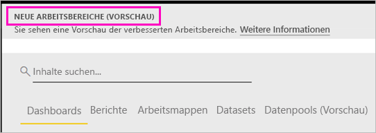
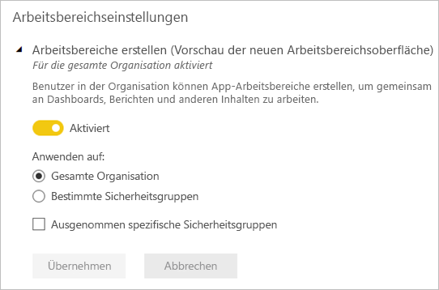

# Organisieren der neuen Arbeitsbereiche (Vorschauversion) in Power BI

Arbeitsbereiche stellen einen hervorragenden Ort für die Zusammenarbeit mit Kollegen dar, um Sammlungen von Dashboards und Berichten zu erstellen. Anschließend können Sie diese in *Apps* bündeln, die Sie an die gesamte Organisation oder an bestimmte Personen oder Gruppen verteilen können. In Power BI wird eine Vorschauversion für die neuen Arbeitsbereiche eingeführt. 

Mit den neuen Arbeitsbereichen (Vorschauversion) können Sie nun Folgendes durchführen:

- Arbeitsbereichsrollen Benutzergruppen zuweisen: Sicherheitsgruppen, Verteilerlisten, Office 365-Gruppen und Einzelpersonen.
- Einen Arbeitsbereich in Power BI erstellen, ohne eine Office 365-Gruppe zu erstellen.
- Genauere Arbeitsbereichsrollen für flexiblere Verwaltung von Berechtigungen in einem Arbeitsbereich verwenden.

Erfahren Sie mehr über das [Erstellen eines der neuen Arbeitsbereiche](service-create-the-new-workspaces.md).
 
Wenn Sie einen der neuen Arbeitsbereiche erstellen, erstellen Sie keine zugrunde liegende, zugehörige Office 365-Gruppe. Die gesamte Arbeitsbereichsverwaltung findet in Power BI statt, nicht in Office 365. Sie können dem Arbeitsbereich immer noch eine Office 365-Gruppe hinzufügen, um den Benutzerzugriff auf Inhalte weiterhin über Office 365-Gruppen zu verwalten. Zusätzlich können Sie jedoch Sicherheitsgruppen und Verteilerlisten verwenden sowie Benutzer direkt in Power BI hinzufügen. Damit profitieren Sie von einer flexiblen Möglichkeit für die Verwaltung des Arbeitsbereichszugriffs. Da die Arbeitsbereichsverwaltung jetzt in Power BI erfolgt, entscheiden die Power BI-Administratoren, welche Benutzer in einer Organisation Arbeitsbereiche erstellen dürfen. In den **Arbeitsbereichseinstellungen** im Verwaltungsportal können Administratoren zulassen, dass alle oder keine Benutzer in einer Organisation Arbeitsbereiche erstellen. Sie können auch die Erstellung von Mitgliedern bestimmter Sicherheitsgruppen beschränken.

Erfahren Sie mehr über das [Power BI-Verwaltungsportal](service-admin-portal.md).

## Rollout der neuen Arbeitsbereiche

Während der Vorschauphase können alte und neue Arbeitsbereiche parallel zueinander existieren, und Sie können beide erstellen. Wenn die Vorschau der neuen Arbeitsbereiche endet, und diese in die allgemeine Verfügbarkeit übergehen, werden alte Arbeitsbereiche für einen gewissen Zeitraum beibehalten. Sie können sie jedoch nicht mehr erstellen, und Sie müssen sich darauf vorbereiten, Ihre Arbeitsbereiche zur Infrastruktur der neuen Arbeitsbereiche zu migrieren. Aber keine Sorge, Ihnen stehen mehrere Monate zur Verfügung, um diese Migration abzuschließen.

## Rollen in den neuen Arbeitsbereichen

Sie fügen den neuen Arbeitsbereichen Benutzergruppen oder Einzelpersonen als Mitglieder, Mitwirkende oder Administratoren hinzu. Allen Mitgliedern einer Benutzergruppe wird die von Ihnen festgelegte Rolle zugewiesen. Wenn eine Person in mehreren Benutzergruppen Mitglied ist, erhält sie die höchsten zugewiesenen Berechtigungen.

Alle Benutzer, die Sie einem Arbeitsbereich hinzufügen, benötigen eine Power BI Pro-Lizenz. Im Arbeitsbereich ist die Zusammenarbeit aller Beteiligten beim Erstellen von Dashboards und Berichten möglich, die Sie für eine größere Zielgruppe oder sogar die gesamte Organisation veröffentlichen möchten. Wenn Sie Inhalte an andere Personen in Ihrer Organisation verteilen möchten, können Sie diesen Benutzern Power BI Pro-Lizenzen zuweisen oder den Arbeitsbereich in einer Power BI Premium-Kapazität hinzufügen.

Mit Rollen können Sie verwalten, wer welche Aktionen in einem Arbeitsbereich durchführen kann. So können Teams zusammenarbeiten. Mithilfe der neuen Arbeitsbereiche können Sie Einzelpersonen und Benutzergruppen Rollen zuweisen: Sicherheitsgruppen, Office 365-Gruppen und Verteilerlisten. 

Wenn Sie einer Benutzergruppe Rollen zuweisen, verfügen die Personen in der Gruppe über Zugriffsberechtigungen für Inhalte. Wenn Sie Benutzergruppen schachteln, verfügen alle Benutzer über die Berechtigung. Ein Benutzer, der in mehreren Benutzergruppen mit verschiedenen Rollen Mitglied ist, erhält die höchsten ihm zugewiesenen Berechtigungen. 

Die neuen Arbeitsbereiche bieten drei Rollen: Administratoren, Mitglieder und Mitwirkende.

**Administratoren können folgende Aktionen durchführen:**

- Den Arbeitsbereich aktualisieren und löschen. 
- Personen hinzufügen/entfernen (einschließlich anderer Administratoren).
- Alle Aktionen ausführen, die Mitglieder ausführen können.

**Mitglieder können folgende Aktionen durchführen:** 

- Mitglieder oder andere Benutzer mit niedrigeren Berechtigungen hinzufügen.
- Apps veröffentlichen und aktualisieren.
- Elemente und Apps freigeben.
- Anderen erlauben, Elemente erneut freizugeben.
- Alle Aktionen ausführen, die Mitwirkende ausführen können.

**Mitwirkende können folgende Aktionen durchführen:** 

- Inhalte im Arbeitsbereich erstellen, bearbeiten und löschen. 
- Berichte im Arbeitsbereich veröffentlichen und Inhalt löschen.
- Neuen Benutzern kann kein Zugriff auf Inhalte gewährt werden. Sie können ihre neuen Inhalte nicht freigeben, allerdings können sie Inhalte für jemanden freigeben, für den der Arbeitsbereich, das Element oder die App bereits freigegeben wurde. 
- Keine Mitglieder der Gruppe bearbeiten.
 
Durch den Dienst werden Workflows für die Zugriffsanforderung erstellt, damit Benutzer, die keinen Zugriff haben, diesen anfordern können. Derzeit sind Workflows für die Zugriffsanforderung für Dashboards, Berichte und Apps verfügbar.

## Konvertieren alter Arbeitsbereiche in neue Arbeitsbereiche

Während der Vorschauphase können Sie ihre alten Arbeitsbereiche nicht automatisch in neue konvertieren. Sie können jedoch einen neuen Arbeitsbereich erstellen und Ihren Inhalt dort veröffentlichen. 

Wenn die neuen Arbeitsbereiche in die allgemeine Verfügbarkeit übergehen, können Sie die alten Arbeitsbereiche automatisch migrieren. Nach Eintritt der allgemeinen Verfügbarkeit müssen Sie sie migrieren.

## Inwiefern unterscheiden sich die neuen Arbeitsbereiche von den aktuellen Arbeitsbereichen?

Mit den neuen Arbeitsbereichen werden einige Features neu gestaltet. Im Folgenden werden die Änderungen aufgeführt, die zusammen mit der Vorschauversion voraussichtlich dauerhaft Bestand haben werden. 

* Beim Erstellen von Arbeitsbereichen werden keine entsprechenden Entitäten in Office 365 erstellt, wie es bei aktuellen Arbeitsbereichen noch der Fall ist. (Sie können Ihrem Arbeitsbereich weiterhin eine Office 365-Gruppe hinzufügen, indem Sie eine Rolle zuweisen.) 
* In den aktuellen Arbeitsbereichen können Sie zu den Listen der Mitglieder und Administratoren nur Einzelpersonen hinzufügen. In den neuen Arbeitsbereichen können Sie zu diesen Listen mehrere AD-Sicherheitsgruppen, Verteilerlisten oder Office 365-Gruppen hinzufügen, um die Benutzerverwaltung zu vereinfachen. 
- Sie können ein organisationsbezogenes Inhaltspaket über einen aktuellen Arbeitsbereich erstellen. Über den neuen Arbeitsbereich können Sie diese nicht erstellen.
- Über einen aktuellen Arbeitsbereich können Sie ein organisationsbezogenes Inhaltspaket nutzen. Über den neuen Arbeitsbereich können Sie dieses nicht nutzen.
- Während der Vorschauphase sind einige Features der neuen Arbeitsbereiche noch nicht aktiviert. Weitere Einzelheiten finden Sie im nächsten Abschnitt, [Geplante Features für die neuen Arbeitsbereiche](service-new-workspaces.md#planned-new-workspace-preview-features).

## Einschränkungen und Überlegungen

Zu beachtende Einschränkungen:

- Arbeitsbereiche können maximal 1.000 Datasets oder 1.000 Berichte pro Dataset enthalten. 
- Eine Person mit einer Power BI Pro-Lizenz kann in maximal 250 Arbeitsbereichen Mitglied sein.

## Geplante Vorschaufeatures für die neuen Arbeitsbereiche

Einige weitere Vorschaufeatures für die neuen Arbeitsbereiche befinden sich bei der Einführung der Vorschauversion noch in der Entwicklung, sie sind jedoch noch nicht verfügbar:

- Es gibt keine Schaltfläche **Arbeitsbereich verlassen**.
- Nutzungsmetriken werden noch nicht unterstützt.
- Funktionsweise von Premium: Sie können Arbeitsbereiche in einer Premium-Kapazität zuweisen und erstellen. Damit Sie einen Arbeitsbereich zwischen Kapazitäten verschieben können, müssen Sie jedoch zu den Einstellungen des Arbeitsbereichs wechseln.
- Das Einbetten von SharePoint-Webparts wird noch nicht unterstützt.
- Es gibt keine **OneDrive**-Schaltfläche für Office 365-Gruppen unter „Daten abrufen“ und „Dateien abrufen“.

## Arbeitsbereichsfeatures mit geänderter Funktionsweise

Einige Features funktionieren in den neuen Arbeitsbereichen anders als in den aktuellen Arbeitsbereichen. Diese Unterschiede sind beabsichtigt und basieren auf Feedback, das von Kunden gesammelt wurde. Mit diesen Änderungen wird ein flexiblerer Ansatz für die Zusammenarbeit in Arbeitsbereichen geboten:

- Mitglieder, die eine erneute Freigabe durchführen oder nicht durchführen können: ersetzt durch die Rolle „Mitwirkender“.
- Schreibgeschützte Arbeitsbereiche: Anstatt Benutzern schreibgeschützten Zugriff auf einen Arbeitsbereich zu gewähren, weisen Sie Benutzern die in Kürze verfügbare Rolle „Anzeigender Benutzer“ zu, die einen ähnlichen schreibgeschützten Zugriff auf den Inhalt eines Arbeitsbereichs umfasst.

## Bekannte Probleme

Da dies ein Vorschaufeature ist, gibt es einige Einschränkungen, die Sie beachten sollten. Die folgenden Probleme sind bekannt, und Fehlerbehebungen sind in der Entwicklung:

- Free-Benutzer oder Benutzergruppen, die als Empfänger von E-Mail-Abonnements hinzugefügt wurden, erhalten keine E-Mails, obwohl sie sollten. Das Problem tritt auf, wenn einer der neuen Arbeitsbereiche sich in einer Premium-Kapazität befindet, aber der Bereich „Mein Arbeitsbereich“ des Benutzers, der das Abonnement abschließt, sich nicht in einer Premium-Kapazität befindet. Wenn „Mein Arbeitsbereich“ sich in einer Premium-Kapazität befindet, erhalten Free-Benutzer und Benutzergruppen die E-Mails.
- Nachdem ein Arbeitsbereich aus einer Premium-Kapazität in eine freigegebene Kapazität verschoben wurde, erhalten Benutzer und Benutzergruppen er kostenlosen Version in manchen Fällen weiterhin E-Mails, obwohl dies nicht der Fall sein sollte. Das Problem tritt auf, wenn der Bereich „Mein Arbeitsbereich“ des Benutzers, der das Abonnement abschließt, sich in einer Premium-Kapazität befindet.

## Nächste Schritte
* [Erstellen der neuen Arbeitsbereiche (Vorschauversion) in Power BI](service-create-the-new-workspaces.md)
* [Create the current workspaces (Erstellen der aktuellen Arbeitsbereiche)](service-create-workspaces.md)
* [Installieren und Verwenden von Apps in Power BI](service-create-distribute-apps.md)
* Haben Sie Fragen? [Stellen Sie Ihre Frage in der Power BI-Community.](http://community.powerbi.com/)
