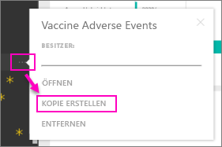

# Organisationsinhaltspakete: Kopieren, aktualisieren und abrufen

Wenn ein organisationsbezogenes Inhaltspaket veröffentlicht wird, sehen alle Empfänger dasselbe Dashboard und dieselben Berichte, Excel-Arbeitsmappen, Datasets und Daten (sofern es sich nicht um eine SQL Server Analysis Services (SSAS)-Datenquelle handelt).  [Nur der Ersteller des Inhaltspakets kann dieses bearbeiten und veröffentlichen](service-organizational-content-pack-manage-update-delete.md).  Alle Empfänger können allerdings eine Kopie des Inhaltspakets speichern, die parallel zum Original verwendet werden kann.

Das Erstellen von Inhaltspaketen unterscheidet sich vom Freigeben von Dashboards oder dem gemeinsamen Bearbeiten in einer Gruppe. Lesen Sie den Artikel [Wie kann ich Dashboards und Berichte freigeben?](service-how-to-collaborate-distribute-dashboards-reports.md), um die beste Option für Ihre Situation zu ermitteln.

> [!NOTE]
> Mit der Vorschauversion der neuen Arbeitsbereiche können Sie keine organisationsbezogenen Inhaltspakete erstellen oder installieren. Führen Sie jetzt ein Upgrade durch, und wandeln Sie Ihre Inhaltspakete in Apps um, falls Sie dies noch nicht getan haben. Erfahren Sie [mehr über die neuen Arbeitsbereiche](service-create-the-new-workspaces.md).
>

## Erstellen einer Kopie eines organisationsbezogenen Inhaltspakets
Erstellen Sie eine eigene Kopie des Inhaltspakets, die für andere nicht sichtbar ist.

1. Wählen Sie die Auslassungspunkte (...) neben dem Dashboard des Inhaltspakets aus und dann „Kopie erstellen“.

    
2. Wählen Sie **Speichern**.  

Sie haben jetzt eine Kopie, die Sie ändern können. Die von Ihnen vorgenommenen Änderungen sind nur für Sie sichtbar.

> [!NOTE]
> Bislang wurde bei der Installation eines Inhaltspakets oder bei der Erstellung einer Kopie jeweils ein neues Dataset in der Inhaltsliste im Arbeitsbereich angezeigt. Dies wurde kürzlich durch ein Update vereinfacht, sodass nun nur noch ein einzelnes Element mit dem neuen Symbol für referenzierte Datasets angezeigt wird:
>
> 
>

## Hilfe!  Ich kann nicht mehr auf das Inhaltspaket zugreifen.
Dies kann verschiedene Ursachen haben:

* **Mitgliedschaftsänderungen**:  Inhaltspakete werden in E-Mail-Verteilergruppen, Sicherheitsgruppen und [Power BI-Gruppen auf der Grundlage von Office 365](https://support.office.com/article/Create-a-group-in-Office-365-7124dc4c-1de9-40d4-b096-e8add19209e9) veröffentlicht.  Wenn Sie aus der Gruppe entfernt werden, haben Sie keinen Zugriff mehr auf das Inhaltspaket.
* **Verteileränderungen**: Der Ersteller des Inhaltspakets ändert den Verteiler. Wenn beispielsweise das Inhaltspaket ursprünglich für die gesamte Organisation freigegeben war, aber der Ersteller es für eine kleinere Zielgruppe neu veröffentlicht hat, sind Sie möglicherweise nicht mehr eingeschlossen.
* **Änderungen der Sicherheitseinstellungen**: Wenn das Dashboard und die Berichte mit lokalen SSAS-Datenquellen verbunden sind und an den Sicherheitseinstellungen Änderungen vorgenommen werden, könnten Ihre Berechtigungen für diesen Server aufgehoben werden.

## Wie werden organisationsbezogene Inhaltspakete aktualisiert?
Wenn das Inhaltspaket erstellt wird, werden die Aktualisierungseinstellungen mit dem Dataset geerbt.  Wenn Sie eine Kopie des Inhaltspakets erstellen, bleiben die Verknüpfung der neuen Version mit dem ursprünglichen Dataset und dessen Aktualisierungszeitplan erhalten.

Weitere Informationen finden Sie unter [Verwalten, Aktualisieren und Löschen von organisationsbezogenen Inhaltspaketen](service-organizational-content-pack-manage-update-delete.md).

## Nächste Schritte
* [Einführung in organisationsbezogene Inhaltspakete](service-organizational-content-pack-introduction.md)
* [Erstellen einer Gruppe in Power BI](service-create-distribute-apps.md)
* Weitere Fragen? [Wenden Sie sich an die Power BI-Community](http://community.powerbi.com/)
