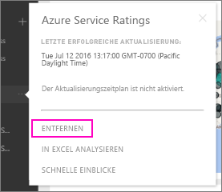

# Entfernen der Verbindung mit einem organisationsbezogenen Power BI-Inhaltspaket

> [!NOTE]
> Sie können keine organisationsbezogenen Inhaltspakete in der Vorschauversion der neuen Arbeitsbereiche erstellen oder installieren. Führen Sie jetzt ein Upgrade durch, und wandeln Sie Ihre Inhaltspakete in Apps um, falls Sie dies noch nicht getan haben. Erfahren Sie [mehr über die neuen Arbeitsbereiche](service-create-the-new-workspaces.md).
> 

Ein Kollege hat ein Inhaltspaket erstellt. Sie haben es in AppSource gefunden und Ihrem Power BI-Arbeitsbereich hinzugefügt. Aber jetzt benötigen Sie es nicht mehr.  Wie entfernen Sie es?

Um ein Inhaltspaket zu entfernen, entfernen Sie das Dataset.  

* Klicken Sie im linken Navigationsbereich auf die Auslassungspunkte rechts neben dem Dataset, und wählen Sie dann **Entfernen \> Ja** aus.  
  
  

Durch das Entfernen des Datasets werden auch alle zugehörigen Berichte und Dashboards entfernt. Durch Entfernen der Verbindung mit dem Inhaltspaket wird das Inhaltspaket jedoch nicht aus der AppSource-Instanz Ihrer Organisation gelöscht.  Sie können jederzeit zu AppSource zurückkehren und das Inhaltspaket wieder Ihrem Arbeitsbereich hinzufügen. Sie können nur dann ein [Inhaltspaket aus AppSource löschen](service-organizational-content-pack-manage-update-delete.md), wenn Sie es selbst erstellt haben.

## Nächste Schritte
* [Einführung in organisationsbezogene Inhaltspakete](service-organizational-content-pack-introduction.md) 
* [Erstellen und Verteilen einer App in Power BI](service-create-distribute-apps.md) 
* [Grundlegende Konzepte für Designer im Power BI-Dienst](service-basic-concepts.md)  
* Weitere Fragen? [Wenden Sie sich an die Power BI-Community](http://community.powerbi.com/)

