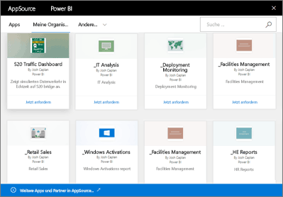

# Einführung in organisationsbezogene Inhaltspakete in Power BI
> [!NOTE]
> Sie können keine organisationsbezogenen Inhaltspakete in der Vorschauversion der neuen Arbeitsbereiche erstellen oder installieren. Führen Sie jetzt ein Upgrade durch, und wandeln Sie Ihre Inhaltspakete in Apps um, falls Sie dies noch nicht getan haben. Erfahren Sie [mehr über die neuen Arbeitsbereiche](service-create-the-new-workspaces.md).
> 

Verteilen Sie regelmäßig Berichte per E-Mail an Ihr Team? Probieren Sie diese Alternative aus: Erstellen Sie ein Paket aus Ihren Dashboards, Berichten, Excel-Arbeitsmappen und Datasets, und veröffentlichen Sie sie für Ihr Team als *organisationsbezogenes Inhaltspaket*. Alle von Ihnen erstellten Inhaltspakete kann Ihr Team leicht in AppSource finden. Da Inhaltspakete Teil von Power BI sind, nutzen sie alle Features von Power BI, einschließlich interaktiver Untersuchung von Daten, neuer Visualisierungen, Fragen und Antworten, Integration mit anderen Datenquellen, Aktualisierung von Daten und mehr.

Das Erstellen von Inhaltspaketen unterscheidet sich vom Freigeben von Dashboards oder dem gemeinsamen Bearbeiten in einem App-Arbeitsbereich. Lesen Sie den Artikel [Wie kann ich Dashboards und Berichte freigeben?](service-how-to-collaborate-distribute-dashboards-reports.md), um die beste Option für Ihre Situation zu ermitteln. 

In AppSource können Sie die Inhaltspakete durchsuchen, die für die gesamte Organisation, für Verteiler- oder Sicherheitsgruppen sowie für [Office 365-Gruppen, deren Mitglied Sie sind](https://support.office.com/article/Create-a-group-in-Office-365-7124dc4c-1de9-40d4-b096-e8add19209e9), veröffentlicht wurden. Wenn Sie kein Mitglied einer bestimmten Gruppe sind, werden Ihnen die Inhaltspakete nicht angezeigt, die für diese Gruppe freigegeben sind. Der schreibgeschützte Zugriff auf die Inhaltspaketdaten, Berichte, Arbeitsmappen und Dashboards ist für alle Mitglieder der Gruppe identisch (sofern es sich nicht um eine SQL Server Analysis Services (SSAS)-Datenquelle handelt, bei der die Berechtigungen mit der Datenquelle geerbt werden).

Die Dashboards, Berichte und Excel-Arbeitsmappen sind schreibgeschützt. Sie können die Berichte und Dashboards jedoch kopieren und als Ausgangspunkt für die Erstellung einer eigenen personalisierten Version des Inhaltspakets verwenden.

> [!NOTE]
> Organisationsbezogene Inhaltspakete sind nur verfügbar, wenn Sie und Ihre Kollegen mit [Power BI Pro-Lizenzen](service-features-license-type.md) arbeiten.
> 
> 

## Was ist *AppSource*?
Durch Veröffentlichen eines organisationsbezogenen Inhaltspakets wird dieses zu AppSource hinzugefügt.  Dieses zentrale Repository vereinfacht Mitgliedern das Durchsuchen und Ermitteln von Dashboards, Berichten und Datasets, die für sie veröffentlicht wurden.  

* Wählen Sie zum Anzeigen von AppSource **Daten abrufen** > **Meine Organisation** > **Abrufen** aus.

## Lebenszyklus eines organisationsbezogenen Inhaltspakets
Jeder Power BI Pro-Benutzer kann organisationsbezogene Inhaltspakete erstellen, veröffentlichen und auf sie zugreifen. Nur der Ersteller des Inhaltspakets kann die Arbeitsmappe und das Dataset ändern, deren Aktualisierung planen und sie löschen.

Der Lebenszyklus sieht etwa wie folgt aus:

1. Nate erstellt in Power BI Pro ein Inhaltspaket und veröffentlicht es für die Verteilergruppe „Marketing“. Die Einstellungen für die Aktualisierung werden mit dem Dataset geerbt und können nur von Nate geändert werden.
   
   > [!NOTE]
   > Hinweis: Wenn Nate das Inhaltspaket von einem [Power BI-App-Arbeitsbereich](service-create-distribute-apps.md) aus erstellt, dem er angehört, können andere Mitglieder dieses Power BI-Arbeitsbereichs Besitzer des Inhaltspakets werden, wenn Nate den Arbeitsbereich verlässt.
   > 
   > 
2. Nate sendet eine E-Mail an die Verteilergruppe, in der er Informationen über das neue Inhaltspaket mitteilt.
3. In Power BI Pro sucht Jane, ein Mitglied der Verteilergruppe „Marketing“, nach diesem Inhaltspaket und stellt eine Verbindung mit dem Inhaltspaket in AppSource her. Sie verfügt jetzt über eine schreibgeschützte Kopie.  Sie weiß, dass es sich um eine schreibgeschützte Kopie handelt, da im linken Navigationsbereich links neben dem Dashboard- und Berichtsnamen ein Freigabesymbol angezeigt wird. Und wenn Jana das Dashboard auswählt, weist ein Schlosssymbol darauf hin, dass sie sich das Dashboard eines Inhaltspakets ansieht. 
4. Angenommen, sie entschließt sich, es anzupassen. Sie verfügt jetzt über ihre eigene Kopie des Dashboards und der Berichte. Ihre Arbeit wirkt sich nicht auf die Quelle, das ursprüngliche Inhaltspaket oder auf andere Mitglieder der Verteilergruppe aus. Sie arbeitet jetzt an ihrer eigenen Kopie von Dashboard und Bericht.
5. Nate nimmt Aktualisierungen am Dashboard vor. Sobald es fertig ist, veröffentlicht er eine neue Version des Inhaltspakets.
   
   * Julio, Mitglied einer anderen Verteilergruppe, hat das ursprüngliche Inhaltspaket nicht angepasst. Die neuen Änderungen werden automatisch auf seine Version des Inhaltspakets angewendet.  
   * Jane hat das Inhaltspaket angepasst. Sie erhält eine Benachrichtigung, dass es eine neue Version gibt.  Sie kann zu AppSource navigieren und das aktualisierte Inhaltspaket abrufen, ohne dass ihre personalisierte Version verloren geht. Sie verfügt jetzt über zwei Versionen: ihre personalisierte Version und das aktualisierte Inhaltspaket.
6. Angenommen, Nate ändert die Sicherheitseinstellungen. Julio und Jane haben keinen Zugriff mehr auf den Inhalt. Oder sie wurden aus der Verteilergruppe „Marketing“ entfernt.
   
   * Julio hat das ursprüngliche Inhaltspaket nicht angepasst, weshalb der Inhalt automatisch entfernt wird. 
   * Jane hat das Inhaltspaket angepasst. Wenn sie das Dashboard das nächste Mal öffnet, sind alle Kacheln aus dem ursprünglichen Inhaltspaket nicht mehr da, doch die Kacheln, die sie aus anderen Berichten (die sie weiter verwenden darf) angeheftet hat, werden weiterhin angezeigt. Die zugehörigen Berichte und das Dataset sind nicht mehr verfügbar (und werden nicht in ihrem linken Navigationsbereich angezeigt).
7. Oder Nate löscht das Inhaltspaket.
   
   * Julio hat das ursprüngliche Inhaltspaket nicht angepasst, weshalb der Inhalt automatisch entfernt wird. 
   * Jane hat das Inhaltspaket angepasst. Wenn sie das Dashboard das nächste Mal öffnet, sind alle Kacheln aus dem ursprünglichen Inhaltspaket nicht mehr da, doch die Kacheln, die sie aus anderen Berichten angeheftet hat, werden weiterhin angezeigt. Die zugehörigen Berichte und das Dataset sind nicht mehr verfügbar (und werden nicht in ihrem linken Navigationsbereich angezeigt).

## Datensicherheit
Alle Mitglieder der Verteilergruppe verfügen über dieselben Berechtigungen für die Daten wie der Ersteller des Inhaltspakets. Die einzige Ausnahme hierbei sind lokale tabellarische SSAS (SQL Server Analysis Services)-Datasets. Da die Berichte und Dashboards eine Liveverbindung mit dem lokalen SSAS-Modell herstellen, wird anhand der Anmeldeinformationen der einzelnen Verteilergruppenmitglieder bestimmt, auf welche Daten das jeweilige Mitglied zugreifen darf.

## Nächste Schritte
* [Erstellen und Veröffentlichen von organisationsbezogenen Inhaltspaketen](service-organizational-content-pack-create-and-publish.md)
* [Erstellen und Verteilen einer App in Power BI](service-create-distribute-apps.md) 
* [Power BI – Grundkonzepte](consumer/end-user-basic-concepts.md)
* Weitere Fragen? [Wenden Sie sich an die Power BI-Community](http://community.powerbi.com/)

