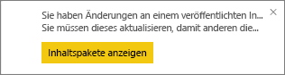
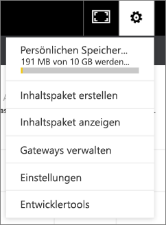

# Verwalten, Aktualisieren und Löschen von organisationsbezogenen Inhaltspaketen
> [!NOTE]
> Kennen Sie schon die neuen *Apps*? Apps sind die neue Methode, um Inhalte für große Zielgruppen in Power BI verfügbar zu machen. Es wird empfohlen, anstelle von organisationsbezogenen Inhaltspaketen oder schreibgeschützten Arbeitsbereichen Apps zu verwenden. [Weitere Informationen über Apps](service-install-use-apps.md)
> 
> 

Sie können Ihre Dashboards, Berichte, Excel-Arbeitsmappen und Datasets packen und als [organisationsbezogene Inhaltspakete](service-organizational-content-pack-introduction.md) für Ihre Kollegen freigeben. Ihre Kollegen können sie wie vorhanden nutzen oder eigene Kopien erstellen.

Das Erstellen von Inhaltspaketen unterscheidet sich vom Freigeben von Dashboards oder dem gemeinsamen Bearbeiten in einer Gruppe. Lesen Sie den Artikel [Wie kann ich Dashboards und Berichte freigeben?](service-how-to-collaborate-distribute-dashboards-reports.md), um die beste Option für Ihre Situation zu ermitteln.

Verschiedene Aufgaben für organisationsbezogene Inhaltspakete können Sie nur ausführen, wenn Sie der Ersteller des Inhaltspakets sind:

* Erneutes Veröffentlichen
* Einschränken oder Erweitern des Zugriffs auf das Inhaltspaket
* Festlegen und Ändern einer geplanten Aktualisierung
* Löschen des Inhaltspakets

## Erstellen und erneutes Veröffentlichen eines organisationsbezogenen Inhaltspakets
Wenn Sie am ursprünglichen Dashboard, dem Bericht oder der Excel-Arbeitsmappe des Inhaltspakets Änderungen vornehmen, werden Sie von Power BI zum erneuten Veröffentlichen aufgefordert. Darüber hinaus können Sie als der Ersteller des Inhaltspakets die Optionen aktualisieren, die Sie im Fenster „Inhaltspaket erstellen“ bei der Erstellung des ursprünglichen Inhaltspakets ausgewählt haben. 

## Mit neuem Inhalt erneut veröffentlichen
Wenn Sie eine Änderung am Dashboard, das Sie in ein Inhaltspaket eingeschlossen haben, vornehmen und speichern, erinnert Power BI Sie daran, es zu aktualisieren, damit die Änderungen anderen Benutzern angezeigt werden. Dies ist beispielsweise der Fall, wenn Sie eine neue Kachel anheften oder den Namen des Dashboards ändern.

1. Wählen Sie in der Meldung **Inhaltspakete anzeigen** aus.
   
   
2. Oder wählen Sie rechts oben das Zahnradsymbol  und dann **Inhaltspaket anzeigen** aus.
   
   
   
   Beachten Sie das Warnsymbol .  Auf diese Weise sehen Sie, dass das Inhaltspaket verändert wurde und nicht mehr mit der von Ihnen veröffentlichten Version übereinstimmt.
3. Wählen Sie **Bearbeiten**aus.  
4. Nehmen Sie im Fenster **Inhaltspaket aktualisieren** alle notwendigen Änderungen vor, und wählen Sie **Update**aus. Daraufhin wird eine **Erfolgsmeldung** angezeigt.
   
   * Für Gruppenmitglieder, die das Inhaltspaket nicht angepasst haben, wird das Update automatisch angewendet.
   * Gruppenmitglieder, die das Inhaltspaket angepasst haben, erhalten eine Benachrichtigung, dass eine neue Version verfügbar ist.  Sie können zu AppSource navigieren und das aktualisierte Inhaltspaket abrufen, ohne ihre personalisierte Version zu verlieren.  Sie verfügen jetzt über zwei Versionen: die personalisierte Version und das aktualisierte Inhaltspaket.  In der personalisierten Version sind die Kacheln aus dem ursprünglichen Inhaltspaket nicht mehr vorhanden.  Die von anderen Berichten angehefteten Kacheln werden jedoch weiterhin gerendert.    

## Aktualisieren der Zielgruppe: Erweitern oder Einschränken des Zugriffs
Eine weitere Änderung, die Ersteller von Inhaltspaketen vornehmen können, ist das Erweitern oder Einschränken des Zugriffs zum Inhaltspaket.  Möglicherweise haben Sie ein Inhaltspaket für eine breite Zielgruppe veröffentlicht, und Sie haben sich entschieden, den Zugriff auf eine kleinere Gruppe einzuschränken.  

1. Wählen Sie das Zahnradsymbol  und die Option **Inhaltspakete anzeigen** aus.
2. Wählen Sie **Bearbeiten**aus. 
3. Nehmen Sie im Fenster **Inhaltspaket aktualisieren** alle notwendigen Änderungen vor, und wählen Sie **Update**aus. Löschen Sie beispielsweise die ursprüngliche Verteilergruppe im Feld **Bestimmte Gruppen** , und ersetzen Sie sie durch eine andere Verteilergruppe (die über weniger Mitglieder verfügt).
   
   Daraufhin wird eine Erfolgsmeldung angezeigt.
   
   Mitarbeiter, die nicht Teil des neuen Alias sind:
   
   * Für Gruppenmitglieder, die das Inhaltspaket nicht angepasst haben, stehen das Dashboard und die dem betreffenden Inhaltspaket zugeordneten Berichte nicht mehr zur Verfügung, und das Inhaltspaket wird im Navigationsbereich nicht mehr angezeigt.
   * Für Gruppenmitglieder, die das Inhaltspaket angepasst haben, sind beim nächsten Öffnen des angepassten Dashboards alle Kacheln des ursprünglichen Inhaltspakets verschwunden.  Die von anderen Berichten angehefteten Kacheln werden jedoch weiterhin gerendert. Die ursprünglichen Berichte und das Dataset des Inhaltspakets sind nicht mehr verfügbar (und das Inhaltspaket wird nicht mehr im Navigationsbereich angezeigt).   

## Aktualisieren eines organisationsbezogenen Inhaltspakets
Als Ersteller des Inhaltspakets können Sie eine [Aktualisierung des Datasets planen](refresh-data.md).  Beim Erstellen und Hochladen des Inhaltspakets wird der Aktualisierungszeitplan mit den Datasets hochgeladen. Wenn Sie den Aktualisierungszeitplan ändern, müssen Sie das Inhaltspaket erneut veröffentlichen (siehe oben).

## Löschen eines organisationsbezogenen Inhaltspakets aus AppSource
Sie können ein Inhaltspaket nur dann aus AppSource löschen, wenn Sie es erstellt haben. 

> [!TIP]
> Sie können [Ihre Verbindung mit einem Inhaltspaket trennen](service-organizational-content-pack-disconnect.md), das Sie nicht erstellt haben. Dadurch wird das Inhaltspaket nicht aus AppSource gelöscht.
> 
> 

1. Wenn Sie ein Inhaltspaket aus AppSource löschen möchten, wechseln Sie in den App-Arbeitsbereich, in dem Sie das Inhaltspaket erstellt haben, wählen Sie das Zahnradsymbol  und die Option **Inhaltspakete anzeigen** aus.
2. Wählen Sie **Löschen \> Löschen** aus. 
   
   * Für Mitglieder, die das Inhaltspaket nicht angepasst haben, werden das Dashboard und die dem Inhaltspaket zugeordneten Berichte automatisch entfernt. Sie sind nicht mehr verfügbar, und das Inhaltspaket wird im Navigationsbereich nicht angezeigt.
   * Für Gruppenmitglieder, die das Inhaltspaket angepasst haben, sind beim nächsten Öffnen des angepassten Dashboards alle Kacheln des ursprünglichen Inhaltspakets verschwunden.  Die von anderen Berichten angehefteten Kacheln werden jedoch weiterhin gerendert. Die ursprünglichen Berichte und das Dataset des Inhaltspakets sind nicht mehr verfügbar (und das Inhaltspaket wird nicht mehr im Navigationsbereich angezeigt).   

## Nächste Schritte
* [Einführung in organisationsbezogene Inhaltspakete](service-organizational-content-pack-introduction.md)
* [Erstellen und Verteilen einer App in Power BI](service-create-distribute-apps.md) 
* Weitere Fragen? [Wenden Sie sich an die Power BI-Community](http://community.powerbi.com/)

