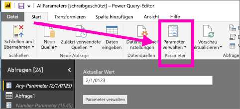
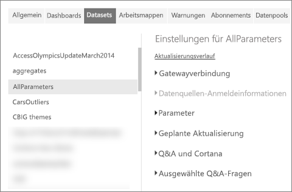
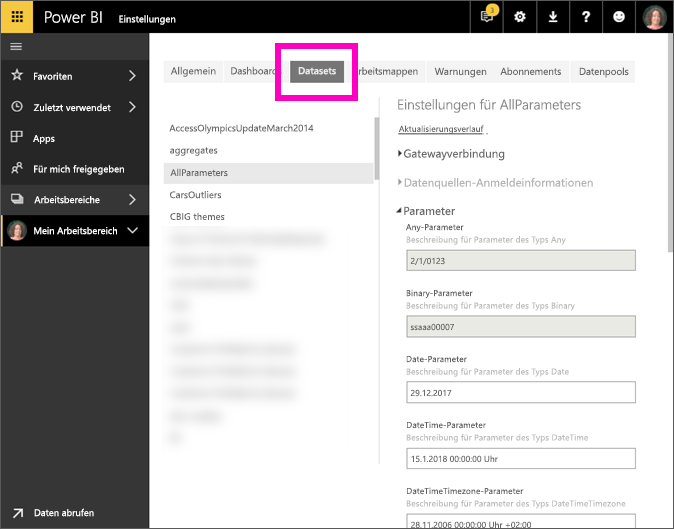

# Was ist ein Abfrageparameter?
Abfrageparameter werden in Power BI Desktop von Berichtserstellern hinzugefügt. Mit Parametern können sie Teile von Berichten von mindestens einem *Parameterwert* abhängig machen. Ein Berichtsersteller kann z.B. einen Parameter erstellen, der die Daten auf ein Land bzw. eine Region einschränkt, oder einen Parameter, der das akzeptierte Format von Feldern (z.B. für Datumsangaben, Uhrzeitangaben und Text) definiert.

## Überprüfen und Bearbeiten von Parametern im Power BI-Dienst

Wenn die Parameter in Power BI Desktop definiert wurden, wenn dieser [Bericht im Power BI-Dienst veröffentlicht wird](desktop-upload-desktop-files.md), werden gleichzeitig auch die Parametereinstellungen und -optionen übertragen. Einige Parametereinstellungen können im Power BI-Dienst geprüft und bearbeitet werden. Dies gilt nicht für Parameter, die die verfügbaren Daten einschränken, sondern nur für diejenigen, die akzeptierte Werte definieren und beschreiben.

1. Klicken Sie im Power BI-Dienst auf das Zahnradsymbol , um die **Einstellungen** zu öffnen.

2. Klicken Sie auf die Registerkarte **Datasets**, und wählen Sie ein Dataset in der Liste aus. 
    
    

3. Erweitern Sie **Parameter**.  Wenn das ausgewählte Dataset keine Parameter aufweist, wird eine Meldung mit einem Link anzeigt, unter dem Sie mehr zu Abfrageparameter erfahren können. Wenn das Dataset über Parameter verfügt, werden diese beim Erweitern von **Parameter** angezeigt. 

    

    Prüfen Sie die Parametereinstellungen, und nehmen Sie bei Bedarf Änderungen vor. Ausgegraute Felder können nicht bearbeitet werden. 

## Nächste Schritte
Sie können Parameter im Handumdrehen hinzuzufügen, indem Sie [die URL modifizieren](service-url-filters.md).