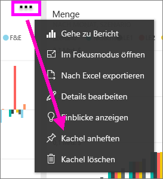
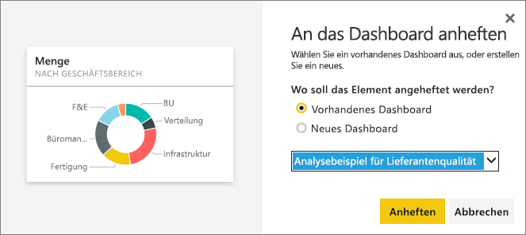
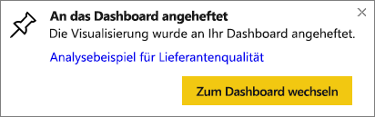

# Anheften einer Kachel aus einem Dashboard an ein anderes Dashboard
Eine Möglichkeit zum Hinzufügen einer neuen [Dashboardkachel](consumer/end-user-tiles.md) ist das Kopieren aus einem anderen Dashboard. Jede dieser Kacheln stellt (sobald angeklickt) einen Link zurück zum Ort der Erstellung da – entweder im F&A oder einem Bericht. 

> [!NOTE]
> Kacheln aus freigegebenen Dashboards können nicht angeheftet werden.

## Anheften einer Kachel an ein anderes Dashboard
1. [Abrufen von Daten](service-get-data.md). In der folgenden Beschreibung wird das [Analysebeispiel für IT-Ausgaben](sample-it-spend.md) verwendet.
2. Öffnen Sie ein [Dashboard](consumer/end-user-dashboards.md).
3. Zeigen Sie auf die Kachel, die Sie anheften möchten, und wählen Sie die Auslassungspunkte (...) und dann **Kachel anheften**.  
   
   
4. Heften Sie die Kachel an ein vorhandenes oder neues Dashboard an. 
   
   * **Vorhandenes Dashboard**: Wählen Sie den Namen des Dashboards aus der Dropdownliste aus.
   * **Neues Dashboard**: Geben Sie den Namen des neuen Dashboards ein.
   
   
5. Wählen Sie **Anheften**aus.
   Eine Erfolgsmeldung (in der Nähe der oberen rechten Ecke) weist Sie darauf hin, dass die Visualisierung als Kachel zum ausgewählten Dashboard hinzugefügt wurde.
   
   
6. Wählen Sie **Zum Dashboard wechseln**, um die angeheftete Kachel anzuzeigen. Hier können Sie die angeheftete Visualisierung [umbenennen, die Größe ändern, verknüpfen und verschieben](service-dashboard-edit-tile.md).

## Nächste Schritte
[Kacheln in Power BI](consumer/end-user-tiles.md)  
[Dashboards in Power BI](consumer/end-user-dashboards.md)  
Weitere Fragen? [Wenden Sie sich an die Power BI-Community](http://community.powerbi.com/)

