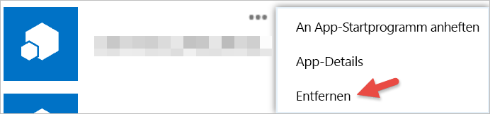

# Erste Schritte mit Drittanbieter-Apps
Sie können auch Apps von Unternehmen oder einzelnen Entwicklern mit Power BI verwenden, die nicht von Microsoft stammen. Beispielsweise können Sie eine Drittanbieter-App verwenden, die Power BI-Kacheln in eine maßgeschneiderte Webanwendung integrieren. Wenn Sie eine Drittanbieter-App verwenden, werden Sie aufgefordert, der Anwendung bestimmte Berechtigungen für Ihr Power BI-Konto und -Ressourcen zu gewähren. Sie dürfen nur solchen Anwendungen Berechtigungen gewähren, die Sie kennen und die aus einer vertrauenswürdigen Quelle stammen. Berechtigungen einer Anwendung können jederzeit widerrufen werden. Weitere Informationen finden Sie unter [Widerrufen der Berechtigungen für eine Drittanbieter-App](#revoke).

Im Folgenden sind die Zugriffsarten aufgeführt, die eine Anwendung anfordern kann.

## Berechtigungen für Power BI-Apps
* **Alle Dashboards anzeigen**
  
  * Diese Berechtigung ermöglicht es einer Anwendung, alle Dashboards, auf die Sie Zugriff haben, anzuzeigen. Dies schließt Dashboards ein, deren Eigentümer Sie sind, die Sie über Inhaltspakete erhalten haben oder die für Sie freigegeben wurden und sich in Gruppen befinden, denen Sie angehören. Die Anwendung kann keine Änderungen am Dashboard vornehmen. Unter anderem kann diese Berechtigung von einer Anwendung verwendet werden, um Ihre Dashboardinhalte in seine Umgebung einzubetten.
* **Alle Berichte anzeigen**
  
  * Diese Berechtigung ermöglicht es einer Anwendung, alle Berichte, auf die Sie Zugriff haben, anzuzeigen. Dies schließt Berichte ein, deren Eigentümer Sie sind, die Sie über Inhaltspakete erhalten haben oder die sich in Gruppen befinden, denen Sie angehören. Die Berechtigung zum Anzeigen des Berichts bedeutet auch, dass die Anwendung die Daten in diesem Bericht lesen darf. Die Anwendung kann keine Änderungen an den Berichten selbst vornehmen. Unter anderem kann diese Berechtigung von einer Anwendung verwendet werden, um Ihre Berichtsinhalte in seine Umgebung einzubetten.
* **Alle Datasets anzeigen**
  
  * Diese Berechtigung ermöglicht es einer Anwendung, alle Datasets aufzulisten, auf die Sie Zugriff haben. Dies schließt Datasets ein, deren Eigentümer Sie sind, die Sie über Inhaltspakete erhalten haben oder die sich in Gruppen befinden, denen Sie angehören. Die Namen aller Ihrer Datasets sowie deren Struktur einschließlich Tabellen- und Spaltennamen sind für eine Anwendung sichtbar. Diese Berechtigung ermöglicht das Lesen der Daten in einem Dataset. Die Berechtigung dient nicht zum Gewähren der Anwendungsrechte zum Hinzufügen oder Ändern eines Datasets.
* **Alle Datasets lesen und schreiben**
  
  * Diese Berechtigung ermöglicht es einer Anwendung, alle Datasets aufzulisten, auf die Sie Zugriff haben. Dies schließt Datasets ein, deren Eigentümer Sie sind, die Sie über Inhaltspakete erhalten haben oder die sich in Gruppen befinden, denen Sie angehören. Die Namen aller Ihrer Datasets sowie deren Struktur einschließlich Tabellen- und Spaltennamen sind für eine Anwendung sichtbar. Diese Berechtigung ermöglicht das Lesen und Schreiben der Daten in einem Dataset. Die Anwendung kann auch neue Datasets erstellen oder vorhandene Datasets ändern. Dies wird häufig von Anwendungen verwendet, um Daten direkt an Power BI zu senden.
* **Gruppen des Benutzers anzeigen**
  
  * Diese Berechtigung ermöglicht es einer Anwendung, alle Gruppen aufzulisten, denen Sie angehören. Diese Berechtigung kann in Kombination mit einer der anderen aufgeführten Berechtigungen verwendet werden, um Inhalte für diese Gruppe anzuzeigen oder zu aktualisieren. Die Anwendung kann keine Änderungen an der Gruppe selbst vornehmen.

<a name="revoke"/>

## Widerrufen der Berechtigungen für eine Drittanbieter-App
Berechtigungen für eine Drittanbieter-App widerrufen Sie auf der Website „Meine Apps“ von Office 365.

Gehen Sie wie folgt vor, um Berechtigungen für Drittanbieter auf der Website **Office 365 – Meine Apps** zu widerrufen:

1. Gehen Sie zur Website [Office 365 – Meine Apps](https://portal.office.com/myapps).
2. Suchen Sie auf der Seite **Meine Apps** nach der Drittanbieter-App.
3. Zeigen Sie auf den App-Titel, klicken Sie auf die Schaltfläche **(...)** , und klicken Sie auf **Entfernen**.
   
   

