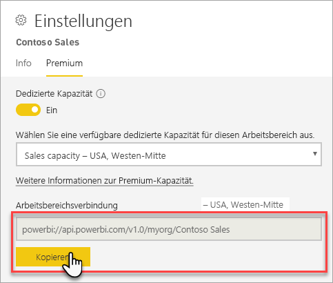
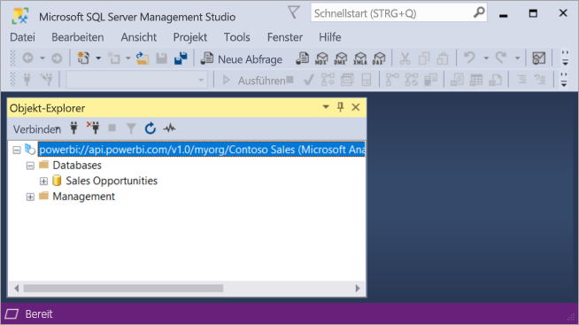

# Herstellen einer Verbindung zu Datasets mit Clientanwendungen und Tools (Vorschau)

Power BI Premium-Arbeitsbereiche und Datasets unterstützen *schreibgeschützte* Verbindungen von Clientanwendungen und Tools von Microsoft und Drittanbietern. 

> [!NOTE]
> Dieser Artikel verfolgt nur das Ziel einer Einführung in schreibgeschützte Verbindungen mit Power BI Premium-Arbeitsbereichen und Datasets. Er verfolgt *nicht* die Absicht, tiefgreifende Informationen zu Programmierbarkeit, spezifischen Tools und Anwendungen, Architektur und zur Verwaltung von Arbeitsbereichen und Datasets zur Verfügung zu stellen. Die hier beschriebenen Themen erfordern eine solide Kenntnis in Architektur und Verwaltung der Analysis Services-Tabellenmodelldatenbank.

## Protokoll

Power BI Premium verwendet das [XML for Analysis](https://docs.microsoft.com/bi-reference/xmla/xml-for-analysis-xmla-reference)-Protokoll (XMLA) für den Datenaustausch zwischen Clientanwendungen und der Engine, die Ihre Arbeitsbereiche und Datasets verwaltet. Diese Kommunikationsvorgänge erfolgen über das, was allgemein als XMLA-Endpunkte bezeichnet wird. XMLA ist das gleiche Kommunikationsprotokoll, das von der Microsoft Analysis Services-Engine verwendet wird, die hinter den Kulissen arbeitet und die semantische Modellierung, die Governance, den Lebenszyklus und die Datenverwaltung von Power BI ausführt. 

Die große Mehrheit der Clientanwendungen und Tools kommunizieren nicht explizit über XMLA-Endpunkte mit der Engine. Stattdessen verwenden sie Clientbibliotheken wie MSOLAP, ADOMD und AMO als Zwischenschicht zwischen der Clientanwendung und der Engine, die ausschließlich mithilfe von XMLA kommuniziert.

## Unterstützte Tools

Diese Tools unterstützen den schreibgeschützten Zugriff auf Power BI Premium-Arbeitsbereiche und -Datasets:

**SQL Server Management Studio (SSMS)** : unterstützt DAX-, MDX-, XMLA- und TraceEvent-Abfragen. Erfordert Version 18.0. [Hier](https://docs.microsoft.com/sql/ssms/download-sql-server-management-studio-ssms) herunterzuladen. 

**SQL Server Profiler**: Dieses Tool ist in SSMS 18.0 (Vorschau) enthalten und bietet Ablaufverfolgung und Debuggen von Serverereignissen. Sie können Daten zu jedem einzelnen Ereignis für die spätere Analyse in einer Datei oder Tabelle erfassen und speichern. Trotz der offiziellen Einstufung als veraltet für SQL Server ist der Profiler auch weiterhin in SSMS enthalten und wird für Analysis Services und neuerdings Power BI Premium weiterhin unterstützt. Weitere Informationen finden Sie unter [SQL Server Profiler](https://docs.microsoft.com/sql/tools/sql-server-profiler/sql-server-profiler).

**DAX Studio**: Open-Source-Communitytool zum Ausführen und Analysieren von DAX-Abfragen in Analysis Services. Erfordert Version 2.8.2 oder höher. Weitere Informationen finden Sie unter [daxstudio.org](https://daxstudio.org/).

**Excel PivotTables**: Es ist die Klick-und-Los-Version von Office 16.0.11326.10000 oder höher erforderlich.

**Drittanbieter**: Dazu gehören Clientanwendungen zur Datenvisualisierung und Tools, mit denen Verbindungen zu Datasets in Power BI Premium hergestellt, diese abgefragt und verbraucht werden können. Für die meisten Tools sind die aktuellsten Versionen der MSOLAP-Clientbibliotheken erforderlich, für einige jedoch möglicherweise ADOMD.

## Clientbibliotheken

Clientbibliotheken sind erforderlich, damit Clientanwendungen und Tools Verbindungen mit Power BI Premium-Arbeitsbereichen herstellen können. Die gleichen Clientbibliotheken, die zum Herstellen von Verbindungen mit Analysis Services verwendet werden, werden auch in Power BI Premium unterstützt. Von Microsoft-Clientanwendungen wie Excel, SQL Server Management Studio (SSMS) und SQL Server Data Tools (SSDT) werden alle drei Clientbibliotheken installiert und im Verlauf der normalen Anwendungsupdates aktualisiert. In manchen Fällen, insbesondere bei der Arbeit mit Drittanbieteranwendungen und -tools, müssen möglicherweise neuere Versionen der Clientbibliotheken installiert werden. Clientbibliotheken werden monatlich aktualisiert. Weitere Informationen finden Sie unter [Clientbibliotheken zum Herstellen einer Verbindung mit Azure Analysis Services](https://docs.microsoft.com/azure/analysis-services/analysis-services-data-providers).

## Herstellen einer Verbindung mit einem Premium-Arbeitsbereich

Sie können Verbindungen mit Arbeitsbereichen herstellen, die dedizierten Premium-Kapazitäten zugewiesen sind. Arbeitsbereiche, die einer dedizierten Kapazität zugewiesen sind, weisen eine Verbindungszeichenfolge im URL-Format auf. 

Klicken Sie zum Abrufen der Verbindungszeichenfolge des Arbeitsbereichs in Power BI **Arbeitsbereichseinstellungen** auf der Registerkarte **Premium** in **Arbeitsbereichsverbindung** auf **Kopieren**.

Arbeitsbereichsverbindungen verwenden das folgende URL-Format, um einen Arbeitsbereich anzusprechen, als ob es sich um einen Analysis Services-Servernamen handelte:   
`powerbi://api.powerbi.com/v1.0/[tenant name]/[workspace name]` 

Beispiel: `powerbi://api.powerbi.com/v1.0/contoso.com/Sales Workspace`

### Herstellen einer Verbindung in SSMS

Wählen Sie in **Mit Server verbinden** > **Servertyp** **Analysis Services** aus. Geben Sie in **Servername** die URL ein. Wählen Sie in **Authentifizierung** **Active Directory: universell mit MFA-Unterstützung** aus, und geben Sie dann in **Benutzername** Ihre Organisationsbenutzer-ID ein. 

Bei hergestellter Verbindung wird der Arbeitsbereich als Analysis Services-Server angezeigt, und im Arbeitsbereich vorhandene Datasets werden als Datenbanken angezeigt.  

### Anfangskatalog

Bei einigen Tools, wie etwa SQL Server Profiler, müssen Sie möglicherweise einen *Anfangskatalog* angeben. Geben Sie ein Dataset (eine Datenbank) in Ihrem Arbeitsbereich an. Klicken Sie in **Mit Server verbinden** auf **Optionen**. Geben Sie im Dialogfeld **Mit Server verbinden** auf der Registerkarte **Verbindungseigenschaften** in **Mit Datenbank verbinden** den Namen des Datasets ein.

### Doppelter Arbeitsbereichsname

Beim Herstellen einer Verbindung mit einem Arbeitsbereich, der den gleichen Namen wie ein anderer Arbeitsbereich aufweist, wird möglicherweise der folgende Fehler angezeigt: **Verbindung zu „powerbi://api.powerbi.com/v1.0/[Name des Mandanten]/[Name des Arbeitsbereichs] kann nicht hergestellt werden.“**

Um diesen Fehler zu umgehen, geben Sie über den Namen des Arbeitsbereichs hinaus die ObjectIDGuid ein, die Sie aus der objectID des Arbeitsbereichs in die URL kopieren können. Fügen Sie die objectID an die Verbindungs-URL an. Beispielsweise: „powerbi://api.powerbi.com/v1.0/myorg/Contoso Vertrieb - 9d83d204-82a9-4b36-98f2-a40099093830“

### Doppelter Datasetname

Beim Herstellen der Verbindung mit einem Dataset mit dem gleichen Namen wie ein weiteres Dataset im selben Arbeitsbereich fügen Sie die Dataset-Guid an den Namen des Datasets an. Sie können sowohl den Namen des Datasets *als auch*  seine GUID abrufen, wenn eine Verbindung mit dem Arbeitsbereich in SSMS besteht. 

### Verzögerung bei der Anzeige von Datasets

Bei Verbindungen mit einem Arbeitsbereich kann es bis zu 5 Minuten dauern, bis Änderungen aus neuen, gelöschten und umbenannten Datasets angezeigt werden. 

### Nicht unterstützte Datasets

Auf die folgenden Datasets kann nicht von XMLA-Endpunkten aus zugegriffen werden. Diese Datasets werden in SSMS oder anderen Tools *nicht* unter dem Arbeitsbereich angezeigt: 

- Datasets mit einer Live-Verbindung zu einem Analysis Services-Modell. 
- Datasets mit Push-Datenübertragung mithilfe der REST-API.
- Datasets in Excel-Arbeitsmappen. 

Die folgenden Datasets werden im Power BI-Dienst nicht unterstützt:   

- Datasets mit einer Liveverbindung mit einem Power BI-Dataset.

## Überwachungsprotokolle 

Wenn Clientanwendungen und Tools eine Verbindung mit einem Arbeitsbereich herstellen, wird der Zugriff über XMLA-Endpunkte in den Power BI-Überwachungsprotokollen unter dem Vorgang **GetWorkspaces** protokolliert. Weitere Informationen finden Sie unter [Power BI-Überwachung](service-admin-auditing.md).

## Siehe auch

[Analysis Services-Referenzen](https://docs.microsoft.com/bi-reference/#pivot=home&panel=home-all)   
[SQL Server Management Studio](https://docs.microsoft.com/sql/ssms/sql-server-management-studio-ssms)   
[SQL Server Analysis Services Tabular Protocol (Tabellenprotokoll von SQL Server Analysis Services)](https://docs.microsoft.com/openspecs/sql_server_protocols/ms-ssas-t/b98ed40e-c27a-4988-ab2d-c9c904fe13cf)   
[Dynamische Verwaltungssichten (DMVs)](https://docs.microsoft.com/sql/analysis-services/instances/use-dynamic-management-views-dmvs-to-monitor-analysis-services)   

Weitere Fragen? [Stellen Sie Ihre Frage in der Power BI-Community.](https://community.powerbi.com/)
