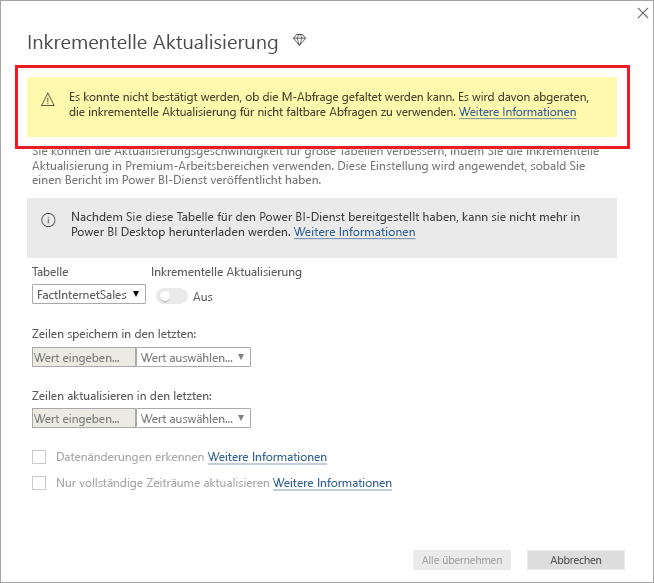

# <a name="incremental-refresh-in-power-bi-premium"></a>Inkrementelle Aktualisierung in Power BI Premium

Die inkrementelle Aktualisierung bietet im Power BI Premium-Dienst für sehr große Datasets die folgenden Vorteile:

- **Schnellere Aktualisierungen:** Nur Daten, die geändert wurden, müssen aktualisiert werden. Aktualisieren Sie beispielsweise nur die letzten fünf Tage eines zehn Jahre alten Datasets.

- **Zuverlässigere Aktualisierungen:** Es ist nicht mehr notwendig, Verbindungen mit langer Ausführungsdauer mit flüchtigen Quellsystemen herzustellen.

- **Reduzierter Ressourcenverbrauch:** Dank weniger zu aktualisierender Daten wird der Gesamtbedarf an Arbeitsspeicher und anderen Ressourcen reduziert.

## <a name="configure-incremental-refresh"></a>Konfigurieren inkrementeller Aktualisierungen

Die Richtlinien für die inkrementelle Aktualisierung werden in Power BI Desktop definiert und bei Veröffentlichung auf den Power BI-Dienst angewendet.

Starten Sie mit dem Aktivieren der inkrementellen Aktualisierung in **Vorschaufeatures**.


### <a name="filter-large-datasets-in-power-bi-desktop"></a>Filtern großer Datasets in Power BI Desktop

Große Datasets mit potenziell Milliarden von Zeilen werden möglicherweise von einem Power BI Desktop-Modell nicht unterstützt, da die PBIX-Datei durch die auf dem Desktopcomputer des Benutzers verfügbaren Speicherressourcen begrenzt wird. Daher werden solche Datensätze üblicherweise beim Import gefiltert. Diese Art der Filterung gilt unabhängig davon, ob die inkrementelle Aktualisierung verwendet wird oder nicht. Für die inkrementelle Aktualisierung filtern Sie mithilfe von Datums- und Uhrzeitparametern von Power Query.

#### <a name="rangestart-and-rangeend-parameters"></a>Die Parameter „RangeStart“ und „RangeEnd“

Für die inkrementelle Aktualisierung werden Datasets unter Verwendung von Datums- und Uhrzeitparametern von Power Query, mit den reservierten Namen **RangeStart** und **RangeEnd** mit Berücksichtigung von Groß- und Kleinschreibung, gefiltert. Diese Parameter werden verwendet, um die in Power BI Desktop importierten Daten zu filtern und die Daten dynamisch in Bereiche zu partitionieren nachdem sie im Power BI-Dienst veröffentlicht wurden. Zum Filtern nach den einzelnen Partitionen werden die Parameterwerte vom Dienst ersetzt. Nach Veröffentlichung werden die Parameterwerte vom Power BI-Dienst automatisch überschrieben. Eine Festlegung in den Dataseteinstellungen des Diensts ist nicht erforderlich. Nach Veröffentlichung werden die Parameterwerte vom Power BI-Dienst automatisch überschrieben. 

Um die Parameter mit Standardwerten zu definieren, wählen Sie im Power Query-Editor **Parameter verwalten** aus.


Nach der Definition der Parameter können Sie den Filter anwenden, indem Sie für eine Spalte den Menüpunkt **Benutzerdefinierter Filter** auswählen.


Stellen Sie sicher, dass Zeilen gefiltert werden, bei denen der Spaltenwert *nach oder gleich* **RangeStart** und *vor* **RangeEnd** ist.


> [!TIP]
> Zwar muss der Datentyp der Parameter „Datum/Uhrzeit“ sein, aber es ist möglich, diesen an die Anforderungen der Datenquelle anzupassen. Beispielsweise konvertiert die folgende Power Query-Funktion einen Datums-/Uhrzeitwert als ganze Zahl in einen Ersatzschlüssel der Form *JJJJMMDD*, die für Data Warehouses üblich ist. Die Funktion kann vom Filterschritt aufgerufen werden.
>
> `(x as datetime) => Date.Year(x)*10000 + Date.Month(x)*100 + Date.Day(x)`

Wählen Sie im Power Query-Editor **Schließen und übernehmen** aus. Eine Teilmenge des Datasets sollte in Power BI Desktop vorhanden sein.

#### <a name="filter-date-column-updates"></a>Filtern von Updates der Datumsspalte

Der Filter für die Datumsspalte wird verwendet, um die Daten im Power BI-Dienst dynamisch in Bereiche zu partitionieren. Die inkrementelle Aktualisierung ist nicht für die Unterstützung in Fällen vorgesehen, in denen die gefilterte Datenspalte im Quellsystem aktualisiert wird. Eine Aktualisierung wird als Einfüge- und Löschvorgang interpretiert, nicht als eigentliche Aktualisierung. Wenn der Löschvorgang im historischen Bereich und nicht im inkrementellen Bereich erfolgt, wird er nicht berücksichtigt. Das kann zu Fehlern bei der Datenaktualisierung führen, die durch Konflikte bei Partitionsschlüssel entstehen.

#### <a name="query-folding"></a>Abfragefaltung

Es ist wichtig, dass die Partitionsfilter per Push an das Quellsystem übertragen werden, wenn Abfragen für Aktualisierungsvorgänge übermittelt werden. Dies bedeutet, dass die Datenquelle die Abfragefaltung unterstützen muss. Die meisten Datenquellen, die SQL-Abfragen unterstützen, unterstützen auch die Abfragefaltung. Datenquellen wie Flatfiles, Blobs, Web- oder OData-Feeds unterstützen die Abfragefaltung normalerweise nicht. Wenn der Filter vom Datenquellen-Back-End nicht unterstützt wird, kann er nicht mithilfe von Push übertragen werden. Diese Fälle werden von der Mashup-Engine ausgeglichen, die den Filter lokal anwendet. Es kann sein, dass dafür das komplette Dataset von der Datenquelle abgerufen werden muss. Dadurch kann die inkrementelle Aktualisierung verlangsamt werden, und es kann sein, dass dem Prozess im Power BI-Dienst oder im lokalen Datengateway nicht ausreichend Ressourcen zur Verfügung stehen.

In Anbetracht der unterschiedlichen Unterstützungsebenen der Abfragefaltung für jede Datenquelle sollte eine Überprüfung durchgeführt werden, um sicherzustellen, dass die Filterlogik in die Quellabfragen eingeschlossen wurde. Um dies einfacher zu gestalten, versucht Power BI Desktop, diese Überprüfung für Sie durchzuführen. Falls eine Überprüfung nicht möglich ist, wird eine Warnung im Dialogfeld „Inkrementelle Aktualisierung“ angezeigt, wenn die Richtlinie für die inkrementelle Aktualisierung definiert wird. Für SQL-basierte Datenquellen wie SQL, Oracle und Teradata ist diese Warnung verlässlich. Für die Überprüfung durch andere Datenquellen kann eine Ablaufverfolgung von Abfragen erforderlich sein. Falls eine Bestätigung durch Power BI Desktop nicht möglich ist, wird die folgende Warnung angezeigt:

 

### <a name="define-the-refresh-policy"></a>Definieren der Aktualisierungsrichtlinie

Die inkrementelle Aktualisierung ist mit Ausnahme von Liveverbindungsmodellen im Kontextmenü für Tabellen verfügbar.


#### <a name="incremental-refresh-dialog"></a>Dialogfeld „Inkrementelle Aktualisierung“

Das Dialogfeld „Inkrementelle Aktualisierung“ wird angezeigt. Aktivieren Sie das Dialogfeld mithilfe der Umschaltfläche.


> [!NOTE]
> Wenn sich der Power Query-Ausdruck für die Tabelle nicht auf die Parameter mit reservierten Namen bezieht, ist die Umschaltmöglichkeit deaktiviert.

Im Text der Kopfzeile wird Folgendes erläutert:

- Die inkrementelle Aktualisierung wird nur für Arbeitsbereiche mit Premium-Kapazitäten unterstützt. Aktualisierungsrichtlinien werden in Power BI Desktop definiert und über Aktualisierungsvorgänge im Dienst angewendet.

- Wenn Sie die PBIX-Datei mit einer enthaltenen inkrementellen Aktualisierungsrichtlinie aus dem Power BI-Dienst herunterladen können, kann sie nicht in Power BI Desktop geöffnet werden. Auch wenn dies in Zukunft möglicherweise unterstützt wird, denken Sie daran, dass diese Datasets so groß werden können, dass sie nicht mehr heruntergeladen und auf einem typischen Desktopcomputer geöffnet werden können.

#### <a name="refresh-ranges"></a>Aktualisierungsbereiche

Im folgenden Beispiel werden Aktualisierungsrichtlinien zum Speichern der Daten für fünf gesamte Kalenderjahre sowie Daten des laufenden Jahres bis zum aktuellen Datum und zum inkrementellen Aktualisieren der Daten von zehn Tagen definiert. Der erste Aktualisierungsvorgang lädt Verlaufsdaten. Die folgenden Aktualisierungen sind inkrementell, und sie führen die folgenden Vorgänge aus, wenn sie täglich ausgeführt werden:

- Die Daten eines neuen Tages werden hinzugefügt.

- Daten der letzten zehn Tage bis zum aktuellen Datum werden aktualisiert.

- Kalenderjahre, die bezogen auf das aktuelle Datum älter als fünf Jahre sind, werden entfernt. Wenn das aktuelle Datum der 1. Januar 2019 ist, wird z.B. das Jahr 2013 entfernt.

Die erste Aktualisierung im Power BI-Dienst kann länger dauern, da fünf gesamte Kalenderjahre importiert werden. Nachfolgende Aktualisierungen werden möglicherweise in einem Bruchteil der Zeit abgeschlossen.


> [!NOTE]
> Die Definition dieser Bereiche reicht ggf. schon aus. In diesem Fall können Sie direkt zum folgenden Veröffentlichungsschritt übergehen. Die zusätzlichen Dropdownlisten sind für erweiterte Funktionen vorgesehen.

### <a name="advanced-policy-options"></a>Erweiterte Richtlinienoptionen

#### <a name="detect-data-changes"></a>Datenänderungen erkennen

Eine inkrementelle Aktualisierung der Daten von zehn Tagen ist effizienter als eine vollständige Aktualisierung von fünf Jahren. Es geht jedoch noch etwas besser. Wenn Sie das Kontrollkästchen **Datenänderungen erkennen** aktivieren, können Sie eine Datum-/Uhrzeit-Spalte auswählen, um nur die Tage zu bestimmen und zu aktualisieren, an denen sich die Daten geändert haben. Dies setzt voraus, dass eine solche Spalte im Quellsystem vorhanden ist, die typischerweise zu Prüfzwecken dient. **Hierbei darf es sich nicht um dieselbe Spalte handeln, die zum Partitionieren der Daten mit den RangeStart/RangeEnd-Parametern verwendet wird.** Der Maximalwert dieser Spalte wird für jeden der Zeiträume im Inkrementbereich ausgewertet. Wenn sie sich seit der letzten Aktualisierung nicht geändert hat, muss der Zeitraum nicht aktualisiert werden. Im Beispiel kann dies die Anzahl der Tage, die inkrementell aktualisiert werden, von zehn auf etwa zwei weitere verringern.


> [!TIP]
> Das aktuelle Design erfordert, dass die Spalte zur Erkennung von Datenänderungen beibehalten und im Arbeitsspeicher zwischengespeichert wird. Sie können eine der folgenden Techniken in Betracht ziehen, um die Kardinalität und den Arbeitsspeicherbedarf zu reduzieren.
>
> Behalten Sie nur den Maximalwert dieser Spalte zum Zeitpunkt der Aktualisierung bei, eventuell mithilfe einer Power Query-Funktion.
>
> Reduzieren Sie die Genauigkeit auf ein Niveau, das angesichts Ihrer Anforderungen an die Aktualisierungsfrequenz vertretbar ist.
>
> Wir planen, die Definition benutzerdefinierter Abfragen zur Erkennung von Datenänderungen zu einem späteren Zeitpunkt zu ermöglichen. Dies könnte dazu dienen, das Beibehalten des Spaltenwerts ganz zu vermeiden.

#### <a name="only-refresh-complete-periods"></a>Nur vollständige Zeiträume aktualisieren

Angenommen, Ihre Aktualisierung ist für 4:00 Uhr morgens geplant. Wenn während dieser 4 Stunden Daten im Quellsystem auftauchen, möchten Sie diese möglicherweise nicht berücksichtigen. Einige betriebswirtschaftliche Metriken – wie Fässer pro Tag in der Öl- und Gasindustrie – ergeben bei Teiltagen keinen Sinn.

Ein weiteres Beispiel ist das Aktualisieren von Daten in einem Finanzsystem, bei dem die Daten des Vormonats am 12. Kalendertag des Monats freigegeben werden. Legen Sie in diesem Fall den Inkrementbereich auf 1 Monat fest, und planen Sie die Aktualisierung für den 12. Tag des Monats. Wenn diese Option aktiviert ist, werden z.B. die Daten vom Januar am 12. Februar aktualisiert.


> [!NOTE]
> Aktualisierungsvorgänge im Dienst erfolgen gemäß der UTC-Zeit. Dies kann den Stichtag bestimmen und sich auf ganze Zeiträume auswirken. Wir planen, die Möglichkeit hinzuzufügen, den Stichtag für eine Aktualisierung zu überschreiben.

## <a name="publish-to-the-service"></a>Veröffentlichen im Dienst

Da die inkrementelle Aktualisierung eine ausschließliche Premium-Funktion ist, ermöglicht das Dialogfeld „Veröffentlichen“ nur die Auswahl eines Arbeitsbereichs mit Premium-Kapazität.


Sie können das Modell nun aktualisieren. Die erste Aktualisierung kann aufgrund des Imports der Verlaufsdaten länger dauern. Nachfolgende Aktualisierungen sind wesentlich schneller, da sie inkrementell erfolgen.

## <a name="query-timeouts"></a>Zeitüberschreitungen bei Abfragen

Im Artikel [Problembehandlung bei Aktualisierungsszenarios](https://docs.microsoft.com/power-bi/refresh-troubleshooting-refresh-scenarios) wird erklärt, dass es bei Aktualisierungsvorgängen im Power BI-Dienst zu Zeitüberschreitungen kommt. Abfragen können auch durch die standardmäßige Zeitüberschreitung für die Datenquelle eingeschränkt werden. Die meisten relationalen Datenquellen erlauben das Überschreiben von Zeitüberschreitungen im Ausdruck „M“. Zum Beispiel wird im folgenden Ausdruck die [SQL Server-Datenzugriffsfunktion](https://msdn.microsoft.com/query-bi/m/sql-database) verwendet, um sie auf 2 Stunden festzulegen. Jeder durch die Richtlinienbereiche definierte Zeitraum sendet eine Abfrage unter Einhaltung der Einstellung für die Befehlszeitüberschreitung.

```
let
    Source = Sql.Database("myserver.database.windows.net", "AdventureWorks", [CommandTimeout=#duration(0, 2, 0, 0)]),
    dbo_Fact = Source{[Schema="dbo",Item="FactInternetSales"]}[Data],
    #"Filtered Rows" = Table.SelectRows(dbo_Fact, each [OrderDate] >= RangeStart and [OrderDate] < RangeEnd)
in
    #"Filtered Rows"
```
