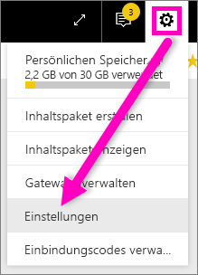
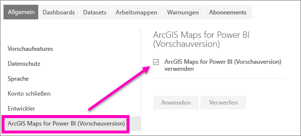

# Aktivieren von Power BI-Vorschaufeatures
## Was sind *Vorschaufeatures*?
Power BI wird ständig verbessert. Neue Funktionen stellen wir immer wieder als *Vorschaufeatures* vor. Wenn Sie sie testen möchten, können Sie Vorschaufeatures aktivieren (und deaktivieren).

> [!TIP]
> Haben Sie Fragen oder Feedback? [Besuchen Sie das Power BI-Communityforum](http://community.powerbi.com/t5/Navigation-Preview-Forum/bd-p/NavigationPreview).
> 
> 

## Suchen und Aktivieren (und Deaktivieren) von Vorschauversionen
1. Öffnen Sie das Menü „Einstellungen“, indem Sie das Zahnradsymbol in der oberen rechten Ecke des Power BI-Bildschirms und dann **Einstellungen** auswählen.
   
   .
2. Wählen Sie die Registerkarte **Allgemein** aus. Wenn eine Vorschau vorhanden ist, wird eine Option für **Vorschaufeatures** oder ein Vorschaufeature auf der linken Seite angezeigt.  In diesem Beispiel wird eine Vorschau für ArcGIS Maps aufgeführt. 
   
   
3. Im Optionsfeld können Sie die neue Oberfläche mit **Ein** bzw. über das Kontrollkästchen aktivieren. Klicken Sie dann auf **Übernehmen**.
4. Um die Vorschaufeatures zu deaktivieren, führen Sie die ersten drei oben beschriebenen Schritte aus, und wählen Sie im Sie im dritten Schritt **Aus** aus bzw. deaktivieren Sie das Kontrollkästchen. Wählen Sie dann **Übernehmen** aus.

Haben Sie Fragen oder Feedback? [Besuchen Sie das Power BI-Communityforum](http://community.powerbi.com/t5/Navigation-Preview-Forum/bd-p/NavigationPreview).

