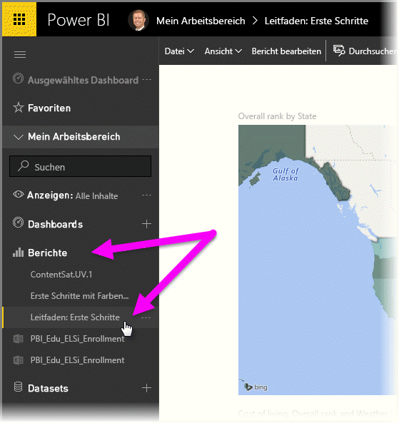
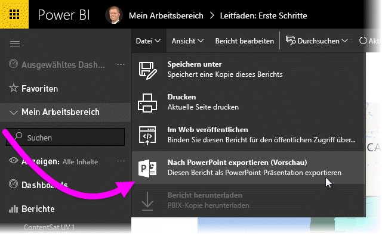
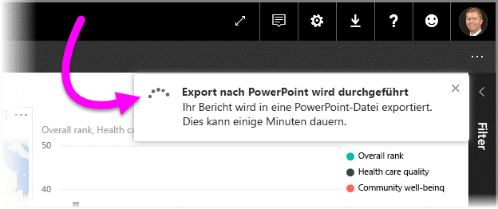
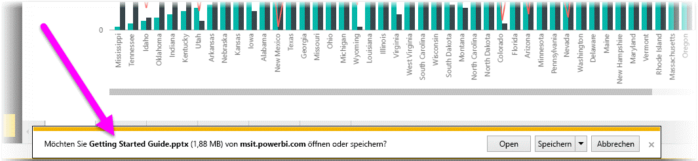
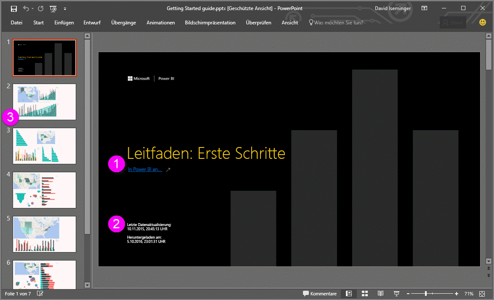
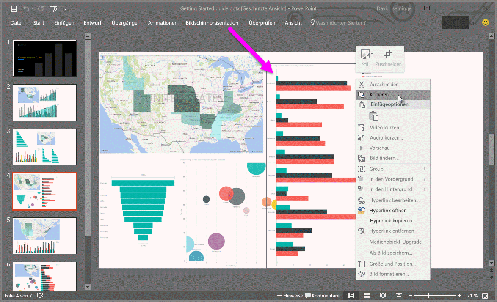

# Exportieren von Berichten aus Power BI nach PowerPoint (Preview)
Mit Power BI können Sie Berichte jetzt in **Microsoft PowerPoint** veröffentlichen und darauf basierend einfach eine Foliengruppe erstellen. Beim **Export nach PowerPoint** geschieht Folgendes:

* Jede Seite im Power BI-Bericht entspricht einer einzelnen Folie in PowerPoint.
* Jede Visualisierung im Power BI-Bericht wird beim Export in ein hochauflösendes Bild in PowerPoint umgewandelt.
* Textfelder im Power BI-Bericht entsprechen bearbeitbaren Textfeldern in PowerPoint.
* In PowerPoint wird ein Link zum Power BI-Bericht erstellt.

**Power BI-Berichte** lassen sich ganz einfach nach **PowerPoint** exportieren. Befolgen Sie einfach die Schritte im nächsten Abschnitt.

## Exportieren eines Power BI-Berichts nach PowerPoint
Wählen Sie im Power BI-Dienst im linken Navigationsbereich **Berichte** aus, um diesen Bereich zu erweitern. Wählen Sie dann den gewünschten Bericht aus, um diesen im Zeichenbereich anzuzeigen. Sie können den Bericht auch über **Mein Arbeitsbereich** oder aus den **Favoriten** auswählen, wenn sich der Bericht auch an diesen Orten befindet.

Sobald der Bericht, den Sie nach PowerPoint exportieren möchten, im Zeichenbereich angezeigt wird, wählen Sie in der Menüleiste im Power BI-Dienst **Datei > Export nach PowerPoint (Vorschau)** aus, wie in der folgenden Abbildung dargestellt.

Rechts oben im Browserfenster des Power BI-Diensts wird ein Benachrichtigungsbanner mit der Information angezeigt, dass ein Export nach PowerPoint ausgeführt wird. Dies kann einige Minuten dauern. Während der Bericht exportiert wird, können Sie in Power BI weiterarbeiten.

Sobald der Vorgang beendet ist, wird über das Banner gemeldet, dass der Power BI-Dienst den Export abgeschlossen hat.

Ihre Datei ist dann dort verfügbar, wo Ihr Browser heruntergeladene Dateien speichert. In der folgenden Abbildung wird die Datei als Downloadbanner unten im Browserfenster angezeigt.

Das war schon alles. Sie können die Datei herunterladen, in PowerPoint öffnen und wie jeden anderen PowerPoint-Stapel bearbeiten oder erweitern.

## Features der exportierten PowerPoint-Datei
Wenn Sie die aus Power BI exportierte PowerPoint-Datei öffnen, werden Sie einige nützliche Elemente entdecken. Sehen Sie sich die folgende Abbildung an, und betrachten Sie die nummerierten Elemente unten, in denen einige dieser Funktionen beschrieben werden.

1. Die erste Seite der Foliengruppe enthält den Namen des Berichts sowie einen Link, über den Sie den Bericht, auf dem die Foliengruppe basiert, **in Power BI anzeigen** können.
2. Außerdem werden weitere nützliche Informationen über den Bericht angezeigt, einschließlich der *letzten Datenaktualisierung*, der der exportierte Bericht zugrunde liegt, und des *Downloadzeitpunkts* (Uhrzeit und Datum). Dabei handelt es sich um Uhrzeit und Datum des Exports des Power BI-Berichts in die PowerPoint-Datei.
3. Jeder Berichtsseite entspricht eine eigene Folie (siehe linken Navigationsbereich).

Wenn Sie eine einzelne Folie näher betrachten, sehen Sie, dass jede Visualisierung als separates Bild enthalten ist (siehe oben). Auf diese Weise können Sie das Bild kopieren und in einer anderen Folie (oder an einem beliebigen Ort) einfügen.

Wie Sie mit dem PowerPoint-Stapel und den hochauflösenden Bildern weiter verfahren möchten, liegt ganz bei Ihnen.

## Einschränkungen
Einige Aspekte und Einschränkungen sind bei der Arbeit mit der Funktion **Export nach PowerPoint** zu beachten.

* **R-Visuals** werden derzeit nicht unterstützt. Diese Visuals werden als leeres Bild in PowerPoint mit der Fehlermeldung exportiert, dass das Visual nicht unterstützt wird.
* **Benutzerdefinierte Visuals**, die **zertifiziert** wurden, werden unterstützt. Weitere Informationen zu zertifizierten benutzerdefinierten Visuals sowie zum Zertifizieren von benutzerdefinierten Visuals finden Sie unter [Wie wird ein benutzerdefiniertes Visual zertifiziert?](power-bi-custom-visuals-certified.md). Nicht zertifizierte Visuals werden nicht unterstützt, und diese Visuals werden als leeres Bild in PowerPoint mit der Fehlermeldung exportiert, dass das Visual nicht unterstützt wird.
* **Zertifizierte benutzerdefinierte Visualisierungen** werden unterstützt. Eine zertifizierte benutzerdefinierte Visualisierung wurde zur Verwendung mit Power BI genehmigt, erfüllt bestimmte Codeanforderungen und hat strenge Sicherheitstest bestanden. Über diesen Link erhalten Sie [weitere Informationen über **zertifizierte benutzerdefinierte Visualisierungen**](power-bi-custom-visuals-certified.md).
* Berichte mit mehr als 15 Berichtsseiten können derzeit nicht exportiert werden.
* Der Exportvorgang des Berichts nach PowerPoint kann einige Minuten dauern. Zu den Faktoren, die die benötigte Zeit beeinflussen, zählen die Struktur des Berichts sowie die jeweils aktuelle Auslastung des Power BI-Diensts.
* Wenn das Menüelement **Export nach PowerPoint (Vorschau)** im Power BI-Dienst nicht verfügbar ist, hat der Administrator Ihres Mandanten diese Funktion wahrscheinlich deaktiviert. Wenden Sie sich an den Administrator Ihres Mandanten, um Einzelheiten zu erfahren.
* Hintergrundbilder werden an der Begrenzung des Diagramms abgeschnitten. Es wird empfohlen, Hintergrundbilder vor dem Export nach PowerPoint zu entfernen.
* **Sitzungsinterne Interaktivität** wie Hervorheben und Filtern, Drilldown usw. wird beim Export nach PowerPoint derzeit nicht unterstützt. Die exportierte PowerPoint-Datei enthält die ursprünglichen Visualisierungen, wie sie im Bericht gespeichert wurden.
* Seiten werden in PowerPoint immer mit dem Standardseitenverhältnis von 9:16 erstellt, unabhängig von den ursprünglichen Seitengrößen oder -abmessungen im Power BI-Bericht.
* Berichte, die ein Benutzer außerhalb Ihrer Power BI-Mandantendomäne besitzt (beispielsweise ein Bericht im Besitz einer Person außerhalb Ihrer Organisation, die ihn für Sie freigegeben hat), können nicht in PowerPoint veröffentlicht werden.
* Wenn Sie ein Dashboard für Personen außerhalb Ihrer Organisation freigeben (und damit für einen Benutzer, der nicht Ihrem Power BI-Mandanten angehört), kann der betreffende Benutzer die zugehörigen Berichte des freigegebenen Dashboards nicht nach PowerPoint exportieren. Wenn Sie beispielsweise aaron@contoso.com sind, können Sie Berichte für david@cohowinery.com freigeben. david@cohowinery.com kann jedoch die zugehörigen Berichte nicht nach PowerPoint exportieren.

## Nächste Schritte
[In Excel analysieren](service-analyze-in-excel.md)

[Excel-Daten in Power BI](service-excel-workbook-files.md)

[Wie wird ein benutzerdefiniertes visuelles Element zertifiziert?](power-bi-custom-visuals-certified.md)

