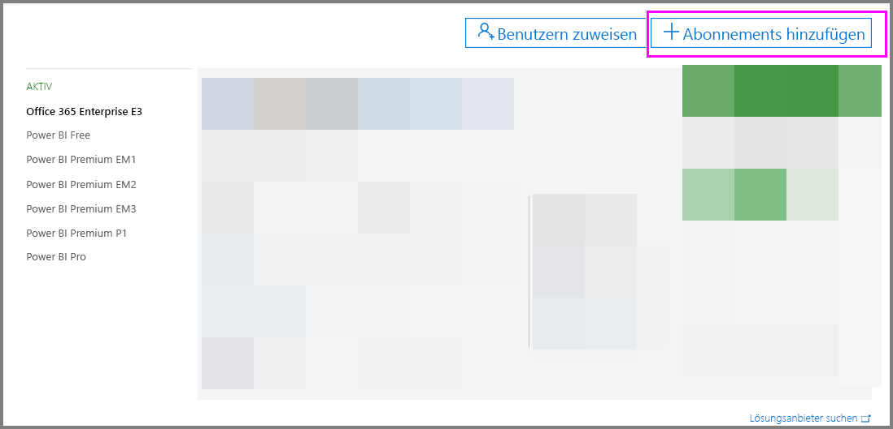
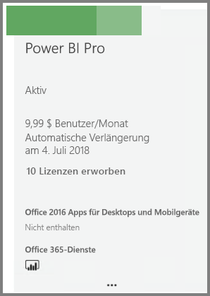
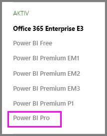

# Erwerb von Power BI Pro

Mit Power BI Pro können Sie Berichte veröffentlichen, Dashboards freigeben, mit Kollegen in Arbeitsbereichen zusammenarbeiten und andere damit verbundene Aktivitäten ausüben. Weitere Informationen darüber, wie Ihr Unternehmen von Power BI Pro profitieren kann, finden Sie unter [Power BI Pro in Ihrer Organisation](service-power-bi-pro-in-your-organization.md).

## Erwerb von Power BI Pro im Office 365 Admin Center

Office IT-Administratoren können Power BI Pro entweder als Teil eines Office 365 Enterprise E5-Abonnements oder als separates Power BI Pro-Abonnement erwerben. Anschließend können Sie die Power BI Pro-Lizenzen den entsprechenden Benutzern zuordnen. Weitere Informationen zum Zuweisen von Lizenzen finden Sie unter [Assign licenses to users in Office 365 (Zuweisen von Lizenzen zu Benutzern in Office 365)](https://support.office.com/en-us/article/assign-licenses-to-users-in-office-365-for-business-997596b5-4173-4627-b915-36abac6786dc?ui=en-US&rs=en-US&ad=US).

Führen Sie als Office IT-Admin diese Schritte aus, um Power BI Pro zu erwerben:

1. Navigieren Sie zum [Office 365 Admin Center](https://portal.office.com/adminportal/home#/homepage).
2. Klicken Sie im linken Navigationsbereich auf „Abrechnung“ und anschließend auf „Abonnements“.

    

3. Klicken Sie in der oberen rechten Ecke der Seite „Abonnements“ auf „Abonnement hinzufügen“.

    

4. Suchen Sie das gewünschte Abonnementangebot:

    Klicken Sie auf „Office 365 Enterprise E5“ in der Enterprise Suite.

    

    Klicken Sie unter „Andere Pläne“ auf „Power BI Pro“.

    

5. Zeigen Sie auf die drei Punkte (...) neben dem gewünschten Abonnement, und klicken Sie auf „Jetzt kaufen“.

    

6. Klicken Sie je nach bevorzugter Zahlungsart entweder auf „Pay monthly“ (Monatlich bezahlen) oder auf „Pay for a full year“ (Ein Jahr im Voraus bezahlen).
7. Geben Sie unter „How many users do you want?“ (Wie viele Benutzerlizenzen möchten Sie hinzufügen?) die Anzahl der Lizenzen ein, die Sie hinzufügen möchten, und klicken Sie dann auf „Zur Kasse gehen“ oder auf „In den Einkaufswagen“.
8. Stellen Sie sicher, dass das erworbene Abonnement nun auf der Seite „Abonnements“ angezeigt wird.

   

> [!NOTE]
> Sie können nach dem Kauf mehrere Lizenzen hinzufügen. Klicken Sie auf der Seite „Abonnements“ auf „Power BI Pro“ und anschließend auf „Hinzufügen oder Entfernen von Lizenzen“.
>

## Preise

Informationen zu den aktuellen Preisen finden Sie unter [Power BI – Preise](https://powerbi.microsoft.com/en-us/pricing/).

## Nächste Schritte
[Self-Service-Registrierung für Power BI](service-admin-signing-up-for-power-bi-with-a-new-office-365-trial.md)
 
[Power BI Free in Ihrer Organisation](service-admin-service-free-in-your-organization.md)
 
[Power BI Pro in Ihrer Organisation](service-power-bi-pro-in-your-organization.md)
 
[Aktivierung der erweiterten Pro-Testversion](service-extended-pro-trial.md)
 
[Assigning Power BI Pro licenses (Zuweisen von Power BI Pro-Lizenzen)](service-assigning-power-bi-pro-licenses.md)
 
[Power BI Premium – Beschreibung](service-admin-premium-manage.md)
 
[Erwerben von Power BI Premium](service-admin-premium-purchase.md)
 
[Power BI Premium-Whitepaper](https://aka.ms/pbipremiumwhitepaper)

Weitere Fragen? [Stellen Sie Ihre Frage in der Power BI-Community.](https://community.powerbi.com/)