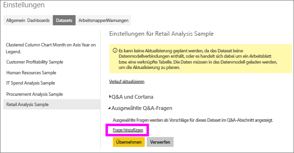
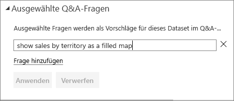
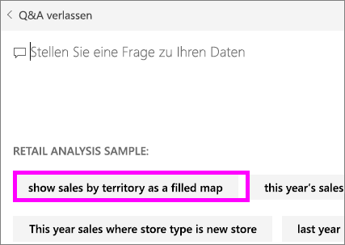

# Erstellen von ausgewählten Fragen für Power BI Q&A
Wenn Sie ein Dataset besitzen, können Sie dem Dataset eigene ausgewählte Fragen hinzufügen.  Power BI Q&A zeigt diese Fragen dann für Kollegen an, die das Dataset verwenden.  Durch die ausgewählten Fragen erhalten Ihre Kollegen Anhaltspunkte für die Arten von Fragen, die sie zum Dataset stellen können. Welche ausgewählten Fragen Sie hinzufügen, ist Ihnen überlassen – häufig gestellte Fragen, Fragen mit interessanten Ergebnissen oder Fragen, die möglicherweise schwierig zu formulieren sind.

Sehen Sie sich an, wie ausgewählte Fragen zu Power BI Q&A hinzugefügt und diese ausgewählten Fragen dann zum Erkunden des Datasets genutzt werden. Befolgen Sie dann die schrittweisen Anleitungen unter dem Video, um es selbst ausprobieren.

<iframe width="560" height="315" src="https://www.youtube.com/embed/E1mIAyEXuF4" frameborder="0" allowfullscreen></iframe>

> [!NOTE]
> Ausgewählte Fragen für Q&A stehen auch in der [Microsoft Power BI-App für iOS auf iPads, iPhones und iPod Touch-Geräten](mobile-apps-ios-qna.md) zur Verfügung.
> 
> 

In diesem Artikel wird das [Analysebeispiel für den Einzelhandel](sample-datasets.md) verwendet.

1. Wählen Sie das Q&A-Fragefeld aus.   Beachten Sie, dass Q&A an sich bereits hilfreich ist, da eine Liste der im Dataset auftretenden Begriffe angezeigt wird.
2. Um dieser Liste weitere Fragen hinzuzufügen, wählen Sie das Zahnradsymbol in der rechten oberen Ecke von Power BI aus.  
   
3. Wählen Sie **Einstellungen** &gt; **Datasets** &gt; **Analysebeispiel für Einzelhandel** &gt; **Ausgewählte Q&A-Fragen** aus.  
4. Wählen Sie **Frage hinzufügen**aus.
   
   
5. Geben Sie Ihre Frage in das Textfeld ein, und wählen Sie **Übernehmen**aus.   Optional können Sie eine weitere Frage hinzufügen, indem Sie **Frage hinzufügen**auswählen.  
   
6. Navigieren Sie zurück zum Power BI-Dashboard, um das Analysebeispiel für Einzelhandel zu öffnen, und platzieren Sie den Cursor im Fragenfeld für Fragen und Antworten (F&A).   
   
7. Die neue ausgewählte Frage **Umsatz nach Gebiet als Karte** wird in der Liste an erster Stelle aufgeführt. Wählen Sie sie aus.  
8. Die Antwort wird als Flächenkartogramm visualisiert.  
   

### Nächste Schritte
[Q&A in Power BI](service-q-and-a.md)  
[Tutorial: Einführung in Power BI Q&A](power-bi-visualization-introduction-to-q-and-a.md)  
[Power BI – Grundkonzepte](service-basic-concepts.md)  
Weitere Fragen? [Wenden Sie sich an die Power BI-Community](http://community.powerbi.com/)

