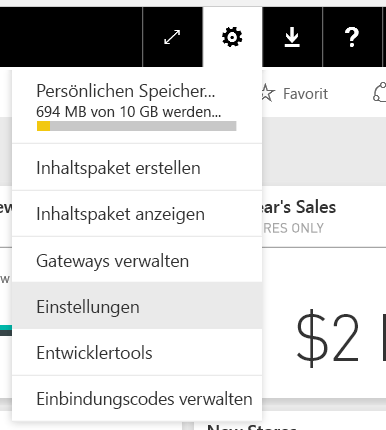
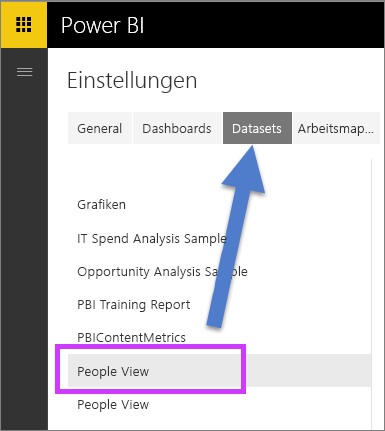
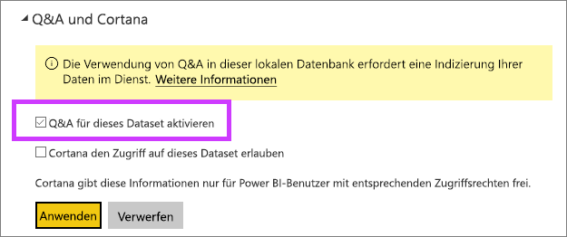

# Aktivieren von Q&A für Liveverbindungen
## Was ist das lokale Datengateway?  Was ist eine Liveverbindung?
Sie können Datasets in Power BI importieren oder eine Liveverbindung zu den Daten herstellen. Über eine Liveverbindung verwendete Datasets werden häufig als „lokal“ bezeichnet. Die Liveverbindungen werden mit einem [Gateway](service-gateway-onprem.md) verwaltet, und die Übermittlung der Daten und Abfragen erfolgt über Liveabfragen.

## Q&A für Datasets mit Zugriff über das lokale Datengateway
Wenn Sie F&A mit Datasets verwenden möchten, auf die Sie über ein Gateway zugreifen, müssen Sie die Datasets zuerst aktivieren.

Nach der Aktivierung erstellt Power BI einen Index für Ihre Datenquelle und lädt eine Teilmenge der Daten in Power BI hoch, um das Stellen von Fragen zu ermöglichen. Das Erstellen des anfänglichen Index kann mehrere Minuten dauern. Dieser wird anschließend von Power BI verwaltet und bei Datenänderungen automatisch aktualisiert. Das F&A-Feature verhält sich mit diesen Datasets genauso wie mit in Power BI veröffentlichten Daten. In beiden Fällen wird der vollständige in F&A verfügbare Feature-Satz einschließlich der Verwendung der Datenquelle mit Cortana unterstützt.

Wenn Sie in Power BI Fragen stellen, ermittelt F&A die beste Visualisierung bzw. den besten Bericht, um Ihre Fragen mithilfe eines Index Ihres Datasets zu beantworten. Nachdem die bestmögliche Antwort ermittelt wurde, ruft Q&A mithilfe von DirectQuery Livedaten aus der Datenquelle über das Gateway ab, um Diagrammen und Grafiken zu füllen. Dadurch zeigen die F&A-Ergebnisse in Power BI stets die aktuellen Daten direkt aus der zugrunde liegenden Datenquelle an.

Da Power BI F&A die Text- und Schemawerte aus Ihrer Datenquelle verwenden, um zu ermitteln, wie das zugrunde liegende Modell für Antworten abgefragt werden soll, ist bei Suchen nach speziellen neuen oder gelöschten Textwerten (wie Fragen im Zusammenhang mit einem neu hinzugefügten Textdatensatz für einen Kunden) wichtig, dass der Index die aktuellen Werte enthält. Power BI aktualisiert den Text- und Schemaindex automatisch innerhalb von 60 Minuten nach einer Datenänderung.

Weitere Informationen finden Sie unter:

* Was ist das [lokale Datengateway](service-gateway-onprem.md)?
* [Einführung in Power BI Q&A](power-bi-q-and-a.md)

## Aktivieren von Q&A
Nachdem Sie das Datengateway eingerichtet haben, stellen Sie aus Power BI eine Verbindung mit Ihren Daten her.  Erstellen Sie ein Dashboard mit Ihren lokalen Daten oder laden Sie eine PBIX-Datei hoch, die lokale Daten verwendet.  Möglicherweise enthalten Ihre Dashboards, Berichte und Datasets auch bereits lokale Daten, die für Sie freigegeben wurden.

1. Wählen Sie rechts oben das Zahnradsymbol  und dann **Einstellungen** aus.
   
   
2. Wählen Sie **Datasets**, und wählen Sie das für Q&A aktivierte Dataset aus.
   
   
3. Erweitern Sie **Q&A and Cortana**, aktivieren Sie das Kontrollkästchen **Turn on Q&A for this dataset**, und wählen Sie **Anwenden**.
   
    

## Welche Daten werden zwischengespeichert, und wie werden Daten geschützt?
Wenn Sie F&A für Ihre lokalen Daten aktivieren, wird eine Teilmenge der Daten im Dienst zwischengespeichert. Damit wird eine akzeptable Leistung von F&A sichergestellt. Werte, die länger als 24 Zeichen sind, werden in Power BI nicht zwischengespeichert. Wenn Sie F&A deaktivieren (durch Deaktivieren von **Turn on Q&A for this dataset**) oder Ihr Dataset löschen, wird der Cache innerhalb weniger Stunden gelöscht.

## Zu beachtende Aspekte und Problembehandlung
Während der Vorschauphase dieses Features gelten mehrere Einschränkungen:

* Das Feature ist zunächst nur für tabellarische SQL Server 2016 Analysis Services-Datenquellen verfügbar. Das Feature wurde für die Zusammenarbeit mit tabellarischen Daten optimiert. Einige Funktionen stehen für mehrdimensionale Datenquellen zur Verfügung, aber die volle Q&A-Leistung wird für mehrdimensionale Datenquellen noch nicht unterstützt. Im Lauf der Zeit werden weitere vom lokalen Datengateway unterstützte Datenquellen eingeführt.
* Zunächst steht die in SQL Server Analysis Services definierte vollständige Unterstützung der Sicherheit auf Zeilenebene nicht in der öffentlichen Vorschauversion zur Verfügung. Bei der Eingabe von Fragen in F&A können durch die „automatische Vervollständigung“ Zeichenfolgenwerte angezeigt werden, auf die der Benutzer keinen Zugriff hat. Die im Modell definierte Sicherheit auf Zeilenebene wird jedoch für Berichts- und Diagrammvisualisierungen respektiert, wobei keine zugrunde liegenden numerischen Daten angezeigt werden können. Optionen zum Steuern dieses Verhalten werden in kommenden Updates veröffentlicht.
* Liveverbindungen werden nur mit dem lokalen Datengateway unterstützt. Daher können sie nicht mit dem persönlichen Gateway verwendet werden.

## Nächste Schritte
[Lokales Datengateway](service-gateway-onprem.md)  
[Verwalten Ihrer Datenquelle – Analysis Services](service-gateway-enterprise-manage-ssas.md)  
[Power BI – Grundkonzepte](service-basic-concepts.md)  
[Übersicht über Power BI Q&A](power-bi-q-and-a.md)  

Weitere Fragen? [Stellen Sie Ihre Frage in der Power BI-Community.](http://community.powerbi.com/)

