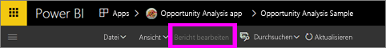
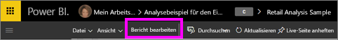
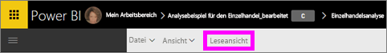

# Leseansicht und Bearbeitungsansicht für Berichte im Power BI-Dienst
Im Power BI-Dienst (nicht in Power BI Desktop) stehen zwei Modi bereit, um Berichte anzuzeigen und mit ihnen zu interagieren: die Leseansicht und die Bearbeitungsansicht.  

Die Leseansicht ist für alle Benutzer verfügbar, während die Bearbeitungsansicht nur für Berichtersteller und -besitzer zur Verfügung steht. Die Leseansicht ist für die *Benutzer* von Berichten konzipiert, d.h. die Kollegen, die Berichte in Apps öffnen oder für die Berichte freigegeben werden. Durch die Leseansicht wird sichergestellt, dass alle Benutzer eines bestimmten Berichts den gleichen Bericht und die gleichen Visualisierungen mit den gleichen Filtern sehen.  Die Benutzer können mit dem Bericht interagieren, jedoch keine Änderungen speichern.

>**HINWEIS**: Unter bestimmten Umständen sehen die Benutzer von Berichten aufgrund von Sicherheits- und Datenberechtigungen auf Zeilenebene unterschiedliche Daten. 

Die Bearbeitungsansicht ist nur für die Ersteller von Berichten und die Benutzer verfügbar, die den Bericht als Mitglied oder Administrator eines App-Arbeitsbereichs besitzen.

## Leseansicht

In der Leseansicht können Sie sich mit den Daten vertraut machen und bedenkenlos damit experimentieren. Interaktivität ist in der Leseansicht weniger ausgeprägt als in der [Bearbeitungsansicht](service-interact-with-a-report-in-editing-view.md), aber die Leseansicht bietet Ihnen dennoch viele Optionen zum Untersuchen der Daten. Dies ist z.B. beim Anzeigen von Berichten praktisch, die [für Sie freigegeben wurden](service-share-dashboards.md) und nur in der Leseansicht geöffnet werden können.

Weitere Informationen finden Sie unter [Interagieren mit einem Bericht in der Leseansicht von Power BI](service-interact-with-a-report-in-reading-view.md).

## Bearbeitungsansicht
In der Bearbeitungsansicht in Power BI können Sie (im Vergleich zur [Leseansicht](service-interact-with-a-report-in-reading-view.md)) noch tiefer in Ihre Daten eindringen, indem Sie Felder hinzufügen und entfernen, den Visualisierungstyp ändern, neue Visualisierungen erstellen und Visualisierungen und Seiten zum Bericht hinzufügen und daraus entfernen.

Weitere Informationen finden Sie unter [Interagieren mit einem Bericht in der Bearbeitungsansicht von Power BI](service-interact-with-a-report-in-editing-view.md).

## Navigieren zwischen Bearbeitungs- und Leseansicht
Beachten Sie, dass nur Berichtersteller und -besitzer einen Bericht in der Bearbeitungsansicht öffnen können.

1. Ein Bericht wird standardmäßig in der Leseansicht geöffnet. Sie können an der Option **Bericht bearbeiten** erkennen, ob Sie sich in der Leseansicht befinden. Wenn **Bericht bearbeiten** ausgegraut angezeigt wird, sind Sie nicht berechtigt, den Bericht in der Bearbeitungsansicht zu öffnen.

   

2. Wenn **Bericht bearbeiten** nicht ausgegraut ist, können Sie die Option auswählen, um den Bericht in der Bearbeitungsansicht zu öffnen. 
   
   
   
   Der Bericht wird dann in der Bearbeitungsansicht mit denselben [Anzeigeeinstellungen](power-bi-report-display-settings.md) angezeigt, die Sie zuletzt in der Leseansicht verwendet haben.

2. Wählen Sie zum Zurückkehren zur Leseansicht in der oberen Navigationsleiste **Leseansicht** aus.
   
    

Es gibt viele Möglichkeiten, um mit einem Bericht in der Leseansicht zu interagieren und die Daten so zu analysieren und aufzuteilen, dass Einblicke und Antworten gewonnen werden können.  Das nächste Thema, [Interagieren mit einem Bericht in der Leseansicht von Power BI](service-interact-with-a-report-in-editing-view.md), führt dies im Detail auf.

### Nächste Schritte
[Interagieren mit einem Bericht in der Leseansicht](service-interact-with-a-report-in-editing-view.md)    
Zurück zu [Berichte in Power BI](service-reports.md)    
Weitere Fragen? [Wenden Sie sich an die Power BI-Community](http://community.powerbi.com/) 

