# Echtzeitstreaming in Power BI
Mit dem Power BI-Echtzeitstreaming können Sie in Echtzeit Daten streamen und Dashboards aktualisieren. Alle visuellen Elemente und Dashboards, die in Power BI erstellt werden können, können so erstellt werden, dass Echtzeitdaten und visuelle Echtzeitelemente angezeigt und aktualisiert werden. Die Geräte und Quellen von Streamingdaten können Factorysensoren, soziale Medien, Servicenutzungsmetriken sowie alle Elemente sein, über die zeitkritische Daten erfasst oder übertragen werden können.

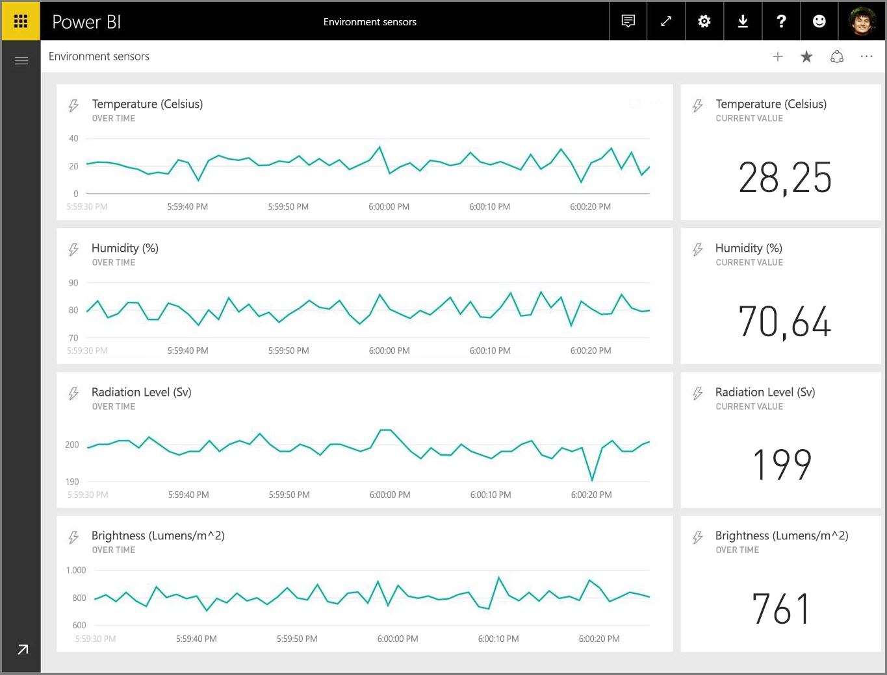

In diesem Artikel wird das Einrichten eines Echtzeitstreaming-Datasets in Power BI veranschaulicht. Bevor wir jedoch darauf eingehen, ist ein Verständnis der Typen von Echtzeitdatasets, die in Kacheln (und Dashboards) angezeigt werden, sowie der Unterschiede zwischen diesen Datasets unerlässlich.

## Typen von Echtzeitdatasets
Es gibt drei Typen von Echtzeitdatasets, die für die Anzeige in Echtzeitdashboards konzipiert sind:

* Pushdataset
* Streamingdataset
* PubNub-Streamingdataset

Informieren Sie sich zunächst über die Unterschiede zwischen diesen Datasets (dieser Abschnitt). Anschließend wird erläutert, wie Daten per Push in jedes dieser Datasets übertragen werden.

### Pushdataset
Bei einem **Pushdataset** werden Daten per Push in den Power BI-Dienst übertragen. Beim Erstellen des Datasets erstellt der Power BI-Dienst automatisch eine neue Datenbank im Dienst, in dem die Daten gespeichert werden. Da eine zugrundeliegende Datenbank vorhanden ist, in der weiterhin eingehende Daten gespeichert werden, können anhand der Daten Berichte erstellt werden. Diese Berichte und die zugehörigen visuellen Elemente gleichen beliebigen anderen visuellen Berichtselementen. Das heißt, Sie können sämtliche Power BI-Berichterstellungsfunktionen nutzen, um visuelle Elemente zu erstellen. Hierzu zählen u.a. benutzerdefinierte visuelle Elemente, Datenwarnungen und angeheftete Dashboardkacheln.

Sobald ein Bericht mit dem Pushdataset erstellt wurde, können seine visuellen Elemente an ein Dashboard angeheftet werden. In diesem Dashboard werden visuelle Elemente bei Aktualisierungen der Daten in Echtzeit aktualisiert. Innerhalb des Diensts löst das Dashboard bei jedem Empfang neuer Daten eine Aktualisierung der Kachel aus.

Bei angehefteten Kacheln aus einem Pushdataset sind zwei Aspekte zu beachten:

* Das Anheften eines gesamten Berichts mit der Option *Live-Seite anheften* bewirkt **nicht**, dass die Daten automatisch aktualisiert werden.
* Sobald ein visuelles Element an ein Dashboard angeheftet wurde, können Sie über **Q&A** Fragen zum Pushdataset in natürlicher Sprache stellen. Wenn Sie eine **Q&A**-Abfrage senden, können Sie das erhaltene visuelle Element wieder am Dashboard anheften, und dieses Dashboard wird *ebenfalls* in Echtzeit aktualisiert.

### Streamingdataset
Bei einem **Streamingdataset** werden Daten ebenfalls per Push in den Power BI-Dienst übertragen. Es gibt jedoch einen wichtigen Unterschied: Power BI speichert die Daten nur in einem temporären Cache, der schnell abläuft. Mithilfe des temporären Caches werden lediglich visuelle Elemente mit einem eher flüchtigen Verlauf angezeigt, z.B. ein Liniendiagramm, mit dem ein Zeitfenster von einer Stunde dargestellt wird.

Für ein **Streamingdataset** ist *keine* zugrundeliegende Datenbank vorhanden. Daher können Sie anhand der aus dem Stream eingehenden Daten *keine* Berichtsvisuals erstellen. Somit können Sie nicht die Berichtsfunktionen wie Filtern, benutzerdefinierte visuelle Elemente usw. nutzen.

Die einzige Möglichkeit zum Visualisieren eines Streamingdatasets besteht darin, eine Kachel hinzuzufügen und das Streamingdataset als Datenquelle für **benutzerdefinierte Streamingdaten** zu verwenden. Die auf einem **Streamingdataset** basierenden benutzerdefinierten Streamingkacheln werden für die schnelle Anzeige von Echtzeitdaten optimiert. Die Wartezeit zwischen der Übertragung der Daten per Push in den Power BI-Dienst und der Aktualisierung des visuellen Elements ist äußerst kurz, da die Daten nicht in eine Datenbank eingegeben bzw. aus einer Datenbank ausgelesen werden müssen.

In der Praxis empfehlen sich Streamingdatasets und die zugehörigen visuellen Streamingelemente insbesondere für Situationen, in denen die Wartezeit zwischen der Übertragung der Daten per Push und ihrer Visualisierung minimiert werden soll. Darüber hinaus hat es sich bewährt, die Daten per Push in einem Format zu übertragen, das ohne Änderung visualisiert werden kann und bei dem es keiner weiteren Aggregierung bedarf. Beispiele für Daten, die wie vorhanden verwendet werden können, sind Temperaturwerte und vorberechnete Durchschnittswerte.

### PubNub-Streamingdataset
Bei einem **PubNub**-Streamingdataset verwendet der Power BI-Webclient das PubNub-SDK, um einen vorhandenen PubNub-Datenstrom zu lesen, wobei vom Power BI-Dienst keine Daten gespeichert werden.

Wie beim **Streamingdataset** gibt es auch beim **PubNub-Streamingdataset** keine zugrundeliegende Datenbank in Power BI. Daher können Sie keine Berichtsvisuals anhand der eingehenden Daten erstellen, und auch die Vorteile der Berichtsfunktionen wie Filtern, benutzerdefinierte Visuals usw. können nicht genutzt werden. Somit kann das **PubNub-Streamingdataset** nur visualisiert werden, indem dem Dashboard eine Kachel hinzugefügt und ein PubNub-Datenstrom als Quelle konfiguriert wird.

Auf einem **PubNub-Streamingdataset** basierende Kacheln werden für die schnelle Anzeige von Echtzeitdaten optimiert. Da Power BI mit dem PubNub-Datenstrom direkt verbunden ist, gibt es eine äußerst geringe Latenz bei der Übertragung der Daten per Push in den Power BI-Dienst und der Aktualisierung der Visualisierung.

### Matrix eines Streamingdatasets
In der folgenden Tabelle (oder Matrix) werden die drei Typen von Datasets für das Echtzeitstreaming beschrieben. Zudem werden die Vorteile und Nachteile der einzelnen Typen aufgeführt.

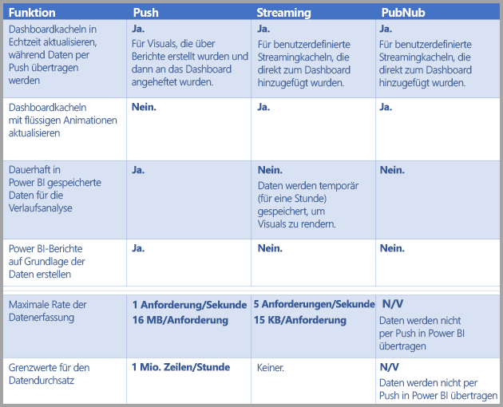

> [!NOTE]
> In [diesem Artikel](https://docs.microsoft.com/power-bi/developer/api-rest-api-limitations) finden Sie Informationen zu den **Push**-Beschränkungen hinsichtlich der übertragenen Datenmenge.
> 
> 

## Übertragen von Daten in Datasets per Push
Im vorhergehenden Abschnitt wurden die drei Grundtypen von Echtzeitdatasets beschrieben, die für das Echtzeitstreaming verwendet werden können. Zudem wurde auf die Unterschiede zwischen den Typen eingegangen. In diesem Abschnitt wird beschrieben, wie Datasets erstellt und Daten per Push in diese Datasets übertragen werden.

Es gibt drei grundlegende Möglichkeiten, Daten per Push in ein Dataset zu übertragen:

* Mit den Power BI-REST-APIs
* Über die Benutzeroberfläche des Streamingdatasets
* Mithilfe von Azure Stream Analytics

Betrachten wir nun der Reihe nach diese einzelnen Möglichkeiten.

### Übertragen von Daten per Push mit den Power BI-REST-APIs
Mit **Power BI-REST-APIs** können Daten erstellt und an **Pushdatasets** und an **Streamingdatasets** gesendet werden. Wenn Sie ein Dataset mithilfe von Power BI-REST-APIs erstellen, wird mit dem *defaultMode*-Flag angegeben, ob es sich um ein Push- oder Streamingdataset handelt. Wenn kein *defaultMode*-Flag gesetzt ist, handelt es sich bei dem Dataset standardmäßig um ein **Pushdataset**.

Wenn der *defaultMode*-Wert auf *pushStreaming* festgelegt ist, ist das Dataset sowohl ein **Push**- *als auch* ein **Streamingdataset** und bietet daher die Vorteile beider Datasettypen. 

> [!NOTE]
> Wenn beim Verwenden von Datasets das *defaultMode*-Flag auf *pushStreaming* festgelegt ist und eine Anforderung die 15-KB-Größenbeschränkung für ein **Streamingdataset** überschreitet, jedoch unter der 16-MB-Größenbeschränkung eines **push**-Datasets liegt, wird die Anforderung erfolgreich ausgeführt, und die Daten werden im Pushdataset aktualisiert. Bei allen Streamingkacheln tritt jedoch vorübergehend ein Fehler auf.

Verwenden Sie nach dem Erstellen eines Datasets die REST-APIs, um die Daten per Push mithilfe der [**PostRows**-API](https://docs.microsoft.com/rest/api/power-bi/pushdatasets/datasets_postrows) zu übertragen.

Alle Anforderungen an REST-APIs werden mit **Azure AD OAuth** gesichert.

### Übertragen von Daten per Push über die Benutzeroberfläche des Streamingdatasets
Im Power BI-Dienst können Sie ein Dataset erstellen, indem Sie wie in der folgenden Abbildung den **API**-Ansatz wählen.

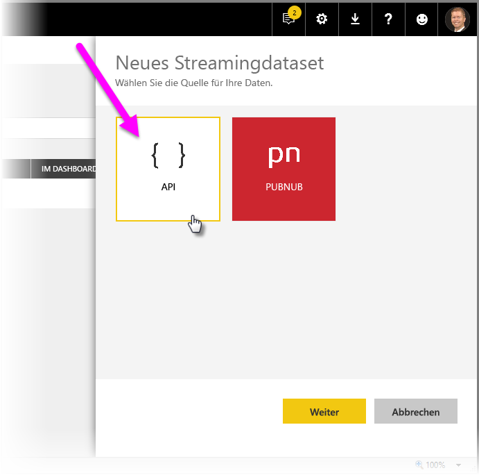

Beim Erstellen des neuen Streamingdatasets können Sie die Option **Verlaufsdatenanalyse** aktivieren (siehe Abbildung unten), die weitreichende Auswirkungen hat.

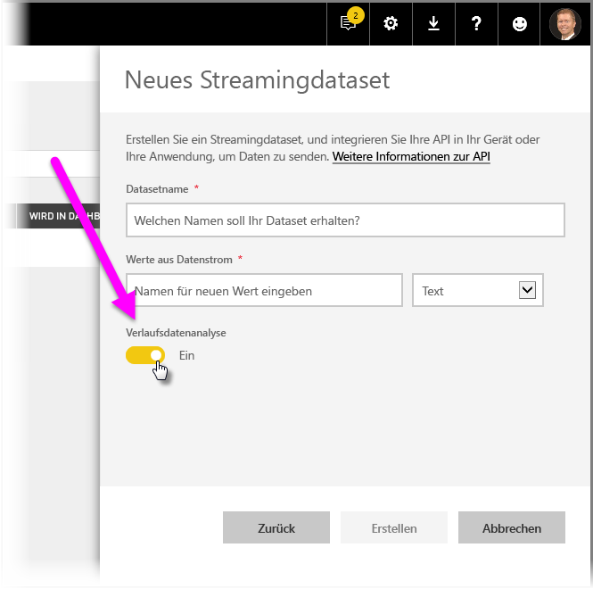

Wenn **Verlaufsdatenanalyse** deaktiviert ist (dies ist die Standardeinstellung), erstellen Sie ein **Streamingdataset**, wie weiter oben in diesem Artikel beschrieben. Ist **Verlaufsdatenanalyse** hingegen *aktiviert*, ist das erstellte Dataset sowohl ein **Streamingdataset** als auch ein **Pushdataset**. Dies entspricht dem Erstellen eines Datasets mithilfe der Power BI-REST-APIs, wobei das *defaultMode*-Flag auf *pushStreaming* festgelegt ist (wie weiter oben in diesem Artikel beschrieben).

> [!NOTE]
> Für Streamingdatasets, die über die Benutzeroberfläche des Power BI-Diensts erstellt werden (wie im vorherigen Abschnitt beschrieben), ist keine Azure AD-Authentifizierung erforderlich. In solchen Datasets empfängt der Dataset-Besitzer eine URL mit einem RowKey, der den Anfordernden autorisiert, Daten per Push in das Dataset zu übertragen, ohne dass ein Azure AD-OAuth-Bearertoken verwendet werden muss. Beachten Sie jedoch, dass auch mit dem Azure AD (AAD)-Ansatz immer noch Daten per Push in das Dataset übertragen werden können.
> 
> 

### Übertragen von Daten per Push mithilfe von Azure Stream Analytics
Sie können Power BI als Ausgabe in **Azure Stream Analytics** (ASA) hinzufügen und diese Datenströme anschließend im Power BI-Dienst in Echtzeit visualisieren. In diesem Abschnitt werden technische Aspekte des Ablaufs dieses Prozesses erläutert.

Azure Stream Analytics erstellt mithilfe der Power BI-REST-APIs seinen Ausgabedatenstrom in Power BI, wobei *defaultMode* auf *pushStreaming* festgelegt ist (Informationen zu *defaultMode* finden Sie in vorherigen Abschnitten dieses Artikels). Das Ergebnis ist ein Dataset, mit dem die Vorteile von **Push-** und **Streamingdatasets** genutzt werden können. Beim Erstellen des Datasets legt Azure Stream Analytics zudem das Flag **retentionPolicy* auf *basicFIFO* fest. Bei dieser Einstellung werden in der Datenbank, die das zugehörige Pushdataset unterstützt, 200.000 Zeilen gespeichert. Wird dieser Grenzwert erreicht, werden Zeilen gemäß dem FIFO-Prinzip (First-In First-Out) gelöscht.

> [!CAUTION]
> Wenn Ihre Azure Stream Analytics-Abfrage eine sehr schnelle Ausgabe in Power BI (z.B. ein- oder zweimal pro Sekunde) zum Ergebnis hat, fasst Azure Stream Analytics diese Ausgaben per Stapelverarbeitung in einer einzigen Anforderung zusammen. Dadurch kann die Größe der Anforderung den Grenzwert für Streamingkacheln überschreiten. In diesem Fall können Streamingkacheln (wie in früheren Abschnitten bereits erwähnt) nicht gerendert werden. In derartigen Fällen empfiehlt es sich, die Rate der Datenausgabe in Power BI zu verlangsamen. Legen Sie anstelle eines sekündlichen Maximalwerts einen Maximalwert von mehr als 10 Sekunden fest.
> 
> 

## Einrichten des Datasets für das Echtzeitstreaming in Power BI
Nun haben wir die drei Grundtypen von Datasets für das Echtzeitstreaming sowie die drei grundlegenden Möglichkeiten zum Übertragen von Daten in ein Dataset per Push erörtert. Kommen wir jetzt zur Funktionsweise des Echtzeit-Streamingdatasets in Power BI.

Um mit dem Echtzeitstreaming zu beginnen, müssen Sie eine von zwei Möglichkeiten für die Nutzung von Streamingdaten in Power BI auswählen:

* **Kacheln** mit visuellen Elementen der Streamingdaten
* **Datasets**, die auf der Grundlage von in Power BI beibehaltenen Streamingdaten erstellt werden

Bei beiden Optionen müssen Sie **Streamingdaten** in Power BI einrichten. Wählen Sie hierfür in einem vorhandenen oder neuen Dashboard die Option **Kachel hinzufügen** und dann **Benutzerdefinierte Streamingdaten** aus.

Wenn Sie noch keine Streamingdaten eingerichtet haben, ist das kein Problem. Wählen Sie für die ersten Schritte einfach **Verwaltete Daten** aus.

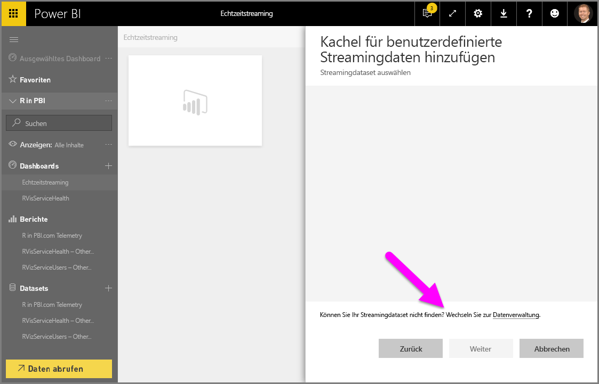

Auf dieser Seite können Sie (im Textfeld) den Endpunkt des Streamingdatasets eingeben, sofern bereits eines erstellt wurde. Sollten Sie noch kein Streamingdataset erstellt haben, wählen Sie in der oberen rechten Ecke das Plussymbol ( **+** ) aus, um die verfügbaren Optionen zum Erstellen eines Streamingdatasets anzuzeigen.

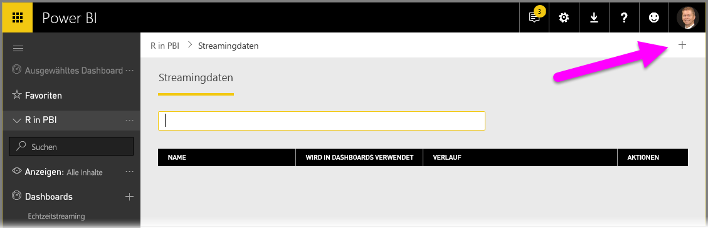

Wenn Sie auf das Symbol **+** klicken, werden zwei Optionen angezeigt:

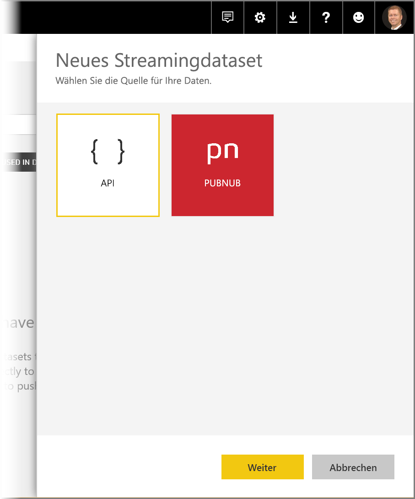

Im nächsten Abschnitt werden diese Optionen beschrieben, und es wird ausführlicher erläutert, wie Sie eine **Kachel** für das Streaming oder ein **Dataset** anhand der Streamingdatenquelle erstellen, die Sie später zum Erstellen von Berichten verwenden können.

## Erstellen Sie das Streamingdataset mit der gewünschten Option.
Es gibt zwei Möglichkeiten, einen Echtzeit-Streamingdatenfeed zu erstellen, der in Power BI verwendet und visualisiert werden kann:

* **Power BI-REST-API** mit einem Echtzeit-Streamingendpunkt
* **PubNub**

In den nächsten Abschnitten werden diese Optionen im Einzelnen erläutert.

### Verwenden der Power BI-REST-API
**Power BI-REST-API**Verbesserungen der Power BI-REST-API erleichtern Entwicklern das Echtzeitstreaming. Bei der Auswahl von **API** im Fenster **Neues Streamingdataset** werden Optionen angezeigt, die eine Verbindung mit dem Endpunkt und dessen Verwendung durch Power BI ermöglichen:

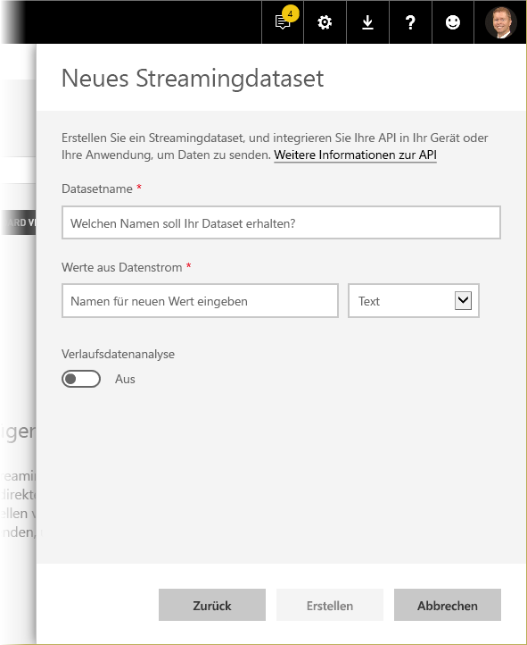

Wenn Power BI die über diesen Datenstream gesendeten Daten speichern soll, aktivieren Sie *Verlaufsdatenanalyse*. Anschließend können Sie für den gesammelten Datenstream Berichte erstellen und Analysen ausführen. Sie können sich außerdem [über die API informieren](https://docs.microsoft.com/rest/api/power-bi/).

Nachdem Sie den Datenstrom erfolgreich erstellt haben, steht Ihnen ein REST-API-URL-Endpunkt zur Verfügung, den die Anwendung mithilfe von *POST*-Anfragen aufrufen kann, um die Daten an das erstellte Power BI-Dataset für **Streamingdaten** zu übertragen.

Bei *POST*-Anforderungen sollten Sie sicherstellen, dass der Anforderungstext dem JSON-Beispiel entspricht, das in der Power BI-Benutzeroberfläche angezeigt wird. Beispiel: Umschließen Sie JSON-Objekte mit einem Array.

### Verwenden von PubNub
Dank der Integration von **PubNub**-Streaming in Power BI können Sie **PubNub**Datenströme mit geringer Latenzzeit in Power BI verwenden (oder neue erstellen). Wenn Sie **PubNub** und dann **Weiter** auswählen, wird das folgende Fenster angezeigt:

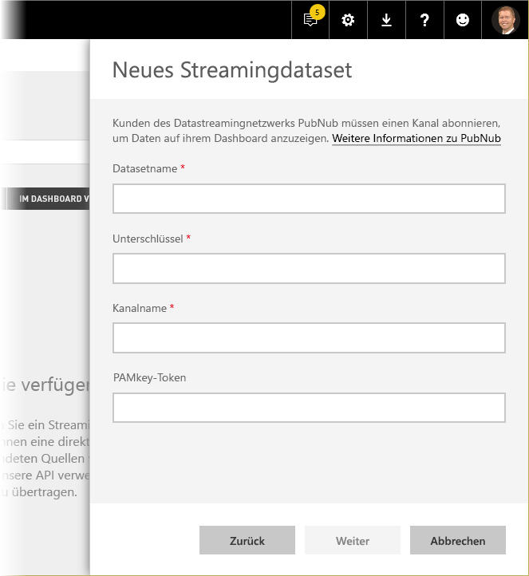

> [!WARNING]
> PubNub-Kanäle können mithilfe eines PAM-Authentifizierungsschlüssels (PubNub Access Manager) gesichert werden. Dieser Schlüssel wird für alle Benutzer freigegeben, die auf das Dashboard zugreifen können. Hier erhalten Sie [weitere Informationen zur PubNub-Zugriffssteuerung](https://www.pubnub.com/docs/web-javascript/pam-security).
> 
> 

**PubNub**Datenströme haben oft ein hohes Volumen und sind in ihrer ursprünglichen Form nicht immer für die Speicherung und Verlaufsanalyse geeignet. Um Power BI für eine Verlaufsanalyse der PubNub-Daten zu verwenden, müssen Sie den unformatierten PubNub-Stream aggregieren und an Power BI senden. Eine Möglichkeit dafür stellt [Azure Stream Analytics](https://azure.microsoft.com/services/stream-analytics/) dar.

## Beispiel für die Verwendung von Echtzeitstreaming in Power BI
Hier finden Sie ein kurzes Beispiel für die Funktionsweise des Echtzeitstreamings in Power BI. Dieses Beispiel veranschaulicht den Wert des Echtzeitstreamings.

In diesem Beispiel wird ein öffentlich verfügbarer Datenstrom aus **PubNub** verwendet. Gehen Sie wie folgt vor:

1. Wählen Sie im **Power BI-Dienst** ein Dashboard aus (oder erstellen Sie ein neues Dashboard). Wählen Sie anschließend **Kachel hinzufügen** > **Benutzerdefinierte Streamingdaten** und dann die Schaltfläche **Weiter** aus.
   
   
2. Wenn noch keine Streamingdatenquellen vorhanden sind, wählen Sie den Link **Verwaltete Daten** (direkt über der Schaltfläche **Weiter**) aus, und wählen Sie dann über den Link in der oberen rechten Ecke des Fensters **+ Streamingdaten hinzufügen** aus. Wählen Sie **PubNub** und dann **Weiter** aus.
3. Erstellen Sie einen Namen für das Dataset, und fügen Sie dann die folgenden Werte in das angezeigte Fenster ein. Wählen Sie anschließend **Weiter** aus:
   
   *Abonnementschlüssel:*
   
       sub-c-5f1b7c8e-fbee-11e3-aa40-02ee2ddab7fe
   *Kanal:*
   
       pubnub-sensor-network
   
   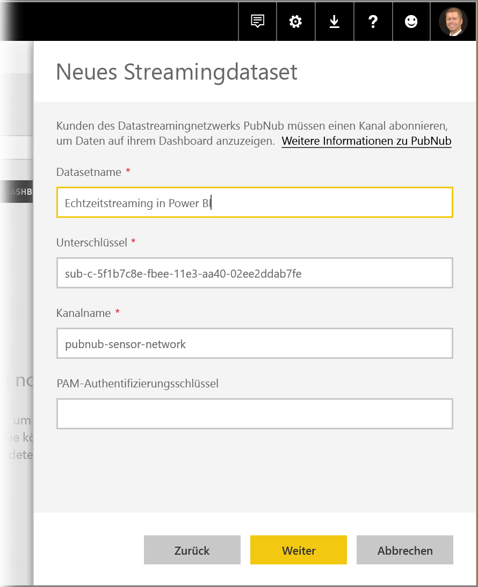
4. Wählen Sie im nächsten Fenster nur die Standardwerte aus (die automatisch aufgefüllt werden). Wählen Sie dann **Erstellen** aus.
   
   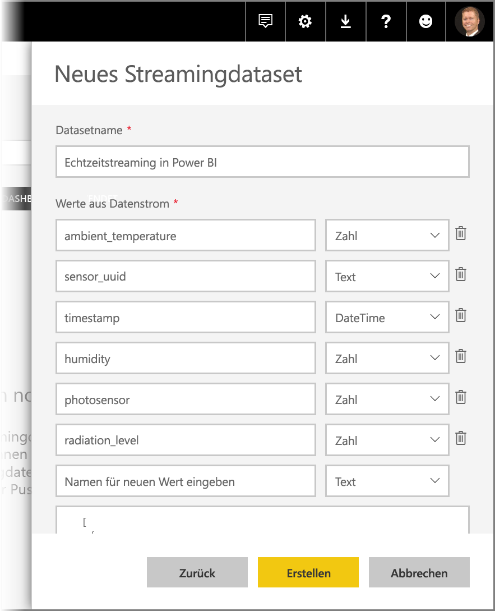
5. Erstellen Sie im Power BI-Arbeitsbereich ein neues Dashboard, und fügen Sie dann eine Kachel hinzu (die Schritte finden Sie bei Bedarf weiter oben). Wenn Sie jetzt eine Kachel erstellen und **Benutzerdefinierte Streamingdaten** auswählen, ist ein Streamingdataset vorhanden, das Sie verwenden können. Experimentieren Sie ein wenig damit. Wenn Sie Liniendiagrammen einige Felder vom Typ *Zahl* und dann weitere Kacheln hinzufügen, erhalten Sie ein Echtzeitdashboard, das wie folgt aussieht:
   
   

Probieren Sie dieses Beispieldataset aus. Erstellen Sie dann eigene Datasets, und streamen Sie Livedaten in Power BI.

## Fragen und Antworten
Im Folgenden finden Sie Antworten auf einige häufig gestellte Fragen zum Echtzeitstreaming in Power BI.

#### Können Filter für ein Pushdataset verwendet werden? Und wie sieht es bei einem Streamingdataset aus?
Leider werden Filter von Streamingdatasets nicht unterstützt. Für Pushdatasets können Sie einen Bericht erstellen, den Bericht filtern und anschließend die gefilterten visuellen Elemente an ein Dashboard anheften. Es ist jedoch nicht möglich, den Filter für das visuelle Element zu ändern, sobald dieses am Dashboard angeheftet ist.

Sie können separat die Live-Berichtskachel am Dashboard anheften. In diesem Fall können Sie die Filter ändern. Live-Berichtskacheln werden jedoch bei der Übertragung von Daten per Push nicht in Echtzeit aktualisiert – Sie müssen das visuelle Element über die Option *Dashboardkacheln aktualisieren* im Menü **Mehr** manuell aktualisieren.

Beim Anwenden von Filtern zum Übertragen von Datasets mit *DateTime*-Feldern per Push mit einer Genauigkeit von Millisekunden werden *Äquivalenzoperatoren* nicht unterstützt. Operatoren wie „Größer als“ (>) und „Kleiner als“ (<) werden jedoch ordnungsgemäß ausgeführt.

#### Wie kann ich den aktuellen Wert in einem Pushdataset erkennen? Und wie sieht es bei einem Streamingdataset aus?
Streamingdatasets sind so ausgelegt, dass die aktuellen Daten angezeigt werden. Mit dem visuellen Streamingelement **Karte** können Sie auf einfache Weise die aktuellen numerischen Werte anzeigen lassen. Die Karte unterstützt jedoch leider keine Daten vom Typ *DateTime* oder *Text*.
Wenn Sie bei Pushdatasets über einen Zeitstempel im Schema verfügen, können Sie versuchen, ein visuelles Berichtselement mit dem letzten N-Filter zu erstellen.

#### Kann ich in Power BI Desktop eine Verbindung mit Push- oder Streamingdatasets herstellen?
Dies ist derzeit leider nicht möglich.

#### Um auf die vorherige Frage zurückzukommen: Wie kann ich für Echtzeitdatasets eine Modellierung ausführen?
Eine Modellierung ist bei einem Streamingdataset nicht möglich, da die Daten nicht dauerhaft gespeichert werden. Bei einem Pushdataset können Sie die REST-APIs zum Aktualisieren von Datasets/Tabellen verwenden, um Measures und Beziehungen hinzuzufügen. 

#### Wie kann ich alle Werte in einem Pushdataset löschen? Und wie sieht es bei einem Streamingdataset aus?
In einem Pushdataset können Sie den REST-API-Aufruf „Delete Rows“ verwenden. Derzeit gibt es keine Möglichkeit, Daten aus einem Streamingdataset zu löschen; die Daten werden jedoch nach Ablauf einer Stunde automatisch gelöscht.

#### Ich habe eine Azure Stream Analytics-Ausgabe in Power BI eingerichtet, diese wird jedoch in Power BI nicht angezeigt – worin besteht das Problem?
Versuchen Sie, das Problem anhand der folgenden Prüfliste zu beheben:

1. Starten Sie den Azure Stream Analytics-Auftrag neu (Aufträge, die vor der allgemeinen Einführung der Streaming-Version erstellt wurden, erfordern einen Neustart)
2. Versuchen Sie, die Power BI-Verbindung in Azure Stream Analytics erneut zu autorisieren
3. Welchen Arbeitsbereich haben Sie in der Azure Stream Analytics-Ausgabe angegeben? Haben Sie im Power BI-Dienst diesen (d.h. den gleichen) Arbeitsbereich eingecheckt?
4. Erfolgt die Ausgabe der Azure Stream Analytics-Abfrage explizit in die Power BI-Ausgabe? (Verwendung des INTO-Schlüsselworts)
5. Erfolgt ein Datenfluss durch den Azure Stream Analytics-Auftrag? Das Dataset wird nur erstellt, wenn Daten übertragen werden.
6. Können Sie die Azure Stream Analytics-Protokolle einsehen, um festzustellen, ob Warnungen oder Fehler vorhanden sind?

## Nächste Schritte
Hier sind einige Links zu Themen, die beim Verwenden von Echtzeitstreaming in Power BI hilfreich sein könnten:

* [Übersicht über die Power BI-REST-API mit Echtzeitdaten](https://docs.microsoft.com/rest/api/power-bi/)
* [Azure Stream Analytics](https://azure.microsoft.com/services/stream-analytics/)

