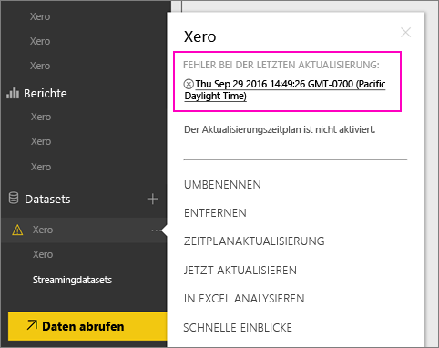
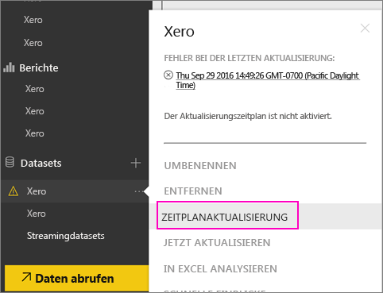
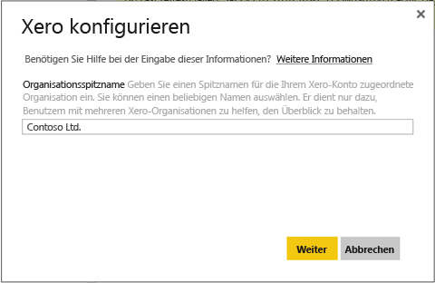
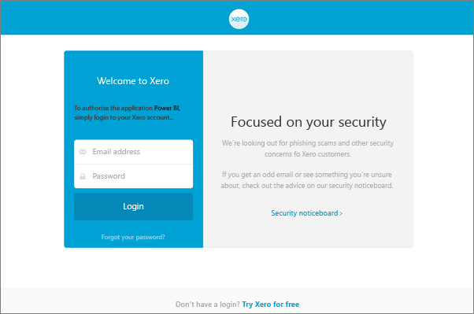
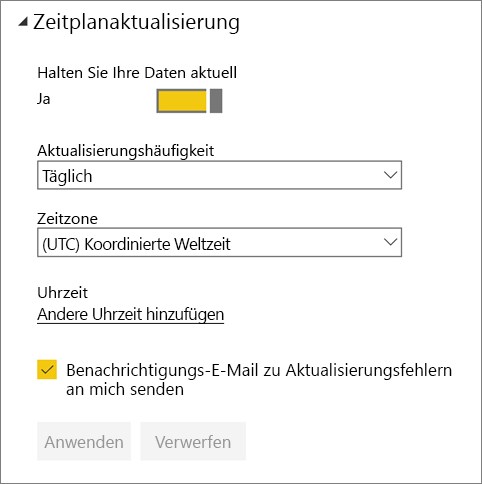
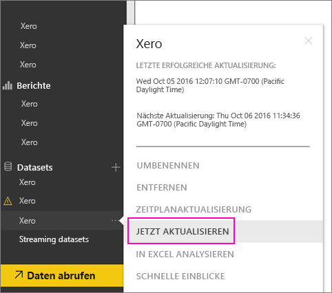

# Aktualisieren der Anmeldeinformationen für das Xero-Inhaltspaket nach einem Aktualisierungsfehler
Wenn Sie das Xero-Inhaltspaket für Power BI verwenden, sind Sie möglicherweise auf Probleme bei der täglichen Aktualisierung des Inhaltspakets festgestellt, das kürzlich durch eine Störung des Power BI-Diensts verursacht wurde.

Sie können feststellen, ob Ihr Inhaltspaket erfolgreich aktualisiert wurde, indem Sie den letzten Aktualisierungsstatus des Xero-Datasets überprüfen, wie im folgenden Screenshot gezeigt.

Wenn Sie sehen, dass die Aktualisierung wie oben gezeigt fehlgeschlagen ist, befolgen Sie diese Schritte, um die Anmeldeinformationen für das Inhaltspaket zu erneuern.

1. Klicken Sie auf die Auslassungspunkte (...) neben dem Xero-Dataset, und klicken Sie dann auf **Aktualisierung planen**. Dadurch wird die Einstellungsseite für das Xero-Inhaltspaket geöffnet.
   
    
2. Wählen Sie auf der Seite **Einstellungen für Xero** die Option **Anmeldeinformationen für die Datenquelle** > **Anmeldeinformationen bearbeiten** aus.
   
    
3. Geben Sie den Namen Ihrer Organisation ein, und klicken Sie auf **Weiter**.
   
    
4. Melden Sie sich mit Ihrem Xero-Konto an.
   
    
5. Nachdem Sie Ihre Anmeldeinformationen aktualisiert haben, möchten jetzt wir sicherstellen, dass im Aktualisierungszeitplan die tägliche Ausführung festgelegt ist. Klicken Sie dazu auf die Auslassungspunkte (...) neben dem Xero-Dataset, und klicken Sie dann erneut auf **Aktualisierung planen**.
   
    
6. Sie können das Dataset auch sofort aktualisieren. Klicken Sie auf die Auslassungspunkte (...) neben dem Xero-Dataset, und klicken Sie dann auf **Jetzt aktualisieren**.
   
    

Wenn weiterhin Probleme beim Aktualisieren auftreten, wenden Sie sich unter [http://support.powerbi.com](http://support.powerbi.com) an uns. 

Weitere Informationen zum Xero-Inhaltspaket für Power BI finden Sie auf der [Hilfeseite für das Xero-Inhaltspaket](service-connect-to-xero.md).

### Nächste Schritte
* Weitere Fragen? [Wenden Sie sich an die Power BI-Community](http://community.powerbi.com/)

