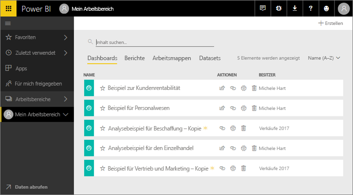
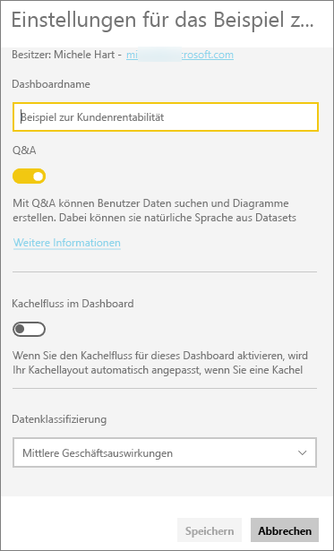
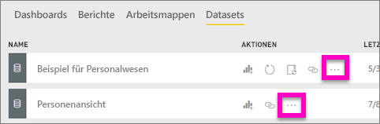
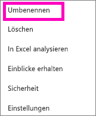
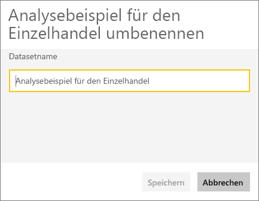
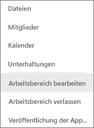
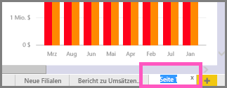

# Sie können praktisch alle Elemente im Power BI-Dienst umbenennen.
In diesem Artikel wird erläutert, wie Sie Dashboards, Berichte, Berichtsseiten, Arbeitsmappen, Datasets, Apps und Arbeitsbereiche im Power BI-Dienst umbenennen.

**Kann ich den Namen ändern?**

| Inhaltstyp | Ich bin der Autor oder Ersteller | Für mich freigegeben |
| --- | --- | --- |
| Dashboards in einem Arbeitsbereich |Ja |Nein |
| Berichte in einem Arbeitsbereich |Ja |Nein |
| Arbeitsmappe in einem Arbeitsbereich |Ja |Nein |
| Dataset in einem Arbeitsbereich |Ja |Nein |
| App-Arbeitsbereich |Ja, wenn Sie der Besitzer sind oder über Administratorberechtigungen verfügen |Nein |
| Veröffentlichte Apps |Nicht im App-Bildschirm, aber der App-Name kann im App-Arbeitsbereich geändert und die App mit einem neuen Namen neu veröffentlicht werden, wenn Sie über Administratorberechtigungen verfügen |Nein |
| App-Inhalte (Dashboard, Bericht, Arbeitsmappe, Dataset) |Nicht im App-Bildschirm, aber der Inhalt der App kann im App-Arbeitsbereich umbenannt und die App mit einem neuen Namen neu veröffentlicht werden, wenn Sie über Administratorberechtigungen verfügen |Nein |
| Inhalte in **Für mich freigegeben** |Nein |Nein |

## Umbenennen eines Dashboards, Berichts oder einer Arbeitsmappe
1. Öffnen Sie einen Arbeitsbereich, und wählen Sie die Registerkarte **Dashboards**, **Berichte** oder **Arbeitsmappen** aus. Zeigen Sie auf das umzubenennende Element, und klicken Sie auf das Zahnradsymbol . Wenn kein Zahnradsymbol angezeigt wird, verfügen Sie nicht über die Berechtigung zum Umbenennen.
   
   
2. Geben Sie auf der Seite „Einstellungen“ den neuen Namen ein, und wählen Sie **Speichern** aus.
   
   

## Umbenennen eines Datasets
1. Öffnen Sie einen Arbeitsbereich, und wählen Sie die Registerkarte **Datasets** aus.
   
   
2. Zeigen Sie auf das Element, das Sie umbenennen möchten, wählen Sie die Auslassungspunkte (...) aus, und wählen Sie **Umbenennen** aus.  
   
      
   
   > [!NOTE]
   > Die Optionen in der Dropdownliste variieren.
   > 
   > 
3. Geben Sie auf der Seite „Einstellungen“ einen neuen Namen ein, und wählen Sie **Speichern** aus.
   
     

## Umbenennen eines App-Arbeitsbereichs
Jeder Benutzer mit Administratorberechtigungen kann einen App-Arbeitsbereich umbenennen.

1. Wechseln Sie zu dem Arbeitsbereich, den Sie umbenennen möchten.
2. Wählen Sie in der rechten oberen Ecke die Auslassungspunkte (...) und dann **Arbeitsbereich bearbeiten** aus. Wenn diese Option nicht angezeigt wird, verfügen Sie nicht über die Berechtigung zum Umbenennen dieses Arbeitsbereichs. 
   
    
3. Geben Sie einen neuen Namen für den Arbeitsbereich ein, und wählen Sie **Speichern** aus.
   
   

## Umbenennen einer Seite in einem Bericht
Gefällt Ihnen der Namen einer Seite in Ihrem Power BI-Bericht nicht?  Ein neuer Name ist nur einen Mausklick entfernt. Seiten können in der [Bearbeitungsansicht für Berichte](service-interact-with-a-report-in-editing-view.md) umbenannt werden.

1. Öffnen Sie den Bericht in der [Bearbeitungsansicht](service-reading-view-and-editing-view.md).
2. Wechseln Sie zu den Registerkarten „Berichtsseite“ am unteren Rand der Power BI-Fensters.
   
    
3. Öffnen Sie die Berichtsseite, die Sie umbenennen möchten, indem Sie die Registerkarte auswählen.
4. Doppelklicken Sie auf den Namen der Registerkarte, um sie zu markieren.  
   
    
5. Geben Sie einen neuen Berichtsseitennamen ein, und drücken Sie die EINGABETASTE.
   
    

## Zu beachtende Aspekte und Problembehandlung
* Wenn das Element, das umbenannt werden soll, für Sie freigegeben wurde oder zu einem Inhaltspaket gehört, wird das Zahnradsymbol nicht angezeigt, und Sie haben keinen Zugriff auf die Einstellungen.
* Wenn auf der Registerkarte **Datasets** die Auslassungspunkte (...) nicht angezeigt werden, vergrößern Sie das Browserfenster.

Weitere Fragen? [Wenden Sie sich an die Power BI-Community](http://community.powerbi.com/)

