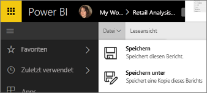
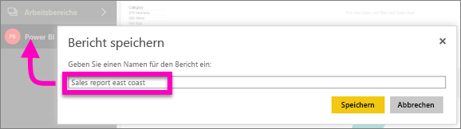

# Speichern eines Berichts im Power BI-Dienst und in Power BI Desktop
Nachdem Sie einen Bericht in Power BI geändert haben, können Sie ihn speichern, unter einem neuen Namen speichern oder ohne Änderungen schließen. Angenommen, Sie öffnen den Bericht, erstellen eine Visualisierung und heften diese an Ihr Dashboard an. Wenn Sie ihn schließen, ohne die Änderungen zu speichern, bleibt die Kachel im Dashboard, die Visualisierung wird jedoch nicht im Bericht gespeichert. Wenn Sie auf diese Kachel auf dem Dashboard klicken, wird der Bericht geöffnet, die Visualisierung ist allerdings nicht vorhanden.

> [!TIP]
> Achten Sie darauf, welcher Arbeitsbereich aktiv ist, damit Sie den gespeicherten Bericht finden können. Der Bericht wird im aktiven Arbeitsbereich gespeichert.
> 
> 

### So speichern Sie einen Bericht:
1. Wenn Sie versuchen, einen Bericht zu verlassen, und der Bericht Änderungen enthält, wird in Power BI eine Eingabeaufforderung angezeigt.
   
   
2. Sie können den Bericht auch speichern, indem Sie **DATEI** \> **Speichern** oder **Speichern unter** auswählen. Wenn Sie sich in der [Leseansicht](service-interact-with-a-report-in-reading-view.md) befinden, sehen Sie nur die Option „Speichern unter“. 
   
   
3. Wenn es sich um einen neuen Bericht („Speichern“) oder um eine neue Version eines vorhandenen Berichts („Speichern unter“) handelt, geben Sie ihm einen aussagekräftigen Namen.  **Der Bericht wird dem aktiven Arbeitsbereich hinzugefügt.**
   
    

### Nächste Schritte
Erfahren Sie mehr über [Berichte in Power BI](service-reports.md).

[Power BI – Grundkonzepte](service-basic-concepts.md)

Weitere Fragen? [Wenden Sie sich an die Power BI-Community](http://community.powerbi.com/)

