# Abonnieren eines Power BI-Berichts oder -Dashboards
Es war noch nie so einfach, bei den wichtigsten Dashboards und Berichten auf dem aktuellen Stand zu bleiben. Wenn Sie die Berichtsseiten und Dashboards abonnieren, die für Sie am wichtigsten sind, erhalten Sie von Power BI per E-Mail eine Momentaufnahme. Sie legen fest, wie oft Power BI die E-Mail-Nachrichten senden soll: von einmal täglich bis einmal pro Woche. Die E-Mail und die Momentaufnahme werden in der Sprache verfasst, die in den Power BI-Einstellungen festgelegt wurde. Wenn keine Sprache definiert wurde, verwendet Power BI die aktuelle Spracheinstellung des Browsers.

Sie können die Spracheinstellung anzeigen, indem Sie das Zahnradsymbol und dann **Einstellungen > Allgemein > Sprache** auswählen.

> [!NOTE]
> Abonnements können nur im Power BI-Dienst erstellt werden. Die E-Mail, die Sie erhalten, enthält einen Link, mit dem Sie zum Bericht/Dashboard wechseln können. Wenn Sie diesen Link auf mobilen Geräten auswählen, auf denen Power BI-Apps installiert sind, wird die App gestartet (statt die Standardaktion auszuführen, d.h. den Bericht oder das Dashboard auf der Power BI-Website zu öffnen).
> 
> 

Sehen Sie sich an, wie Sirui ein E-Mail-Abonnement für einen Bericht einrichtet. Befolgen Sie dann die schrittweisen Anleitungen unter dem Video, um es selbst ausprobieren.

<iframe width="560" height="315" src="https://www.youtube.com/embed/saQx7G0pxhc" frameborder="0" allowfullscreen></iframe>

## Anforderungen
Das **Erstellen** eines Abonnements ist ein Feature von Power BI Pro, und Sie benötigen Berechtigungen zum Anzeigen oder Bearbeiten der Inhalte (Dashboard oder Bericht).

## Abonnieren eines Dashboards
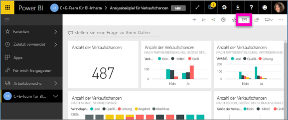

1. Öffnen Sie das Dashboard.
2. Wählen Sie in der oberen Menüleiste **Abonnieren** aus, oder wählen Sie das Umschlagsymbol  aus.
   
   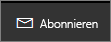
3. Mithilfe des gelben Schiebereglers können Sie das Abonnement aktivieren und deaktivieren.  Wenn Sie den Schieberegler auf „Aus“ stellen, wird das Abonnement nicht gelöscht. Verwenden Sie zum Löschen des Abonnements das Papierkorbsymbol.
   
   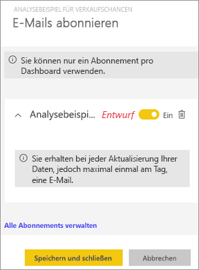
4. Wählen Sie **Speichern und schließen** aus, um das Abonnement zu speichern. Sie erhalten jedes Mal eine E-Mail-Momentaufnahme des Dashboards, wenn eines der zugrunde liegenden Datasets geändert wurde. Wird das Dashboard an einem Tag mehrmals aktualisiert, erhalten Sie nur eine E-Mail mit einer Momentaufnahme nach der ersten Aktualisierung.
   
   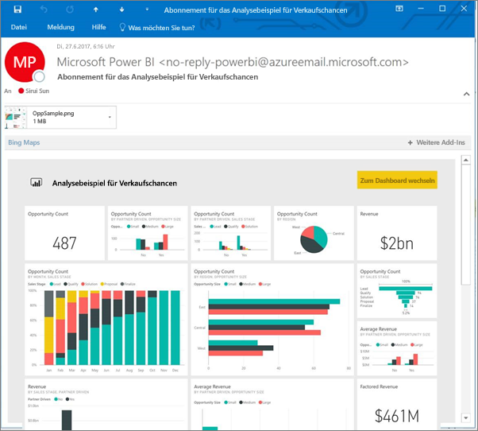
   
   > [!TIP]
   > Möchten Sie die E-Mail-Nachricht sofort ansehen? Lösen Sie das Senden einer E-Mail aus, indem Sie eines der mit dem Dashboard verknüpften Datasets aktualisieren. (Wenn Sie nicht über Bearbeitungsberechtigungen für das Dataset verfügen, müssen Sie einen Benutzer mit den entsprechenden Berechtigungen bitten, diesen Schritt für Sie auszuführen.) Um zu ermitteln, welche Datasets zum Erstellen des Dashboards verwendet werden, wählen Sie im Dashboard das Symbol **Verwandte Inhalte anzeigen**  aus, um **Verwandte Inhalte** zu öffnen, und wählen Sie dann das Symbol zum Aktualisieren  aus. 
   > 
   > 
   
   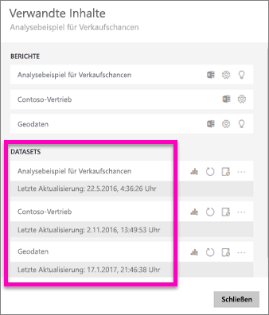

## Abonnieren einer Berichtsseite
1. Öffnen Sie den Bericht in der [Leseansicht](service-reading-view-and-editing-view.md).
2. Wählen Sie auf der oberen Menüleiste die Option **Abonnieren** aus.
   
   
3. Die Berichtsseiten können einzeln abonniert werden. Wählen Sie in der Dropdownliste die gewünschte Berichtsseite aus.
   
   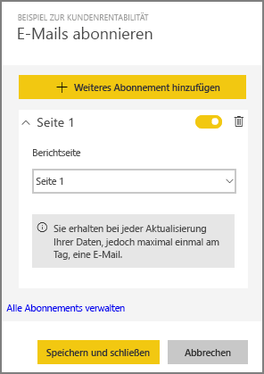
   
   Fügen Sie weitere Berichtsseiten hinzu.
4. Mithilfe des gelben Schiebereglers können Sie das Abonnement für die einzelnen Seiten aktivieren und deaktivieren.  Wenn Sie den Schieberegler auf „Aus“ stellen, wird das Abonnement nicht gelöscht. Verwenden Sie zum Löschen des Abonnements das Papierkorbsymbol.
   
   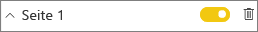
5. Wählen Sie **Speichern und schließen** aus, um das Abonnement zu speichern. Wenn der Bericht aktualisiert wird, erhalten Sie eine E-Mail mit einer Momentaufnahme der einzelnen Berichtsseiten. Wird der Bericht nicht aktualisiert, erhalten Sie an diesem Tag keine E-Mail mit einer Momentaufnahme.  Wird der Bericht an einem Tag mehrmals aktualisiert, erhalten Sie nur eine E-Mail mit einer Momentaufnahme nach der ersten Aktualisierung.
   
   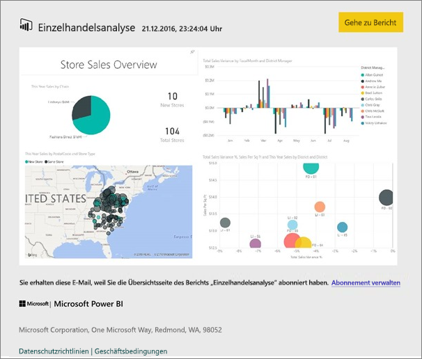
   
   > [!TIP]
   > Möchten Sie die E-Mail-Nachricht sofort ansehen? Veranlassen Sie das Senden einer E-Mail-Nachricht, indem Sie das Dataset öffnen und **Jetzt aktualisieren** auswählen. Wenn Sie nicht über Bearbeitungsberechtigungen für das Dataset verfügen, müssen Sie einen Benutzer mit den entsprechenden Berechtigungen bitten, diesen Schritt für Sie auszuführen.
   > 
   > 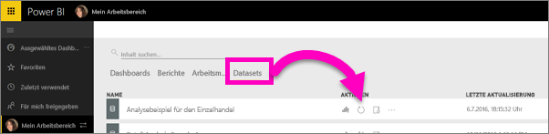
   > 
   > 

## Bestimmung des E-Mail-Zeitplans für Berichte
In der folgenden Tabelle wird beschrieben, wie häufig Sie E-Mail-Nachrichten erhalten. Dies ist abhängig von der Verbindungsmethode des Datasets, auf dem das Dashboard oder der Bericht basiert (DirectQuery, Live Connect, Import in Power BI oder Excel-Datei in OneDrive oder SharePoint Online) sowie von den verfügbaren und aktivierten Abonnementoptionen (täglich, wöchentlich oder keine).

|  | **DirectQuery** | **Live Connect** | **Geplante Aktualisierung (Import)** | **Excel-Datei in OneDrive/SharePoint Online** |
| --- | --- | --- | --- | --- |
| **Wie oft wird der Bericht/das Dashboard aktualisiert?** |Alle 15 Minuten |Power BI führt alle 15 Minuten eine Überprüfung aus. Wenn das Dataset geändert wurde, wird der Bericht aktualisiert. |Der Benutzer wählt keine, tägliche oder wöchentliche E-Mails aus. „Täglich“ kann bis zu 8 Mal pro Tag bedeuten. „Wöchentlich“ ist eigentlich ein wöchentlicher Zeitplan, den der Benutzer erstellt und für den er die Aktualisierung auf einen Wert zwischen einmal in der Woche und einmal täglich festgelegt. |Einmal pro Stunde |
| **Welche Kontrolle hat der Benutzer über den Zeitplan für die abonnierten E-Mails?** |Verfügbare Optionen: täglich oder wöchentlich |Keine Optionen: Der Benutzer erhält jedes Mal eine E-Mail-Nachricht, wenn der Bericht aktualisiert wird, jedoch nicht öfter als einmal pro Tag. |Wenn es sich um einen Zeitplan für die tägliche Aktualisierung handelt, lauten die Optionen „Täglich“ und „Wöchentlich“.  Bei einem Zeitplan für die wöchentliche Aktualisierung ist nur die Option „Wöchentlich“ verfügbar. |Keine Optionen: Der Benutzer erhält jedes Mal eine E-Mail-Nachricht, wenn das Dataset aktualisiert wird, jedoch nicht öfter als einmal pro Tag. |

## Verwalten Ihrer Abonnements
Der Bildschirm für die Abonnementverwaltung kann auf zwei Arten aufgerufen werden:  Wählen Sie im Dialogfeld **E-Mails abonnieren** Dialogfeld die Option **Alle Abonnements verwalten** aus (siehe Schritt 3 weiter oben). Oder: Wählen Sie auf der oberen Menüleiste das Power BI-Zahnradsymbol  und anschließend **Einstellungen** aus.

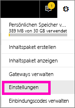

Welche Abonnements hier angezeigt werden, hängt vom aktiven Arbeitsbereich ab.  Wenn Sie alle Ihre Abonnements für alle Arbeitsbereiche anzeigen möchten, muss **Mein Arbeitsbereich** aktiv sein. Grundlegende Informationen zu Arbeitsbereichen finden Sie unter [Arbeitsbereiche in Power BI](service-create-distribute-apps.md).

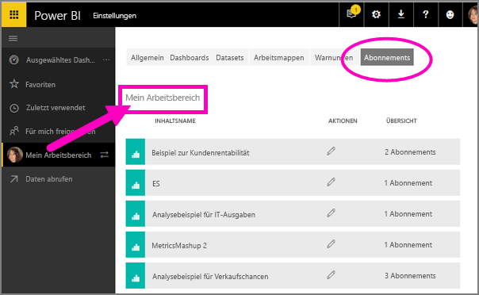

Ein Abonnement wird beendet, wenn die Pro-Lizenz abläuft, das Dashboard oder der Bericht vom Besitzer gelöscht wird oder das zum Erstellen des Abonnements verwendete Benutzerkonto gelöscht wird.

## Zu beachtende Aspekte und Problembehandlung
* Die Abonnierfunktion steht zum jetzigen Zeitpunkt nicht für Dashboards oder Berichte aus Inhaltspaketen oder Power BI-Apps zur Verfügung. Es gibt jedoch eine Möglichkeit, dies zu umgehen: Erstellen Sie hierzu eine Kopie des Berichts/Dashboards, und fügen Sie dieser Version Abonnements hinzu.
* Abonnements von Berichtseiten sind mit dem Namen der Berichtseite verknüpft. Wenn Sie eine Berichtseite abonnieren und dann umbenennen, müssen Sie das Abonnement erneut erstellen.
* Bei E-Mail-Abonnements für Live Connection-Datasets erhalten Sie nur dann E-Mail-Nachrichten, wenn die Daten geändert wurden. Wenn also eine Aktualisierung erfolgt, aber keine Daten geändert wurden, sendet Power BI keine E-Mail-Nachricht.
* E-Mail-Abonnements bieten keine Unterstützung für die meisten [benutzerdefinierten Visuals](power-bi-custom-visuals.md).  Die einzige Ausnahme sind benutzerdefinierte Visuals, die [zertifiziert](power-bi-custom-visuals-certified.md) wurden.  
* E-Mail-Abonnements werden mit Standardzuständen für Filter und Slicer des Berichts gesendet. Alle Änderungen der Standardwerte, die Sie vor dem Abonnieren vornehmen, werden nicht in der E-Mail angezeigt.    
* E-Mail-Abonnements werden auf Berichtsseiten, die von der Live Connect-Funktion für den Dienst in Power BI Desktop erstellt wurden, noch nicht unterstützt.    
* Für Abonnements von Dashboards werden bestimmte Typen von Kacheln noch nicht unterstützt.  Dazu zählen Streamingkacheln, Videokacheln und benutzerdefinierte Kacheln mit Webinhalten.     
* Wenn Sie ein Dashboard für einen Kollegen außerhalb Ihres Mandanten freigeben, kann dieser das Dashboard oder dessen zugeordnete Berichtsseiten nicht abonnieren. Angenommen, Sie sind aaron@xyz.com und geben das Dashboard für anyone@ABC.com frei.  anyone@ABC.com kann dann die freigegebenen Inhalte nicht abonnieren.    
* Aufgrund der Beschränkungen für die E-Mail-Größe können Dashboards oder Berichte mit extrem großen Bildern möglicherweise nicht abonniert werden.    
* Die Aktualisierung von Datasets, die mit Dashboards und Berichten verknüpft sind, die seit mehr als 2 Monaten nicht besucht wurden, wird von Power BI automatisch ausgesetzt.  Wenn Sie jedoch einem Dashboard oder Bericht ein Abonnement hinzufügen, wird die Aktualisierung nicht ausgesetzt, auch wenn das Dashboard bzw. der Bericht längere Zeit nicht besucht wurde.    
* Wenn Sie die E-Mails des Abonnements nicht erhalten, vergewissern Sie sich, dass Ihr Benutzerprinzipalname (UPN) E-Mails empfangen kann. [Das Power BI-Team arbeitet daran, diese Anforderung zu lockern](https://community.powerbi.com/t5/Issues/No-Mail-from-Cloud-Service/idc-p/205918#M10163) – schauen Sie also wieder vorbei. 
* Für gesendete Berichte und Dashboards wird Ihre Power BI-Spracheinstellung verwendet. Die Standardsprache ist Englisch. Sie können die Spracheinstellung anzeigen, indem Sie das Zahnradsymbol und dann **Einstellungen > Allgemein > Sprache** auswählen.

## Nächste Schritte
* Weitere Fragen? [Stellen Sie Ihre Frage in der Power BI-Community.](http://community.powerbi.com/)    
* [Blogbeitrag lesen](https://powerbi.microsoft.com/blog/introducing-dashboard-email-subscriptions-a-360-degree-view-of-your-business-in-your-inbox-every-day/)

