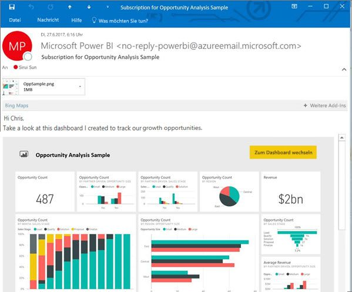

# Abonnieren eines Berichts oder Dashboards im Power BI-Dienst (app.powerbi.com)
Es war noch nie so einfach, bei den wichtigsten Dashboards und Berichten auf dem aktuellen Stand zu bleiben. Wenn Sie und Ihre Kollegen die Berichtsseiten und Dashboards abonnieren, die für Sie am wichtigsten sind, erhalten Sie von Power BI per E-Mail eine Momentaufnahme. Sie legen fest, wie oft Power BI die E-Mail-Nachrichten senden soll: von einmal täglich bis einmal pro Woche. 

Für E-Mails und Momentaufnahmen wird die Sprache verwendet, die in den Power BI-Einstellungen festgelegt ist. Weitere Informationen finden Sie unter [Unterstützte Sprachen und Länder/Regionen für Power BI](supported-languages-countries-regions.md). Wenn keine Sprache definiert ist, verwendet Power BI die Sprache, die der Gebietsschemaeinstellung Ihres aktuellen Browsers entspricht. Sie können die Spracheinstellung anzeigen bzw. festlegen, indem Sie zuerst auf das Zahnradsymbol  >  **und dann auf Einstellungen > Allgemein > Sprache** klicken. 

Abonnements können nur im Power BI-Dienst erstellt werden. Die E-Mail, die Sie erhalten, enthält einen Link, mit dem Sie zum Bericht/Dashboard wechseln können. Wenn Sie diesen Link auf mobilen Geräten auswählen, auf denen Power BI-Apps installiert sind, wird die App gestartet (statt die Standardaktion auszuführen, d.h. den Bericht oder das Dashboard auf der Power BI-Website zu öffnen).

## Anforderungen
- Das **Erstellen** eines Abonnements ist ein Feature von Power BI Pro, und Sie benötigen Berechtigungen zum Bearbeiten der Inhalte (Dashboard oder Bericht), um das Abonnement erstellen zu können. 
- Da Abonnement-E-Mails nur dann gesendet werden, wenn ein Dataset aktualisiert wird, funktionieren Abonnements von Datasets nicht, wenn diese Datasets nicht aktualisiert werden.

## Abonnieren eines Berichts oder Dashboards
Egal, ob Sie ein Dashboard oder einen Bericht abonnieren – der Vorgang ist sehr ähnlich. Sie können Dashboards und Berichte im Power BI-Dienst für sich selbst oder andere über die gleiche Schaltfläche abonnieren.
 
.

1. Öffnen Sie das Dashboard oder den Bericht.
2. Klicken Sie in der oberen Menüleiste auf **Abonnieren**, oder klicken Sie auf das Briefumschlagsymbol .
   
   

3. Mithilfe des gelben Schiebereglers können Sie das Abonnement aktivieren und deaktivieren.  Wenn Sie den Schieberegler auf „Aus“ stellen, wird das Abonnement nicht gelöscht. Verwenden Sie zum Löschen des Abonnements das Papierkorbsymbol.

4. Geben Sie die E-Mail-Adressinformationen ein. Ihre E-Mail-Adresse wird vorausgefüllt, aber Sie können auch andere Benutzer dem Abonnement hinzufügen. Es können nur E-Mail-Adressen aus der gleichen Domäne hinzugefügt werden (weitere Informationen im Folgenden unter **Hinweise und Problembehandlung**). Wenn der Bericht oder das Dashboard in einer [Premium-Kapazität](service-premium.md) gehostet wird, können Sie Abonnements für andere Benutzer anhand einzelner E-Mail-Adressen oder mit Gruppenaliasen abschließen. Wenn der Bericht oder das Dashboard nicht in einer Premium-Kapazität gehostet wird, können Sie Abonnements auch weiterhin für andere Benutzer mit deren E-Mail-Adressen abschließen, aber diese müssen auch über eine Power BI Pro-Lizenz verfügen.

    In den unten stehenden Screenshots sehen Sie, dass Sie beim Abonnieren eines Berichts eigentlich eine *Berichtsseite* abonnieren.  Klicken Sie auf **Weiteres Abonnement hinzufügen**, und wählen Sie die gewünschten Seiten aus, um mehrere Seiten in einem Bericht zu abonnieren. 
      
   

5. Wählen Sie **Speichern und schließen** aus, um das Abonnement zu speichern. Die Abonnenten erhalten jedes Mal eine E-Mail mit einer Momentaufnahme des Dashboards oder des Berichts, wenn eines der zugrunde liegenden Datasets geändert wurde. Wird das Dashboard oder der Bericht mehrmals an einem Tag aktualisiert, erhalten Sie nur eine E-Mail nach der ersten Aktualisierung.  
   
   
   
   > [!TIP]
   > Möchten Sie die E-Mail-Nachricht sofort ansehen? Lösen Sie das Senden einer E-Mail aus, indem Sie eines der mit dem Dashboard oder dem Bericht verknüpften Datasets aktualisieren. (Wenn Sie nicht über Bearbeitungsberechtigungen für das Dataset verfügen, müssen Sie einen Benutzer mit den entsprechenden Berechtigungen bitten, diesen Schritt für Sie auszuführen.) Um zu ermitteln, welche Datasets zum Erstellen verwendet werden, klicken Sie auf das Symbol **Verwandte Inhalte anzeigen** , um **Verwandte Inhalte** zu öffnen, und klicken Sie dann auf das Symbol zum Aktualisieren . 
   > 
   > 
   
   

## Bestimmung des E-Mail-Zeitplans
In der folgenden Tabelle wird beschrieben, wie häufig Sie E-Mail-Nachrichten erhalten. Dies ist abhängig von der Verbindungsmethode des Datasets, auf dem das Dashboard oder der Bericht basiert (DirectQuery, Live Connect, Import in Power BI oder Excel-Datei in OneDrive oder SharePoint Online) sowie von den verfügbaren und aktivierten Abonnementoptionen (täglich, wöchentlich oder keine).

|  | **DirectQuery** | **Live Connect** | **Geplante Aktualisierung (Import)** | **Excel-Datei in OneDrive/SharePoint Online** |
| --- | --- | --- | --- | --- |
| **Wie oft wird der Bericht/das Dashboard aktualisiert?** |Alle 15 Minuten |Power BI führt alle 15 Minuten eine Überprüfung aus. Wenn das Dataset geändert wurde, wird der Bericht aktualisiert. |Der Benutzer wählt keine, tägliche oder wöchentliche E-Mails aus. „Täglich“ kann bis zu 8 Mal pro Tag bedeuten. „Wöchentlich“ ist eigentlich ein wöchentlicher Zeitplan, den der Benutzer erstellt und für den er die Aktualisierung auf einen Wert zwischen einmal in der Woche und einmal täglich festgelegt. |Einmal pro Stunde |
| **Welche Kontrolle hat der Benutzer über den Zeitplan für die abonnierten E-Mails?** |Verfügbare Optionen: täglich oder wöchentlich |Keine Optionen: Der Benutzer erhält jedes Mal eine E-Mail-Nachricht, wenn der Bericht aktualisiert wird, jedoch nicht öfter als einmal pro Tag. |Wenn es sich um einen Zeitplan für die tägliche Aktualisierung handelt, lauten die Optionen „Täglich“ und „Wöchentlich“.  Bei einem Zeitplan für die wöchentliche Aktualisierung ist nur die Option „Wöchentlich“ verfügbar. |Keine Optionen: Der Benutzer erhält jedes Mal eine E-Mail-Nachricht, wenn das Dataset aktualisiert wird, jedoch nicht öfter als einmal pro Tag. |

## Verwalten Ihrer Abonnements
Nur der Ersteller eines Abonnements kann dieses auch verwalten.  Der Bildschirm für die Abonnementverwaltung kann auf zwei Arten aufgerufen werden:  Wählen Sie im Dialogfeld **E-Mails abonnieren** die Option **Alle Abonnements verwalten** aus (siehe Screenshots unter Schritt 4 weiter oben). Oder: Klicken Sie auf der oberen Menüleiste auf das Power BI-Zahnradsymbol  und anschließend auf **Einstellungen**.

Welche Abonnements hier angezeigt werden, hängt vom aktiven Arbeitsbereich ab.  Wenn Sie alle Ihre Abonnements für alle Arbeitsbereiche anzeigen möchten, muss **Mein Arbeitsbereich** aktiv sein. Grundlegende Informationen zu Arbeitsbereichen finden Sie unter [Arbeitsbereiche in Power BI](service-create-distribute-apps.md).

Ein Abonnement wird beendet, wenn die Pro-Lizenz abläuft, das Dashboard oder der Bericht vom Besitzer gelöscht wird oder das zum Erstellen des Abonnements verwendete Benutzerkonto gelöscht wird.

## Zu beachtende Aspekte und Problembehandlung
* Abonnements von Berichtseiten sind mit dem Namen der Berichtseite verknüpft. Wenn Sie eine Berichtseite abonnieren und dann umbenennen, müssen Sie das Abonnement erneut erstellen.
* Bei E-Mail-Abonnements für Live Connection-Datasets erhalten Sie nur dann E-Mail-Nachrichten, wenn die Daten geändert wurden. Wenn also eine Aktualisierung erfolgt, aber keine Daten geändert wurden, sendet Power BI keine E-Mail-Nachricht.
* E-Mail-Abonnements bieten keine Unterstützung für die meisten [benutzerdefinierten Visuals](power-bi-custom-visuals.md).  Die einzige Ausnahme sind benutzerdefinierte Visuals, die [zertifiziert](power-bi-custom-visuals-certified.md) wurden.  
* Wenn auf Kacheln Sicherheit auf Zeilenebene (Row Level Security, RLS) angewendet wurde, werden diese Kacheln nicht angezeigt.
* E-Mail-Abonnements werden mit Standardzuständen für Filter und Slicer des Berichts gesendet. Alle Änderungen der Standardwerte, die Sie nach dem Abonnieren vornehmen, werden nicht in der E-Mail angezeigt.    
* E-Mail-Abonnements werden auf Berichtsseiten, die von der Live Connect-Funktion für den Dienst in Power BI Desktop erstellt wurden, noch nicht unterstützt.    
* Für Abonnements von Dashboards werden bestimmte Typen von Kacheln noch nicht unterstützt.  Dazu zählen Streamingkacheln, Videokacheln und benutzerdefinierte Kacheln mit Webinhalten.     
* Wenn Sie ein Dashboard für einen Kollegen außerhalb Ihres Mandanten freigeben, können Sie zusätzlich kein Abonnement für diesen Kollegen erstellen. Wenn Sie aaron@xyz.com sind, können Sie Dashboards und Berichte für anyone@ABC.com freigeben, aber kein Abonnement für anyone@ABC.com abschließen.      
* Aufgrund der Beschränkungen für die E-Mail-Größe können Dashboards oder Berichte mit extrem großen Bildern möglicherweise nicht abonniert werden.    
* Die Aktualisierung von Datasets, die mit Dashboards und Berichten verknüpft sind, die seit mehr als 2 Monaten nicht besucht wurden, wird von Power BI automatisch ausgesetzt.  Wenn Sie jedoch einem Dashboard oder Bericht ein Abonnement hinzufügen, wird die Aktualisierung nicht ausgesetzt, auch wenn das Dashboard bzw. der Bericht längere Zeit nicht besucht wurde.    
* Wenn Sie die E-Mails des Abonnements nicht erhalten, vergewissern Sie sich, dass Ihr Benutzerprinzipalname (UPN) E-Mails empfangen kann. [Das Power BI-Team arbeitet daran, diese Anforderung zu lockern](https://community.powerbi.com/t5/Issues/No-Mail-from-Cloud-Service/idc-p/205918#M10163) – schauen Sie also wieder vorbei. 
* Wenn Ihr Dashboard oder Bericht sich in einer Premium-Kapazität befindet, können Sie E-Mail-Aliase von Gruppen für Abonnements verwenden, statt für jeden Kollegen einzeln mit dessen E-Mail-Adresse ein Abonnement abschließen zu müssen. Die Aliase basieren auf dem aktuellen Verzeichnis der aktiven Benutzer. 

## Nächste Schritte
* Weitere Fragen? [Stellen Sie Ihre Frage in der Power BI-Community.](http://community.powerbi.com/)    
* [Blogbeitrag lesen](https://powerbi.microsoft.com/blog/introducing-dashboard-email-subscriptions-a-360-degree-view-of-your-business-in-your-inbox-every-day/)

