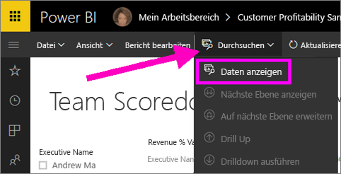
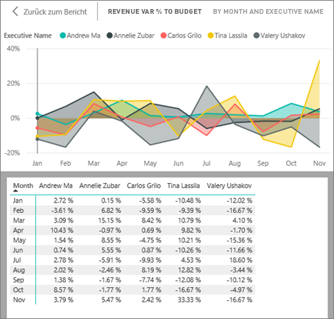
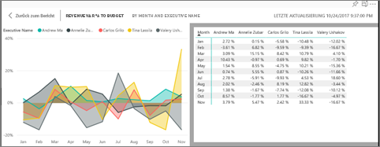
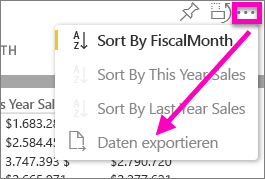

# Anzeigen der Daten, die zum Erstellen der Visualisierung verwendet wurden
## Daten anzeigen
Eine Power BI-Visualisierung wird mithilfe von Daten aus Ihren Datasets erstellt. Sie haben in Power BI die Möglichkeit, die Daten *anzuzeigen*, die der Visualisierung zugrunde liegen. Wenn Sie **Daten anzeigen** auswählen, werden die Daten in Power BI unter (oder neben) der Visualisierung angezeigt.

Sie können die Daten, mit denen die Visualisierung erstellt wurde, auch als XLSX- oder CSV-Datei exportieren und in Excel anzeigen. Weitere Informationen finden Sie unter [Exportieren von Daten aus Power BI-Visualisierungen](power-bi-visualization-export-data.md).

> [!NOTE]
> *Daten anzeigen* und *Daten exportieren* sind sowohl im Power BI-Dienst als auch in Power BI Desktop verfügbar. Power BI Desktop bietet jedoch eine zusätzliche Detailebene. [Mit *Datensätze anzeigen* werden die tatsächlichen Zeilen aus dem Dataset angezeigt](desktop-see-data-see-records.md).
> 
> 

## Verwenden von *Daten anzeigen* im Power BI-Dienst
1. Öffnen Sie im Power BI-Dienst einen Bericht in der [Leseansicht oder der Bearbeitungsansicht](service-reading-view-and-editing-view.md), und wählen Sie ein Visual aus.  Öffnen Sie in Power BI Desktop die Berichtsansicht.
2. Wählen Sie zum Anzeigen der für das Visual verwendeten Daten **Durchsuchen** > **Daten anzeigen**.
   
   
3. Standardmäßig werden die Daten unter der Visualisierung angezeigt.
   
   
4. Wählen Sie zum Ändern der Ausrichtung rechts oben in der Visualisierung das vertikale Layout  aus.
   
   
5. Wählen Sie zum Exportieren der Daten in eine CSV-Datei die Auslassungspunkte und anschließend **Daten exportieren** aus.
   
    
   
    Weitere Informationen zum Exportieren der Daten in Excel finden Sie unter [Exportieren von Daten aus Power BI-Visualisierungen](power-bi-visualization-export-data.md).
6. Wenn die Daten ausgeblendet werden sollen, deaktivieren Sie **Durchsuchen** > **Daten anzeigen**.

### Nächste Schritte
[Exportieren von Daten aus Power BI-Visualisierungen](power-bi-visualization-export-data.md)    
[Visualisierungen in Power BI-Berichten](power-bi-report-visualizations.md)    
[Power BI-Berichte](service-reports.md)    
[Power BI – Grundkonzepte](service-basic-concepts.md)    
Weitere Fragen? [Wenden Sie sich an die Power BI-Community](http://community.powerbi.com/)

