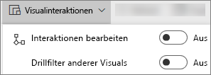
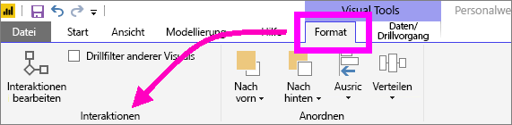
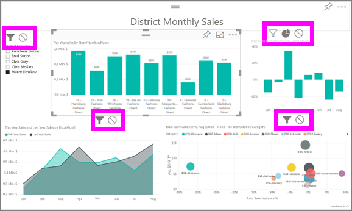

# Ändern der Interaktion von Visualisierungen in einem Power BI-Bericht
Wenn Sie über die Berechtigungen zum Bearbeiten eines Berichts verfügen, können Sie **visuelle Interaktionen** verwenden, um zu ändern, wie sich Visualisierungen auf einer Berichtsseite aufeinander auswirken. 

Standardmäßig können Visualisierungen auf einer Berichtsseite für die Kreuzfilterung und -hervorhebung der anderen Visualisierungen auf der Seite verwendet werden.
Beim Auswählen eines Status in einer Kartenvisualisierung wird beispielsweise das Säulendiagramm hervorgehoben und das Liniendiagramm gefiltert, um nur Daten anzuzeigen, die für diesen einen Status gelten.
Siehe [Informationen zum Filtern und Hervorheben](power-bi-reports-filters-and-highlighting.md). Wenn Sie über eine Visualisierung verfügen, die [Drilling](consumer/end-user-drill.md) unterstützt, hat das Drilling einer Visualisierung standardmäßig keinen Einfluss auf andere Visualisierungen auf der Berichtsseite. Diese beiden Standardverhaltensweisen können jedoch überschrieben werden, und Interaktionen können jeweils auf Basis einer Visualisierung festgelegt werden.

In diesem Artikel erhalten Sie weitere Informationen zum Verwenden von **visuellen Interaktionen** in der [Bearbeitungsansicht](service-interact-with-a-report-in-editing-view.md) des Power BI-Diensts und in Power BI Desktop. Wenn ein Bericht für Sie freigegeben wurde, können Sie die Einstellungen für visuelle Interaktionen nicht ändern.

> [!NOTE]
> Die Begriffe *Kreuzfilterung* und *Kreuzhervorhebung* werden verwendet, um das hier beschriebene Verhalten davon zu unterscheiden, was geschieht, wenn Sie den Bereich **Filter** zum Filtern und Hervorheben von Visualisierungen verwenden.  
> 
> 

<iframe width="560" height="315" src="https://www.youtube.com/embed/N_xYsCbyHPw?list=PL1N57mwBHtN0JFoKSR0n-tBkUJHeMP2cP" frameborder="0" allowfullscreen></iframe>

1. Wählen Sie eine Visualisierung aus, um sie zu aktivieren.  
2. Zeigen Sie die Optionen **Visuelle Interaktionen** an.
    - Klicken Sie im Power BI-Dienst auf die Dropdownliste in der Menüleiste.

       

    - Klicken Sie unter Desktop auf **Format > Interaktionen**.

        

3. Klicken Sie auf **Interaktionen bearbeiten**, um die Steuerelemente für die Interaktionen von Visualisierungen zu aktivieren. Power BI fügt Symbole für die Kreuzfilterung und die Kreuzhervorhebung zu allen anderen Visualisierungen auf der Berichtsseite hinzu.
   
    
3. Bestimmen Sie, welche Auswirkung die ausgewählte Visualisierung auf die anderen haben soll.  Optional können Sie diesen Schritt für alle anderen Visualisierungen auf der Berichtsseite wiederholen.
   
   * Wenn die Visualisierung kreuzgefiltert werden soll, klicken Sie auf das **Filtersymbol** .
   * Wenn eine Kreuzhervorhebung bei dieser Visualisierung bewirkt werden soll, klicken Sie auf das Symbol **Hervorhebung** .
   * Wenn sie keine Auswirkung haben soll, wählen Sie das Symbol **Keine Auswirkung**  aus.

4. Klicken Sie auf **Drillfilter anderer Visuals**, um die Steuerelemente für das Drilling zu aktivieren.  Wenn Sie nun einen Drilldown (oder Drillup) in einer Visualisierung ausführen, ändern sich die anderen Visualisierungen auf der Berichtsseite und zeigen die aktuelle Auswahl für das Drilling an. 

   

