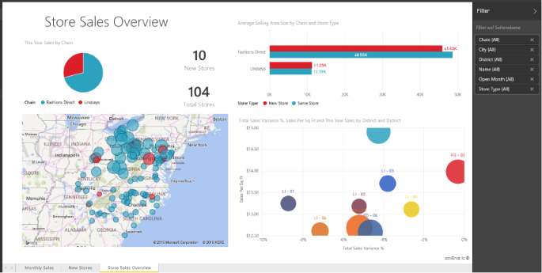

# Berichte in Power BI
## Was ist ein Power BI-Bericht?
Ein ***Power BI-Bericht*** stellt eine Ansicht eines Datasets aus verschiedenen Perspektiven dar, wobei die aus dem Dataset gewonnenen verschiedenen Ergebnisse und Erkenntnisse als Visualisierungen angezeigt werden.  Ein Bericht kann eine einzelne Visualisierung, aber auch mehrere mit Visualisierungen gefüllte Seiten enthalten. Abhängig von Ihrem Aufgabengebiet *erstellen* Sie vielleicht Berichte, und/oder Sie *nutzen* oder verwenden Berichte.

Dieser Bericht enthält drei Seiten (oder Registerkarten). Derzeit wird die Seite „Store Sales Overview“ angezeigt. Auf dieser Seite befinden sich 6 verschiedene Visualisierungen und ein Seitentitel. Visualisierungen können an Dashboards *angeheftet* werden. Bei der Auswahl einer angehefteten Visualisierung wird der Bericht geöffnet, aus dem heraus sie angeheftet wurde.

Wenn Sie mit Power BI noch nicht vertraut sind, lesen Sie den Artikel [Grundkonzepte des Power BI-Diensts](service-basic-concepts.md).

Berichte sind ein Feature des Power BI-Diensts und von Power BI Desktop. Die Arbeit mit Berichten ist nahezu identisch. Auf mobilen Geräten können Sie allerdings keine Berichte erstellen. Aber Sie können [Berichte anzeigen, freigeben und kommentieren](mobile-reports-in-the-mobile-apps.md).

## Vorteile von Berichten
Berichte basieren auf einem einzelnen Dataset. Jede Visualisierung in einem Bericht stellt eine wertvolle Information dar. Und die Visualisierungen sind nicht statisch. Sie können Daten hinzufügen und entfernen, die Visualisierungstypen ändern sowie Filter und Slicer anwenden, wenn Sie die Daten detaillierter untersuchen, um Erkenntnisse zu gewinnen und Antworten zu finden. Ähnlich wie ein Dashboard – aber mit noch mehr Funktionen – ist ein Bericht ausgesprochen interaktiv und weitgehend anpassbar, und die Visualisierungen werden aktualisiert, wenn sich die zugrunde liegenden Daten ändern.

## Vergleich: Dashboards und Berichte
Als Zeichenbereiche, die ebenfalls Visualisierungen enthalten, werden [Dashboards](service-dashboards.md) gerne mit Berichten verwechselt. Es gibt aber einige wichtige Unterschiede.  

| **Eigenschaften** | **Dashboards** | **Berichte** |
| --- | --- | --- |
| Pages |Eine Seite |Eine oder mehrere Seiten |
| Datenquellen |Ein oder mehrere Berichte und ein oder mehrere Datasets pro Dashboard |Ein Dataset pro Bericht |
| In Power BI Desktop verfügbar |Nein |Ja, Berichte können erstellt und angezeigt werden. |
| Anheften |Vorhandene Visualisierungen (Kacheln) können vom aktuellen Dashboard aus nur an andere Ihrer Dashboards angeheftet werden. |Visualisierungen können (als Kacheln) an beliebige Ihrer Dashboards angeheftet werden. Gesamte Berichtsseiten können an beliebige Ihrer Dashboards angeheftet werden. |
| Abonnieren |Ein Dashboard kann nicht abonniert werden. |Berichtsseiten können abonniert werden. |
| Filter |Keine Filter, keine Slices |Viele Filter, Hervorhebungen und Slices |
| Benachrichtigungen festlegen |Benachrichtigungen können erstellt werden. Sie erhalten eine E-Mail, wenn bestimmte Bedingungen erfüllt sind. |Nein |
| Ausgewählt |Ein Dashboard kann als „ausgewähltes“ Dashboard festgelegt werden. |Ein ausgewählter Bericht kann nicht erstellt werden. |
| Abfragen in natürlicher Sprache |Über das Dashboard verfügbar |Über Berichte nicht verfügbar |
| Visualisierungstyp veränderbar |Nein. Wenn der Besitzer eines Berichts den Visualisierungstyp im Bericht ändert, wird die an das Dashboard angeheftete Visualisierung außerdem nicht aktualisiert. |Ja |
| Zugrunde liegende Dataset-Tabellen und Felder sichtbar |Nein. Exportieren von Daten, aber Tabellen und Felder im Dashboard nicht sichtbar |Ja. Tabellen, Felder und Werte des Datasets sichtbar |
| Visualisierungen erstellen |Es können ausschließlich Widgets zum Dashboard hinzugefügt werden („Kachel hinzufügen“). |Viele verschiedene Visuals können erstellt, benutzerdefinierte Visuals hinzugefügt und Visuals (mit Bearbeitungsberechtigungen) bearbeitet werden. |
| Anpassung |Visualisierungen (Kacheln) können u.a. verschoben und angeordnet, vergrößert und verkleinert, mit Links versehen, umbenannt, gelöscht und im Vollbildmodus angezeigt werden. Die Daten und Visualisierungen selbst sind allerdings schreibgeschützt. |In der Leseansicht können Berichte u.a. veröffentlicht, eingebettet, gefiltert, exportiert, als PBIX heruntergeladen und in Excel analysiert werden. Außerdem können Sie verwandte Inhalte anzeigen und QR-Codes generieren.  In der Bearbeitungsansicht haben Sie noch mehr Möglichkeiten. |

## ***Ersteller*** und ***Anwender*** von Berichten
Erstellen Sie Berichte für den eigenen Gebrauch, oder geben Sie sie später für Ihre Mitarbeiter frei? Dann sollten Sie wissen, wie Berichte erstellt und freigegeben werden. Oder erhalten Sie Berichte von anderen? Dann möchten Sie vielleicht wissen, wie Berichte funktionieren und wie Sie mit ihnen interagieren.

Hier finden Sie die entsprechenden Anleitungen für jede dieser Rollen.

### Wenn Sie Berichte erstellen und freigeben
* Beginnen Sie mit einer [Tour für den Power BI-Dienst](service-basic-concepts.md), um zu erfahren, wo Sie Berichte und Berichtstools finden.
* Verschaffen Sie sich einen Überblick über den [Berichts-Editor](service-the-report-editor-take-a-tour.md).
* Erfahren Sie, wie Sie [einen Bericht aus einem Dataset erstellen](service-report-create-new.md).
* [Erfahren Sie, wie Sie Visualisierungs-, Seiten- und Filter auf Berichtsebene verwenden](power-bi-how-to-report-filter.md)
* Informieren Sie sich über die verschiedenen Möglichkeiten, [einen Bericht für Kollegen freizugeben](service-share-dashboards.md).

### Wenn Sie Berichte erhalten und verwenden
* Beginnen Sie mit einer [Tour für den Power BI-Dienst](service-basic-concepts.md), um zu erfahren, wo Sie Berichte und Berichtstools finden.
* Erfahren Sie, wie Sie [einen Bericht öffnen](service-report-open.md), und lernen Sie alle verfügbaren Interaktionen in der [Leseansicht](service-reading-view-and-editing-view.md) kennen.
* Machen Sie sich mit Berichten vertraut, indem Sie sich eine Tour durch eines unserer [Beispiele](sample-tutorial-connect-to-the-samples.md) ansehen.  
* Der Bericht wird nicht mehr benötigt? Sie können ihn [entfernen](service-delete.md).
* Um zu sehen, welches Dataset der Bericht verwendet und an welche Dashboards Kacheln aus dem Bericht angeheftet sind, [zeigen Sie verwandte Inhalte an](service-related-content.md).

> [!TIP]
> Wenn Sie die gesuchten Informationen hier nicht finden, verwenden Sie das Inhaltsverzeichnis auf der linken Seite, um alle Themen zu *Berichten* zu durchsuchen.
> 
> 

## Nächste Schritte
[Erste Schritte mit Power BI](service-get-started.md) 

[Power BI – Grundkonzepte](service-basic-concepts.md)

Weitere Fragen? [Wenden Sie sich an die Power BI-Community](http://community.powerbi.com/)

