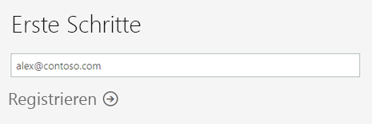
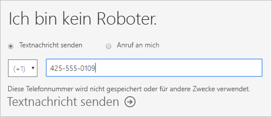
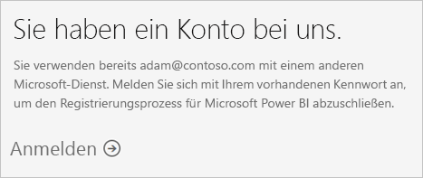
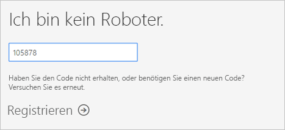
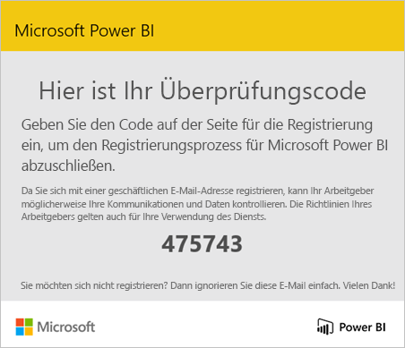
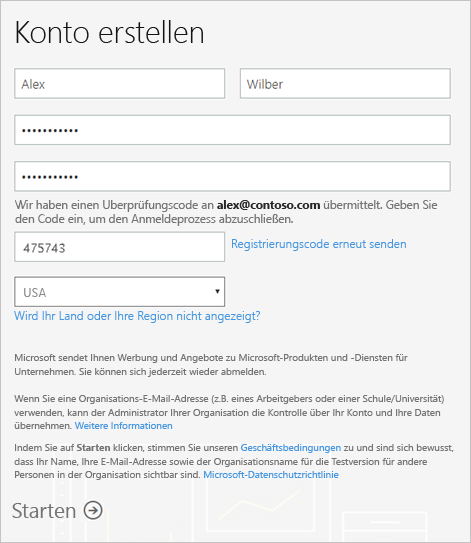
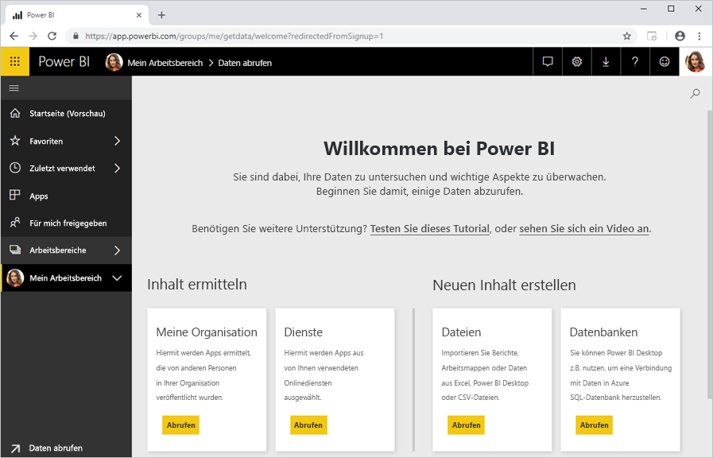

# Registrieren für Power BI als Einzelperson

Power BI kann Ihr persönliches Tool für Berichte und Visualisierungen sein und darüber hinaus als Engine für Analyse und Entscheidungsfindung für Gruppenprojekte, Abteilungen oder gesamte Unternehmen dienen. In diesem Artikel wird erläutert, wie für die Testversion von Power BI Pro als Einzelperson registrieren. Wenn Sie eine Power BI-Administrator sind, finden Sie unter [Power BI in Ihrer Organisation Lizenzen](service-admin-licensing-organization.md).

## Unterstützte E-Mail-Adressen

Bevor Sie den Registrierungsprozess beginnen, ist es wichtig, um welche Typen von e-Mail-Adressen zu erhalten, die Sie in Power BI verwenden können:

* Bei der Registrierung für Power BI können nur E-Mail-Adressen von Geschäfts-, Schul- oder Unikonten verwendet werden. Sie können keine registrieren Sie sich mit e-Mail-Adressen, die vom e-Mail-Diensten oder Telekommunikationsanbietern bereitgestellt. Dies schließt outlook.com, hotmail.com, gmail.com und andere.

* Nachdem Sie sich registriert haben, [können Sie Gastbenutzer einladen](https://docs.microsoft.com/azure/active-directory/active-directory-b2b-what-is-azure-ad-b2b), um Ihren Power BI-Inhalt für diese freizugeben. Dies geht mit jeder E-Mail-Adresse, auch mit einer privaten.

* Sie können sich bei Power BI mit den Adressendungen „.gov“ oder „.mil“ anmelden, dafür ist jedoch ein anderes Verfahren notwendig. Weitere Informationen finden Sie unter [Ihre US-Behörde in Power BI-Dienst registrieren](service-govus-signup.md).

## Registrieren für eine Testversion

Gehen Sie wie folgt vor, um sich für eine Power BI Pro-Testversion zu registrieren. Im nächsten Abschnitt, [Ablauf der Testversion](#trial-expiration), erfahren Sie die Optionen haben Sie beim Ablauf der Testversion.

1. Wechseln Sie in Power BI zur [Registrierungsseite](https://signup.microsoft.com/signup?sku=a403ebcc-fae0-4ca2-8c8c-7a907fd6c235).

1. Geben Sie Ihre E-Mail-Adresse ein, und klicken Sie auf **Registrieren**.

    

1. Wenn Sie eine Meldung wie diese erhalten, wählen Sie eine Option aus, um einen Prüfcode empfangen, und klicken Sie dann mit dem nächsten Schritt in diesem Verfahren fortfahren.

    

    Wenn Sie eine Meldung wie diese erhalten, schließen Sie die Schritte, um sich anmelden und Power BI verwenden.

    

1. Geben Sie den Code ein, den Sie erhalten haben, und klicken Sie auf **Registrieren**.

    

1. Überprüfen Sie Ihre e-Mail-Adresse für eine Meldung wie diese.

    

1. Geben Sie auf dem nächsten Bildschirm Ihre Informationen sowie den Prüfcode aus der E-Mail ein. Wählen Sie eine Region aus, lesen Sie die Richtlinien durch, die Sie über einen Link aufrufen können, und klicken Sie anschließend auf **Starten**.

    

1. Sie gelangen anschließend auf [Anmeldeseite für Power BI](https://powerbi.microsoft.com/landing/signin/), und Sie können mithilfe von Power BI.

    

## Ablauf der Testversion

Wenn Ihre Power BI Pro-Testversion läuft ab, die lizenzänderungen zu einer Power BI (free) Lizenz. Wenn dies passiert, müssen Sie nicht mehr den Zugriff auf Funktionen, die eine Power BI Pro-Lizenz erforderlich. Weitere Informationen finden Sie unter [Funktionen nach Lizenztyp](service-features-license-type.md).

Wenn eine Power BI (free) Lizenz ausreicht, müssen Sie nichts weiter tun. Um Power BI Pro-Features nutzen zu können, wenden Sie sich an Ihren IT-Administrator über den Erwerb einer Power BI Pro-Lizenz.

## Behandeln von Problemen beim Registrieren

In den meisten Fällen können Sie für Power BI registrieren gemäß den beschriebenen Prozess. Einige der Probleme, die Sie für die Registrierung verhindern möglicherweise werden in der folgenden Tabelle, mit möglichen problemumgehungen beschrieben.

| Symptom/Fehlermeldung | Mögliche Ursache und Lösung |
| ----------------------- | -------------------- |
| <strong>Persönliche e-Mail-Adressen (z. B. nancy@gmail.com)</strong> erhalten Sie eine Meldung wie diese während der Registrierung:    *Sie haben eine private E-Mail-Adresse eingegeben: Geben Sie Ihre geschäftliche E-Mail-Adresse ein, damit wir die Daten Ihres Unternehmens sicher speichern können.*    oder    *Bei der E-Mail-Adresse handelt es sich anscheinend um eine persönliche Adresse. Geben Sie Ihre geschäftliche Adresse ein, damit wir Sie mit anderen Personen in Ihrem Unternehmen verbinden können. Und keine Sorge: Wir geben die Adresse an niemanden weiter.* | Powerbi unterstützt keine e-Mail-Adressen von Verbraucher-e-Mail-Diensten oder Telekommunikationsanbietern-Anbieter bereitgestellt.    Um die Anmeldung abgeschlossen haben, geben Sie eine e-Mail-Adresse, die von Ihrer Organisation oder Schule zugewiesen.    Wenn Sie sich noch immer nicht registrieren können und zu einem erweiterten Setup bereit sind, können Sie sich [mit dieser E-Mail-Adresse für ein neues Office 365-Testabonnement registrieren](service-admin-signing-up-for-power-bi-with-a-new-office-365-trial.md).    Es ist ebenso möglich, dass ein vorhandener Benutzer [Sie als Gast einlädt](service-admin-azure-ad-b2b.md). |
| **Self-service-Registrierung deaktiviert**: Sie erhalten eine Meldung wie die folgende während der Registrierung:    *Ihre Registrierung konnte nicht beendet werden. Ihre IT-Abteilung hat die Registrierung für Microsoft Power BI deaktiviert. Bitte wenden Sie sich an Ihre IT-Abteilung, um den Anmeldeprozess abzuschließen.*    oder    *Bei der E-Mail-Adresse handelt es sich anscheinend um eine persönliche Adresse. Geben Sie Ihre geschäftliche Adresse ein, damit wir Sie mit anderen Personen in Ihrem Unternehmen verbinden können. Und keine Sorge: Wir geben die Adresse an niemanden weiter.* | Ihre Organisation IT-Administrator hat die Self-service-Registrierung für Power BI deaktiviert.    Um die Anmeldung abgeschlossen haben, wenden Sie sich an Ihren IT-Administrator, und bitten Sie ihn, [führen Sie die Anweisungen, um die Registrierung](service-admin-licensing-organization.md#enable-or-disable-individual-user-sign-up-in-azure-active-directory).    Dieses Problem kann auch auftreten, wenn Sie sich [über einen Partner für Office 365 registriert haben](service-admin-syndication-partner.md). |
| **E-Mail-Adresse ist nicht in Office 365-ID** Sie erhalten eine Meldung wie die folgende während der Registrierung:    *Wir können Sie auf „contoso.com“ nicht finden.  Verwenden Sie auf der Arbeit oder in der Schule eine andere ID?    Versuchen Sie, sich damit anzumelden. Wenn es nicht funktioniert, wenden Sie sich an Ihre IT-Abteilung.* | Ihre Organisation verwendet für die Anmeldung bei Office 365 und anderen Microsoft-Diensten andere IDs als Ihre E-Mail-Adresse.  Ihre E-Mail-Adresse ist z. B., Nancy.Smith@contoso.com aber Ihre ID ist nancys@contoso.com.    Verwenden Sie die ID, die Ihre Organisation Ihnen zugewiesen wurden, für die Anmeldung bei Office 365 oder andere Microsoft-Dienste, um die Registrierung abzuschließen.  Wenn Sie nicht wissen, was ist, wenden Sie sich an Ihren IT-Administrator.    Wenn Sie sich noch immer nicht registrieren können und zu einem erweiterten Setup bereit sind, können Sie sich [mit dieser E-Mail-Adresse für ein neues Office 365-Testabonnement registrieren](service-admin-signing-up-for-power-bi-with-a-new-office-365-trial.md). |

## Nächste Schritte

[Erwerb von Power BI Pro](service-admin-purchasing-power-bi-pro.md)  
[Power BI-Servicevertrag für Einzelbenutzer](https://powerbi.microsoft.com/terms-of-service/)  

Weitere Fragen? [Stellen Sie Ihre Frage in der Power BI-Community.](http://community.powerbi.com/)