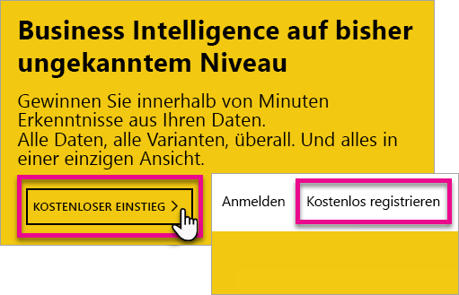
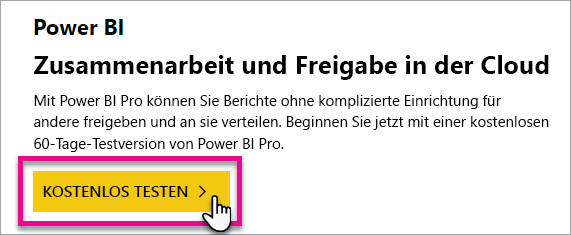
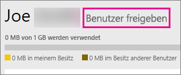
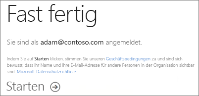
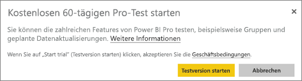

# Registrieren für Power BI als Einzelperson
Erfahren Sie, wie Sie sich für Power BI registrieren, und beginnen Sie, Power BI für Ihre persönlichen Berichts- und Visualisierungsanforderungen zu nutzen.

Power BI kann Ihr persönliches Tool für Berichte und Visualisierungen sein und darüber hinaus als Engine für Analyse und Entscheidungsfindung für Gruppenprojekte, Abteilungen oder gesamte Unternehmen dienen.

Dieser Artikel führt Sie durch die Optionen, die es für das Registrieren und erste Schritte mit dem Power BI-Dienst gibt. Informationen zu den Unterschieden zwischen Power BI Free und Pro finden Sie unter [Power BI Free und Pro im Vergleich](service-free-vs-pro.md).

## Sie haben einige Optionen
Als Einzelperson haben Sie mehrere Optionen, um sich zu registrieren und erste Schritte mit Power BI auszuführen. Sie können sich für ein kostenloses Konto registrieren, oder Sie können ein Power BI Pro-Abonnement erwerben. Wenn Sie sich für ein kostenloses Konto registrieren, haben Sie, sobald Sie den Dienst nutzen, die Option, eine kostenlose 60-Tage-Testversion von Power BI Pro zu aktivieren.

Wenn Sie zu einer bestehenden Organisation gehören, die Office 365 verwendet, können Sie sich trotzdem für ein kostenloses Konto registrieren. Ihr IT-Administrator hat außerdem einige Optionen, Power BI Pro zu erwerben und Lizenzen zuzuweisen. Weitere Informationen dazu, welche Optionen für einen IT-Administrator verfügbar sind, finden Sie unter [Erwerb von Power BI Pro](service-admin-purchasing-power-bi-pro.md).

> [!NOTE]
> Wenn Sie Mitglied einer Organisation sind, ist die Registrierung für Einzelpersonen möglicherweise deaktiviert. Wenn Sie eine Fehlermeldung erhalten, die angibt, dass die Registrierung deaktiviert ist, wenden Sie sich an Ihre IT-Abteilung, um weitere Informationen zu erhalten.

## Anforderungen für eine Registrierung

Um sich für Power BI zu registrieren, benötigen Sie eine geschäftliche E-Mail-Adresse. Sie können sich nicht mit einer privaten E-Mail-Adresse für Power BI registrieren.

### Welche E-Mail-Adresse kann für Power BI verwendet werden?
Bei der Registrierung für Power BI können nur E-Mail-Adressen von Geschäfts-, Schul- oder Unikonten verwendet werden. Sie können sich bei Power BI nicht mit E-Mail-Adressen anmelden, die von E-Mail-Diensten für Endkunden oder von Telekommunikationsanbietern zur Verfügung gestellt werden. Dazu gehören auch outlook.com, hotmail.com, gmail.com und andere.

Wenn Sie versuchen, sich mit einer persönlichen E-Mail-Adresse zu registrieren, werden Sie in einer Fehlermeldung dazu aufgefordert, ein Geschäfts-, Schul- oder Unikonto zu verwenden.

> [!NOTE]
> Sie können sich mit einer .gov- oder .mil-Adresse für Power BI registrieren. Sehen Sie sich für weitere Informationen den Artikel zum [Registrieren einer US-Behörde für den Power BI-Dienst](https://docs.microsoft.com/en-us/power-bi/service-govus-signup) an.
>

> [!NOTE]
> Nachdem Sie sich registriert haben, [können Sie Gastbenutzer einladen](https://docs.microsoft.com/en-us/azure/active-directory/active-directory-b2b-what-is-azure-ad-b2b), um Inhalt in Ihrem Power BI-Mandanten für diese freizugeben. Dies geht mit jeder E-Mail-Adresse, auch mit einer privaten.
>

## Welche Lizenz benötigen Sie?
Sie können ermitteln, welche Lizenz Sie benötigen, indem Sie die Informationen lesen, die es zu jedem Lizenztyp gibt. Benutzer der kostenlosen (Free) Lizenz können einen Großteil der Funktionalität der Dienste nutzen, ausgenommen sind lediglich die Funktionen für Freigaben (gemeinsame Nutzung) und Zusammenarbeit. Power BI Pro-Benutzer können alle Features im Dienst verwenden, aber diese Lizenz ist nicht kostenfrei. Wenn Sie keine Inhalte freigeben müssen, ist „Kostenlos“ wahrscheinlich ausreichend für Sie. Weitere Informationen hierzu erhalten Sie auf der Seite [Power BI – Preise](https://powerbi.microsoft.com//pricing/).

Im Rest dieses Artikels wird erläutert, wie Sie sich für jede Option registrieren.

## Registrieren für Power BI Free als Einzelperson
Die Registrierung für ein Power BI Free-Konto geht besonders schnell. Bei diesem Konto fallen keine Kosten an, und Sie können viele Features des Diensts nutzen.

> [!NOTE]
> Wenn Sie die Meldung erhalten, dass Sie bereits registriert sind, rufen Sie https://app.powerbi.com auf, und melden Sie sich an.
> 
> 

Um sich für Power BI zu registrieren, können Sie wie folgt vorgehen.

1. Rufen Sie [powerbi.com](https://powerbi.microsoft.com) in Ihrem Browser auf.
2. Wählen Sie **Kostenloser Einstieg** oder **Kostenlos registrieren** aus.

    
3. Wählen Sie auf der Seite „Erste Schritte“ unter „Power BI“ die Option **Kostenlos testen >** aus.

    
4. Geben Sie die E-Mail-Adresse für die Registrierung ein, und wählen Sie dann **Registrieren**. Achten Sie darauf, dass Ihre E-Mail-Adresse für die Registrierung zulässig ist. Weitere Informationen dazu, welche E-Mail-Adresse Sie verwenden können, finden Sie unter [Welche E-Mail-Adresse kann für Power BI verwendet werden?](#what-email-address-can-be-used-with-power-bi)

    
5. Sie erhalten eine Meldung, in der Sie aufgefordert werden, Ihre E-Mail-Adresse zu überprüfen.

    
6. Wählen Sie den Link in der E-Mail aus, um Ihre E-Mail-Adresse zu bestätigen. Dadurch gelangen Sie zurück in die Schrittfolge für die Registrierung. Sie müssen möglicherweise einige zusätzliche Informationen über sich selbst angeben.
7. Sie gelangen dann zu https://app.powerbi.com und können Power BI als Benutzer der Free-Version nutzen.

### Darstellung innerhalb des Diensts
Bei geöffnetem Dienst können Sie überprüfen, ob Sie über ein kostenloses Konto verfügen. Klicken Sie dazu auf das **Zahnradsymbol**, und wählen Sie dann **Persönlichen Speicher verwalten**.

### Vorgehensweise, wenn Sie bereits zu einer vorhandenen Organisation gehören
Wenn Ihr Konto zu einer bestehenden Organisation gehört, werden Sie in einer Meldung gebeten, sich mit diesem Konto anzumelden. Wählen Sie **Weiter**, und melden Sie sich mit Ihrer Office 365-Anmeldung an.

Sie sehen dann eine Meldung, in der Sie gebeten werden, **Starten** auszuwählen.

## Power BI Pro als 60-Tage-Testversion
Nachdem Sie sich für ein kostenloses Konto registriert haben, erhalten Sie die Möglichkeit, die Pro-Version 60 Tage lang kostenlos zu testen. Während des Testzeitraums haben Sie Zugriff auf alle Pro-Features. Power BI Pro hat alle Features der kostenlosen Version von Power BI sowie zusätzliche Features für Freigeben und Zusammenarbeit. Weitere Informationen finden Sie unter [Power BI – Preise](https://powerbi.microsoft.com/pricing). Um eine 60 Tage lang gültige kostenlose Testversion von Power BI Pro auszuprobieren, melden Sie sich bei Power BI an, und testen Sie eins dieser Features von Power BI Pro:

* [Erstellen eines App-Arbeitsbereichs](service-create-distribute-apps.md)
* [Freigeben eines Dashboards](service-share-dashboards.md)

Wenn Sie eins dieser Features ausprobieren, werden Sie aufgefordert, Ihren kostenlosen Testzeitraum zu beginnen. Sie können die Testversion auch starten, indem Sie auf das Zahnradsymbol klicken und **Persönlichen Speicher verwalten** auswählen. Klicken Sie anschließend rechts auf **Pro kostenlos testen**.

Wählen Sie dann **Test starten** aus.

>[!NOTE]
>Benutzer, die dieses ins Produkt integrierte Power BI Pro-Testangebot nutzen, werden im Office 365-Administratorportal nicht als Power BI Pro-Testbenutzer aufgeführt (sie werden als Benutzer der kostenlosen Power BI-Version angezeigt). Sie werden jedoch auf der Seite **Speicher verwalten** in Power BI als Benutzer der Power BI Pro-Testversion angezeigt.

>[!NOTE]
>Wenn Sie IT-Administrator sind und Power BI-Testlizenzen für mehrere Benutzer in Ihrer Organisation erwerben und bereitstellen möchten, ohne dass die einzelnen Benutzer den Testbedingungen einzeln zustimmen müssen, können Sie sich für eine [Power BI Pro-Testversion im Abonnement](https://portal.office.com/Signup/MainSignup15.aspx?OfferId=d59682f3-3e3b-4686-9c00-7c7c1c736085&dl=POWER_BI_PRO) registrieren. Sie müssen ein globaler Office 365-Administrator oder ein Abrechnungsadministrator sein oder einen neuen Mandanten erstellen, um sich für eine Administratortestversion zu registrieren. Weitere Informationen finden Sie unter [Erwerb von Power BI Pro](service-admin-purchasing-power-bi-pro.md).
> 
> [!NOTE]
> Bei Verfügbarkeit von Power BI Premium und mit den Änderungen am Power BI Free-Angebot zum 1. Juni 2017 können Sie für die erweiterte Pro-Testversion berechtigt sein. Weitere Informationen finden Sie unter [Aktivierung der erweiterten Pro-Testversion](service-extended-pro-trial.md).
> 
> 

### Darstellung innerhalb des Diensts
Bei geöffnetem Dienst können Sie überprüfen, ob Sie über ein Pro-Testkonto verfügen. Klicken Sie dazu zunächst auf das <strong>Zahnradsymbol* und anschließend auf **Persönlichen Speicher verwalten</strong>.

## Vorgehensweise, um das vollständige Power BI Pro zu erhalten
Es gibt keine Möglichkeit, die Power BI Pro-Lizenz als Einzelperson zu erhalten. Sie müssen Ihren IT-Administrator bitten, die Lizenz zu erwerben und Ihrem Konto zuzuweisen. Weitere Informationen finden Sie unter [Erwerb von Power BI Pro](service-admin-purchasing-power-bi-pro.md).

## Problembehandlung
In vielen Fällen ist die Registrierung für Power BI mit dem oben beschriebenen einfachen Self-Service-Registrierungsprozess möglich. Wenn Sie die Self-Service-Registrierung nicht ausführen können, hat dies möglicherweise verschiedene Ursachen.  Die unten stehende Tabelle listet einige der häufigsten Gründe dafür auf, weshalb Sie die Registrierung möglicherweise nicht abschließen können, und nennt Möglichkeiten, wie Sie diese Probleme umgehen können.

|                                                                                                                                                                                                                          **Symptom/Fehlermeldung**                                                                                                                                                                                                                           |                                                                                                                                                                                                                                                                                                                                                **Mögliche Ursache und Lösung**                                                                                                                                                                                                                                                                                                                                                |
|--------------------------------------------------------------------------------------------------------------------------------------------------------------------------------------------------------------------------------------------------------------------------------------------------------------------------------------------------------------------------------------------------------------------------------------------------------------------------------|------------------------------------------------------------------------------------------------------------------------------------------------------------------------------------------------------------------------------------------------------------------------------------------------------------------------------------------------------------------------------------------------------------------------------------------------------------------------------------------------------------------------------------------------------------------------------------------------------------------------------------------------------------------------------------------------------------------------|
| <strong>Persönliche E-Mail-Adressen (beispielsweise nancy@gmail.com)</strong> Sie erhalten während der Registrierung eine Meldung wie die folgende:    *Sie haben eine private E-Mail-Adresse eingegeben. Bitte geben Sie Ihre geschäftliche E-Mail-Adresse ein, damit wir die Daten Ihres Unternehmens sicher speichern können.*    oder    *Bei der E-Mail-Adresse handelt es sich anscheinend um eine persönliche Adresse. Geben Sie Ihre geschäftliche Adresse ein, damit wir Sie mit anderen Personen in Ihrem Unternehmen verbinden können. Und keine Sorge: Wir geben die Adresse an niemanden weiter.* |                          Power BI unterstützt keine E-Mail-Adressen, die von E-Mail-Diensten für Endkunden oder von Telekommunikationsanbietern zur Verfügung gestellt werden.    Damit Sie die Registrierung abschließen können, versuchen Sie es noch mal, und geben Sie eine E-Mail-Adresse Ihrer Organisation oder Bildungseinrichtung an.    Wenn Sie sich noch immer nicht registrieren können und zu einem erweiterten Setup bereit sind, können Sie sich [mit dieser E-Mail-Adresse für ein neues Office 365-Testabonnement registrieren](service-admin-signing-up-for-power-bi-with-a-new-office-365-trial.md).    Lassen Sie das Benutzerkonto als [Azure B2B-Gast](https://docs.microsoft.com/en-us/azure/active-directory/active-directory-b2b-what-is-azure-ad-b2b) einladen.                           |
|            **Self-Service-Registrierung deaktiviert** Sie erhalten eine Meldung wie die folgende während der Registrierung:    *Ihre Registrierung konnte nicht beendet werden. Ihre IT-Abteilung hat die Registrierung für Microsoft Power BI deaktiviert. Bitte wenden Sie sich an Ihre IT-Abteilung, um den Anmeldeprozess abzuschließen.*    oder    *Bei der E-Mail-Adresse handelt es sich anscheinend um eine persönliche Adresse. Geben Sie Ihre geschäftliche Adresse ein, damit wir Sie mit anderen Personen in Ihrem Unternehmen verbinden können. Und keine Sorge: Wir geben die Adresse an niemanden weiter.*             |                             Der IT-Administrator Ihres Unternehmens hat die Self-Service-Registrierung für Power BI deaktiviert.    Wenden Sie sich an Ihren IT-Administrator, und bitten Sie ihn, die untenstehenden Anweisungen zu befolgen, damit Sie die Registrierung abschließen, vorhandene Benutzer für Power BI registrieren und Ihrem bestehenden Mandanten neue Benutzer hinzufügen können.    Dieses Problem kann auch auftreten, wenn Sie sich über einen Partner für Office 365 registriert haben. [Weitere Informationen](service-admin-syndication-partner.md)    [Power BI in Ihrer Organisation](https://support.office.com/en-ca/article/Power-BI-in-your-Organization-d7941332-8aec-4e5e-87e8-92073ce73dc5#BKMK_HowCanIAllowO365Tenant)                              |
|                                                                                          **Die E-Mail-Adresse ist keine Office 365-ID**. Sie erhalten eine Meldung wie die folgende während der Registrierung:    *Wir können Sie auf „contoso.com“ nicht finden.  Verwenden Sie auf der Arbeit oder in der Schule eine andere ID?    Versuchen Sie, sich damit anzumelden. Wenn es nicht funktioniert, wenden Sie sich an Ihre IT-Abteilung.*                                                                                           | Ihre Organisation verwendet für die Anmeldung bei Office 365 und anderen Microsoft-Diensten andere IDs als Ihre E-Mail-Adresse.  Ihre E-Mail-Adresse ist z. B., Nancy.Smith@contoso.com aber Ihre ID ist nancys@contoso.com.    Nutzen Sie zum Abschließen der Registrierung die ID, die Ihrem Unternehmen für die Anmeldung bei Office 365 oder anderen Microsoft-Diensten zugewiesen wurde.  Wenn Sie diese nicht kennen, wenden Sie sich an Ihren IT-Administrator.    Wenn Sie sich noch immer nicht registrieren können, besteht auch die Möglichkeit, sich mit einem erweiterten Setup [mit dieser E-Mail-Adresse für ein neues Office 365-Testabonnement anzumelden](service-admin-signing-up-for-power-bi-with-a-new-office-365-trial.md). |

## Nächste Schritte
[Power BI Free in Ihrer Organisation](service-admin-service-free-in-your-organization.md)  
[Erwerb von Power BI Pro](service-admin-purchasing-power-bi-pro.md)  
[Power BI-Servicevertrag für Einzelbenutzer](https://powerbi.microsoft.com/terms-of-service/)  
[Power BI Premium – Beschreibung](service-premium.md)  
[Power BI Premium-Whitepaper](https://aka.ms/pbipremiumwhitepaper)  

Weitere Fragen? [Stellen Sie Ihre Frage in der Power BI-Community.](http://community.powerbi.com/)

