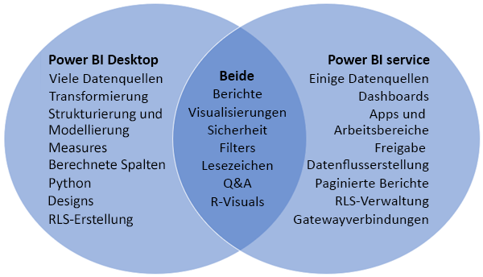
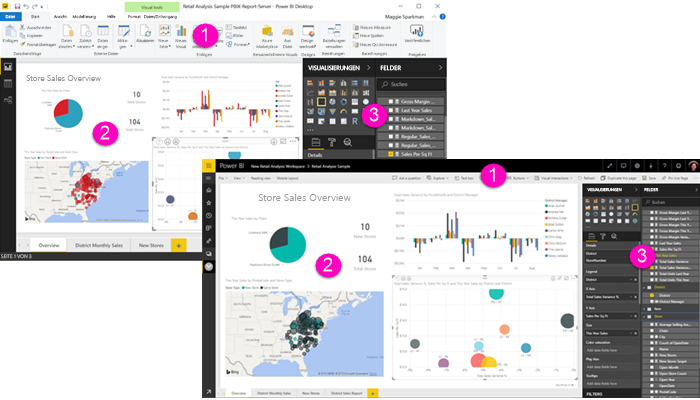

# Vergleich zwischen Power BI Desktop und dem Power BI-Dienst

In einem Venn-Diagramm würde die Überlappung der beiden Tools bei einem Vergleich zwischen Power BI Desktop und dem Power BI-Dienst im Bereich in der Mitte angezeigt werden. Es gibt einige Aufgaben, die Sie sowohl in Power BI Desktop als auch im Power BI-Dienst ausführen können. Auf den beiden Seiten des Venn-Diagramms werden jedoch einzigartige Features der Anwendung und des Diensts aufgeführt.  

**Power BI Desktop** ist ein Tool für die umfassende Datenanalyse und Berichterstellung. Wenn Sie die kostenlose Anwendung auf Ihrem lokalen Computer installieren, können Sie eine Verbindung mit vielen verschiedenen Datenquellen herstellen und diese in einem Datenmodell kombinieren (dies wird häufig als „Modellierung“ bezeichnet). Im Leitfaden [Erste Schritte mit Power BI Desktop](desktop-getting-started.md) wird der Prozess ausführlich beschrieben.

Der **Power BI-Dienst** ist ein cloudbasierter Onlinedienst für die Bearbeitung einfacher Berichte und die Zusammenarbeit von Teams und Unternehmen. Sie können im Power BI-Dienst auch eine Verbindung mit Datenquellen herstellen, Modellierungen sind jedoch nur eingeschränkt möglich. 

Die meisten Berichts-Designer, die an Business Intelligence-Projekten arbeiten, verwenden **Power BI Desktop** zum Erstellen von Berichten und nutzen anschließend den **Power BI-Dienst**, um ihre Berichte für andere Personen freizugeben.

## Bearbeitung von Berichten

Sie können sowohl in der Anwendung als auch im Dienst *Berichte* erstellen und bearbeiten. Ein Bericht kann eine Seite oder mehrere Seiten umfassen und Visuals und Sammlungen von Visuals enthalten. Sie können Lesezeichen, Schaltflächen, Filter und Drillthrough hinzufügen, um die Navigation in Ihren Berichten zu verbessern.

Die Berichts-Editoren in Power BI Desktop und im Power BI-Dienst ähneln sich. Sie bestehen aus drei Abschnitten:  

1. Den oberen Navigationsleisten, die in Power BI Desktop und dem Power BI-Dienst Unterschiede aufweisen    
2. Der Zeichenbereich des Berichts     
3. Den Bereichen **Felder**, **Visualisierungen** und **Filter**

Im folgenden Video wird der Berichts-Editor in Power BI Desktop gezeigt. 

<iframe width="560" height="315" src="https://www.youtube.com/embed/IkJda4O7oGs" frameborder="0" allowfullscreen></iframe>

## Zusammenarbeit im Power BI-Dienst

Nachdem Sie Ihre Berichte erstellt haben, können Sie diese in einem *Arbeitsbereich* im **Power BI-Dienst** speichern, in dem Sie und Ihre Kollegen zusammenarbeiten. Zusätzlich zu diesen Berichten erstellen Sie *Dashboards*. Anschließend geben Sie die Dashboards und Berichte für Berichtsbenutzer innerhalb und außerhalb Ihrer Organisation frei. Ihre Berichtbenutzer zeigen diese im Power BI-Dienst in der [Leseansicht](consumer/end-user-reading-view.md) an, nicht in der Bearbeitungsansicht. Sie haben keinen Zugriff auf alle Features, die für Berichtersteller verfügbar sind. 

## Nächste Schritte

[Was ist Power BI Desktop?](desktop-what-is-desktop.md)

[Erstellen eines Berichts](service-report-create-new.md) im Power BI-Dienst

[Grundlegende Konzepte für Berichts-Designer](service-basic-concepts.md)

Weitere Fragen? [Wenden Sie sich an die Power BI-Community](http://community.powerbi.com/)

