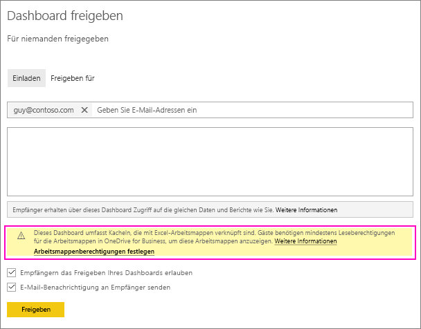
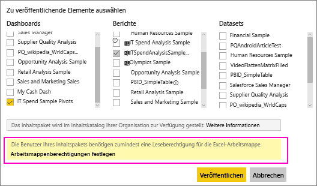
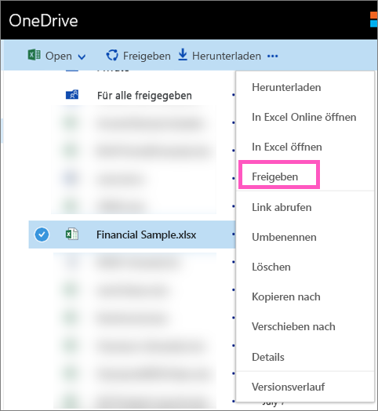

# Freigeben eines Power BI-Dashboards, das mit einer Excel-Datei in OneDrive verknüpft ist
In Power BI können Sie sich [mit Excel-Arbeitsmappen auf OneDrive for Business verbinden](service-excel-workbook-files.md) und Kacheln an ein Dashboard aus der jeweiligen Arbeitsmappe anheften. Wenn Sie dieses Dashboard freigeben oder ein Inhaltspaket erstellen, das dieses Dashboard enthält:

* Ihre Kollegen können die Kacheln anzeigen, ohne über Berechtigungen für die Arbeitsmappe an sich zu verfügen. Sie können also ein Inhaltspaket erstellen und müssen sich darüber im Klaren sein, dass Ihre Kollegen die Kacheln aus der OneDrive-Excel-Arbeitsmappe in OneDrive sehen können.
* Durch Klicken auf die Kachel wird die Arbeitsmappe in Power BI geöffnet. Die Arbeitsmappe wird nur geöffnet, wenn Ihr Kollege mindestens über [Leseberechtigungen](https://support.office.com/article/Share-documents-or-folders-in-Office-365-1fe37332-0f9a-4719-970e-d2578da4941c) für die Arbeitsmappe auf OneDrive for Business verfügt.

## Freigeben eines Dashboards, das Arbeitsmappenkacheln enthält
Weitere Informationen zum Freigeben eines Dashboards mit Links auf eine Excel-Arbeitsmappe auf OneDrive for Business finden Sie unter [Freigeben eines Dashboards](service-share-dashboards.md). Der Unterschied besteht darin, dass Sie die Möglichkeit zum Ändern der Berechtigungen für die verknüpfte Excel-Arbeitsmappe vor dem Freigeben haben.

  

1. Geben Sie die E-Mail-Adressen für Ihre Kollegen ein.
2. Wählen Sie zum Aktivieren der Anzeige der Excel-Arbeitsmappe aus Power BI für Ihre Kollegen **Zu OneDrive for Business wechseln, um Arbeitsmappenberechtigungen festzulegen**aus.
3. [Ändern Sie die Berechtigungen](https://support.office.com/article/Share-files-and-folders-and-change-permissions-9fcc2f7d-de0c-4cec-93b0-a82024800c07) auf OneDrive nach Bedarf.
4. Wählen Sie **Freigeben**aus.

>[!NOTE]
>Ihre Kollegen werden nicht in der Lage sein, zusätzliche Kacheln aus der Arbeitsmappe anzuheften, und sie können in Power BI keine Änderungen an der Excel-Arbeitsmappe vornehmen.
> 
> 

## Erstellen eines organisationsbezogenen Inhaltspakets mit einem Dashboard, das Arbeitsmappenkacheln enthält
Wenn Sie ein [Inhaltspaket veröffentlichen](service-organizational-content-pack-create-and-publish.md), erteilen Sie Zugriff für einzelne Kollegen oder Gruppen. Wenn Sie ein Inhaltspaket veröffentlichen, das Arbeitsmappenlinks enthält, haben Sie die Möglichkeit, vor der Veröffentlichung die Berechtigungen für die verknüpfte Excel-Arbeitsmappe zu ändern.

1. Geben Sie auf dem Bildschirm **Inhaltspaket erstellen** E-Mail-Adressen ein, geben Sie dem Inhaltspaket einen Titel, fügen Sie eine Beschreibung hinzu, und laden Sie ein Bild hoch.
2. Wählen Sie das Dashboard und/oder den Bericht aus, das bzw. der mit der Excel-Arbeitsmappe auf OneDrive for Business verknüpft ist.
   
    
3. Wählen Sie **Zu OneDrive for Business wechseln, um Arbeitsmappenberechtigungen festzulegen**aus.
4. [Ändern Sie die Berechtigungen](https://support.office.com/article/Share-files-and-folders-and-change-permissions-9fcc2f7d-de0c-4cec-93b0-a82024800c07) auf OneDrive nach Bedarf.
5. Wählen Sie **Veröffentlichen**aus.

## Freigeben eines Dashboards in einem Power BI-Arbeitsbereich
Das Freigeben eines Dashboards in einem Power BI-Arbeitsbereich ähnelt dem Freigeben eines Dashboards aus dem eigenen Arbeitsbereich mit der Ausnahme, dass die Dateien in einer Office 365-Arbeitsbereichswebsite anstatt im privaten OneDrive for Business gespeichert sind. Ändern Sie die Berechtigungen für die Excel-Arbeitsmappe vor der Freigabe des Dashboards für Personen außerhalb des Arbeitsbereichs.

## Nächste Schritte
* [Anheften einer Kachel an ein Power BI-Dashboard aus Excel](service-dashboard-pin-tile-from-excel.md)
* [Power BI – Grundkonzepte](consumer/end-user-basic-concepts.md)
* Weitere Fragen? [Wenden Sie sich an die Power BI-Community](http://community.powerbi.com/)

