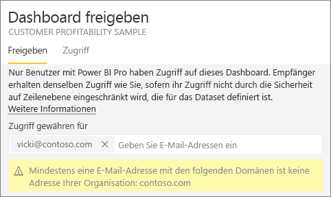
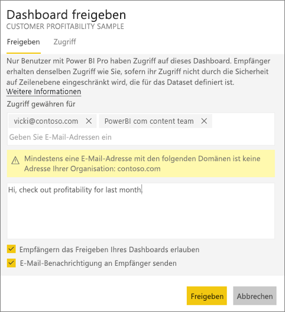
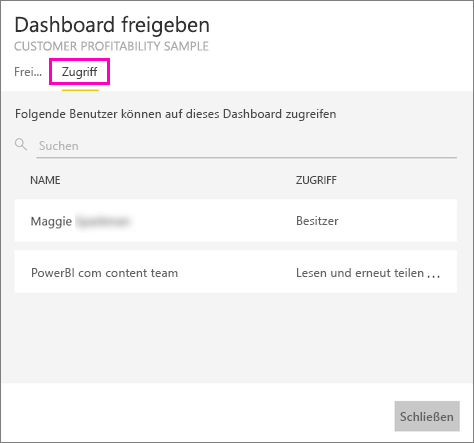
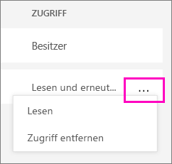

# Freigeben Ihrer Power BI-Dashboards für Kollegen und andere
*Freigeben* ist eine gute Möglichkeit, einigen Personen Zugriff auf Ihre Dashboards und Berichte zu gewähren. Power BI bietet [verschiedene Möglichkeiten zum gemeinsamen Bearbeiten und Verteilen Ihrer Dashboards](service-how-to-collaborate-distribute-dashboards-reports.md), und Freigeben ist nur eine davon.

Zum Freigeben benötigen Sie und die Empfänger eine [Power BI Pro-Lizenz](service-free-vs-pro.md), egal, ob Sie Inhalte innerhalb oder außerhalb Ihrer Organisation freigeben. Oder es muss sich um Inhalte in einer [Premium-Kapazität](service-premium.md) handeln. Vorschläge? Das Power BI-Team ist immer an Ihrem Feedback interessiert. Besuchen Sie daher die [Power BI-Community-Website](https://community.powerbi.com/).

Sie können ein Dashboard aus Ihrem eigenen Arbeitsbereich oder aus einem App-Arbeitsbereich freigeben. Wenn Sie ein Dashboard freigeben, können diejenigen, für die Sie es freigeben, es anzeigen und damit interagieren, aber es nicht bearbeiten. Sie sehen die gleichen Daten wie Sie im Dashboard und den Berichten, es sei denn, die [Sicherheit auf Zeilenebene (RLS)](service-admin-rls.md) ist aktiviert. Die Kollegen, für die Sie das Dashboard freigeben, können es für ihre Kollegen freigeben, wenn Sie dies zulassen. Die Personen außerhalb Ihrer Organisation können ebenfalls das Dashboard anzeigen und damit interagieren, aber es nicht freigeben. 

Sie können [ein Dashboard auch aus einer beliebigen mobilen Power BI-App freigeben](mobile-share-dashboard-from-the-mobile-apps.md). Sie können Dashboards über den Power BI-Dienst und die mobilen Power BI-Apps, aber nicht über Power BI Desktop freigeben.

## Video: Freigeben eines Dashboards
Sehen Sie sich an, wie Amanda ihr Dashboard für Kollegen im Unternehmen und externe Personen freigibt. Befolgen Sie dann die schrittweisen Anleitungen unter dem Video, um es selbst ausprobieren.

<iframe width="560" height="315" src="https://www.youtube.com/embed/0tUwn8DHo3s?list=PL1N57mwBHtN0JFoKSR0n-tBkUJHeMP2cP" frameborder="0" allowfullscreen></iframe>

## Freigeben eines Dashboards
1. Öffnen Sie in „Mein Arbeitsbereich“ oder in einem App-Arbeitsbereich ein Dashboard, und wählen Sie **Freigeben**  aus.
2. Geben Sie im oberen Feld die vollständigen E-Mail-Adressen für Einzelpersonen, Verteilergruppen oder Sicherheitsgruppen ein. Bei dynamischen Verteilerlisten sind Freigaben nicht möglich. 
   
   Freigaben sind auch für Personen mit Adressen außerhalb der Organisation möglich. In diesem Fall wird allerdings eine Warnung angezeigt.
   
     
3. Wenn Sie möchten, fügen Sie eine Nachricht hinzu. Dies ist optional.
4. Damit Ihre Kollegen Ihr Dashboard für weitere Personen freigeben können, aktivieren Sie das Kontrollkästchen **Empfängern das Freigeben Ihres Dashboards erlauben**.
   
   Wenn Sie anderen Personen das Freigeben gestatten, wird dies als *erneutes Freigeben* bezeichnet. In diesem Fall können die anderen Personen die Inhalte über den Power BI-Dienst und die mobilen Apps erneut freigeben oder die E-Mail-Einladung an andere Personen in der Organisation weiterleiten. Nach einem Monat läuft die Einladung ab. Für Personen außerhalb Ihrer Organisation ist die erneute Freigabe nicht möglich. Als Besitzer des Dashboards können Sie die erneute Freigabe deaktivieren und auch individuell widerrufen. Siehe [Aufheben der Freigabe eines Dashboards oder Aufheben der Freigabe durch andere](service-share-dashboards.md#stop-sharing-a-dashboard-or-stop-others-from-sharing).
5. Wählen Sie **Freigeben** aus.
   
     
   
   Power BI sendet an die Personen, jedoch nicht an Gruppen, eine Einladung per E-Mail, die einen Link zum freigegebenen Dashboard enthält. Die Benachrichtigung **Erfolgreich** wird angezeigt. 
   
   Wenn Empfänger in Ihrer Organisation auf den Link klicken, wird das Dashboard in Power BI ihrer Listenseite **Für mich freigegeben** hinzugefügt. Die Empfänger können Ihren Namen auswählen, um alle von Ihnen freigegebenen Dashboards anzuzeigen. 
   
   
   
   Wenn Empfänger außerhalb der Organisation auf den Link klicken, wird das Dashboard angezeigt, jedoch nicht im üblichen Power BI-Portal. Weitere Informationen finden Sie unter [Freigabe eines Dashboards für Personen außerhalb Ihrer Organisation](service-share-dashboards.md#share-a-dashboard-with-people-outside-your-organization).

## Wer hat Zugriff auf das von mir freigegebene Dashboard?
In einigen Fällen müssen Sie sehen können, für welche Personen Sie ein Dashboard freigegeben haben, und für welche Personen diese das Dashboard freigegeben haben.

1. Wählen Sie in der Liste der Dashboards oder im Dashboard selbst **Freigeben**  aus. 
2. Wählen Sie im Dialogfeld **Dashboard freigeben** die Option **Zugriff** aus.
   
    
   
    Personen außerhalb Ihrer Organisation werden als **Gast** aufgelistet.

## Aufheben der Freigabe eines Dashboards oder Aufheben der Freigabe durch andere
Nur der Dashboardbesitzer kann die erneute Freigabe aktivieren und deaktivieren.

### Wenn Sie die Freigabeeinladung noch nicht gesendet haben
* Deaktivieren Sie unten in der Einladung das Kontrollkästchen **Empfängern das Freigeben Ihres Dashboards erlauben**, bevor Sie sie senden.

### Wenn Sie das Dashboard bereits freigegeben haben
1. Wählen Sie in der Liste der Dashboards oder im Dashboard selbst **Freigeben**  aus. 
2. Wählen Sie im Dialogfeld **Dashboard freigeben** die Option **Zugriff** aus.
   
    
3. Klicken Sie auf die Auslassungspunkte (**...**) neben **Lesen und erneut freigeben**, und wählen Sie dann Folgendes:
   
   
   
   * **Lesen**, um Freigaben dieser Person für andere Personen zu verhindern.
   * **Zugriff entfernen**, um zu verhindern, dass diese Person das Dashboard anzeigen kann.

## Freigabe eines Dashboards für Personen außerhalb Ihrer Organisation
Bei einer Freigabe für Personen außerhalb Ihrer Organisation erhalten diese eine E-Mail mit einem Link zum freigegebenen Dashboard, und sie müssen sich bei Power BI anmelden, um das Dashboard anzuzeigen. Wenn sie kein Power BI-Konto haben, können sie sich nach Klicken auf den Link für eines registrieren.

Nachdem sie sich angemeldet haben, sehen sie das freigegebene Dashboard in einem eigenen Browserfenster ohne den linken Navigationsbereich, nicht in ihrem üblichen Power BI-Portal. Sie müssen den Link als Favoriten speichern, um künftig auf dieses Dashboard zugreifen zu können.

Sie können Inhalte in diesem Dashboard oder Bericht nicht bearbeiten. Sie können mit den Diagrammen im Bericht interagieren (Kreuzhervorhebung) und Filter/Slicer ändern, die für die mit dem Dashboard verbundenen Berichte verfügbar sind, sie können ihre Änderungen aber nicht speichern.

Nur direkte Empfänger können das freigegebene Dashboard anzeigen. Wenn Sie die E-Mail beispielsweise an Vicki@contoso.com gesendet haben, wird das Dashboard nur für Vicki angezeigt. Niemand sonst kann das Dashboard sehen, selbst wenn der Link verfügbar ist, und Vicki muss dieselbe E-Mail-Adresse verwenden, um auf dieses Dashboard zuzugreifen. Wenn sie sich mit einer anderen E-Mail-Adresse anmeldet, hat sie auch keinen Zugriff auf das Dashboard.

Personen außerhalb Ihrer Organisation können überhaupt keine Daten anzeigen, wenn für lokale Analysis Services-Tabellenmodelle die Sicherheit auf Rollen- oder Zeilenebene implementiert ist.

Wenn Sie aus einer mobilen Power BI-App einen Link an Personen außerhalb Ihrer Organisation senden und diese auf den Link klicken, wird das Dashboard in einem Browser und nicht in der mobilen Power BI-App geöffnet.

## Einschränkungen und Überlegungen
Aspekte, die beim Freigeben von Dashboards zu beachten sind:

* Im Allgemeinen sehen Sie und Ihre Kollegen die gleichen Daten im Dashboard. Wenn Sie folglich mehr Berechtigungen als Ihre Kollegen haben, Daten zu sehen, werden sie alle Daten in Ihrem Dashboard sehen können. Wenn jedoch die [Sicherheit auf Zeilenebene (RLS)](service-admin-rls.md) auf das einem Dashboard zugrunde liegende Dataset angewendet ist, wird anhand der Anmeldeinformationen jeder Person festgelegt, auf welche Daten sie zugreifen kann.
* Jede Person, für die Sie das Dashboard freigeben, kann es anzeigen und in der [Leseansicht](service-report-open-in-reading-view.md) mit Ihren Berichten interagieren. Sie können keine Berichte erstellen oder Änderungen an vorhandenen Berichten speichern.
* Das Dataset kann von ihnen nicht angezeigt oder heruntergeladen werden.
* Alle Benutzer können die [Dashboarddaten manuell aktualisieren](refresh-data.md).
* Wenn Sie Office 365 für E-Mails verwenden, ist die Freigabe für Mitglieder einer Verteilergruppe möglich, indem Sie die der Verteilergruppe zugeordnete E-Mail-Adresse eingeben.
* Kollegen in derselben E-Mail-Domäne wie Sie und Kollegen, die zu einer anderen Domäne gehören, aber innerhalb desselben Mandanten registriert sind, können das Dashboard für andere freigeben. Angenommen, die Domänen „contoso.com“ und „contoso2.com“ sind im selben Mandanten registriert. Wenn Sie die E-Mail-Adresse konrads@contoso.com haben, ist sowohl ravali@contoso.com als auch gustav@contoso2.com eine Freigabe erlaubt, sofern Sie ihnen die Berechtigung zum Freigeben erteilt haben.
* Wenn Ihre Kollegen bereits über den Zugriff auf ein bestimmtes Dashboard verfügen, können Sie einen direkten Link zu diesem Dashboard senden, indem Sie einfach die URL kopieren, wenn Sie sich auf dem Dashboard befinden. Beispiel:   
  
    https://powerbi.com/dashboards/g12466b5-a452-4e55-8634-xxxxxxxxxxxx
* Ebenso können Sie, wenn Ihre Kollegen bereits Zugriff auf ein bestimmtes Dashboard haben, [einen direkten Link zum zugrunde liegenden Bericht senden](service-share-reports.md). 

## Nächste Schritte
* Feedback? Anregungen nehmen wir auf der [Power BI-Communitywebsite](https://community.powerbi.com/) entgegen.
* [Wie kann ich Dashboards und Berichte freigeben?](service-how-to-collaborate-distribute-dashboards-reports.md)
* [Freigeben nur eines Power BI-Berichts](service-share-reports.md)
* Haben Sie Fragen? [Wenden Sie sich an die Power BI-Community](http://community.powerbi.com/).

