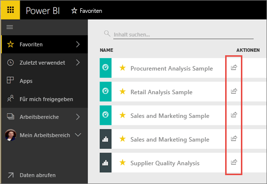
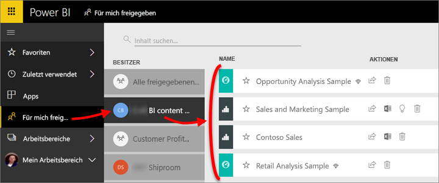
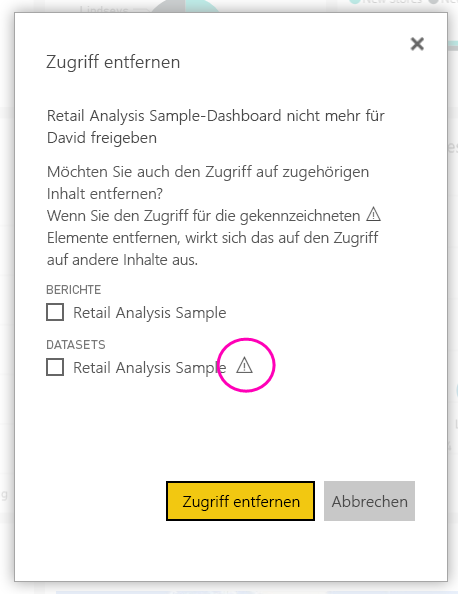
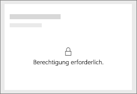
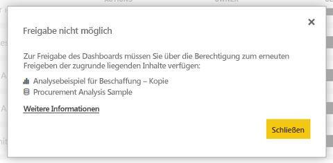

# Freigeben von Power BI-Dashboards und -Berichten für Kollegen und andere
*Freigeben* ist eine gute Möglichkeit, einigen Personen Zugriff auf Ihre Dashboards und Berichte zu gewähren. Zudem bietet Power BI [verschiedene Möglichkeiten zum gemeinsamen Bearbeiten und Verteilen von Dashboards und Berichten](service-how-to-collaborate-distribute-dashboards-reports.md).

Zum Freigeben benötigen Sie eine [Power BI Pro-Lizenz](service-features-license-type.md), egal, ob Sie Inhalte innerhalb oder außerhalb Ihrer Organisation freigeben. Auch Ihre Empfänger benötigen Power BI Pro-Lizenzen, es sei denn, die Inhalte einer [Premium-Kapazität](service-premium-what-is.md). 

Sie können Dashboards und Berichte aus den meisten Stellen im Power BI-Dienst freigeben: Favoriten, zuletzt verwendet "," für mich (wenn der Besitzer es erlaubt), Arbeitsbereich oder andere Arbeitsbereiche freigegeben. Wenn Sie Dashboards oder Berichts freigeben, können diejenigen, für die Sie sie freigeben, diese anzeigen und damit interagieren, aber nicht bearbeiten. Sie sehen die gleichen Daten wie Sie im Dashboard oder Bericht, es sei denn, die [Sicherheit auf Zeilenebene (RLS)](service-admin-rls.md) ist aktiviert. Die Kollegen, für die Sie Inhalte freigeben, können diese auch für ihre Kollegen freigeben, wenn Sie dies zulassen. Die Personen außerhalb Ihrer Organisation können auch anzeigen und im Dashboard oder Bericht interagieren, aber nicht freigeben. 

Sie können [ein Dashboard auch aus einer beliebigen mobilen Power BI-App freigeben](consumer/mobile/mobile-share-dashboard-from-the-mobile-apps.md). Allerdings können nicht Sie Dashboards in Power BI Desktop freigeben.

## Video: Freigeben eines Dashboards
Sehen Sie sich an, wie Amanda ihr Dashboard für Kollegen im Unternehmen und externe Personen freigibt. Befolgen Sie dann die schrittweisen Anleitungen unter dem Video, um es selbst ausprobieren.

<iframe width="560" height="315" src="https://www.youtube.com/embed/0tUwn8DHo3s?list=PL1N57mwBHtN0JFoKSR0n-tBkUJHeMP2cP" frameborder="0" allowfullscreen></iframe>

## Freigeben eines Dashboards oder Berichts

1. Wählen Sie in einer Liste von Dashboards bzw. Berichten oder in einem geöffneten Dashboard oder Bericht **Freigeben** .

2. Geben Sie im oberen Feld die vollständigen E-Mail-Adressen für Einzelpersonen, Verteilergruppen oder Sicherheitsgruppen ein. Bei dynamischen Verteilerlisten sind Freigaben nicht möglich. 
   
   Freigaben sind auch für Personen mit Adressen außerhalb der Organisation möglich. In diesem Fall wird allerdings eine Warnung angezeigt.
   
    
 
   >[!NOTE]
   >Das Eingabefeld unterstützt maximal 100 Benutzer oder Gruppen. Wenn Sie mit einer großen Anzahl von Benutzern teilen möchten, sollten Sie das Dashboard in einem Arbeitsbereich erstellt und [als app verteilen](service-create-distribute-apps.md).
   > 
   > 

3. Wenn Sie möchten, fügen Sie eine Nachricht hinzu. Dies ist optional.
4. Damit Ihre Kollegen Ihren Inhalt für andere Benutzer freigeben können, überprüfen Sie **Empfängern das Freigeben von Dashboards (oder Berichts) ermöglichen**.
   
   Wenn Sie anderen Personen das Freigeben gestatten, wird dies als *erneutes Freigeben* bezeichnet. In diesem Fall können die anderen Personen die Inhalte über den Power BI-Dienst und die mobilen Apps erneut freigeben oder die E-Mail-Einladung an andere Personen in der Organisation weiterleiten. Nach einem Monat läuft die Einladung ab. Für Personen außerhalb Ihrer Organisation ist die erneute Freigabe nicht möglich. Als Besitzer des Inhalts können Sie die erneute Freigabe deaktivieren oder individuell widerrufen. Finden Sie unter [Freigabe beenden oder verhindern, dass andere Benutzer freigeben](#stop-sharing-or-stop-others-from-sharing).

5. Wählen Sie **Freigeben** aus.
   
     
   
   Powerbi sendet eine e-Mail-Einladung an die Personen, jedoch nicht an Gruppen, mit einem Link zum freigegebenen Inhalt. Die Benachrichtigung **Erfolgreich** wird angezeigt. 
   
   Wenn Empfänger in Ihrer Organisation auf den Link klicken, wird das Dashboard bzw. der Bericht in Power BI ihrer Listenseite **Für mich freigegeben** hinzugefügt. Die Empfänger können Ihren Namen auswählen, um alle von Ihnen für sie freigegebenen Inhalte anzuzeigen. 
   
   
   
   Wenn Empfänger außerhalb der Organisation auf den Link klicken, wird das Dashboard bzw. der Bericht angezeigt, jedoch nicht im üblichen Power BI-Portal. Weitere Informationen finden Sie unter [für Personen außerhalb Ihrer Organisation freigeben eines Dashboards oder Berichts](#share-a-dashboard-or-report-with-people-outside-your-organization).

## Wer hat Zugriff auf von Ihnen freigegebene Dashboards und Berichte?
Manchmal müssen Sie die Personen zu sehen, die Sie freigegeben haben, die und anzuzeigen, für wen sie freigegeben haben:

1. Wählen Sie in der Liste der Dashboards und Berichte oder im Dashboard bzw. Bericht selbst **Freigeben**  aus. 
2. In der **Freigeben von Dashboards** oder **Bericht freigeben** wählen Sie im Dialogfeld **Zugriff**.
   
    

    Personen außerhalb Ihrer Organisation werden als **Gast** aufgelistet.

## Aufheben der Freigabe oder Aufheben der Freigabe durch andere
Nur der Dashboard- bzw. Berichtbesitzer kann die erneute Freigabe aktivieren und deaktivieren.

### Wenn Sie die Freigabeeinladung noch nicht gesendet haben
* Deaktivieren der **Empfängern das Freigeben von Dashboards (oder Berichts) ermöglichen** Kontrollkästchen am unteren Rand der Einladung, bevor Sie sie senden.

### Wenn Sie das Dashboard bzw. den Bericht bereits freigegeben haben
1. Wählen Sie in der Liste der Dashboards und Berichte oder im Dashboard bzw. Bericht selbst **Freigeben**  aus. 
2. In der **Freigeben von Dashboards** oder **Bericht freigeben** wählen Sie im Dialogfeld **Zugriff**.
   
    
3. Klicken Sie auf die Auslassungspunkte ( **...** ) neben **Lesen und erneut freigeben**, und wählen Sie dann Folgendes:
   
   
   
   * **Lesen**, um Freigaben dieser Person für andere Personen zu verhindern.
   * **Zugriff entfernen**, um zu verhindern, dass diese Person den freigegebenen Inhalt anzeigen kann.

4. In der **Zugriff entfernen** Dialogfeld Feld, das entscheiden, ob Sie auch den Zugriff auf verwandte Inhalte, z. B. Berichte und Datasets entfernen möchten. Wenn Sie Elemente mit einem Warnsymbol entfernen , es wird empfohlen, auch verwandten Inhalte entfernen, da sie nicht korrekt angezeigt.

    

## Freigeben eines Dashboards bzw. eines Berichts für Personen außerhalb Ihrer Organisation
Wenn Sie für Personen außerhalb Ihrer Organisation freigeben, erhalten sie eine e-Mail mit einem Link zum freigegebenen Dashboard oder Bericht, die sie in Power BI anmelden müssen, finden Sie unter. Wenn sie keine Power BI Pro-Lizenz haben, können sie sich nach Klicken auf den Link für eine Lizenz registrieren.

Nachdem sie sich angemeldet haben, sehen sie das freigegebene Dashboard bzw. Bericht in einem eigenen Browserfenster, nicht in ihrem üblichen Power BI-Portal. Um das Dashboard oder den Bericht später zugreifen zu können, müssen sie den Link einem Lesezeichen versehen.

Sie können Inhalte in diesem Dashboard oder Bericht nicht bearbeiten. Obwohl sie mit den Diagrammen interagieren und Ändern von Filtern oder Slicern können, können nicht sie ihre Änderungen zu speichern. 

Nur direkte Empfänger können das freigegebene Dashboard bzw. den freigegebenen Bericht anzeigen. Wenn Sie die E-Mail beispielsweise an Vicki@contoso.com gesendet haben, wird das Dashboard nur für Vicki angezeigt. Niemand sonst können das Dashboard sehen, auch wenn sie den Link verfügen. Vicki muss dieselbe e-Mail-Adresse verwenden, um darauf zuzugreifen; Wenn sie sich mit einer anderen e-Mail-Adresse anmeldet, müssen sie nicht über Zugriff auf das Dashboard.

Personen außerhalb Ihrer Organisation können keine Daten anzeigen, wenn für lokale Analysis Services-Tabellenmodelle die Sicherheit auf Rollen- oder Zeilenebene implementiert ist.

Wenn Sie einen Link aus einer mobilen Power BI-app an Personen außerhalb Ihrer Organisation senden, wird durch das Klicken auf den Link im Dashboard geöffnet, in einem Browser, nicht in der mobilen Power BI-app.

Wenn Sie [externe Gastbenutzer zum Bearbeiten und Verwalten von Inhalt in der Organisation können](service-admin-portal.md#export-and-sharing-settings), die standarderfahrung Nutzung nur nicht auf sie angewendet werden. [Weitere Informationen](service-admin-azure-ad-b2b.md).

## Einschränkungen und Überlegungen
Aspekte, die beim Freigeben von Dashboards und Berichten zu beachten sind:

* Im Allgemeinen sehen Sie und Ihre Kollegen die gleichen Daten im Dashboard bzw. Bericht. Wenn Sie folglich mehr Berechtigungen als Ihre Kollegen haben, Daten zu sehen, werden sie alle Daten in Ihrem Dashboard bzw. Bericht sehen können. Wenn jedoch die [Sicherheit auf Zeilenebene (RLS)](service-admin-rls.md) auf das einem Dashboard bzw. Bericht zugrunde liegende Dataset angewendet ist, wird anhand der Anmeldeinformationen jeder Person festgelegt, auf welche Daten sie zugreifen kann.
* Alle Benutzer Sie das Dashboard freigeben kann es anzeigen und interagieren mit den verknüpften Berichten in ["Leseansicht"](consumer/end-user-reading-view.md#reading-view). Sie können keine Berichte erstellen oder Änderungen an vorhandenen Berichten speichern.
* Obwohl niemand anzeigen oder das Dataset herunterladen können, können sie das Dataset direkt mithilfe die analysieren die Funktion in Excel zugreifen. Ein Administrator kann die Möglichkeit, Analysieren in Excel verwenden, für alle Benutzer in einer Gruppe einschränken. Die Einschränkung gilt allerdings für alle Benutzer in dieser Gruppe für jeden Arbeitsbereich, zu dem die Gruppe gehört.
* Alle Benutzer können die [Daten manuell aktualisieren](refresh-data.md).
* Wenn Sie Office 365 für E-Mails verwenden, ist die Freigabe für Mitglieder einer Verteilergruppe möglich, indem Sie die der Verteilergruppe zugeordnete E-Mail-Adresse eingeben.
* Kollegen, die Ihre e-Mail-Domäne gemeinsam nutzen und Kollegen, die mit der Domäne verschiedene, jedoch innerhalb der gleichen Mandanten registriert ist, können das Dashboard für andere Benutzer freigeben. Ist z. B. wenn die Domänen "contoso.com" und "Contoso2.com" sind in demselben Mandanten und Ihre e-Mail-Adresse registriert sind konrads@contoso.com, klicken Sie dann beide ravali@contoso.com und gustav@contoso2.com freigeben können, solange Sie ihnen über die Berechtigung zum Freigeben erteilt haben.
* Wenn Ihre Kollegen bereits Zugriff auf ein bestimmtes Dashboard bzw. Bericht haben, können Sie einen direkten Link senden, durch die URL kopieren, wenn Sie sich im Dashboard oder Bericht befinden. Beispiel: `https://powerbi.com/dashboards/g12466b5-a452-4e55-8634-xxxxxxxxxxxx`
* Auch wenn Ihre Kollegen bereits Zugriff auf ein bestimmtes Dashboard verfügen, können Sie [einen direkten Link zu den zugrunde liegenden Bericht senden](service-share-reports.md). 
* Sie können maximal 100 Benutzer oder Gruppen in einer einzelnen Freigabe-Aktion, freigeben. Allerdings können Sie mehr als 500 Benutzern Zugriff auf ein Element gewähren. Zu diesem Zweck müssen Sie entweder freigeben Sie mehrere Male, indem Sie die Benutzer einzeln angeben oder freigegeben Sie wird, eine Benutzergruppe, die alle Benutzer enthält.

## Behandeln von Problemen bei der Freigabe

### Die Empfänger meines Dashboards sehen ein Schlosssymbol auf einer Kachel oder die Meldung „Berechtigung erforderlich“.

Den Personen, für die Sie Inhalte freigeben, wird möglicherweise eine gesperrte Kachel in einem Dashboard oder die Meldung „Berechtigung erforderlich“ angezeigt, wenn sie einen Bericht anzeigen möchten.

Wenn dies der Fall ist, müssen Sie diese Berechtigung für das zugrunde liegende Dataset gewähren:

1. Wechseln Sie in der Liste Ihrer Inhalte zur Registerkarte **Datasets**.

1. Wählen Sie die Auslassungspunkte ( **...** ) neben dem Dataset, und wählen Sie dann **Berechtigungen verwalten**.

    

1. Wählen Sie **Benutzer hinzufügen** aus.

    

1. Geben Sie die vollständigen E-Mail-Adressen für Einzelpersonen, Verteilergruppen oder Sicherheitsgruppen ein. Bei dynamischen Verteilerlisten sind Freigaben nicht möglich.

    

1. Wählen Sie **Hinzufügen**.

### Ein Dashboard oder Bericht kann nicht freigegeben werden

Um einem Dashboard oder Bericht freizugeben, benötigen Sie die Berechtigung zum Freigeben des zugrunde liegenden Inhalts; alle zugehörigen, also, Berichte und Datasets. Wenn Sie eine Meldung, dass Sie nicht freigeben können bitten Sie den Autor des Berichts sehen gewähren, Sie über die Berechtigung für diese Berichte und Datasets Replikatpfads erneut frei.

## Nächste Schritte
* Feedback? Anregungen nehmen wir auf der [Power BI-Communitywebsite](https://community.powerbi.com/) entgegen.
* [Wie kann ich Dashboards und Berichte freigeben?](service-how-to-collaborate-distribute-dashboards-reports.md)
* [Freigeben eines gefilterten Power BI-Berichts](service-share-reports.md).
* Haben Sie Fragen? [Wenden Sie sich an die Power BI-Community](http://community.powerbi.com/).

