# Schnellstart: Sich mit dem Power BI-Dienst vertraut machen

Nachdem Sie die Grundlagen von Power BI kennengelernt haben, machen Sie sich nun mit dem **Power BI-Dienst** näher vertraut. Wie bereits erwähnt, kann es sein, dass jemand in Ihrem Team die ganze Zeit in **Power BI Desktop** verbringt, um Daten zu kombinieren und Berichte für andere zu erstellen. Sie hingegen verbringen andererseits ggf. Ihre ganze Zeit im Power BI-Dienst mit dem Anzeigen von und Interagieren mit Inhalten, die von anderen erstellt wurden (Erfahrung als **Consumer**) oder dem Abrufen von Daten und dem Erstellen Ihrer eigenen Berichte und Dashboards (Erfahrung als **Ersteller**). In dieser Schnellstartanleitung importieren Sie Beispieldaten und nutzen diese, um sich mit dem Power BI-Dienst näher vertraut zu machen. 
 
## Voraussetzungen

- Wenn Sie noch nicht bei Power BI registriert sind, müssen Sie sich zuerst für eine [kostenlose Testversion registrieren](https://app.powerbi.com/signupredirect?pbi_source=web).

- Lesen Sie [Power BI-Dienst – Grundkonzepte](service-basic-concepts.md).

## Öffnen des Power BI-Diensts und Abrufen von Daten
Wir rufen einige Beispieldaten ab, die wir für unseren Rundgang durch den Power-BI-Dienst nutzen. Es gibt alle möglichen Arten von Beispieldaten, die wir Ihnen zur Verfügung stellen. Dieses Mal greifen wir auf die Daten zu Einzelhandelsgeschäften zurück.    
1. Öffnen Sie „app.powerbi.com“, und klicken Sie auf den Link **Beispiele**. 

    

2. Klicken Sie auf **Analysebeispiel für Einzelhandel > Verbinden**.

    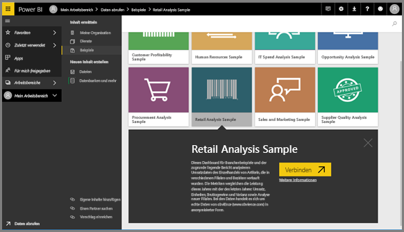

    Der Power BI-Dienst importiert das Beispiel und zeigt das Dashboard an. Bei Dashboards unterscheiden sich der Power BI-Dienst und Power BI Desktop. Das Beispiel enthält auch einen Bericht und ein Dataset, auf das wir später zurückkommen werden.

    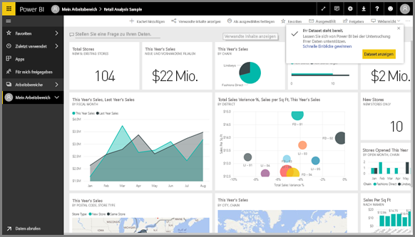

Amanda zeigt Ihnen eine Übersicht über die Navigation des Power BI-Diensts.  Befolgen Sie dann die detaillierten Anweisungen unter dem Video, um es selbst ausprobieren.

<iframe width="560" height="315" src="https://www.youtube.com/embed/G26dr2PsEpk" frameborder="0" allowfullscreen></iframe>

## Anzeigen von Inhalten (Dashboards, Berichte, Arbeitsmappen, Datasets, Arbeitsbereiche, Apps)
Betrachten wir zunächst, wie die grundlegenden Inhalte (Dashboards, Berichte, Datasets, Arbeitsmappen) organisiert sind. Inhalt wird im Kontext eines Arbeitsbereichs angezeigt. An diesem Punkt gibt es nur einen Arbeitsbereich, der **Mein Arbeitsbereich** heißt. In „Mein Arbeitsbereich“ werden alle Inhalte gespeichert, deren Besitzer Sie sind. Betrachten Sie ihn als persönlichen Sandkasten oder Arbeitsbereich für eigene Inhalte. Sie können Inhalte von „Mein Arbeitsbereich“ für Kollegen freigeben. In „Mein Arbeitsbereich“ sind die Inhalte auf 4 Registerkarten organisiert: „Dashboards“, „Berichte“, „Arbeitsmappen“ und „Datasets“.

Wählen Sie im linken Navigationsbereich einen Arbeitsbereich aus. Die Registerkarten für die entsprechenden Inhalte (Dashboards, Berichte, Arbeitsmappen und Datasets) werden dann rechts im Power BI-Zeichenbereich aufgerufen.

Einem neuen Benutzer wird nur ein Arbeitsbereich (**Mein Arbeitsbereich**) angezeigt.

Auf diesen Registerkarten (bzw. in diesen *Inhaltsansichten*) sehen Sie Informationen zum Inhalt sowie Aktionen, die Sie auf diesen Inhalt anwenden können.  Auf der Registerkarte „Dashboards“ können Sie beispielsweise ein Dashboard öffnen, freigeben, löschen, suchen, neue Inhalte erstellen, sortieren und vieles mehr.

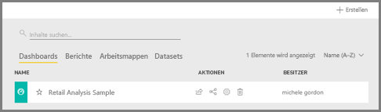

Öffnen Sie das Dashboard, indem Sie den Namen des Dashboards auswählen.

## Speichern eines Dashboards und Berichts als Favoriten
**Favoriten** ermöglichen Ihnen den schnellen Zugriff auf die Inhalte, die für Sie am wichtigsten sind.  

1. Wählen Sie bei geöffnetem Dashboard rechts oben **Favorit** aus.
   
   
   
   Aus **Favorit** wird nun **Aus Favoriten entfernen**, und das Sternsymbol wird in Gelb angezeigt.
   
   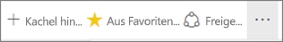

2. Klicken Sie im linken Navigationsbereich auf den Pfeil rechts neben **Favoriten**, um die Liste aller Inhalte anzuzeigen, die Sie als Favoriten markiert haben. Da der linke Navigationsbereich ein permanentes Feature des Power BI-Diensts ist, haben Sie überall im Power BI-Dienst Zugriff auf diese Liste.
   
    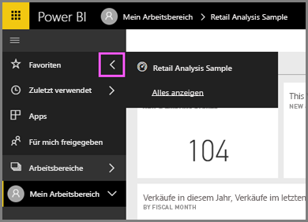
   
    Wir haben bisher nur ein Favoriten. Favoriten können Dashboards, Berichte oder Apps sein.  

1. Sie können ein Dashboard oder einen Bericht auch über die Registerkarte **Dashboards** oder **Berichte** des Arbeitsbereichs als Favorit speichern.  Öffnen Sie die Registerkarte **Berichte**, und klicken Sie links neben dem Berichtsnamen auf das Sternsymbol.
   
   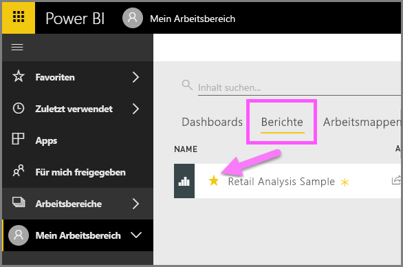

3. Öffnen Sie den *Bereich* **Favoriten**, indem Sie im linken Navigationsbereich **Favoriten** auswählen oder auf das Sternsymbol  klicken.
   
   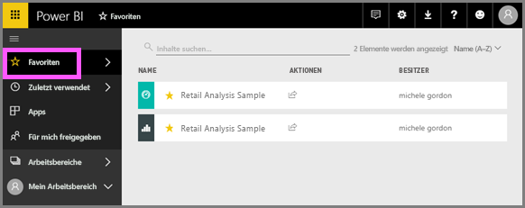
   
   Sie haben nun zwei Favoriten, ein Dashboard und einen Bericht. Von hier aus können Sie diese öffnen, durchsuchen und als Favorit löschen oder für Kollegen freigeben.

4. Wählen Sie den Berichtsnamen aus, um ihn im Berichts-Editor zu öffnen.

    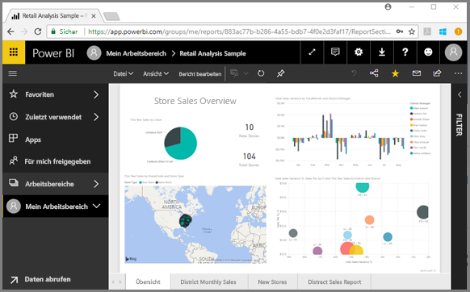

Weitere Informationen finden Sie unter [Favoriten](service-dashboard-favorite.md).

## Suchen der neuesten Inhalte

1. Ähnlich wie bei den Favoriten können Sie überall im Power BI-Dienst auf die zuletzt verwendeten Berichte und Dashboards zugreifen, indem Sie im linken Navigationsbereich auf den Pfeil neben **Zuletzt verwendet** klicken.

   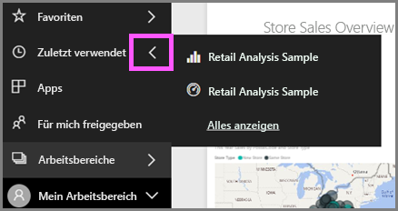

    Wählen Sie im Flyout Inhalt aus, um ihn zu öffnen.

2. Mitunter möchten Sie keine aktuellen Inhalte öffnen, sondern Informationen anzeigen oder andere Aktionen ausführen, wie z.B. Insights ausführen bzw. Daten freigeben oder nach Excel exportieren. In solchen Fällen öffnen Sie den Bereich **Zuletzt verwendet**, indem Sie auf **Zuletzt verwendet** oder das zugehörige Symbol im linken Navigationsbereich klicken. Wenn Sie mehrere Arbeitsbereiche haben, enthält diese Liste Inhalte aus allen Ihren Arbeitsbereichen.

   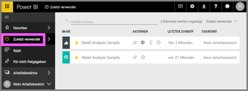

Weitere Informationen finden Sie unter [Zuletzt verwendete Inhalte in Power BI](service-recent.md).

### Suchen und Sortieren von Inhalten
Die Inhaltsansicht erleichtert das Suchen, Filtern und Sortieren Ihrer Inhalte. Um ein Dashboard, einen Bericht oder eine Arbeitsmappe zu suchen, verwenden Sie den Suchbereich. Durch die Filterung in Power BI werden dann nur die Inhalte angezeigt, die den Suchbegriff als Teil ihres Namens enthalten.

Da Sie nur ein Beispiel haben, ist kein Suchen und Sortieren notwendig.  Aber bei langen Listen von Dashboards, Berichten, Arbeitsmappen und Datasets ist die Such- und Sortierfunktion überaus hilfreich.

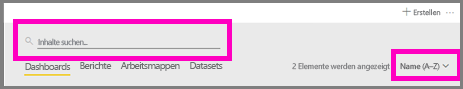

Sie können die Inhalte auch nach Name oder Besitzer sortieren.  

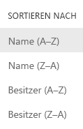

Weitere Informationen finden Sie unter [Suchen und Sortieren von Inhalten in Power BI](service-navigation-search-filter-sort.md).

## Bereinigen von Ressourcen
Nachdem Sie diese Schnellstartanleitung abgeschlossen haben, können Sie das Dashboard, den Bericht und das Dataset zum Beispiel für die Einzelhandelsanalyse löschen, wenn Sie möchten.

1. Öffnen Sie den Power BI-Dienst (app.powerbi.com), und melden Sie sich an.    
2. Wählen Sie im linken Navigationsbereich die Optionen **Arbeitsbereiche > Mein Arbeitsbereich** aus.  
    Sehen Sie den gelben Stern, der anzeigt, dass es sich um einen Favoriten handelt?    
3. Klicken Sie auf der Registerkarte **Dashboards** neben dem Retail Analysis-Dashboard auf das Mülleimersymbol zum **Löschen**.    

    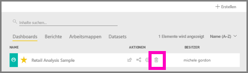

4. Wählen Sie die Registerkarte **Berichte**aus, und führen Sie die gleichen Schritte für den Retail Analysis-Bericht durch.
1. Wählen Sie die Registerkarte **Datasets**aus, und führen Sie die gleichen Schritte für das Dataset für die Einzelhandelsanalyse durch.

## Nächste Schritte

> [!div class="nextstepaction"]
> [Lese- und Bearbeitungsansicht im Power BI-Dienst](./service-reading-view-and-editing-view.md)