# Die neue Navigation im Power BI-Dienst
## Der linke Navigationsbereich

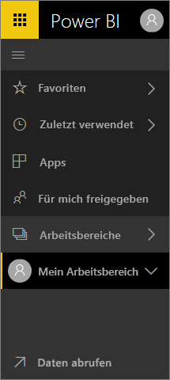

**Kurzübersicht**

| Aktion | Neuer (aktueller) Pfad |
| --- | --- | --- |
| Speichern eines Dashboards oder Berichts als Favorit |Klicken Sie auf „Arbeitsbereich > Dashboards“ oder „Arbeitsbereich > Berichte“ und dann auf das Sternsymbol, sodass sich seine Farbe in Gelb ändert. |
| Speichern einer App als Favorit | Klicken Sie im linken Navigationsbereich auf **Apps**, und klicken Sie auf den Stern neben dem App-Namen.
| Anzeigen einer Liste Ihrer Favoriten |Wählen Sie im linken Navigationsbereich **Favoriten** aus. |
| Anzeigen einer Liste kürzlich aufgerufener Dashboards und Berichte |Wählen Sie im linken Navigationsbereich **Zuletzt verwendet** aus. |
| Anzeigen einer Liste der Dashboards, die für Sie freigegeben wurden |Wählen Sie im linken Navigationsbereich **Für mich freigegeben** aus. |
| Freigeben eines Dashboards |Öffnen Sie ein Dashboard, und wählen Sie **Freigeben** aus, oder erstellen und veröffentlichen Sie eine App. |
| Löschen eines Dashboards |Wählen Sie „Mein Arbeitsbereich“ > „Dashboards“ und dann das Papierkorbsymbol aus. |
| Löschen eines Berichts |Wählen Sie „Mein Arbeitsbereich“ > „Berichte“ und dann das Papierkorbsymbol aus. |
| Löschen eines Datasets |Wählen Sie „Mein Arbeitsbereich“ > „Datasets“ > „...“ > „Löschen“ aus. |
| Öffnen eines Dashboards |Wählen Sie „Arbeitsbereich“ > „Dashboards“ und dann den Namen des Dashboards aus. |
| Öffnen Sie einen Bericht. |Wählen Sie „Arbeitsbereich“ > „Berichte“ und dann den Namen des Berichts aus. |
| Öffnen eines Datasets |Wählen Sie „Arbeitsbereich“ > „Datasets“ und dann den Namen des Datasets aus. |
| Erstellen eines Dashboards |Wählen Sie in der oberen Navigationsleiste „Erstellen“ > „Dashboard“ aus. |
| Erstellen eines Berichts |Wählen Sie in der oberen Navigationsleiste „Erstellen“ > „Bericht“ aus. |
| Erstellen eines Datasets |Wählen Sie in der oberen Navigationsleiste „Erstellen“ > „Dataset“ aus. |
| Erstellen einer App |Wählen Sie „Arbeitsbereiche“ > „App-Arbeitsbereich erstellen“ aus. |
| Anzeigen einer Liste aller Dashboards, Berichte und Datasets, deren Besitzer Sie sind |Wählen Sie „Arbeitsbereiche“ > „Mein Arbeitsbereich“ aus. |

## Allgemeine Aufgaben

Amanda zeigt Ihnen eine Übersicht über die Navigation des Power BI-Diensts.  Befolgen Sie dann die detaillierten Anweisungen unter dem Video, um es selbst ausprobieren.

<iframe width="560" height="315" src="https://www.youtube.com/embed/G26dr2PsEpk" frameborder="0" allowfullscreen></iframe>

## Anzeigen von Inhalten (Dashboards, Berichte, Arbeitsmappen, Datasets, Arbeitsbereiche, Apps)
Betrachten wir zunächst, wie die grundlegenden Inhalte (Dashboards, Berichte, Datasets, Arbeitsmappen) organisiert sind. Bisher wurden alle Inhalte im linken Navigationsbereich aufgelistet. Jetzt haben Sie immer noch diese Möglichkeit, jedoch werden Inhalte standardmäßig nach Inhaltstyp im Kontext eines Arbeitsbereichs angezeigt. Wählen Sie im linken Navigationsbereich einen Arbeitsbereich aus. Die Registerkarten für die entsprechenden Inhalte (Dashboards, Berichte, Arbeitsmappen und Datasets) werden dann rechts im Power BI-Zeichenbereich aufgerufen.

In Power BI Free wird nur ein Arbeitsbereich (**Mein Arbeitsbereich**) angezeigt.

### Bevorzugte Dashboards, Berichte und Apps
**Favoriten** ermöglichen Ihnen den schnellen Zugriff auf die Inhalte, die für Sie am wichtigsten sind.  

1. Wenn Sie ein Dashboard oder einen Bericht geöffnet haben, klicken Sie in der oberen rechten Ecke auf **Favorit**.
   
   
   
   Aus **Favorit** wird nun **Aus Favoriten entfernen**, und das Sternsymbol wird in Gelb angezeigt.
   
   

2. Klicken Sie für eine App im linken Navigationsbereich auf **Apps**, zeigen Sie auf die App, und klicken Sie dann auf den Stern, um diese als Favorit zu markieren.

2. Klicken Sie im linken Navigationsbereich auf den Pfeil rechts neben **Favoriten**, um die Liste aller Inhalte anzuzeigen, die Sie als Favoriten markiert haben. Da der linke Navigationsbereich ein permanentes Feature des Power BI-Diensts ist, haben Sie überall im Power BI-Dienst Zugriff auf diese Liste.
   
    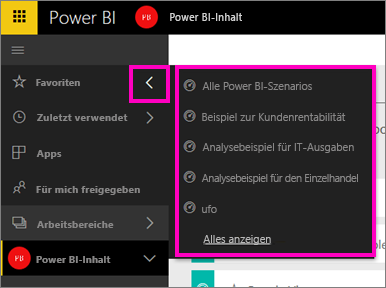
   
    Hier können Sie ein Dashboard, einen Bericht oder eine App auswählen und öffnen.

3. Um den Bereich **Favoriten** zu öffnen, wählen Sie im linken Navigationsbereich **Favoriten** aus, oder wählen Sie das Symbol „Favoriten“ .
   
   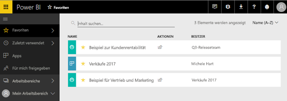
   
   Von hier aus können Sie diese öffnen, Inhalte finden und diese als Favorit löschen oder für Kollegen freigeben.

1. Sie können ein Dashboard oder einen Bericht auch über die Registerkarte **Dashboards** oder **Berichte** des Arbeitsbereichs als Favorit speichern.  Öffnen Sie den Arbeitsbereich, um die Inhaltsansicht anzuzeigen, und klicken Sie auf das Sternsymbol links neben dem Namen.
   
   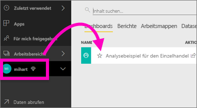

Weitere Informationen finden Sie unter [Favoriten](service-dashboard-favorite.md).

### Zuletzt verwendet
Über den Bereich **Zuletzt verwendet** gelangen Sie schnell zu den Inhalten, auf die Sie kürzlich zugegriffen haben. Dies gilt für Inhalte aus allen Ihren Arbeitsbereichen.

  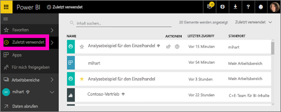

Ähnlich wie bei den Favoriten können Sie überall im Power BI-Dienst auf die zuletzt verwendeten Berichte und Dashboards zugreifen, indem Sie im linken Navigationsbereich auf den Pfeil neben **Zuletzt verwendet** klicken.

  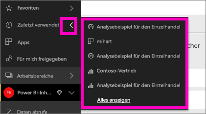

Weitere Informationen finden Sie unter [Zuletzt verwendete Inhalte in Power BI](service-recent.md).

### Apps
In einer App sind Dashboards und Berichte kombiniert, die erstellt wurden, um Schlüsselmetriken bereitzustellen. Sie können über interne Apps der Organisation und auch über [Apps für externe Dienste](service-connect-to-services.md), z.B. Google Analytics und Microsoft Dynamics CRM, verfügen. 

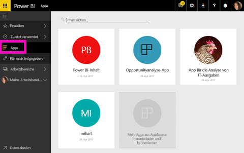

Weitere Informationen finden Sie unter **App-Arbeitsbereiche** (siehe unten) und [Was sind Power BI-Apps?](service-install-use-apps.md).

### Für mich freigegeben
Unter **Für mich freigegeben** finden Sie alle Inhalte, die Kollegen für Sie freigegeben haben.  Sie können nach Dashboardbesitzer filtern, das Suchfeld für die Suche relevanter Informationen verwenden und die Elemente nach Datum sortieren.  Und freigegebene Inhalte, die Sie häufig besuchen, können Sie besonders einfach direkt in der Ansicht **Für mich freigegeben** den Favoriten hinzufügen.

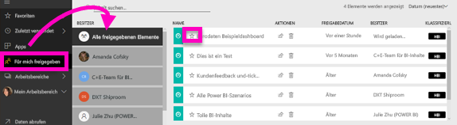

Weitere Informationen finden Sie unter [Anzeigen der Power BI-Dashboards, die für mich freigegeben wurden](service-shared-with-me.md).

### Arbeiten mit Arbeitsbereichen
Das nächste Element im linken Navigationsbereich lautet *Arbeitsbereiche*. Sie können sich Arbeitsbereiche als *Container* für Power BI-Inhalte vorstellen. Es gibt zwei Typen von Arbeitsbereichen: **Mein Arbeitsbereich** und App-Arbeitsbereiche.

Wenn Sie weder Mitglied eines App-Arbeitsbereichs noch Administrator sind, werden im linken Navigationsbereich möglicherweise keine App-Arbeitsbereiche angezeigt. Und wenn Sie ein Power BI Free-Kunde sind, werden keine App-Arbeitsbereiche angezeigt.

#### Mein Arbeitsbereich
In **Mein Arbeitsbereich** werden alle Inhalte gespeichert, deren Besitzer Sie sind. Betrachten Sie ihn als persönlichen Sandkasten oder Arbeitsbereich für eigene Inhalte. Sie können Inhalte von „Mein Arbeitsbereich“ für Kollegen freigeben. In „Mein Arbeitsbereich“ sind die Inhalte auf 4 Registerkarten organisiert: „Dashboards“, „Berichte“, „Arbeitsmappen“ und „Datasets“.

#### App-Arbeitsbereiche
Apps und App-Arbeitsbereiche sind ein Feature von Power BI Pro. Wenn Sie Dashboards und Berichte für andere Benutzer erstellen, verwenden Sie hierzu App-Arbeitsbereiche. Apps werden in einem App-Arbeitsbereich erstellt. Deshalb müssen Sie zum Erstellen einer App zunächst den App-Arbeitsbereich erstellen. Sie sind die Weiterentwicklung von Gruppenarbeitsbereichen – Stagingbereiche und Container für die Inhalte der App.  Sie und Ihre Kollegen können beim Erstellen von Dashboards, Berichten und anderen Inhalten, die Sie an eine größere Zielgruppe oder sogar die gesamte Organisation verteilen möchten, zusammenarbeiten.

Weitere Informationen finden Sie unter [Erstellen und Verteilen einer App in Power BI](service-create-distribute-apps.md#app-workspaces).

Wie in **Mein Arbeitsbereich** sind die Inhalte auf 4 Registerkarten organisiert: „Dashboards“, „Berichte“, „Arbeitsmappen“ und „Datasets“.

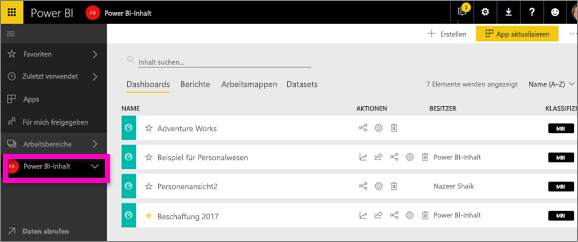

Klicken Sie im linken Navigationsbereich auf **Arbeitsbereiche**, um zwischen Arbeitsbereichen zu wechseln.

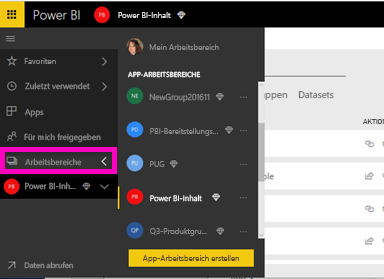

### Suchen und Sortieren von Inhalten
Die Inhaltsansicht erleichtert das Suchen, Filtern und Sortieren Ihrer Inhalte. Um ein Dashboard, einen Bericht oder eine Arbeitsmappe zu suchen, verwenden Sie den Suchbereich. Durch die Filterung in Power BI werden dann nur die Inhalte angezeigt, die den Suchbegriff als Teil ihres Namens enthalten.

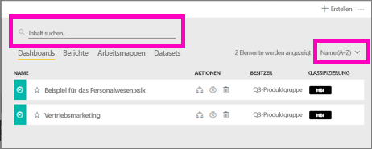

Sie können die Inhalte auch nach Name oder Besitzer sortieren.  

Weitere Informationen finden Sie unter [Suchen und Sortieren von Inhalten in Power BI](service-navigation-search-filter-sort.md).

## Nächste Schritte
Power BI-Dienst – [Grundkonzepte](service-basic-concepts.md)    

Haben Sie Fragen oder Feedback? [Besuchen Sie das Power BI-Communityforum](http://community.powerbi.com/t5/Navigation-Preview-Forum/bd-p/NavigationPreview)

