# Tutorial: Aufrufen eines Machine Learning Studio-Modells in Power BI (Vorschau)

In diesem Tutorial zeigen wir Ihnen die Integration von Erkenntnissen aus einem **Azure Machine Learning Studio**-Modell in Power BI. Dieses Tutorial enthält Anleitungen dazu, wie einem Power BI-Benutzer Zugriff auf ein Azure ML-Modell gewährt wird, wie ein Datenfluss erstellt und Erkenntnisse aus dem Azure ML-Modell auf Ihren Dataflow angewendet werden. Außerdem verweist er auf das Schnellstarthandbuch zum Erstellen eines Azure ML-Modells, sofern Sie noch nicht über ein Modell verfügen.

Das Tutorial führt Sie durch die folgenden Schritte:

> [!div class="checklist"]
> * Erstellen und Veröffentlichen eines Azure Machine Learning-Modells
> * Gewähren des Zugriffs für einen Power BI-Benutzer zur Verwendung des Modells
> * Erstellen eines Dataflows
> * Anwenden von Erkenntnissen aus dem Azure ML-Modell auf den Dataflow

## Erstellen und Veröffentlichen eines Azure ML-Modells

Befolgen Sie die Anweisungen unter [Tutorial 1: Vorhersagen des Kreditrisikos: Azure Machine Learning Studio](https://docs.microsoft.com/azure/machine-learning/studio/walkthrough-1-create-ml-workspace), um einen **Machine Learning**-Arbeitsbereich zu erstellen.

Sie können diese Schritte auf alle Azure ML-Modelle oder Datasets anwenden, über die Sie bereits verfügen. Wenn Sie nicht über ein veröffentlichtes Modell verfügen, können Sie mithilfe von [Schnellstart: Erstellen Ihres ersten Data Science-Experiments in Azure Machine Learning Studio](https://docs.microsoft.com/azure/machine-learning/studio/create-experiment), womit ein Azure ML-Modell für die PKW-Preisprognose eingerichtet wird, in wenigen Minuten ein Modell erstellen.

Führen Sie die Schritte unter [Bereitstellen eines Azure Machine Learning Studio-Webdiensts](https://docs.microsoft.com/azure/machine-learning/studio/publish-a-machine-learning-web-service) aus, um das Azure ML-Modell als Webdienst zu veröffentlichen.

## Erteilen eines Power BI-Benutzerzugriffs

Um von Power BI aus auf ein Azure ML-Modell zugreifen zu können, benötigen Sie **Lesezugriff** auf das Azure-Abonnement und die Ressourcengruppe sowie **Lesezugriff** auf den Azure Machine Learning Studio-Webdienst für Machine Learning Studio-Modelle.  Für Azure Machine Learning Service-Modelle benötigen Sie den **Lesezugriff** auf den Machine Learning Service-Arbeitsbereich.

Die folgenden Schritte setzen voraus, dass Sie Koadministrator für das Azure-Abonnement und die Ressourcengruppe sind, für die das Modell veröffentlicht wurde.

Melden Sie sich beim [Azure-Portal](https://portal.azure.com) an, und navigieren Sie zur Seite **Abonnements**, die Sie über die Liste **Alle Dienste** im linken Navigationsmenü finden.

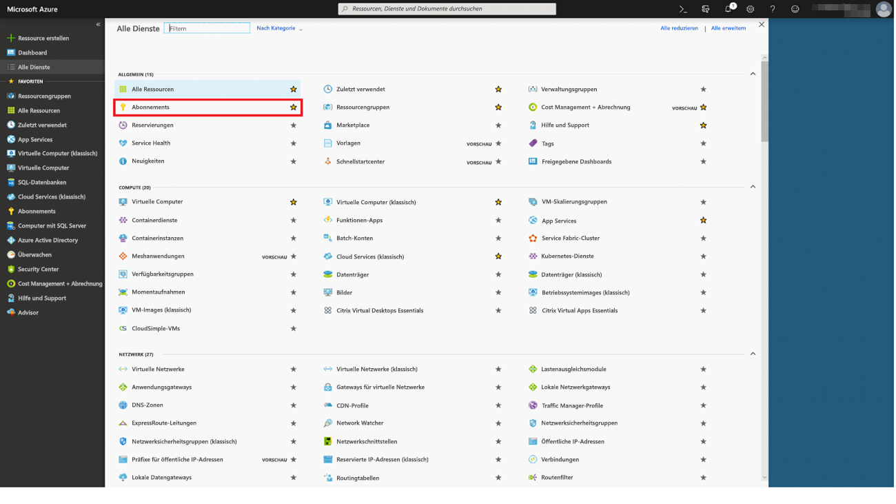

Wählen Sie das Azure-Abonnement aus, das Sie zum Veröffentlichen des Modells verwendet haben, und wählen Sie **Zugriffssteuerung (IAM)** aus. Wählen Sie als Nächstes **Rollenzuweisung hinzufügen** aus, und wählen Sie dann die **Leser**-Rolle und den Power BI-Benutzer aus. Wählen Sie **Speichern** aus, wenn Sie fertig sind. In der folgenden Abbildung ist diese Auswahl dargestellt.

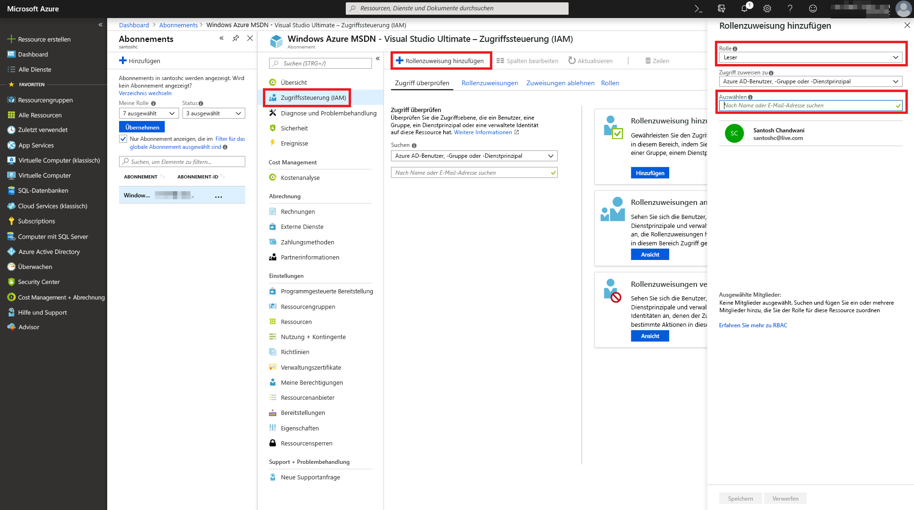

Wiederholen Sie dann die obigen Schritte, um der **Mitwirkender**-Rolle Zugriff auf den Power BI-Benutzer für den jeweiligen Machine Learning-Webdienst zu gewähren, für den das Azure ML-Modell bereitgestellt wurde.

## Erstellen eines Dataflows

### Abrufen von Daten zum Erstellen eines Dataflows

Melden Sie sich beim Power BI-Dienst mit den Anmeldeinformationen des Benutzers an, für den Sie im vorherigen Schritt Zugriff auf das Azure ML-Modell gewährt haben.

Dieser Schritt setzt voraus, dass Sie über die Daten, die Sie mit Ihrem Azure ML-Modell bewerten, im CSV-Format verfügen.  Wenn Sie das **Automobilpreisexperiment** zum Erstellen des Modells in Machine Learning Studio verwendet haben, wird das Dataset dafür in folgendem Link freigegeben:

* [Azure Machine Learning Studio-Beispielmodell](https://raw.githubusercontent.com/santoshc1/PowerBI‑AI‑samples/master/Tutorial\_MLStudio\_model\_integration/Automobile%20price%20data%20\_Raw\_.csv)

### Erstellen eines Dataflows

Um die Entitäten in Ihrem Dataflow zu erstellen, melden Sie sich beim Power BI-Dienst an, und navigieren Sie zu einem Arbeitsbereich Ihrer dedizierten Kapazität, in dem die KI-Vorschau aktiviert ist.

Wenn Sie noch keinen Arbeitsbereich haben, können Sie einen Arbeitsbereich erstellen, indem Sie **Arbeitsbereiche** im linken Menü und dann **App-Arbeitsbereich erstellen** im Bereich am unteren Rand auswählen.  Daraufhin wird ein Bereich zur Eingabe der Details des Arbeitsbereichs geöffnet. Geben Sie einen Namen für den Arbeitsbereich ein, und wählen Sie **Speichern** aus.

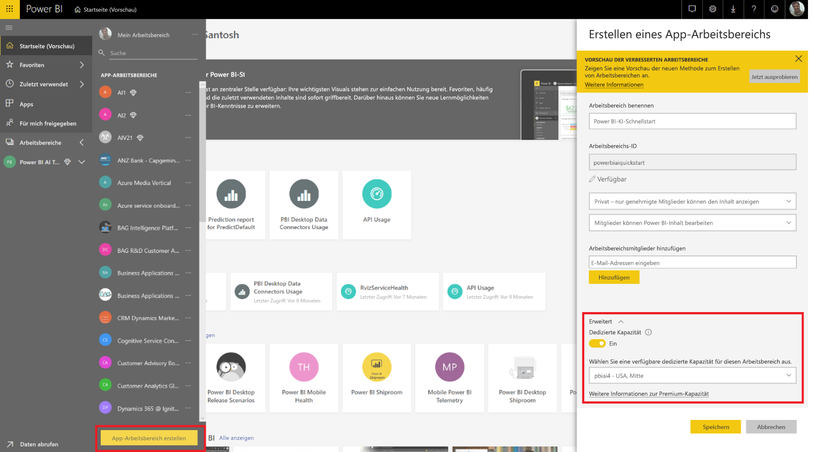

Nachdem der Arbeitsbereich erstellt wurde, können Sie **Überspringen** unten rechts im Begrüßungsbildschirm auswählen.

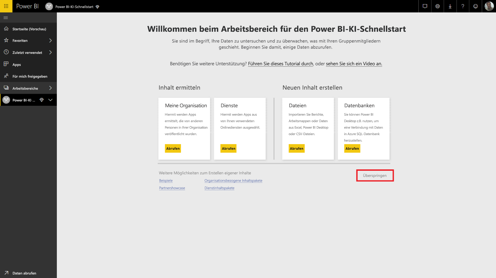

Wählen Sie die Registerkarte **Dataflows (Vorschau)** aus, und wählen Sie dann die Schaltfläche **Erstellen** oben rechts im Arbeitsbereich und dann die Schaltfläche **Dataflow** aus.

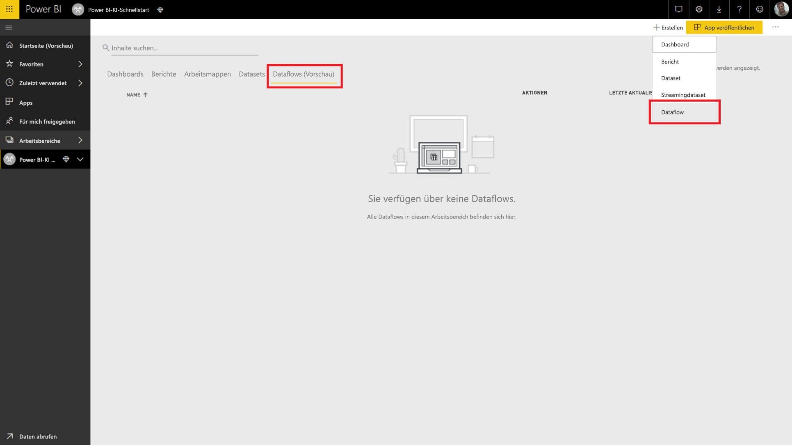

Wählen Sie **Neue Entitäten hinzufügen** aus, wodurch der **Power Query-Editor** im Browser gestartet wird.

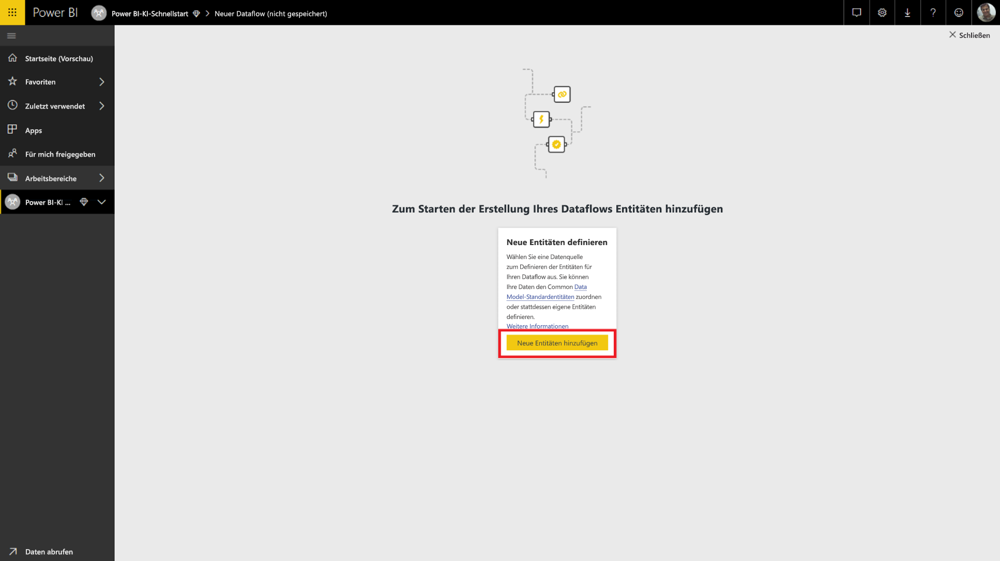

Wählen Sie **Text/CSV-Datei** als Datenquelle aus.

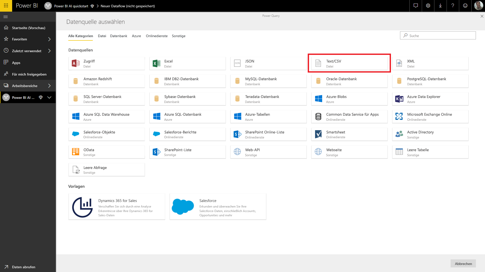

Im nächsten Bildschirm werden Sie aufgefordert, eine Verbindung mit einer Datenquelle herzustellen. Fügen Sie den Link zu den Daten ein, die Sie verwendet haben, um Ihr Azure ML-Modell zu erstellen. Wenn Sie die _Automobilpreis_-Daten verwendet haben, können Sie den folgenden Link in das Feld **Dateipfad oder URL** einfügen und dann auf **Weiter** klicken.

`https://raw.githubusercontent.com/santoshc1/PowerBI‑AI‑samples/master/Tutorial\_MLStudio\_model\_integration/Automobile%20price%20data%20\_Raw\_.csv`

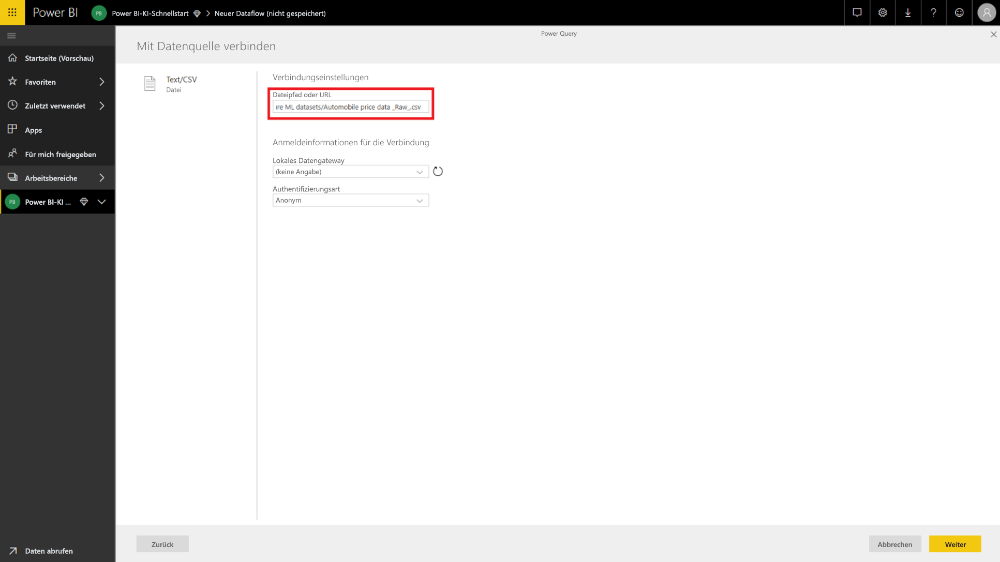

Der Power Query-Editor zeigt eine Vorschau der Daten aus der CSV-Datei an. Wählen Sie **Tabelle transformieren** im Menübefehlsband und dann **Erste Zeile als Überschriften verwenden** aus.  Dadurch wird der Abfrageschritt _Höher gestufte Header_ im Bereich **Angewendete Schritte** rechts hinzugefügt. Sie können die Abfrage im Bereich auf der rechten Seite auch mit einem aussagekräftigeren Namen umbenennen, z.B. _Automobile Pricing_.

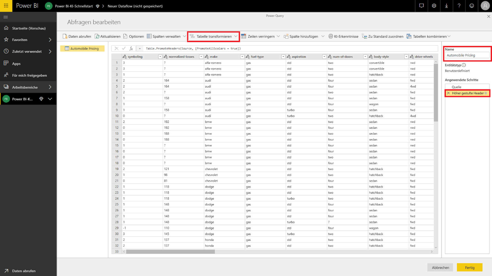

In unserem Quelldataset ist für unbekannte Werte „?“ festgelegt.  Um dies zu bereinigen, können wir „?“ der Einfachheit halber mit „0“ ersetzen, um später Fehler zu vermeiden.  Wählen Sie hierzu die Spalten *normalized-losses*, *bore*, *stroke*, *compression-ratio*, *horsepower*, *peak-rpm* und *price* aus, indem Sie auf ihren Namen in den Spaltenüberschriften klicken, dann auf „Spalten transformieren“ klicken und „Werte ersetzen“ auswählen.  Ersetzen Sie „?“ mit „0“.

Alle Spalten in der Tabelle aus einer Text/CSV-Quelle werden als Textspalten behandelt.  Als Nächstes müssen wir die numerischen Spalten in die korrekten Datentypen ändern.  In Power Query klicken Sie dazu auf das Datentypsymbol in der Spaltenüberschrift.  Ändern Sie die Spalten in die folgenden Typen:

- **Ganze Zahl**:  symboling, normalized-losses, curb-weight, engine-size, horsepower, peak-rpm, city-mpg, highway-mpg, price
- **Dezimalzahl**:  wheel-base, length, width, height, bore, stroke, compression-ratio

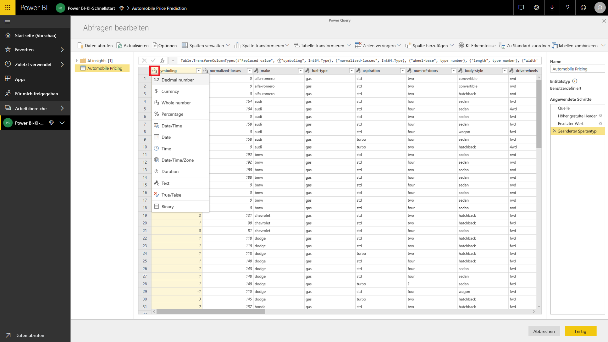

Wählen Sie **Fertig** aus, um den Power Query-Editor zu schließen. Dann sehen Sie die Entitätenliste mit den _Automobile Pricing_-Daten, die wir hinzugefügt haben. Wählen Sie **Speichern** in der oberen rechten Ecke aus, geben Sie einen Namen für den Dataflow an, und wählen Sie dann **Speichern** aus.

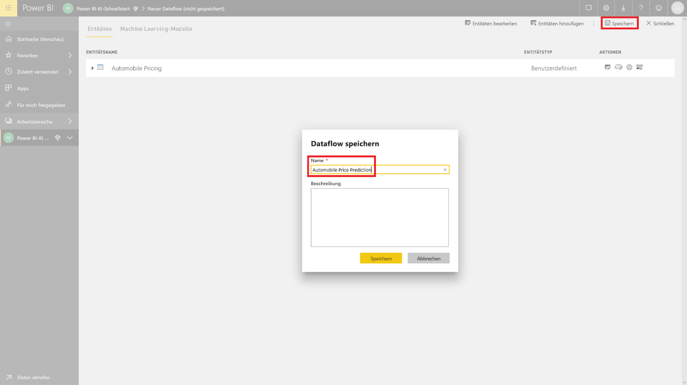

### Aktualisieren des Dataflows

Beim Speichern des Dataflows wird eine Benachrichtigung angezeigt, dass Ihr Dataflow gespeichert wurde. Wählen Sie **Jetzt aktualisieren** aus, um Daten aus der Quelle im Dataflow zu erfassen.

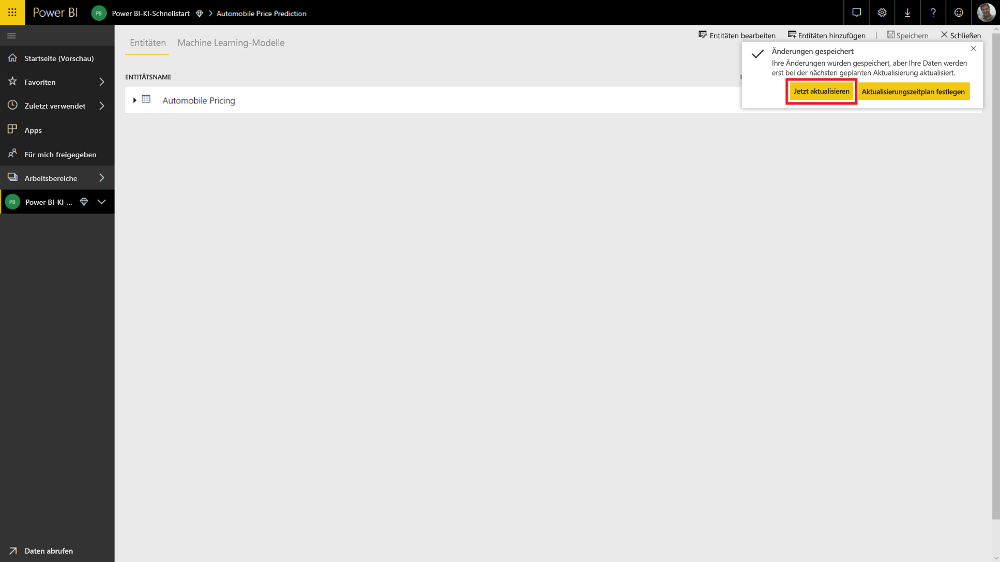

Wählen Sie **Schließen** in der oberen rechten Ecke aus, und warten Sie, bis die Aktualisierung des Dataflows abgeschlossen ist.

Sie können Ihren Dataflow auch mit den **Aktionen**-Befehlen aktualisieren. Der Dataflow zeigt den Zeitstempel an, wenn die Aktualisierung abgeschlossen ist.

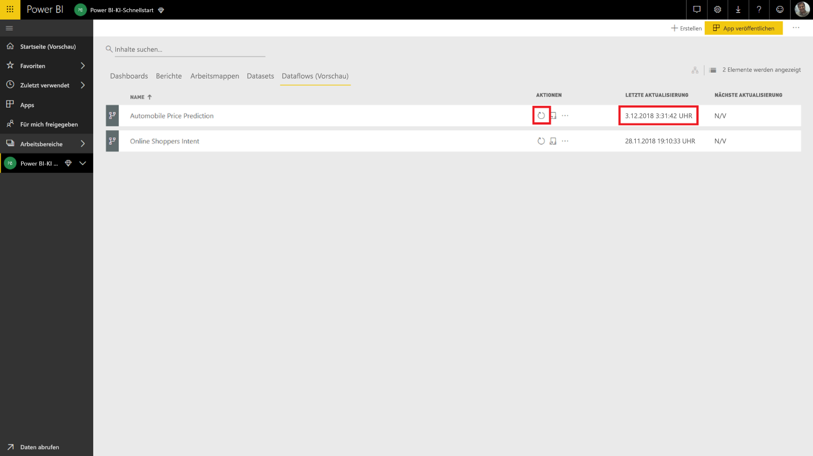

## Anwenden von Erkenntnissen aus dem Azure ML-Modell

Für den Zugriff auf das Azure ML-Modell _Automobile Price Prediction_ können Sie die _Automobile Pricing_-Entität bearbeiten, für die wir den vorhergesagten Preis hinzufügen möchten.

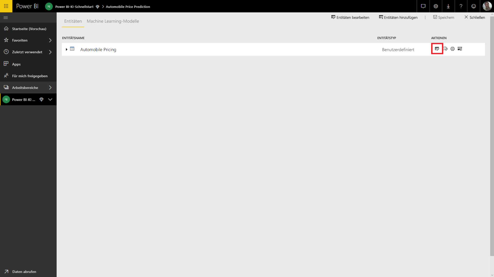

Durch Auswahl des **Bearbeiten**-Symbols wird der Power Query-Editor für die Entitäten in Ihrem Dataflow geöffnet.

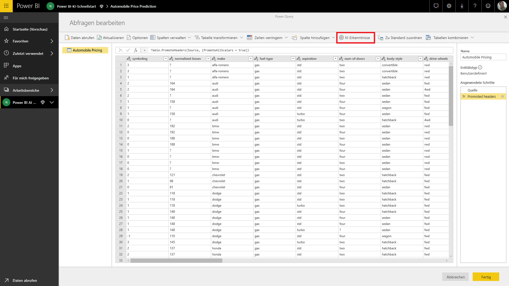

Wählen Sie die **KI-Erkenntnisse**-Schaltfläche im Menüband und dann im linken Navigationsmenü den _Azure Machine Learning Models_-Ordner aus.

Die Azure ML-Modelle, auf die Ihnen Zugriff gewährt wurde, werden als Power Query-Funktionen mit einem *AzureML*-Präfix aufgelistet.  Beim Klicken auf die Funktion, die dem _AutomobilePricePrediction_-Modell entspricht, werden die Parameter für den Webdienst des Modells als Funktionsparameter aufgelistet.

Um ein Azure ML-Modell aufzurufen, können Sie beliebige Spalten der ausgewählten Entität als Eingabe aus der Dropdownliste angeben. Sie können auch einen konstanten Wert angeben, der als Eingabe verwendet werden soll, indem Sie das Spaltensymbol auf der linken Seite des Eingabedialogfelds umschalten. Wenn ein Spaltenname mit einem der Funktionsparameternamen übereinstimmt, wird die Spalte automatisch als Eingabe vorgeschlagen.  Wenn der Spaltenname nicht übereinstimmt, können Sie ihn in der Dropdownliste auswählen.

Im Fall des _Automobile Pricing Prediction_-Modells lauten die Eingabeparameter:

- make
- body-style
- wheel-base
- engine-size
- horsepower
- peak-rpm
- highway-mpg

Da unsere Tabelle mit dem ursprünglichen Dataset übereinstimmt, das zum Trainieren des Modells verwendet wurde, sind für alle Parameter bereits die richtigen Spalten ausgewählt.

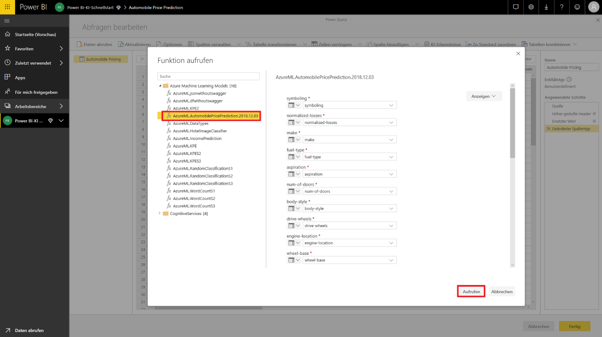

Wählen Sie **Aufrufen** auf, um die Vorschau der Ausgabe des Azure ML-Modells als neue Spalte in der Entitätentabelle anzuzeigen. Sie sehen den Modellaufruf auch als angewendeten Schritt für die Abfrage.

Die Ausgabe des Modells wird als Datensatz in der Ausgabespalte angezeigt. Sie können die Spalte erweitern, um einzelne Ausgabeparameter in separaten Spalten zu erzeugen. In unserem Fall interessieren wir uns nur für _Scored Labels_ (Bewertete Bezeichnungen), die den vorhergesagten Preis des Fahrzeugs enthält.  Also deaktivieren wir den Rest und wählen **OK** aus.

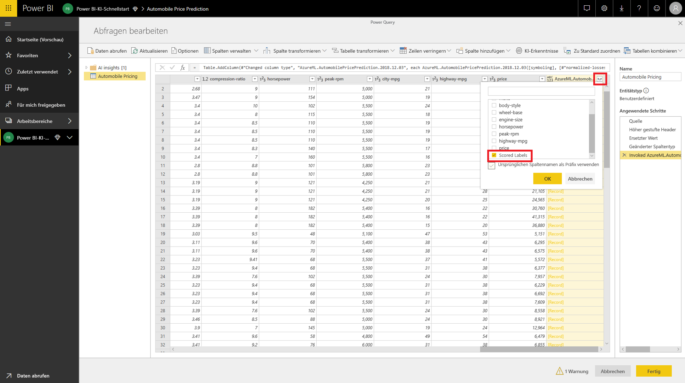

Die resultierende *Scored Labels*-Spalte enthält die Preisvorhersage aus dem Azure ML-Modell.

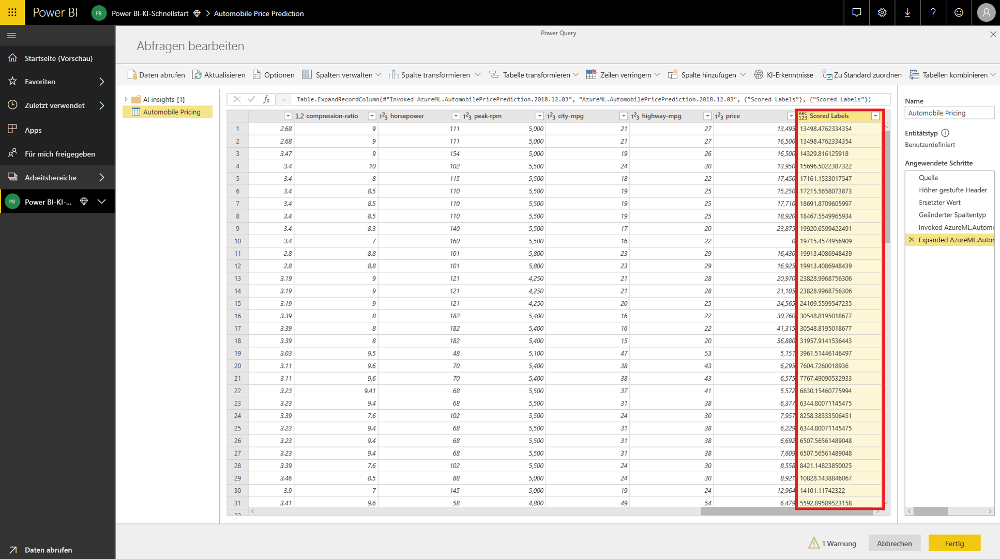

Nach dem Speichern Ihres Dataflows wird das Azure ML-Modell automatisch aufgerufen, wenn der Dataflow für neue oder aktualisierte Zeilen in der Entitätentabelle aktualisiert wird.

## Bereinigen von Ressourcen

Wenn Sie die Azure-Ressourcen, die Sie in diesem Artikel erstellt haben, nicht mehr benötigen, löschen Sie sie, um unnötige Kosten zu vermeiden.  Sie können auch die Dataflows löschen, die Sie erstellt haben, wenn Sie sie nicht mehr benötigen.

## Nächste Schritte

In diesem Tutorial haben Sie ein einfaches Experiment mit Azure Machine Learning Studio unter Verwendung eines einfachen Datasets mithilfe der folgenden Schritte erstellt:

- Erstellen und Veröffentlichen eines Azure Machine Learning-Modells
- Gewähren des Zugriffs für einen Power BI-Benutzer zur Verwendung des Modells
- Erstellen eines Dataflows
- Anwenden von Erkenntnissen aus dem Azure ML-Modell auf den Dataflow

Weitere Informationen zur Azure Machine Learning-Integration in Power BI finden Sie unter [Azure Machine Learning-Integration in Power BI (Vorschau)](service-machine-learning-integration.md).
