# <a name="tutorial-use-cognitive-services-in-power-bi"></a>Tutorial: Verwenden von Cognitive Services in Power BI

Power BI bietet Zugriff auf einen Satz von Funktionen von Azure Cognitive Services, um Ihre Daten in der Self-Service-Datenvorbereitung für Dataflows zu erweitern. Die derzeit unterstützten Dienste sind [Standpunktanalyse](https://docs.microsoft.com/azure/cognitive-services/text-analytics/how-tos/text-analytics-how-to-sentiment-analysis), [Schlüsselbegriffserkennung](https://docs.microsoft.com/azure/cognitive-services/text-analytics/how-tos/text-analytics-how-to-keyword-extraction), [Sprachenerkennung](https://docs.microsoft.com/azure/cognitive-services/text-analytics/how-tos/text-analytics-how-to-language-detection) und [Bildmarkierung](https://docs.microsoft.com/azure/cognitive-services/computer-vision/concept-tagging-images). Die Transformationen werden auf dem Power BI-Dienst ausgeführt und erfordern kein Azure Cognitive Services-Abonnement. Dieses Feature erfordert Power BI Premium.

Cognitive Services-Transformationen werden in der [Self-Service-Datenvorbereitung für Datenflüsse](https://powerbi.microsoft.com/blog/introducing-power-bi-data-prep-wtih-dataflows/) unterstützt. Verwenden Sie zum Einstieg die Schrittbeispiele für Textanalyse und Bildmarkierung unten.

In diesem Tutorial erhalten Sie Informationen zu den folgenden Vorgängen:

> [!div class="checklist"]
> * Importieren von Daten in einen Dataflow
> * Bewerten des Standpunkts und Schlüsselbegriffserkennung einer Textspalte in einem Dataflow
> * Herstellen einer Verbindung mit den Ergebnissen über Power BI Desktop


## <a name="prerequisites"></a>Voraussetzungen

Um dieses Tutorial abzuschließen, benötigen Sie Folgendes: 

- Ein Power BI-Konto. Wenn Sie noch nicht bei Power BI registriert sind, müssen Sie sich zuerst für eine [kostenlose Testversion registrieren](https://app.powerbi.com/signupredirect?pbi_source=web).
- Zugriff auf eine Power BI Premium-Kapazität, wobei die KI-Workload aktiviert ist. Diese Workload wird standardmäßig während der Vorschau deaktiviert. Wenn in einer Premium-Kapazität KI-Erkenntnisse nicht angezeigt werden, wenden Sie sich an Ihren Premium-Kapazitätsadministrator, um die KI-Workload im Verwaltungsportal zu aktivieren.

## <a name="text-analytics"></a>Textanalyse

Führen Sie die Schritte in diesem Abschnitt aus, um den Textanalyseteil des Tutorials auszuführen.

### <a name="step-1-apply-sentiment-scoring-in-power-bi-service"></a>Schritt 1: Anwenden der Standpunktbewertung im Power BI-Dienst

Navigieren Sie zum Einstieg zu einem Power BI-Arbeitsbereich mit Premium-Kapazität, und erstellen Sie einen neuen Dataflow mit der **Erstellen**-Schaltfläche oben rechts im Bildschirm.

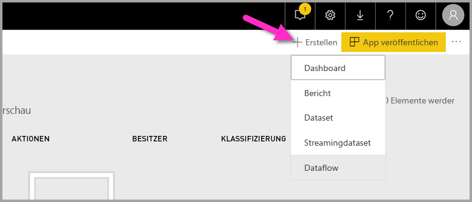

Das Dataflowdialogfeld zeigt die Optionen zum Erstellen eines neuen Dataflows an; wählen Sie **Neue Entitäten hinzufügen** aus. Wählen Sie als Nächstes **Text/CSV** im Datenquellenmenü aus.

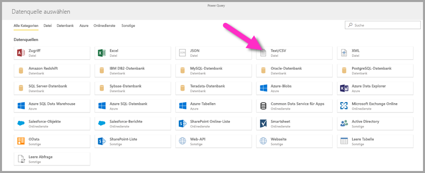

Fügen Sie diese URL in das URL-Feld ein: [https://pbiaitutorials.blob.core.windows.net/textanalytics/FabrikamComments.csv](https://pbiaitutorials.blob.core.windows.net/textanalytics/FabrikamComments.csv), und klicken Sie auf **Weiter**.

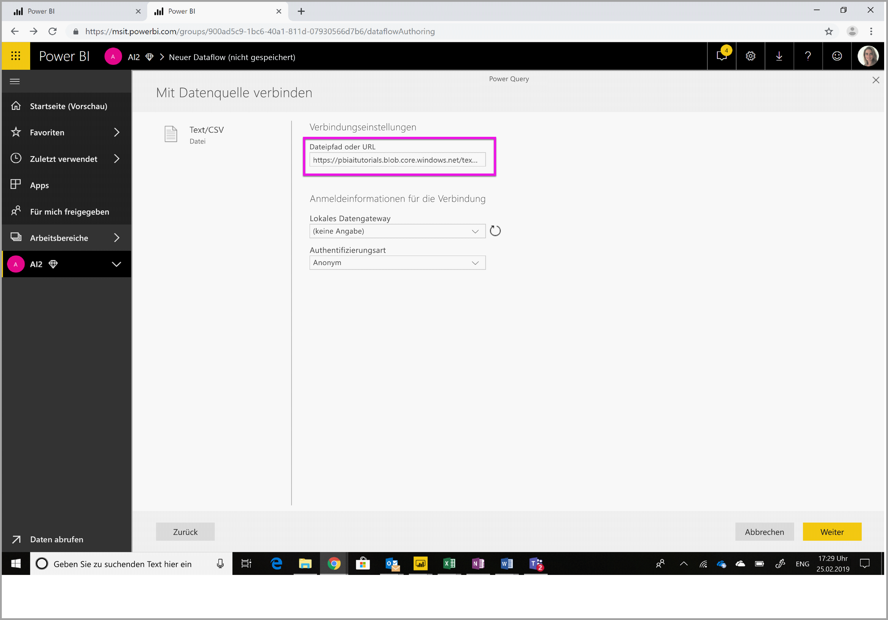

Wählen Sie im oberen Menüband **Tabelle transformieren** aus, und wählen Sie dann **Erste Zeile als Überschriften verwenden** aus. Die Daten können jetzt zur Textanalyse verwendet werden, und wir können Standpunktbewertung und Schlüsselbegriffserkennung auf die „Customer comments“-Spalte anwenden.

Wählen Sie im Power Query-Editor **KI-Erkenntnisse** aus.

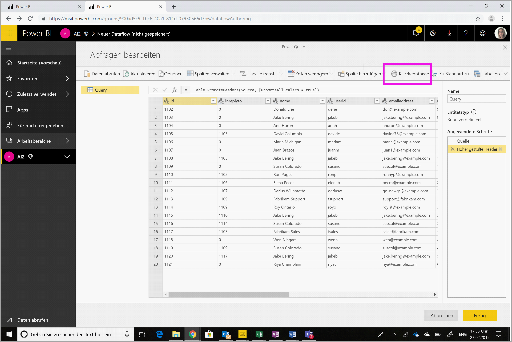

Erweitern Sie den **Cognitive Services**-Ordner, und wählen Sie die Funktion aus, die Sie verwenden möchten. Dieses Beispiel ist die Bewertung des Standpunkts der Kommentarspalte, aber Sie können mit den gleichen Schritten Sprachen- und Schlüsselbegriffserkennung ausprobieren.

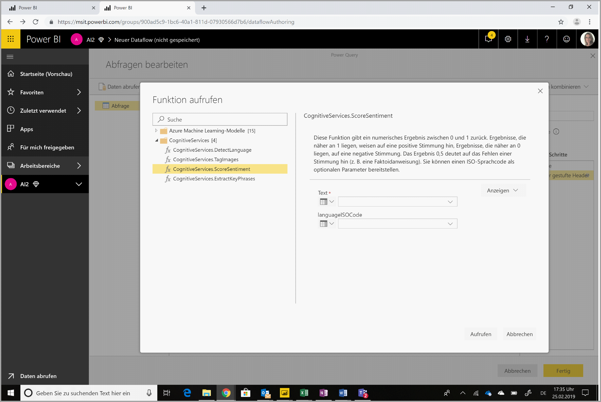

Nach Auswahl einer Funktion werden die erforderlichen und optionalen Felder angezeigt. Um den Standpunkt der Beispielüberprüfungen zu bewerten, wählen Sie die Überprüfungenspalte als Texteingabe aus. Kulturinformationen sind eine optionale Eingabe, und erfordern ein ISO-Format. Geben Sie beispielsweise „en“ ein, wenn der Text als „englisch“ behandelt werden soll. Wenn das Feld leer gelassen wird, erkennt Power BI vor der Bewertung des Standpunkts die Sprache des Eingabewerts.

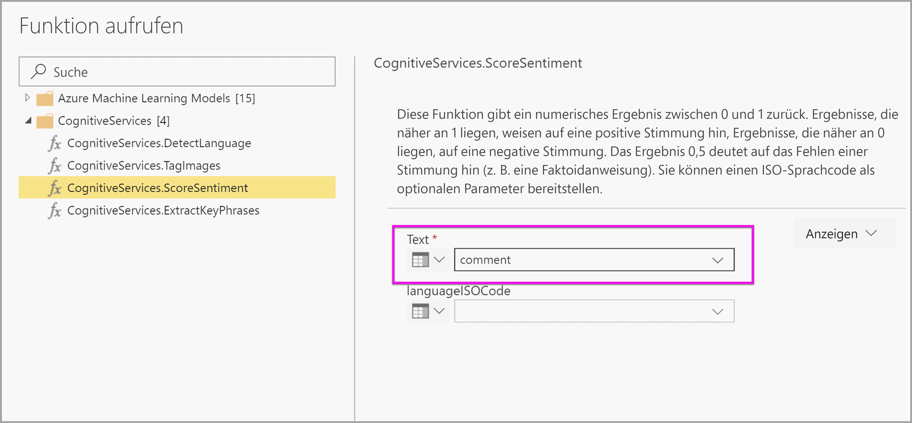

Wählen Sie jetzt **Aufrufen** zum Ausführen der Funktion aus. Eine neue Spalte mit der Standpunktbewertung für jede Zeile wird der Tabelle hinzugefügt. Sie können zurückgehen zu **KI-Erkenntnisse** , um auf die gleiche Weise im Überprüfungstext Schlüsselbegriffe zu erkennen.

Sobald Sie die Transformationen abgeschlossen haben, ändern Sie den Namen der Abfrage in „Customer comments“, und wählen Sie **Fertig** aus.

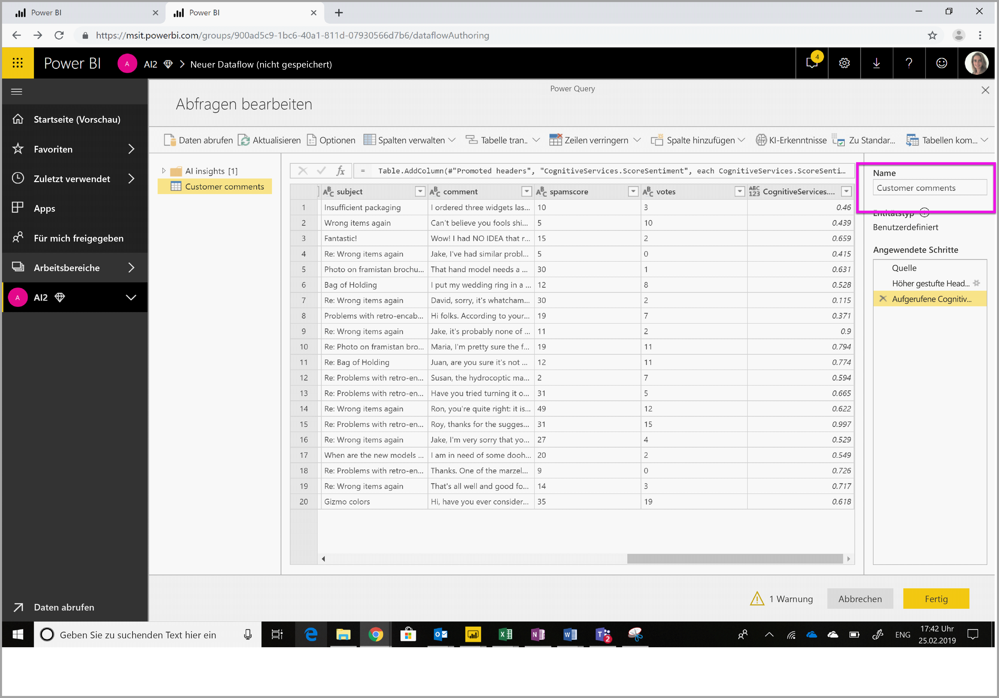

**Speichern** Sie als Nächstes den Dataflow, und nennen Sie ihn „Fabrikam“. Wählen Sie die Schaltfläche **Jetzt aktualisieren** aus, die nach dem Speichern des Dataflows angezeigt wird.

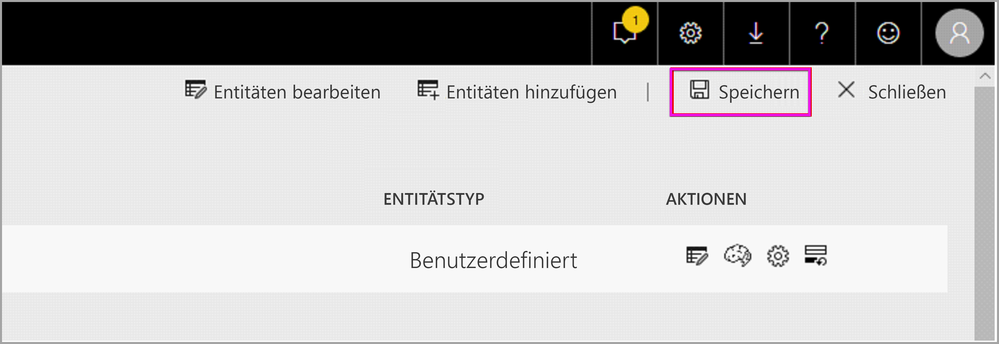

Sobald der Dataflow gespeichert und aktualisiert ist, können Sie ihn in einem Power BI-Bericht verwenden.

### <a name="step-2-connect-from-power-bi-desktop"></a>Schritt 2: Herstellen einer Verbindung von Power BI Desktop aus

Öffnen Sie Power BI Desktop. Wählen Sie im Menüband „Start“ den Befehl **Daten abrufen** aus.

Navigieren Sie zu **Power BI-Datenflows (Beta)** im Power BI-Abschnitt, und wählen Sie **Verbinden** aus.


Da es sich um eine Previewfunktion handelt, fordert der Connector Sie auf, die Vorschaubedingungen zu akzeptieren. Melden Sie sich nach dem Akzeptieren mit Ihrem Organisationskonto an.

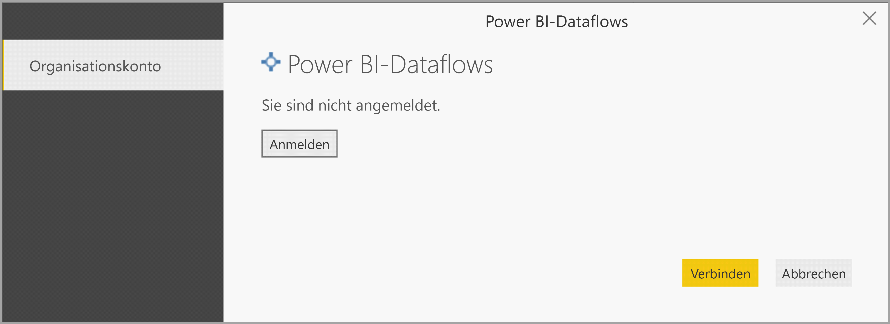

Wählen Sie den Dataflow aus, den Sie gerade erstellt haben. Navigieren Sie zur Tabelle „Customer comments“, und klicken Sie auf **Laden**.

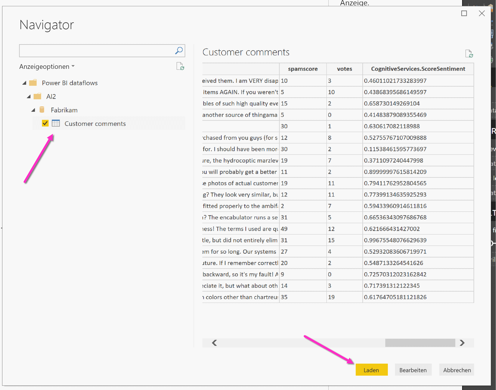

Nachdem die Daten geladen sind, können Sie beginnen, einen Bericht zu erstellen.

## <a name="image-tagging"></a>Bildmarkierung

Navigieren Sie zu einem Power BI-Arbeitsbereich mit Premium-Kapazität. Erstellen Sie einen neuen Dataflow mit der **Erstellen**-Schaltfläche oben rechts im Bildschirm.

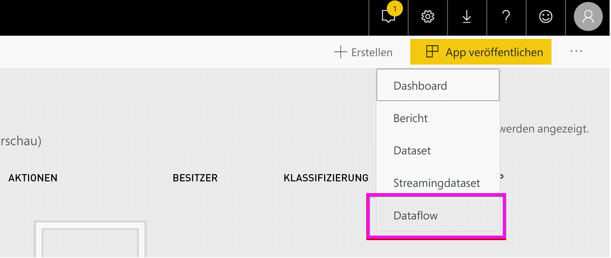

Wählen Sie **Neue Entitäten hinzufügen** aus.

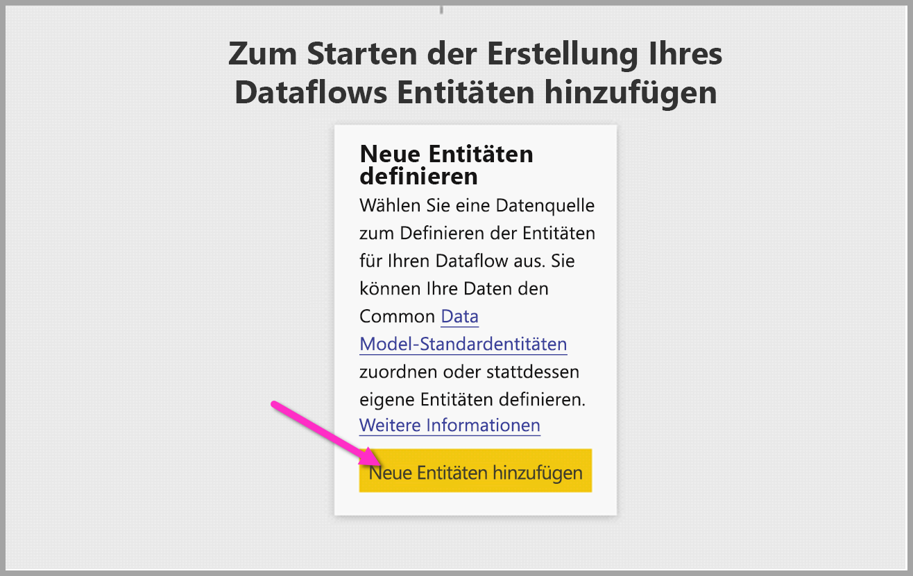

Sobald Sie aufgefordert werden, eine Datenquelle auszuwählen, wählen Sie **Leere Abfrage** aus.

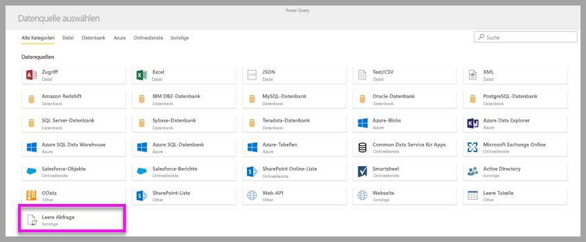

Kopieren Sie die Abfrage unten in den Abfrage-Editor, und klicken Sie auf „Weiter“. Sie können die URL-Pfade unten mit anderen Bildern ersetzen oder weitere Zeilen hinzufügen. Die *Web.Contents*-Funktion importiert die Bild-URL als Binärdatei. Wenn Sie eine Datenquelle mit Bildern haben, die als Binärdaten gespeichert sind, können Sie diese auch direkt verwenden.


```python
let
  Source = Table.FromRows({
  { Web.Contents("https://images.pexels.com/photos/87452/flowers-background-butterflies-beautiful-87452.jpeg") },
  { Web.Contents("https://upload.wikimedia.org/wikipedia/commons/5/53/Colosseum_in_Rome%2C_Italy_-_April_2007.jpg") }}, { "Image" })
in
  Source
```

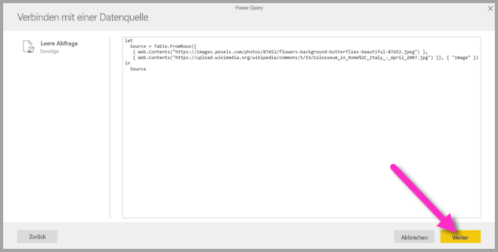

Wählen Sie bei der Aufforderung zur Eingabe von Anmeldeinformationen *anonym* aus.

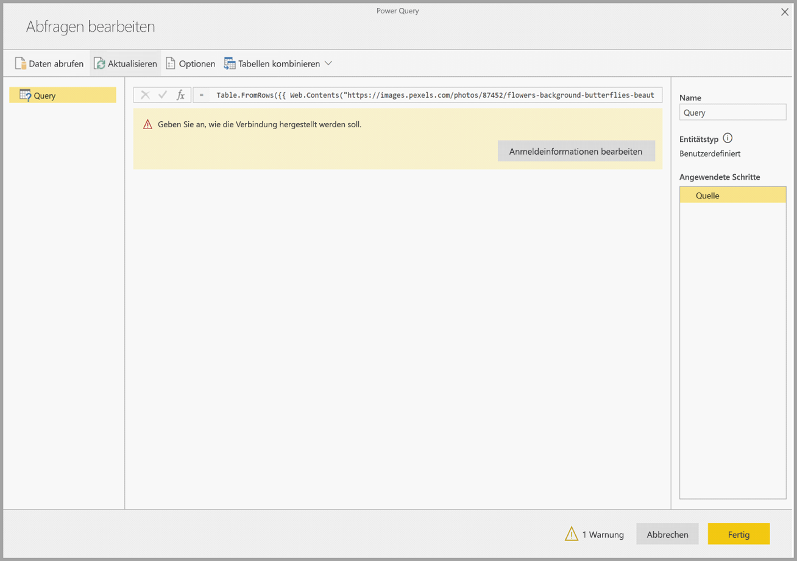

Sie sehen das folgende Bild.

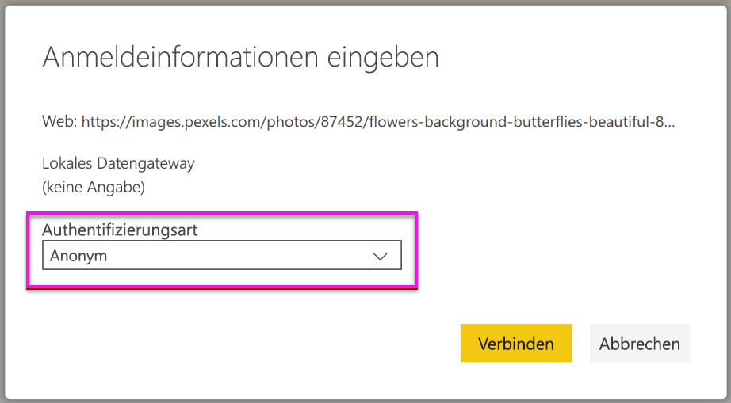

Sie werden zur Eingabe von Anmeldeinformationen für jede einzelne Webseite aufgefordert.

Wählen Sie **KI-Erkenntnisse**  im Abfrage-Editor aus.

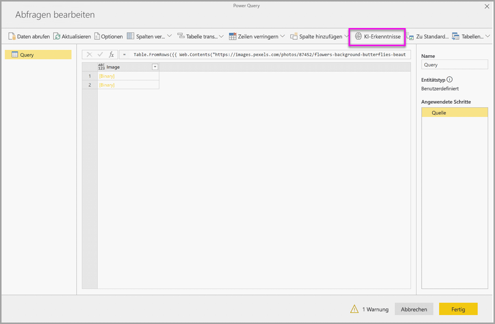

Melden Sie sich als Nächstes mit Ihrem **Organisationskonto** an.

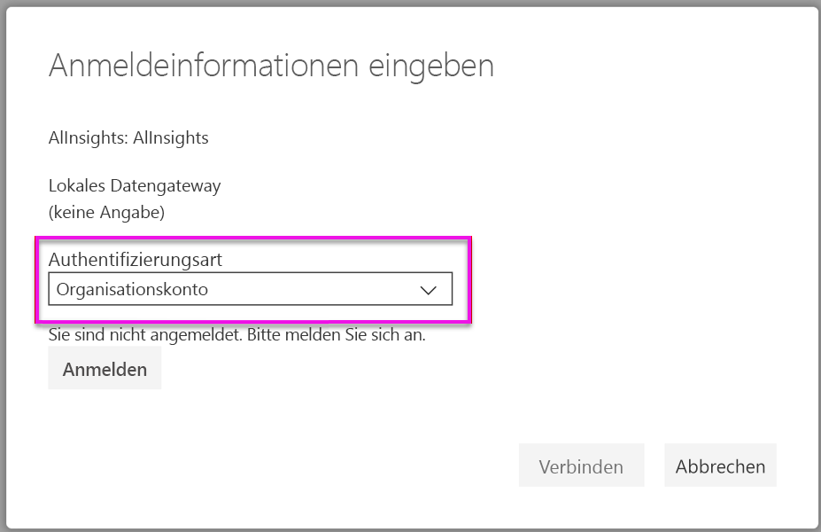

Wählen Sie die Funktion „Bilder markieren“ aus, und geben Sie _[Binär]_ in das Spaltenfeld und _en_ in das Kulturinformationenfeld ein. 

> [!NOTE]
> Sie können derzeit keine Spalte in einer Dropdownliste auswählen; dies wird sobald wie möglich während der privaten Vorschau gelöst.

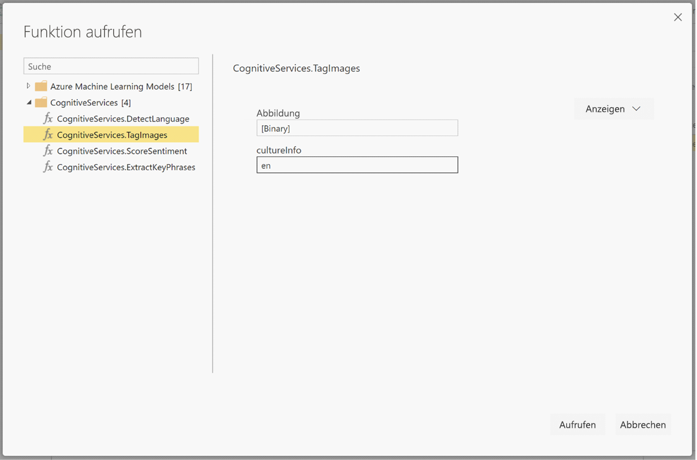

Entfernen Sie im Funktions-Editor die Anführungszeichen um den Namen der Spalte. 

> [!NOTE]
> Das Entfernen der Anführungszeichen ist eine vorübergehende Problemumgehung, die so bald wie möglich während der privaten Vorschau gelöst wird.


Die Funktion gibt einen Datensatz zurück, der sowohl die beiden Tags im durch Trennzeichen getrennten Format als auch einen JSON-Datensatz enthält. Wählen Sie die Erweiterungsschaltfläche aus, um das eine oder andere bzw. beides als Spalten der Tabelle hinzuzufügen.

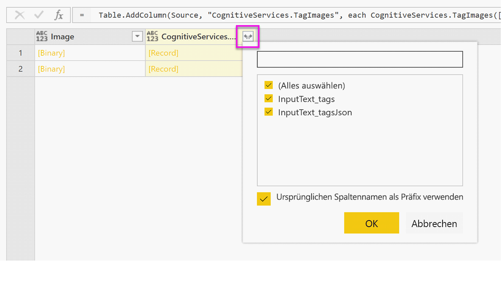

Wählen Sie **Fertig** aus, und speichern Sie den Dataflow. Nachdem Sie den Dataflow aktualisiert haben, können Sie über Power BI Desktop unter Verwendung der Dataflowsconnectors eine Verbindung damit herstellen. (Siehe Schritte auf der Seite 5 dieses Dokuments).

## <a name="clean-up-resources"></a>Bereinigen von Ressourcen

Wenn Sie die Abfrage nicht mehr benötigen, löschen Sie sie durch einen Rechtsklick auf den Abfragenamen im Power Query-Editor, und wählen Sie **Löschen** aus.

## <a name="next-steps"></a>Nächste Schritte

In diesem Tutorial haben Sie Funktionen zur Standpunktbewertung und Bildmarkierung auf einen Power BI-Dataflow angewendet. Weitere Informationen zu Cognitive Services in Power BI finden Sie in den folgenden Artikeln.

* [Dokumentation zu Azure Cognitive Services](https://docs.microsoft.com/azure/cognitive-services/)
* Erste Schritte [mit der Self-Service-Datenvorbereitung für Dataflows](service-dataflows-overview.md)
* Erfahren Sie mehr über [Power BI Premium](https://powerbi.microsoft.com/power-bi-premium/).

Folgende Artikel könnten Sie ebenfalls interessieren:

* [Tutorial: Aufrufen eines Machine Learning Studio-Modells in Power BI (Vorschau)](service-tutorial-invoke-machine-learning-model.md)
* [Azure Machine Learning-Integration in Power BI (Vorschau)](service-machine-learning-integration.md)
* [Cognitive Services in Power BI (Vorschau)](service-cognitive-services.md)