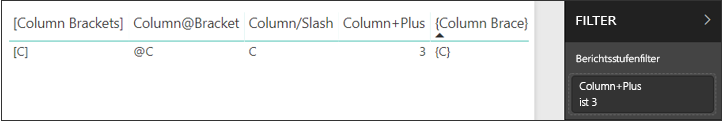
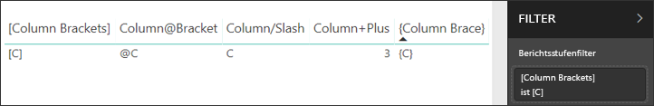

# <a name="filter-a-report-using-query-string-parameters-in-the-url"></a>Filtern eines Berichts mithilfe von Abfragezeichenfolgenparametern in der URL

Wenn Sie im Power BI-Dienst einen Bericht öffnen, hat jeder Seite des Berichts eine eigene eindeutige URL. Zum Filtern der jeweiligen Berichtsseite können Sie den Filterbereich des Berichtszeichenbereichs verwenden.  Sie können aber auch die URL mit Abfragezeichenfolgenparametern versehen, um den Bericht vorab zu filtern. Das ist beispielsweise hilfreich, wenn Sie Kollegen einen bereits vorgefilterten Bericht zeigen möchten. Zum Filtern können Sie etwa der Standard-URL des Berichts die gewünschten Filterparameter hinzufügen und dann die gesamte neue URL per E-Mail versenden.


## <a name="uses-for-query-string-parameters"></a>Verwendungsmöglichkeiten für Abfragezeichenfolgenparameter

Angenommen, Sie arbeiten mit Power BI Desktop. Sie möchten einen Bericht erstellen, der Links zu anderen Power BI-Berichten enthält, aber nur einige der enthaltenen Informationen sollen in den anderen Berichten angezeigt werden. Filtern Sie zunächst die Berichte mithilfe von Abfragezeichenfolgenparametern, und speichern Sie die URLs. Erstellen Sie anschließend eine Tabelle mit diesen neuen Berichts-URLs in Power BI Desktop.  Veröffentlichen Sie den Bericht anschließend, und geben Sie ihn frei.

Auch beim Erstellen einer erweiterten Power BI-Lösung können Abfragezeichenfolgenparameter verwendet werden.  Mithilfe von DAX wird ein Bericht erstellt, der eine gefilterte Berichts-URL dynamisch basierend auf der Auswahl des Kunden im aktuellen Bericht generiert. Wenn Kunden auf die URL klicken, werden ihnen nur die gewünschten Informationen angezeigt. 

## <a name="query-string-parameter-syntax-for-filtering"></a>Syntax für Abfragezeichenfolgenparameter zum Filtern

Mit Parametern können Sie den Bericht nach mindestens einem Wert filtern, auch wenn dieser Wert Leerzeichen oder Sonderzeichen enthält. Die grundlegende Syntax ist recht einfach: Beginnen Sie mit der Berichts-URL, und fügen Sie dann ein Fragezeichen und Ihre Filtersyntax hinzu.

URL?filter=***Tabelle***/***Feld*** eq '***Wert***'


* Bei den Namen für **Tabelle** und **Feld** muss die Groß-/Kleinschreibung beachtet werden, beim **Wert** nicht.
* Zum Filtern können auch Felder verwendet werden, die in der Berichtsansicht ausgeblendet sind.

### <a name="reports-in-apps"></a>Berichte in Apps

Wenn Sie einem Bericht in einer App einen URL-Filter hinzufügen möchten, sieht die Formatierung etwas anders aus. Für Links zu Berichten in einer App gibt es einen Abfrageparameter (ctid), der der URL hinzugefügt wird. Trennen Sie die Abfrageparameter durch ein kaufmännisches und-Zeichen (&). Behalten Sie "? Filter =" und verschiebt den Ctid-Parameter an das Ende der URL durch ein kaufmännisches und-Zeichen (&). 

Sehen Sie sich dazu das folgende Beispiel an:

App.powerbi.com/Groups/Me/Apps/*Anwendungs-Id*/reports/*Bericht-Id*/ReportSection? Filter =*Tabelle*/*Feld* EQ '*Wert*&'Ctid =*Ctid*

### <a name="field-types"></a>Feldtypen

Feldtypen können eine Zahl, ein datetime-Wert oder eine Zeichenfolge sein und müssen dem Typ entsprechen, der im Dataset festgelegt ist.  Das Festlegen einer Tabellenspalte auf „Zeichenfolge“ funktioniert beispielsweise nicht, wenn Sie nach einem Datums-/Uhrzeitwert oder einem numerischen Wert in einer Datasetspalte suchen, die auf „Datum“ festgelegt ist (z.B. Table/StringColumn eq 1).

* **Zeichenfolgen** müssen mit einfachen Anführungszeichen umschlossen werden ('Managername').
* Für **Zahlen** ist keine besondere Formatierung erforderlich.
* **Datums- und Zeitangaben** müssen in einfachen Anführungszeichen stehen. In OData V3 muss ihnen das Word „datetime“ vorangestellt sein. In OData V4 ist dies nicht notwendig.

Auf all das gehen wir im weiteren Verlauf dieses Artikels noch näher ein.  

## <a name="filter-on-a-field"></a>Filtern nach einem Feld

Angenommen, die URL unseres Berichts lautet wie folgt:


Und die Kartendarstellung (weiter oben) zeigt, dass wir über Filialen in North Carolina verfügen.

>[!NOTE]
>Dieses Beispiel basiert auf dem [Analysebeispiel für Einzelhandel](sample-datasets.md).
> 

Wenn Sie den Bericht filtern möchten, sodass nur Daten für Filialen in „NC“ (North Carolina) angezeigt werden, fügen Sie Folgendes an die URL an:

?filter=Store/Territory eq 'NC'


>[!NOTE]
>*NC* ist als Wert im Feld **Territory** der Tabelle **Store** gespeichert.
> 

Der Bericht wird nach North Carolina gefiltert, und alle Visualisierungen auf der Berichtsseite zeigen nur noch Daten für North Carolina.


## <a name="filter-on-multiple-fields"></a>Filtern nach mehreren Feldern

Sie können auch nach mehreren Felder filtern, indem Sie weitere Parameter zu Ihrer URL hinzufügen. Hier nochmals der ursprüngliche Filterparameter.

```
?filter=Store/Territory eq 'NC'
```

Um nach weiteren Feldern zu filtern, fügen Sie ein **and** und ein weiteres Feld im selben Format wie oben hinzu. Es folgt ein Beispiel.

```
?filter=Store/Territory eq 'NC' and Store/Chain eq 'Fashions Direct'
```

<iframe width="640" height="360" src="https://www.youtube.com/embed/0sDGKxOaC8w?showinfo=0" frameborder="0" allowfullscreen></iframe>

## <a name="operators"></a>Operatoren

Power BI unterstützt außer **and** noch viele weitere Operatoren. In der folgenden Tabelle werden diese Operatoren zusammen mit dem Inhaltstyp, den sie unterstützen, aufgeführt:

|Operator  | Definition | Zeichenfolge  | Zahl | Datum |  Beispiel|
|---------|---------|---------|---------|---------|---------|
|**and**     | und |  Ja      | Ja |  Ja|  product/price le 200 and price gt 3.5 |
|**eq**     | equals |  Ja      | Ja   |  Ja       | Address/City eq 'Redmond' |
|**ne**     | Ungleich |   Ja      | Ja  | Ja        |  Address/City ne 'London' |
|**ge**     |  Größer als oder gleich       | Nein | Ja |Ja |  product/price ge 10
|**gt**     | Größer als        |Nein | Ja | Ja  | product/price gt 20
|**le**     |   Kleiner als oder gleich      | Nein | Ja | Ja  | product/price le 100
|**lt**     |  Kleiner als       | Nein | Ja | Ja |  product/price lt 20
|**in\*\***     |  Einschließlich       | Ja | Ja |  Ja | Student/Age in (27, 29)


\*\* Wenn Sie **in** verwenden, können die Werte auf der rechten Seite von **in** einer durch Kommas getrennten Liste entsprechen, die in Klammern eingeschlossen wird, oder einem einzelnen Ausdruck, der eine Sammlung zurückgibt.

### <a name="numeric-data-types"></a>Numerische Datentypen

Ein Filter für Power BI-URLs kann Zahlen in den folgenden Formaten enthalten:

|Zahlentyp  |Beispiel  |
|---------|---------|
|**integer**     |   5      |
|**long**     |   5L oder 5l      |
|**double**     |   5,5 oder 55e-1 oder 0,55e+1 oder 5D oder 5d oder 0,5e1D oder 0,5e1d oder 5,5D oder 5,5d oder 55e-1D oder 55e-1d     |
|**decimal**     |   5M oder 5m oder 5,5M oder 5,5m      |
|**float**     | 5F oder 5f oder 0,5e1F oder 0,5e-1d        |

### <a name="date-data-types"></a>Date-Datentypen

Power BI unterstützt OData V3 and V4 für **Date**- und **DateTimeOffset**-Datentypen.  Datumsangaben werden dargestellt, mit dem EDM-Format (2019-02-12T00:00:00), wenn Sie ein Datum als 'YYYY-MM-DD' angeben, Power BI als interpretiert ' YYYY-MM-DDT00:00:00 ".

Warum ist diese Unterscheidung wichtig? Angenommen, Sie erstellen einen Abfragezeichenfolgen-Parameter **Tabelle Datum/Gt "2018-08-03'** .  Ist der 3. August 2018 in den Ergebnissen enthalten oder wird mit dem 4. August 2018 begonnen? Da es sich bei Power BI die Abfrage übersetzt **Tabelle Datum/Gt "2018-08-03T00:00:00"** , umfassen Ihre Ergebnisse, die eine gewisse Zeitangabenteil aufweisen, da diese Datumsangaben größer wäre Datumsangaben **"2018-08-03T00:00:00"** .

## <a name="special-characters-in-url-filters"></a>Sonderzeichen in URL-Filtern

Für Sonderzeichen und Leerzeichen sind zusätzliche Formatierungen erforderlich. Wenn Ihre Abfrage Leerzeichen, Bindestriche oder Nicht-ASCII-Zeichen enthält, stellen Sie diesen Sonderzeichen eine *Escapesequenz* voran, die mit einem Unterstrich und einem X ( **_x**) beginnt, gefolgt vom 4-stelligen **Unicode** und einem weiteren Unterstrich. Wenn der Unicode weniger als vier Zeichen enthält, müssen Sie diesen mit Nullen ergänzen. Hier sehen Sie einige Beispiele:

|Bezeichner  |Unicode  | Codierung für Power BI  |
|---------|---------|---------|
|**Tabellenname**     | Leerzeichen ist 0x20        |  Table_x0020_Name       |
|**Column**@**Number**     |   @ ist 0x40     |  Column_x0040_Number       |
|**[Column]**     |  [ ist 0x0058, und ] ist 0x0050       |  _x0058_Column_x0050_       |
|**Column+Plus**     | + ist 0x2B        |  Column_x002B_Plus       |

Table_x0020_Name/Column_x002B_Plus eq 3 


Table_x0020_Special/_x005B_Column_x0020_Brackets_x005D_ eq '[C]' 

## <a name="use-dax-to-filter-on-multiple-values"></a>Verwenden von DAX, um nach mehreren Werten zu filtern

Eine andere Möglichkeit, nach mehreren Feldern zu filtern, besteht darin, eine berechnete Spalte zu erstellen, in der zwei Felder zu einem einzelnen Wert verkettet werden. Anschließend können Sie nach diesem Wert filtern.

Angenommen, es gibt zwei Felder: „Territory“ und „Chain“. In diesem Szenario können Sie in Power BI Desktop [eine neue berechnete Spalte](desktop-tutorial-create-calculated-columns.md) (Feld) namens „TerritoryChain“ erstellen. Beachten Sie, dass der **Feldname** keine Leerzeichen enthalten darf. Die DAX-Formel für diese Spalte sieht wie folgt aus:

TerritoryChain = [Territory] & " - " & [Chain]

Veröffentlichen Sie den Bericht für den Power BI-Dienst, und verwenden Sie die URL-Abfragezeichenfolge, um die Daten so zu filtern, dass nur Lindseys-Filialen in NC angezeigt werden.

    https://app.powerbi.com/groups/me/reports/8d6e300b-696f-498e-b611-41ae03366851/ReportSection3?filter=Store/TerritoryChain eq 'NC – Lindseys'

## <a name="pin-a-tile-from-a-filtered-report"></a>Anheften einer Kachel aus einem gefilterten Bericht

Nachdem Sie den Bericht mithilfe von Abfragezeichenfolgenparametern gefiltert haben, können Sie Visualisierungen aus diesem Bericht an Ihr Dashboard anheften.  Die Kachel auf dem Dashboard zeigt die gefilterten Daten, und wenn Sie die Dashboardkachel auswählen, wird der zugrunde liegende Bericht geöffnet.  Die Filterung, die Sie mit der URL ausgeführt haben, wird jedoch nicht mit dem Bericht gespeichert. Wenn Sie die Dashboardkachel auswählen, wird der Bericht im ungefilterten Zustand geöffnet.  Das heißt, die Daten auf der Dashboardkachel entsprechen nicht den Daten aus der Berichtsvisualisierung.

Diese Abweichung ist nützlich, wenn Sie unterschiedliche Ergebnisse anzeigen möchten (gefilterte Ergebnisse im Dashboard, ungefilterte Ergebnisse im Bericht).

## <a name="considerations-and-troubleshooting"></a>Zu beachtende Aspekte und Problembehandlung

Im Zusammenhang mit Abfragezeichenfolgenparametern müssen ein paar Dinge beachtet werden.

* Wenn Sie den *in*-Operator verwenden, müssen die Werte auf der rechten Seite von *in* einer durch Trennzeichen getrennten Liste entsprechen, die in Klammern eingeschlossen ist.    
* Sie können in Power BI-Berichtsserver [Berichtsparameter übergeben](https://docs.microsoft.com/sql/reporting-services/pass-a-report-parameter-within-a-url?view=sql-server-2017.md), indem Sie sie in eine Berichts-URL einschließen. Diese URL-Parameter haben kein Präfix, da sie direkt an die Berichtsverarbeitungs-Engine übergeben werden.
* Filtern mittels Abfragezeichenfolge funktioniert nicht mit [im Web veröffentlichen](service-publish-to-web.md) oder [PDF-Format exportieren](consumer/end-user-pdf.md).
* Das [Einbetten mit dem Berichts-Webpart in SharePoint Online](service-embed-report-spo.md) unterstützt keine URL-Filter.
* Der Datentyp „long“ ist aufgrund von Beschränkungen bei JavaScript (2^53–1).
* Berichts-URL-Filter verfügen über eine Einschränkung von zehn Ausdrücken (zehn Filter die per AND verbunden sind).

## <a name="next-steps"></a>Nächste Schritte

[Anheften einer Visualisierung an ein Dashboard](service-dashboard-pin-tile-from-report.md)  
[Registrieren Sie sich für eine kostenlose Testversion](https://powerbi.microsoft.com/get-started/)

Weitere Fragen? [Stellen Sie Ihre Frage in der Power BI-Community.](http://community.powerbi.com/)
