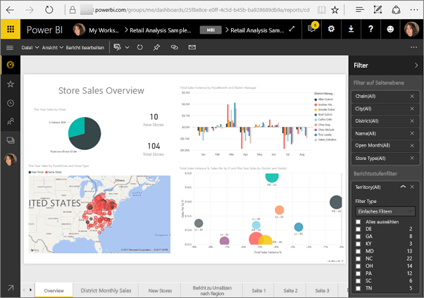
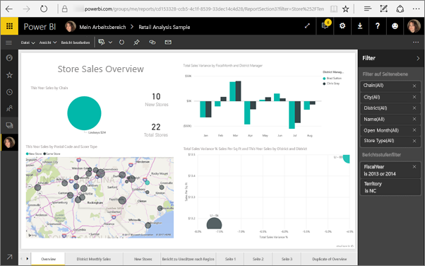

# <a name="filter-a-report-using-query-string-parameters-in-the-url"></a>Filtern eines Berichts mithilfe von Abfragezeichenfolgenparametern in der URL
Wenn Sie im Power BI-Dienst einen Bericht öffnen, hat jeder Seite des Berichts eine eigene eindeutige URL. Zum Filtern der jeweiligen Berichtsseite können Sie den Filterbereich des Berichtszeichenbereichs verwenden.  Sie können aber auch die URL mit Abfragezeichenfolgenparametern versehen, um den Bericht zu filtern. Das ist beispielsweise hilfreich, wenn Sie Kollegen einen bereits vorgefilterten Bericht zeigen möchten. Hierzu können Sie etwa der Standard-URL für den Bericht die gewünschten Filterparameter hinzufügen und dann die gesamte URL per E-Mail versenden.



<iframe width="640" height="360" src="https://www.youtube.com/embed/WQFtN8nvM4A?list=PLv2BtOtLblH3YE_Ycas5B1GtcoFfJXavO&amp;showinfo=0" frameborder="0" allowfullscreen></iframe>

## <a name="query-string-parameter-syntax-for-filtering"></a>Syntax für Abfragezeichenfolgenparameter zum Filtern
Die Syntax ist recht einfach: Beginnen Sie mit der Berichts-URL, und fügen Sie dann ein Fragezeichen und Ihre Filtersyntax hinzu.

URL?filter=***Tabelle***/***Feld*** eq '***Wert***'


* Bei den Namen für **Tabelle** und **Feld** muss die Groß-/Kleinschreibung beachtet werden, beim **Wert** nicht.
* Zum Filtern können auch Felder verwendet werden, die in der Berichtsansicht ausgeblendet sind.
* **Wert** muss in einfache Anführungszeichen eingeschlossen werden.
* Der Feldtyp muss eine Zahl oder Zeichenfolge sein.
* Tabellen- und Feldnamen dürfen keine Leerzeichen enthalten.

Auf all das gehen wir im weiteren Verlauf dieses Artikels noch näher ein.  

## <a name="filter-on-a-field"></a>Filtern nach einem Feld
Angenommen, die URL unseres Berichts lautet wie folgt:


Und die Kartendarstellung (weiter oben) zeigt, dass wir über Filialen in North Carolina verfügen.

>[!NOTE]
>Dieses Beispiel basiert auf dem [Analysebeispiel für Einzelhandel](sample-datasets.md).
> 

Wenn Sie den Bericht filtern möchten, sodass nur Daten für Filialen in „NC“ (North Carolina) angezeigt werden, fügen Sie Folgendes an die URL an:

?filter=Store/Territory eq 'NC'


>[!NOTE]
>*NC* ist als Wert im Feld **Territory** der Tabelle **Store** gespeichert.
> 
> 

Der Bericht wird nach North Carolina gefiltert, und alle Visualisierungen auf der Berichtsseite zeigen nur noch Daten für North Carolina.



## <a name="filter-on-multiple-fields"></a>Filtern nach mehreren Feldern
Sie können auch nach mehreren Felder filtern, indem Sie weitere Parameter zu Ihrer URL hinzufügen. Hier nochmals der ursprüngliche Filterparameter.

```
?filter=Store/Territory eq 'NC'
```

Um nach weiteren Feldern zu filtern, fügen Sie ein `and` und ein weiteres Feld im selben Format wie oben hinzu. Es folgt ein Beispiel.

```
?filter=Store/Territory eq 'NC' and Store/Chain eq 'Fashions Direct'
```

<iframe width="640" height="360" src="https://www.youtube.com/embed/0sDGKxOaC8w?showinfo=0" frameborder="0" allowfullscreen></iframe>


### <a name="using-dax-to-filter-on-multiple-values"></a>Verwenden von DAX, um nach mehreren Werten zu filtern
Eine andere Möglichkeit, nach mehreren Feldern zu filtern, besteht darin, eine berechnete Spalte zu erstellen, in der zwei Felder zu einem einzelnen Wert verkettet werden. Anschließend können Sie nach diesem Wert filtern.

Angenommen, wir verfügen über zwei Felder: „Territory“ und „Chain“. In diesem Szenario können Sie in Power BI Desktop [eine neue berechnete Spalte](desktop-tutorial-create-calculated-columns.md) (Feld) namens „TerritoryChain“ erstellen. Beachten Sie, dass der **Feldname** keine Leerzeichen enthalten darf. Die DAX-Formel für diese Spalte sieht wie folgt aus:

TerritoryChain = [Territory] & " - " & [Chain]

Veröffentlichen Sie den Bericht für den Power BI-Dienst, und verwenden Sie die URL-Abfragezeichenfolge, um die Daten so zu filtern, dass nur Lindseys-Filialen in NC angezeigt werden.

    https://app.powerbi.com/groups/me/reports/8d6e300b-696f-498e-b611-41ae03366851/ReportSection3?filter=Store/TerritoryChain eq 'NC–Lindseys'

## <a name="pin-a-tile-from-a-filtered-report"></a>Anheften einer Kachel aus einem gefilterten Bericht
Nachdem Sie den Bericht mithilfe von Abfragezeichenfolgenparametern gefiltert haben, können Sie Visualisierungen aus diesem Bericht an Ihr Dashboard anheften. Die Kachel auf dem Dashboard zeigt die gefilterten Daten, und wenn Sie die Dashboardkachel auswählen, wird der zugrunde liegende Bericht geöffnet.  Die über die URL vorgenommene Filterung wird jedoch nicht zusammen mit dem Bericht gespeichert, und wenn Sie die Dashboardkachel auswählen, wird der Bericht ungefiltert geöffnet.  Die Daten auf der Dashboardkachel entsprechen also nicht den Daten aus der Berichtsvisualisierung.

Das ist hilfreich, wenn Sie unterschiedliche Ergebnisse anzeigen möchten (gefilterte Ergebnisse auf dem Dashboard, ungefilterte Ergebnisse im Bericht).

## <a name="limitations-and-troubleshooting"></a>Einschränkungen und Problembehandlung
Im Zusammenhang mit Abfragezeichenfolgenparametern müssen ein paar Dinge beachtet werden.

* Das Filtern mittels Abfragezeichenfolge kann nicht für [Im Web veröffentlichen](service-publish-to-web.md) oder Power BI Embedded verwendet werden.   
* Der Feldtyp muss eine Zahl oder Zeichenfolge sein.
* Tabellen- und Feldnamen dürfen keine Leerzeichen enthalten.

## <a name="next-steps"></a>Nächste Schritte
[Anheften einer Visualisierung an ein Dashboard](service-dashboard-pin-tile-from-report.md)  
[Jetzt kostenlos testen](https://powerbi.com/)

Weitere Fragen? [Stellen Sie Ihre Frage in der Power BI-Community.](http://community.powerbi.com/)

