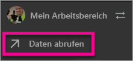
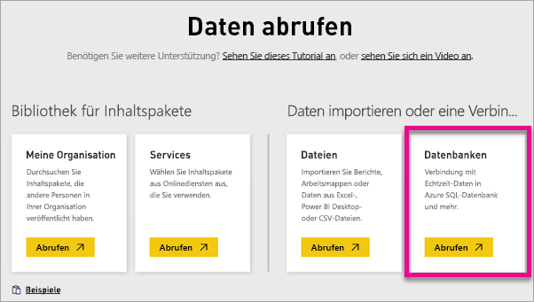
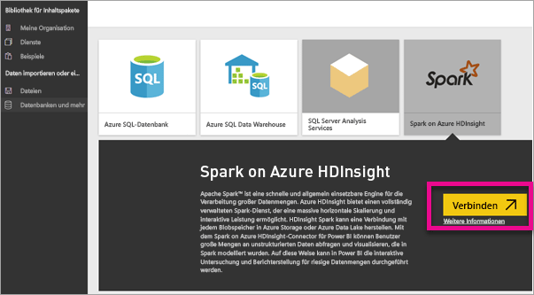
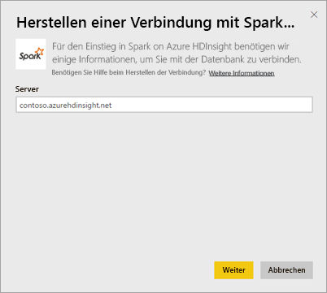
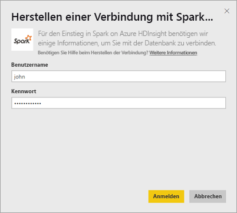
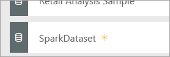
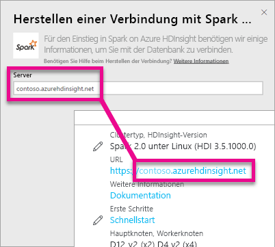
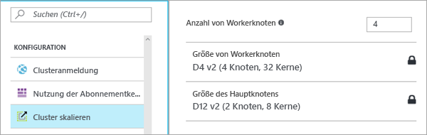

# Spark on HDInsight mit DirectQuery
Spark on Azure HDInsight mit DirectQuery ermöglicht es Ihnen, dynamische Berichte auf Basis von Daten und Metriken zu erstellen, die bereits im Spark-Cluster verfügbar sind. Mit DirectQuery werden Abfragen zurück zum Azure HDInsight Spark-Cluster gesendet, während Sie die Daten in der Berichtsansicht untersuchen. Diese Variante wird für Benutzer empfohlen, die mit den Entitäten vertraut sind, mit denen die Verbindung hergestellt wird.

> [!WARNING]
> Die automatische Aktualisierung von Kacheln wurde für auf Grundlage von Spark-Datasets erstellte Dashboardkacheln deaktiviert. Mit der Option **Dashboardkacheln aktualisieren** können Sie die Kacheln manuell aktualisieren. Berichte sind hiervon nicht betroffen und sollten auf dem neuesten Stand bleiben. 
> 
> 

Sie können die folgenden Schritte ausführen, um mithilfe von DirectQuery im Power BI-Dienst eine Verbindung mit der Spark on Azure HDInsight-Datenquelle herzustellen.

1. Wählen Sie unten im linken Navigationsbereich **Daten abrufen** aus.
   
     
2. Wählen Sie **Datenbanken und mehr** aus.
   
     
3. Wählen Sie den Connector **Spark auf HDInsight** und anschließend **Verbinden**aus.
   
     
4. Geben Sie den Namen des **Servers** ein, zu dem eine Verbindung hergestellt werden soll, sowie Ihren **Benutzernamen** und das **Kennwort**. Der Server erscheint immer in der Form „\<Clustername\>.azurehdinsight.net“. Weitere Informationen zum Suchen dieser Werte finden Sie unten.
   
     
   
     
5. Nachdem die Verbindung hergestellt ist, sehen Sie ein neues Dataset mit dem Namen „SparkDataset“. Sie können auf das Dataset auch über die erstellte Platzhalterkachel zugreifen.
   
     
6. Beim Drilldown in das Dataset können Sie alle Tabellen und Spalten in der Datenbank durchsuchen. Wenn Sie eine Spalte auswählen, wird eine Abfrage zurück an die Quelle gesendet, wodurch Ihre Visualisierung dynamisch erstellt wird. Diese Visualisierungen können in einem neuen Bericht gespeichert und wieder auf Ihrem Dashboard angeheftet werden.

## Suchen von Spark auf HDInsight-Parametern
Der Server besitzt immer die Form „\<Clustername\>.azurehdinsight.net“ und steht im Azure-Portal.

Benutzername und Kennwort finden Sie ebenfalls im Azure-Portal.

## Einschränkungen
Diese Einschränkungen und Hinweise können sich ändern, da wir die Benutzeroberfläche fortlaufend optimieren. Zusätzliche Dokumentation finden Sie unter [Verwenden von BI-Tools mit Apache Spark für Azure HDInsight](https://azure.microsoft.com/documentation/articles/hdinsight-apache-spark-use-bi-tools/).

* Der Power BI-Dienst unterstützt nur eine Konfiguration, die Spark 2.0 und HDInsights 3.5 umfasst.
* Durch jede Aktion, wie z. B. das Auswählen einer Spalte oder das Hinzufügen eines Filters, wird eine Abfrage an die Datenbank gesendet – bevor Sie sehr große Felder auswählen, sollten Sie einen geeigneten Visualisierungstyp wählen.
* Q&A steht für DirectQuery-Datasets nicht zur Verfügung.
* Schemaänderungen werden nicht automatisch übernommen.
* Power BI unterstützt 16.000 Spalten **für alle Tabellen insgesamt** in einem Dataset. Power BI enthält außerdem eine interne Zeilennummernspalte pro Tabelle. Dies bedeutet, dass 15.900 Spalten verfügbar sind, wenn das Dataset 100 Tabellen enthält. Abhängig vom Umfang der Daten aus der Spark-Datenquelle, mit denen Sie arbeiten, kann diese Einschränkung zur Wirkung kommen.

## Problembehandlung
Wenn Probleme beim Ausführen von Abfragen gegen Ihr Cluster auftreten, stellen Sie sicher, dass die Anwendung weiterhin ausgeführt wird, und starten Sie sie bei Bedarf neu.

Sie können im Azure-Portal unter **Konfiguration** > **Cluster skalieren** auch zusätzliche Ressourcen zuordnen:

## Nächste Schritte
[Erste Schritte: Erstellen eines Apache Spark-Clusters für HDInsight (Linux) und Ausführen von interaktiven Abfragen per Spark-SQL](https://azure.microsoft.com/documentation/articles/hdinsight-apache-spark-jupyter-spark-sql)  
[Erste Schritte mit Power BI](service-get-started.md)  
[Abrufen von Daten in Power BI](service-get-data.md)  
Weitere Fragen? [Wenden Sie sich an die Power BI-Community](http://community.powerbi.com/)

