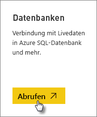
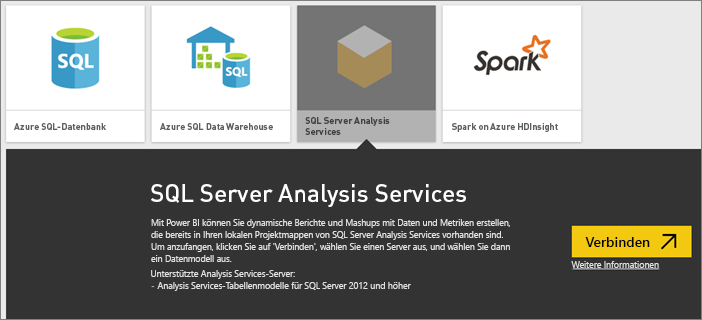
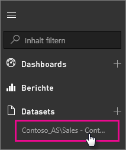

# SQL Server Analysis Services-Livedaten in Power BI
In Power BI gibt es zwei Möglichkeiten, die Verbindung mit einem SQL Server Analysis Services-Liveserver herzustellen. In **Daten abrufen** können Sie eine Verbindung mit einem SQL Server Analysis Services-Server oder aber mit einer [Power BI Desktop-Datei](service-desktop-files.md) bzw. einer [Excel-Arbeitsmappe](service-excel-workbook-files.md) herstellen, die bereits mit einem Analysis Services-Server verbunden ist. Als bewährte Methode empfiehlt Microsoft die Verwendung von Power BI Desktop aufgrund des weitreichenden Toolsets und die vorhandene Möglichkeit, eine Sicherungskopie der Power BI Desktop-Datei lokal zu speichern.

 >[!IMPORTANT]
 >* Zum Herstellen einer Verbindung mit einem Analysis Services-Liveserver muss ein lokales Datengateway von einem Administrator installiert und konfiguriert werden. Weitere Informationen finden Sie unter [Lokales Datengateway](service-gateway-onprem.md).
 >* Wenn Sie das Gateway verwenden, bleiben Ihre Daten lokal verfügbar.  Die von Ihnen auf Basis dieser Daten erstellten Berichte werden im Power BI-Dienst gespeichert. 
 >* [Die F&A-Abfragen in natürlicher Sprache](service-q-and-a-direct-query.md) sind für Analysis Services-Liveverbindungen in der Vorschauversion verfügbar.

## So stellen Sie über „Daten abrufen“ eine Verbindung zu einem Modell her
1. Klicken Sie unter **Mein Arbeitsbereich** auf **Daten abrufen**. Sie können auch zu einem Gruppenarbeitsbereich wechseln, sofern verfügbar.
   
   
2. Wählen Sie **Datenbanken und mehr** aus.
   
   
3. Wählen Sie **SQL Server Analysis Services** > **Verbinden** aus. 
   
   
4. Wählen Sie einen Server aus. Wenn keine der hier aufgeführten Server angezeigt werden, wurde entweder kein Gateway und keine Datenquelle konfiguriert oder Ihr Konto ist nicht auf der Registerkarte **Benutzer** der Datenquelle im Gateway aufgeführt. Wenden Sie sich an Ihren Administrator.
5. Wählen Sie das Modell aus, mit dem Sie eine Verbindung herstellen möchten. Dieses kann tabellarisch oder mehrdimensional sein.

Nachdem Sie die Verbindung mit dem Modell hergestellt haben, wird es auf der Power BI-Website unter **Mein Arbeitsbereich/Datasets**angezeigt. Bei einem Wechsel zu einem Gruppenarbeitsbereich wird das Dataset in der Gruppe angezeigt.

## Dashboardkacheln
Wenn Sie visuelle Elemente aus einem Bericht auf dem Dashboard anheften, werden die angehefteten Kacheln automatisch alle 10 Minuten aktualisiert. Wenn die Daten auf Ihrem lokalen Analysis Services-Server aktualisiert werden, werden die Kacheln nach 10 Minuten automatisch aktualisiert.

## Häufige Probleme

* Schemafehler „Cannot load the model“ (Das Modell kann nicht geladen werden): Dieser Fehler wird ausgegeben, wenn der Benutzer, der eine Verbindung zu SSAS herstellt, keinen Zugriff auf die SSAS-Datenbank, den Cube und das Modell hat.

## Nächste Schritte
[Lokales Datengateway](service-gateway-onprem.md)  
[Verwalten von Analysis Services-Datenquellen](service-gateway-enterprise-manage-ssas.md)  
[Problembehandlung beim lokalen Datengateway](service-gateway-onprem-tshoot.md)  
Weitere Fragen? [Wenden Sie sich an die Power BI-Community](http://community.powerbi.com/)