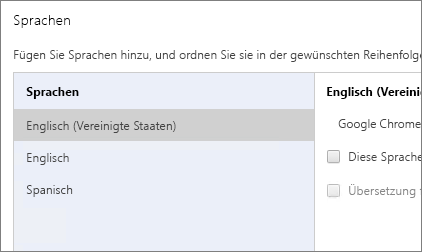
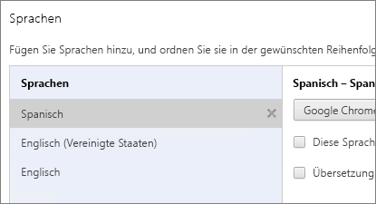
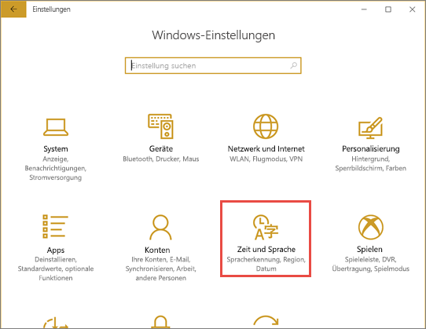
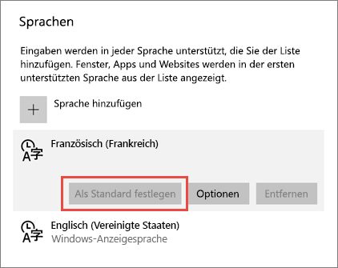

# Unterstützte Sprachen und Länder/Regionen für Power BI
## Länder und Regionen, in denen Power BI erhältlich ist
Eine Liste der Länder und Regionen, in denen Power BI verfügbar ist, finden Sie unter [Internationale Verfügbarkeit](https://products.office.com/business/international-availability). 

## Sprachen im Power BI-Dienst
Der Power BI-Dienst (im Browser) ist in den folgenden 42 Sprachen verfügbar:

* Arabisch
* Baskisch – Basque
* Bulgarisch – Български
* Katalanisch – Català
* Chinesisch (vereinfacht) – 中文(简体)
* Chinesisch (traditionell) – 中文(繁體)
* Kroatisch – Hrvatski
* Tschechisch – Čeština
* Dänisch – Dansk
* Niederländisch – Nederlands
* Englisch – English
* Estnisch – Eesti
* Finnisch – Suomi
* Französisch – Français
* Galizisch – Galego
* Deutsch – Deutsch
* Griechisch – Ελληνικά
* Hebräisch
* Hindi – हिंदी
* Ungarisch – Magyar
* Indonesisch – Bahasa Indonesia
* Italienisch – Italiano
* Japanisch – 日本語
* Kasachisch – Қазақ
* Koreanisch – 한국어
* Lettisch – Latviešu
* Litauisch – Lietuvių
* Malaiisch – Bahasa Melayu
* Norwegisch (Bokmål) – Norsk (Bokmål)
* Polnisch – Polski
* Portugiesisch (Brasilien) – Português
* Portugiesisch (Portugal) – Português
* Rumänisch – Română
* Russisch – Русский
* Serbisch (Kyrillisch) – Српски
* Serbisch (Lateinisch) – Srpski
* Slowakisch – Slovenčina
* Slowenisch – Slovenski
* Spanisch – Español
* Schwedisch – Svenska
* Thailändisch – ไทย
* Türkisch – Türkçe
* Ukrainisch – Українська
* Vietnamesisch – Tiếng Việt

## Was ist übersetzt?
Menüs, Schaltflächen, Meldungen und andere Elemente sind in Ihrer Sprache verfügbar. So können Sie einfacher navigieren und mit Power BI interagieren.

Einige Features sind derzeit nur auf Englisch verfügbar:

* Dashboards und Berichte, die Power BI beim Herstellen einer Verbindung mit Diensten wie z. B. Microsoft Dynamics CRM, Google Analytics, Salesforce usw. erstellt. (Sie können jederzeit eigene Dashboards und Berichte in Ihrer Sprache erstellen.)
* Einblicke in Ihre Daten mit Q&A

Wir arbeiten derzeit daran, zusätzliche Features für andere Sprachen verfügbar zu machen. 

## Auswählen Ihrer Sprache im Power BI-Dienst
1. Wählen Sie im Power BI-Dienst das Symbol **Einstellungen**  > **Einstellungen** aus.
2. Wählen Sie auf der Registerkarte **Allgemein** die Option **Sprache** aus.
3. Wählen Sie Ihre Sprache und dann **Anwenden** aus.

## Ändern der Sprache im Browser
Power BI erkennt Ihre Sprache ausgehend von den Spracheinstellungen auf Ihrem Computer. Der Art und Weise, wie Sie auf diese Einstellungen zugreifen und Änderungen daran vornehmen können, variiert je nach Betriebssystem und Browser. Im Folgenden ist beschrieben, wie Sie in Internet Explorer und Google Chrome auf diese Einstellungen zugreifen.

### Internet Explorer (Version 11)
1. Klicken Sie auf die Schaltfläche **Extras** rechts oben in Ihrem Browserfenster:
   
   
2. Klicken Sie auf **Internetoptionen**.
3. Klicken Sie im Dialogfeld „Internetoptionen“ auf der Registerkarte „Allgemein“ unter „Darstellung“ auf die Schaltfläche **Sprachen** .

### Google Chrome (Version 42)
1. Klicken Sie auf die Menüschaltfläche rechts oben in Ihrem Browserfenster:
   
   
2. Klicken Sie auf **Einstellungen**.
3. Klicken Sie auf **Erweiterte Einstellungen anzeigen**.
4. Klicken Sie unter Sprachen auf die Schaltfläche **Sprach- und Eingabeeinstellungen** .
5. Klicken Sie auf **Hinzufügen**, wählen Sie Ihre Sprache aus, und klicken Sie dann auf **OK**.
   
   
   
   Die neue Sprache wird am Ende der Liste angezeigt. 
6. Ziehen Sie die neue Sprache an den Anfang der Liste, und klicken Sie auf **Google Chrome in dieser Sprache anzeigen**.
   
   
   
   Möglicherweise müssen Sie den Browser schließen und erneut öffnen, damit die geänderte Einstellung wirksam wird.

## Auswählen der Sprache oder des Gebietsschemas von Power BI Desktop
Sie haben zwei Möglichkeiten, Power BI Desktop zu beziehen: Sie können Power BI Desktop herunterladen oder aus dem Windows Store installieren.

* Wenn Sie [Power BI Desktop aus dem Windows Store installieren](#choose-a-language-for-power-bi-desktop-installed-from-the-windows-store), werden sämtliche Sprachen installiert, und es wird die Sprache angezeigt, die der Windows-Standardsprache entspricht.
* Wenn Sie [Power BI Desktop herunterladen](#choose-a-language-when-you-download-power-bi-desktop), wählen Sie die Sprache während des Downloadvorgangs aus. 
* Sie können auch [ein beim Importieren von Daten zu verwendendes Gebietsschema](#choose-the-locale-to-be-used-when-importing-data-into-power-bi-desktop) für einen bestimmten Bericht auswählen. 

### Auswählen einer Sprache für Power BI Desktop beim Installieren aus dem Windows Store
1. [Installieren Sie Power BI Desktop](http://aka.ms/pbidesktopstore) aus dem Windows Store.
2. Suchen Sie zum Ändern der Sprache auf Ihrem Computer nach **Windows-Einstellungen**. 
3. Wählen Sie **Zeit & Sprache** aus.
   
     
4. Wählen Sie **Region & Sprache** aus, wählen Sie eine Sprache und anschließend **Als Standard festlegen** aus.
   
     
   
     Beim nächsten Start von Power BI Desktop wird die festgelegte Sprache als Standard verwendet. 

### Auswählen der Sprache beim Herunterladen von Power BI Desktop
Die für Power BI Desktop ausgewählte Sprache wirkt sich auf das Anzeigeformat von Zahlen und Datumsangaben in Berichten aus. 

* Wählen Sie eine Sprache aus, wenn Sie [Power BI Desktop herunterladen](https://powerbi.microsoft.com/desktop). 

Wenn Sie die Sprache in Power BI Desktop ändern möchten, besuchen Sie erneut die Downloadseite, und laden Sie Power BI Desktop in einer anderen Sprache herunter.

### Auswählen des zu verwendenden Gebietsschemas beim Importieren von Daten in Power BI Desktop
Egal, ob Sie Power BI Desktop herunterladen oder aus dem Windows Store installieren, Sie können für einen bestimmten Bericht ein anderes Gebietsschema als das in Ihrer Version von Power BI Desktop geltende Gebietsschema auswählen. Dadurch ändert sich die Interpretationsweise der Daten beim Import aus der Datenquelle, z.B. ob „3/4/2017“ als 3. April oder als 4. März interpretiert wird. 

1. Öffnen Sie in Power BI Desktop **Datei** > **Optionen und Einstellungen** > **Optionen**.
2. Wählen Sie unter **Aktuelle Datei** die Option **Regionale Einstellungen** aus.
3. Wählen Sie im Feld **Gebietsschema** ein anderes Gebietsschema aus. 
   
   
4. Wählen Sie **OK**aus.

## Sprachen in der Hilfedokumentation
Die Hilfe ist in diesen 10 Sprachen verfügbar: 

* Chinesisch (vereinfacht) – 中文(简体)
* Chinesisch (traditionell) – 中文(繁體)
* Französisch – Français
* Deutsch – Deutsch
* Italienisch – Italiano
* Japanisch – 日本語
* Koreanisch – 한국어
* Portugiesisch (Brasilien) – Português
* Russisch – Русский
* Spanisch – Español

## Nächste Schritte
* Verwenden Sie eine der mobilen Power BI-Apps? Details finden Sie unter [Unterstützte Sprachen der mobilen Power BI-Apps](mobile-apps-supported-languages.md).
* Haben Sie Fragen? Stellen Sie Ihre Frage in der [Power BI-Community](http://community.powerbi.com/).
* Treten weiterhin Probleme auf? Weitere Informationen finden Sie auf der [Supportseite für Power BI](https://powerbi.microsoft.com/support/).

