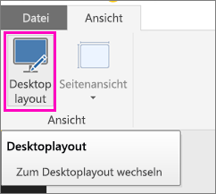
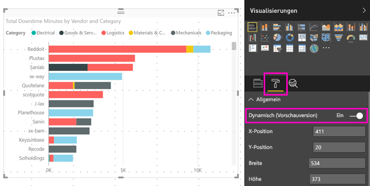

# Optimieren eines Power BI-Visuals für eine beliebige Größe
Wenn Sie einen neuen Bericht erstellen, sind die Visuals standardmäßig *reaktionsfähig*: Sie ändern sich dynamisch, um unabhängig von der Bildschirmgröße eine möglichst große Menge an Daten und Erkenntnissen anzuzeigen. Die Größe von Visuals älterer Berichte können Sie ebenfalls dynamisch anpassen.

Wenn Sie die Größe des Visuals ändert, hat die Datenansicht in Power BI die höchste Priorität. Beispielsweise wird automatisch die Auffüllung entfernt und die Legende über das Visual verschoben, damit es auch bei einer Verkleinerung relevant bleibt. Dynamik ist insbesondere bei Visuals in der mobilen Power BI-App auf Smartphones nützlich.

Die Größe von sämtlichen Visuals mit X- und Y-Achsen sowie Slicern kann ebenfalls auf dynamische Weise geändert werden.

## Aktivieren der Dynamik in Power BI Desktop
1. Vergewissern Sie sich bei älteren Berichten in Power BI Desktop auf der Registerkarte **Ansicht**, dass Sie sich im **Desktoplayout** befinden.
   
    
2. Wählen Sie ein Visual aus. Wählen Sie dann im Bereich **Visualisierungen** den Abschnitt **Format** aus.
3. Erweitern Sie **Allgemein**, und stellen Sie den Schieberegler **Dynamisch** auf **Ein**.
   
    
   
     Wenn Sie jetzt einen [für Smartphones optimierten Bericht erstellen](../desktop-create-phone-report.md) und dieses Visual hinzufügen, wird dessen Größe automatisch dynamisch angepasst.

## Aktivieren der Dynamik im Power BI-Dienst
Die Dynamik für ein Visual in einem Bericht kann im Power BI-Dienst aktiviert werden. Dazu müssen Sie berechtigt sein, den Bericht zu bearbeiten.

1. Klicken Sie in einem Bericht im Power BI-Dienst ([https://powerbi.com](https://powerbi.com)) auf **Bericht bearbeiten**.
2. Wählen Sie ein Visual aus. Wählen Sie dann im Bereich **Visualisierungen** den Abschnitt **Format** aus.
3. Erweitern Sie **Allgemein**, und stellen Sie den Schieberegler **Dynamisch** auf **Ein**.
   
    
   
     Wenn Sie jetzt eine [Smartphoneansicht dieses Berichts erstellen](../desktop-create-phone-report.md) und dieses Visual hinzufügen, wird dessen Größe automatisch dynamisch angepasst.

## Nächste Schritte
* [Erstellen von Berichten, die für die Power BI-Smartphone-Apps optimiert sind](../desktop-create-phone-report.md)
* [Anzeigen von Power BI-Berichten, die für das Smartphone optimiert sind](../consumer/mobile/mobile-apps-view-phone-report.md)
* Weitere Fragen? [Stellen Sie Ihre Frage in der Power BI-Community.](http://community.powerbi.com/)

