# Verwenden des Matrixvisuals in Power BI
Mit dem Visualfeature **Matrix** können Sie Matrixvisuals (auch als *Tabellen* bezeichnet) in **Power BI Desktop**-Berichten und Berichten des **Power BI-Diensts** erstellen. Das neue Feature ermöglicht die übergreifende Hervorhebung von Elementen innerhalb der Matrix mit anderen Visuals. Darüber hinaus können Sie Zeilen, Spalten und sogar einzelne Zellen für die Kreuzhervorhebung auswählen. Die Auswahl einzelner und mehrerer Zellen kann kopiert und in andere Anwendungen eingefügt werden. Um den für Layouts verfügbaren Platz besser auszunutzen, unterstützt das Matrixvisual ein abgestuftes Layout.

Die Matrix bietet viele Features, die in den folgenden Abschnitten dieses Artikels erläutert werden.

## Report themes
Sowohl Matrix- als auch Tabellenvisuals spiegeln die Stile (einschließlich Farben) des angewandten **Berichtsdesigns** wider. Diese entsprechen möglicherweise nicht den erwarteten Farben für das Matrixvisual, die Sie in der Konfiguration für Ihr **Berichtsdesign** ändern können. Weitere Informationen zu Designs finden Sie unter [**Verwenden von Berichtsdesigns in Power BI Desktop**](../desktop-report-themes.md).

## Erläuterung der Berechnung von Summen mit Power BI

Bevor Sie mit der Vorgehensweise für die Verwendung des Visuals **Matrix** fortfahren, ist es wichtig, ein Verständnis dafür zu entwickeln, wie Power BI die Werte für Summen und Teilsummen in Tabellen und Matrizen berechnet. Bei Zeilen mit Summen und Teilsummen wird das Measure für alle Zeilen der zugrunde liegenden Daten ausgewertet. Dabei handelt es sich *nicht* um eine einfache Addition der Werte in den sichtbaren oder angezeigten Zeilen. Das bedeutet, dass andere Werte als erwartet in der Zeile für die Gesamtsumme vorhanden sein können. 

Betrachten Sie die folgenden **Matrix**-Visuals. 

In diesem Beispiel zeigt jede Zeile im **Matrix**-Visual auf der rechten Seite den *Betrag* für jede Kombination von „salesperson“ (Verkäufer) und „date“ (Datum) an. Da ein Verkäufer jedoch für mehrere Datumswerte angezeigt wird, können die Zahlen mehr als einmal angezeigt werden. Daher stimmen die genaue Summe der zugrunde liegenden Daten und die Summe der Addition der sichtbaren Werte nicht überein. Dabei handelt es sich um ein allgemeines Muster, wenn der Wert, dessen Summe Sie bilden, sich auf der Seite „1“ einer 1:n-Beziehung befindet.

Bedenken Sie bei Summen und Teilsummen, dass diese Werte auf den zugrunde liegenden Daten basieren, nicht nur auf den sichtbaren Werten. 

<!-- use Nov blog post video

## Expanding and collapsing row headers
There are two ways you can expand row headers. The first is through the right-click menu. You’ll see options to expand the specific row header you clicked on, the entire level or everything down to the very last level of the hierarchy. You have similar options for collapsing row headers as well.

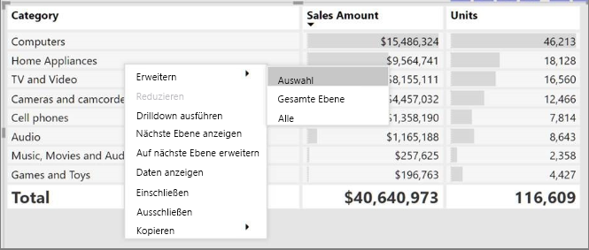

You can also add +/- buttons to the row headers through the formatting pane under the row headers card. By default, the icons will match the formatting of the row header, but you can customize the icons’ color and size separately if you want. 
Once the icons are turned on, they work similarly to the icons from PivotTables in Excel.

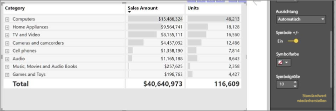

The expansion state of the matrix will save with your report. It can be pinned to dashboards as well, but consumers will need to open up the report to change the state. Conditional formatting will only apply to the inner most visible level of the hierarchy. Note that this expand/collapse experience is not currently supported when connecting to AS servers older than 2016 or MD servers.

Watch the following video to learn more about expand/collapse in the matrix:

-->
## Verwenden von Drilldown mit dem Matrixvisual
Mit dem **Matrixvisual** können Sie viele interessante Drilldownaktionen durchführen, die zuvor nicht verfügbar waren. Hierzu zählt die Möglichkeit des Drilldowns auf Zeilen, Spalten und sogar einzelne Abschnitte und Zellen. Im Folgenden befassen Sie sich mit der Funktionsweise.

### Drilldown auf Zeilenüberschriften
Wenn Sie im Bereich **Visualisierungen** mehrere Felder zum Abschnitt **Zeilen** des Bereichs **Felder** hinzufügen, wird der Drilldown auf Zeilen in der Matrixvisualisierung aktiviert. Im Grunde erstellen Sie eine Hierarchie, durch deren Ebenen Sie sich dann per Drilldown (und Drillup) bewegen können, um die Daten der jeweiligen Ebene zu analysieren.

In der folgenden Abbildung enthält der Abschnitt **Zeilen** auch *Kategorie* und *Unterkategorie*, wodurch eine Gruppierung (oder Hierarchie) der Zeilen entsteht, bei denen ein Drillthrough möglich ist.

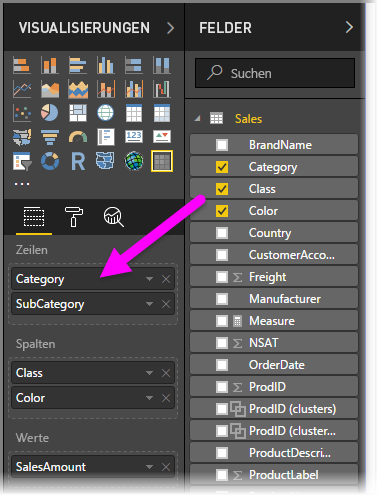

Wenn für die Visualisierung im Abschnitt **Zeilen** eine Gruppierung erstellt wurde, werden oben links in der Visualisierung selbst die Symbole für *Drill* und *Erweitern* angezeigt.

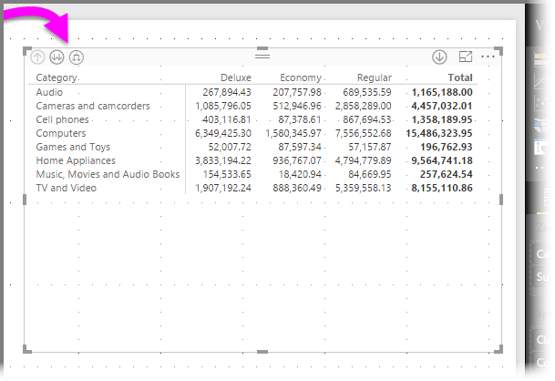

Mit diesen Schaltflächen können Sie in der Hierarchie einen Drilldown (oder Drillup) ausführen (das Verhalten gleicht dem in anderen Visualisierungen). In diesem Fall können Sie einen Drilldown von *Kategorie* zu *Unterkategorie* ausführen (siehe die folgende Abbildung, in der das Gabelpfeil-Symbol für den Drilldown um eine Ebene ausgewählt wurde).

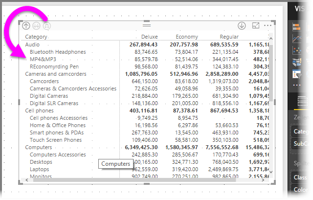

Statt die Symbole zu verwenden, können Sie auch mit der rechten Maustaste auf eine beliebige Zeilenüberschrift klicken und den Drilldown über das nun angezeigte Menü ausführen.

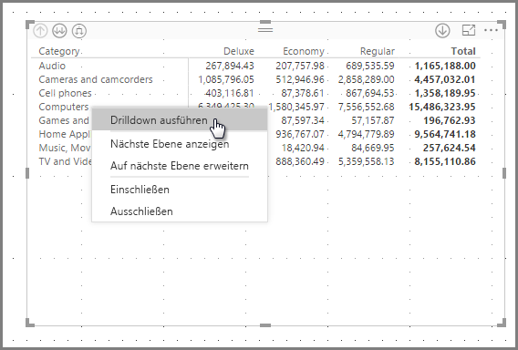

Das Menü enthält verschiedene Optionen, die zu unterschiedlichen Ergebnissen führen:

Mit **Drilldown** wird die Matrix für *diese* Zeilenebene erweitert, alle anderen Zeilenüberschriften, mit Ausnahme derjenigen, auf die der Rechtsklick ausgeführt wurde, sind *nicht betroffen*. In der folgenden Abbildung wurde auf *Computer* geklickt, und **Drilldown** wurde ausgewählt. Wie Sie sehen, werden andere Zeilen, die der höchsten Ebene angehören, nicht mehr in der Matrix angezeigt. Dieses nützliche Feature zum Ausführen von Drilldowns wird im Abschnitt **Kreuzhervorhebungen** genauer erläutert.

Um zur Ansicht der obersten Ebene zurückzukehren, klicken Sie auf das Symbol für **Drillup**. Wenn Sie im Kontextmenü **Nächste Ebene anzeigen** auswählen, wird eine alphabetische Liste aller Elemente auf der nächsten Ebene (hier das Feld *Unterkategorie*) ohne die Kategorisierung der höheren Hierarchieebene angezeigt.

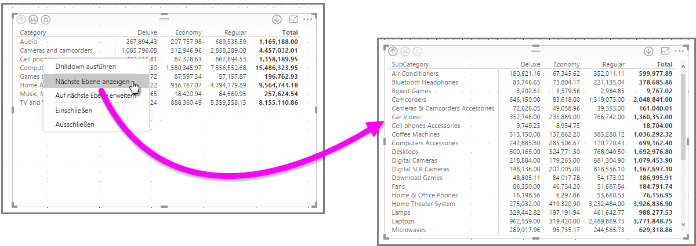

Wenn Sie links oben auf das Symbol für **Drillup** klicken, werden wieder alle Kategorien auf der obersten Ebene in der Matrix angezeigt. Wenn Sie nun erneut einen Rechtsklick ausführen und **Auf nächste Ebene erweitern** auswählen, wird das folgende Visual angezeigt.

Sie können auch die Menüelemente **Einschließen** und **Ausschließen** verwenden, um die Zeile mit dem Rechtsklick (und ihre Unterkategorien) in der Matrix zu behalten oder aus ihr zu entfernen.

### Drilldown auf Spaltenüberschriften
Wie auf Zeilen können Sie auch auf **Spalten** einen Drilldown ausführen. In der folgenden Abbildung sehen Sie, dass der Feldbereich **Spalten** zwei Felder umfasst, sodass Sie wie bei Zeilen eine Hierarchie erstellen können (siehe oben in diesem Artikel). Der Feldbereich **Spalten** enthält *Klasse* und *Farbe*.

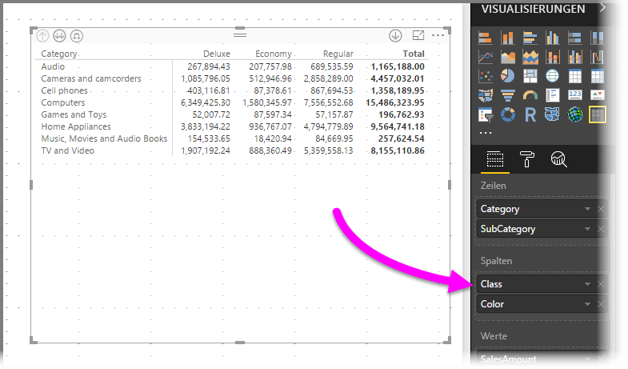

Wenn Sie im **Matrixvisual** mit der rechten Maustaste auf eine Spalte klicken, wird die Option für den Drilldown angezeigt. In der folgenden Abbildung haben wir einen Rechtsklick auf *Deluxe* ausgeführt und **Drilldown** ausgewählt.

Wenn Sie **Drilldown** auswählen, wird die nächste Ebene der Spaltenhierarchie von *Deluxe* angezeigt, in diesem Fall *Farbe*.

Alle weiteren Kontextmenüelemente für Spalten sind identisch mit denen für Zeilen (siehe den vorigen Abschnitt **Drilldown auf Zeilenüberschriften**). Wie bei Zeilen stehen bei Spalten die Optionen **Nächste Ebene anzeigen**, **Auf nächste Ebene erweitern**, **Einschließen** oder **Ausschließen** zur Verfügung.

> [!NOTE]
> Die Symbole für Drilldown und Drillup oben links im Matrixvisual gelten nur für Zeilen. Um einen Drilldown auf Spalten auszuführen, verwenden Sie das Kontextmenü.
> 
> 

## Abgestuftes Layout mit visuellen Matrixelementen
Beim **Matrixvisual** werden Unterkategorien in einer Hierarchie automatisch unter dem übergeordneten Element eingerückt. Dieser Einzug wird als **Abgestuftes Layout** bezeichnet.

In der *ursprünglichen* Version der Matrixvisualisierung wurden Unterkategorien in einer eigenen Spalte angezeigt. Dadurch beanspruchten sie deutlich mehr Platz in der Visualisierung. Im folgenden Bild wird die Tabelle im ursprünglichen **Matrixvisual** dargestellt. Beachten Sie die Unterkategorien in einer separaten Spalte.

In der Abbildung unten sehen Sie ein **Matrixvisual** mit aktiviertem **abgestuften Layout**. Bei der Kategorie *Computer* sind die Unterkategorien (Computerzubehör, Desktops, Laptops, Monitore usw.) leicht eingerückt und die Visualisierung ist klarer und prägnanter strukturiert.

Sie können die Einstellungen für das abgestufte Layout einfach anpassen. Erweitern Sie bei ausgewähltem **Matrixvisual** im Abschnitt **Format** (das Farbroller-Symbol) des Bereichs **Visualisierungen** den Abschnitt **Zeilenüberschriften**. Sie haben zwei Optionen: den Schalter **Abgestuftes Layout** (zum Ein-/Ausschalten des Layouts) und das Eingabefeld **Abgestufter Layouteinzug** (zum Festlegen des Einzugs in Pixel).

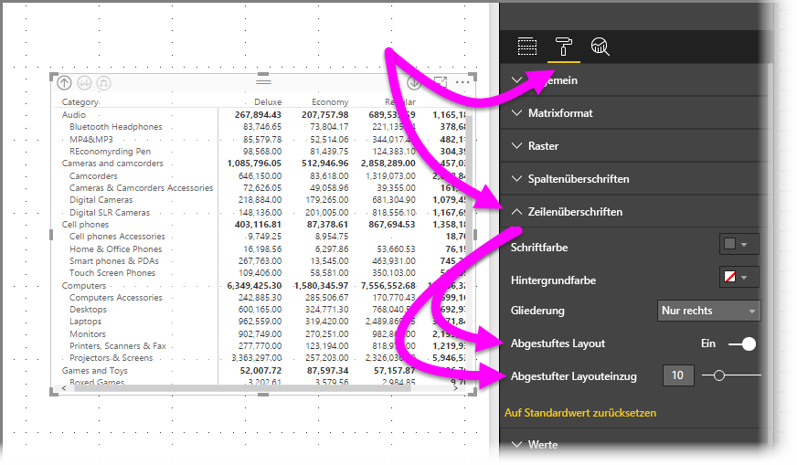

Wenn Sie die Option **Abgestuftes Layout** deaktivieren, werden die Unterkategorien nicht mehr unter dem übergeordneten Element eingerückt, sondern in einer eigenen Spalte angezeigt.

## Teilergebnisse mit Matrixvisuals
Sie können in Matrixvisuals Teilergebnisse sowohl für Zeilen als auch für Spalten aktivieren und deaktivieren. In der folgenden Abbildung sind die Teilergebnisse auf **Ein** festgelegt.

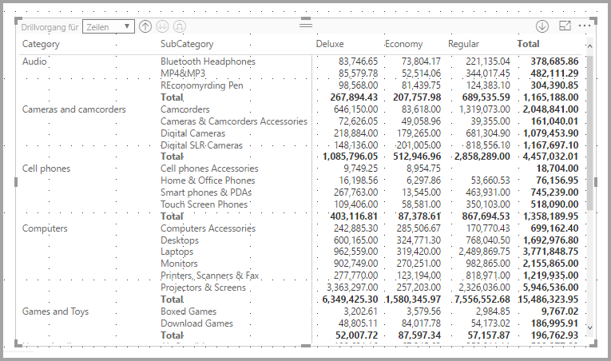

Erweitern Sie im Abschnitt **Format** des Bereichs **Visualisierungen** die Karte **Teilsummen**, und ziehen Sie den Schieberegler **Zeilenzwischensummen** auf **Aus**. Wenn Sie dies tun, werden die Teilergebnisse nicht angezeigt.

Dasselbe Verfahren wird für die Spaltenteilergebnisse angewendet.

## Kreuzhervorhebung mit visuellen Matrixelementen
Jedes Element im **Matrixvisual** kann als Basis für Kreuzhervorhebungen dienen. Wenn Sie in einem **Matrixvisual** eine Spalte auswählen, wird sie hervorgehoben (wie bei anderen Visuals auf der Berichtsseite). Diese Art von Kreuzhervorhebung ist ein Standardfeature in anderen Visuals und bei der Auswahl eines Datenpunkts, das jetzt auch im **Matrixvisual** unterstützt wird.

Auch wird STRG+Klicken jetzt für die Kreuzhervorhebung unterstützt. In der folgenden Abbildung sehen Sie eine Reihe von Unterkategorien, die im **Matrixvisual** ausgewählt wurden. Nicht ausgewählte Elemente sind abgeblendet (grau). Andere Visuals auf der Seite reflektieren die im **Matrixvisual** getroffene Auswahl.

## Kopieren von Werten aus Power BI zum Verwenden in anderen Anwendungen

Womöglich enthält Ihre Matrix oder Tabelle Inhalte, die Sie in anderen Anwendungen wie Dynamics CRM oder Excel oder sogar in anderen Power BI-Berichten verwenden möchten. Sie können in Power BI mit der rechten Maustaste auf eine einzelne Zelle oder eine Zellenauswahl klicken, um sie in die Zwischenablage zu kopieren und in die andere Anwendung einzufügen.

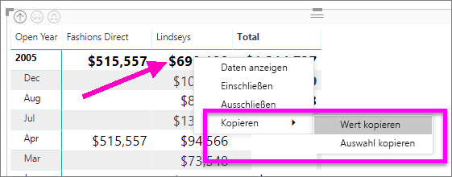

* Um den Wert einer einzelnen Zelle zu kopieren, wählen Sie die Zelle aus, klicken Sie mit der rechten Maustaste, und wählen Sie **Wert kopieren** aus. Der unformatierte Zellenwert befindet sich in der Zwischenablage und lässt sich nun in eine andere Anwendung einfügen.

    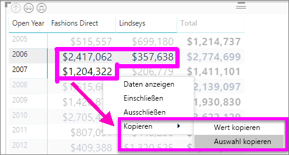

* Um mehrere Zellen zu kopieren, markieren Sie einen Zellbereich, oder verwenden Sie die STRG-TASTE, um eine oder mehrere Zellen auszuwählen. Die Kopie enthält die Spalten- und Zeilenüberschriften.

    

## Schattierung und Schriftfarben für Matrixvisuals
Mit dem **Matrixvisual** können Sie **Bedingte Formatierung** (Farben und Schattierung) auf den Hintergrund von Zellen in der Matrix und bedingte Formatierung auf den Text und die Werte selbst anwenden.

Um bedingte Formatierung anzuwenden, können Sie einen der folgenden Schritte ausführen, wenn ein Matrixvisual ausgewählt ist:

* Klicken Sie im Bereich **Felder** mit der rechten Maustaste auf das Feld, und wählen Sie im Menü **Bedingte Formatierung** aus.
  
  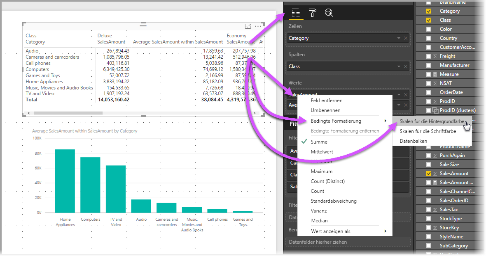
* Oder erweitern Sie im Bereich **Format** die Karte **Bedingte Formatierung**, und ziehen Sie den Schieberegler für **Skalen für die Hintergrundfarbe** oder **Skalen für die Schriftfarbe** auf **Ein**. Durch Aktivieren einer dieser Optionen wird ein Link für *Erweiterte Steuerelemente* angezeigt, sodass Sie die Farben und Werte für die Farbformatierung anpassen können.
  
  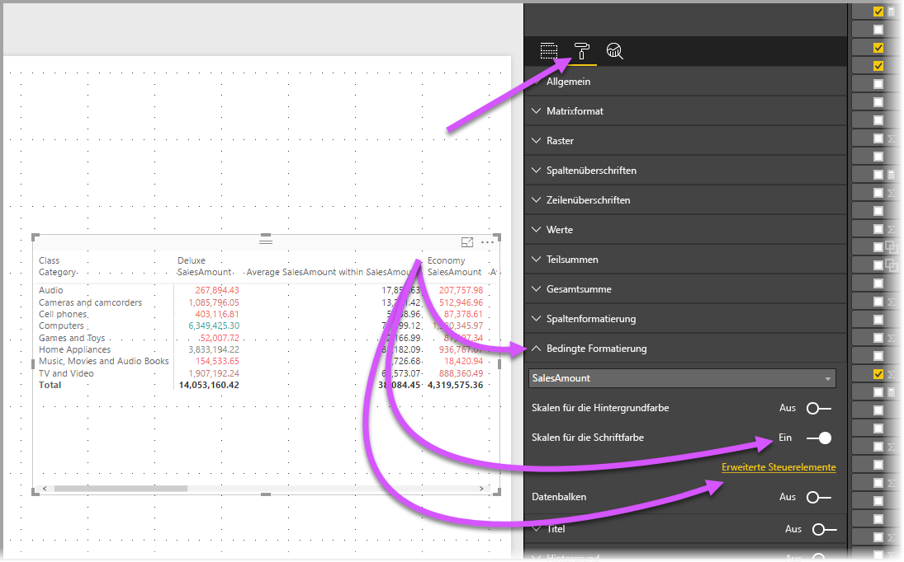

Mit beiden Vorgehensweisen wird das gleiche Ergebnis erreicht. Nach Auswahl von *Erweiterte Steuerelemente* wird das folgende Dialogfeld angezeigt, in dem Sie Anpassungen vornehmen können:

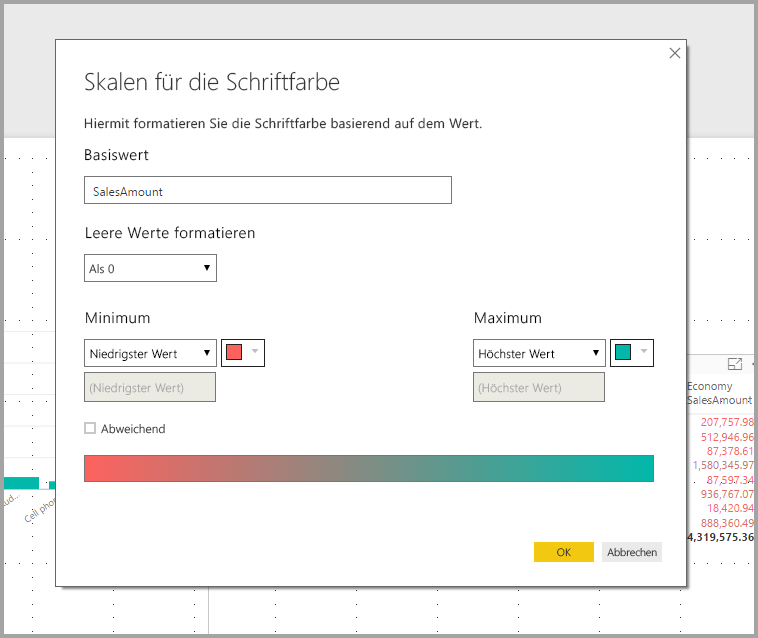

## Nächste Schritte

[Punkt- und Blasendiagramme in Power BI](power-bi-visualization-scatter.md)

[Visualisierungstypen in Power BI](power-bi-visualization-types-for-reports-and-q-and-a.md)