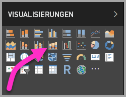
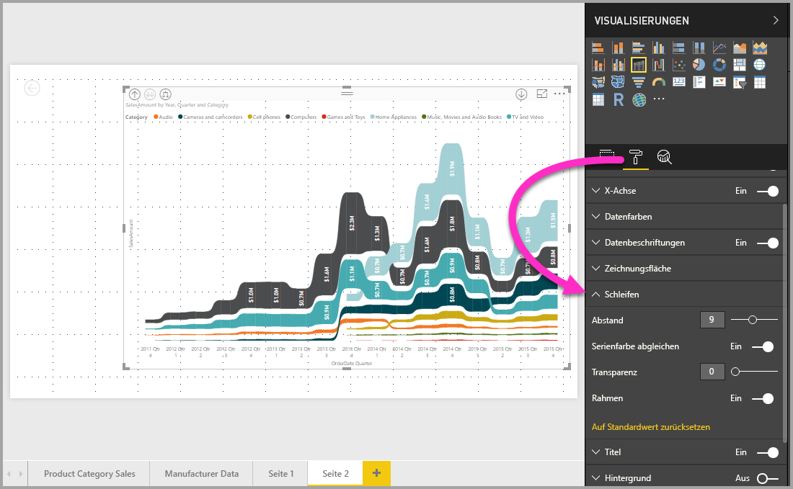

# Verwenden von Menübanddiagrammen in Power BI
Mit den Menübanddiagrammen können Sie Daten visualisieren und schnell feststellen, welche Kategorie von Daten den höchsten Rang (größten Wert) hat. Menübanddiagramme eignen sich gut zum Anzeigen von Rangänderungen, wobei der höchste Rang (Wert) immer für jeden Zeitraum oben angezeigt wird. 

## Erstellen eines Menübanddiagramms
Wählen Sie zum Erstellen eines leeren Diagramms die Option **Menübanddiagramm** im Bereich **Visualisierungen** aus.

Menübanddiagramme verknüpfen eine Kategorie von Daten über das visualisierte Zeitkontinuum mithilfe von Bändern, sodass Sie den Rang einer bestimmten Kategorie während der gesamten Spanne der X-Achse (in der Regel die Zeitachse) erkennen können.

## Formatieren eines Menübanddiagramms
Wenn Sie ein Menübanddiagramm erstellen, stehen Ihnen im Abschnitt **Format** des Bereichs **Visualisierungen** Formatierungsoptionen zur Verfügung. Die Formatierungsoptionen für Menübanddiagramme ähneln denen für ein gestapeltes Säulendiagramm, mit zusätzlichen speziellen Formatierungsoptionen für die Bänder.

Mit den Formatierungsoptionen für Menübanddiagramme können Sie Anpassungen vornehmen.

* Mit **Abstand** können Sie den Abstand zwischen Bändern anpassen. Die Zahl ist der Prozentwert der maximalen Höhe der Spalte.
* Mit **Serienfarbe abgleichen** können Sie die Farbe der Bänder an die Reihenfarbe anpassen. Wenn die Option auf **Aus** festgelegt ist, sind die Bänder grau.
* **Transparenz** gibt die Transparenz der Bänder an. Der Standardwert ist 30.
* Mit **Rand** können Sie am oberen und unteren Rand der Bänder einen dunklen Rahmen platzieren. „Rand“ ist standardmäßig deaktiviert.

## Nächste Schritte

[Punktdiagramme und Blasendiagramme in Power BI](power-bi-visualization-scatter.md)

[Visualisierungstypen in Power BI](power-bi-visualization-types-for-reports-and-q-and-a.md)