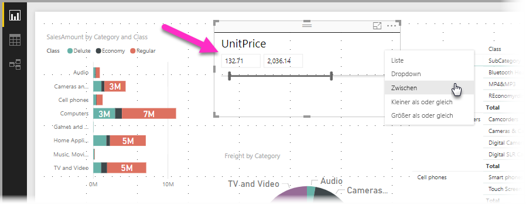
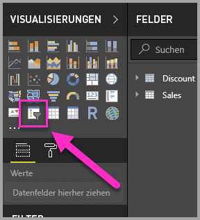
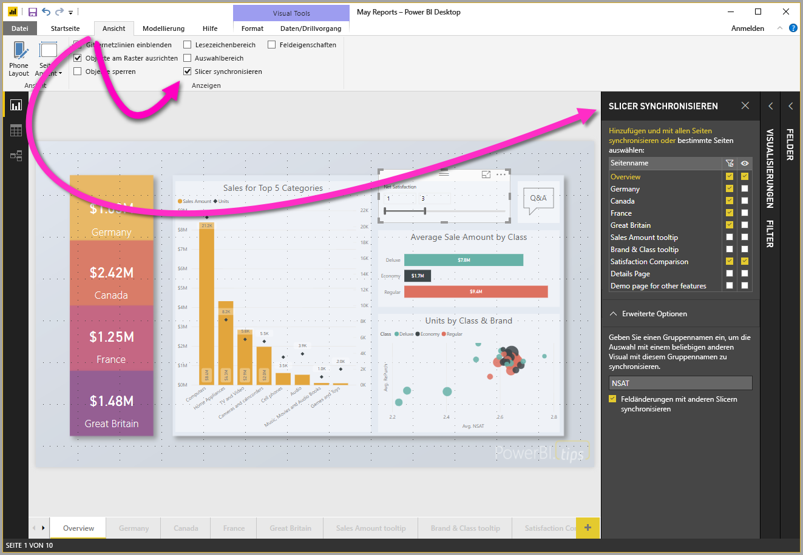
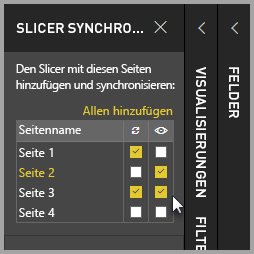
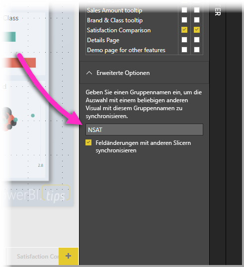

# Verwenden von Slicern in Power BI Desktop

Sie können einen **Slicer** in **Power BI Desktop** verwenden, um die Ergebnisse von Visuals auf Ihrer Berichtsseite zu filtern. Mithilfe von Slicern können Sie den angewendeten Filter einfach anpassen, indem Sie mit dem Slicer interagieren. Sie können ebenfalls Optionen dafür angeben, wie Ihr Slicer angezeigt wird und wie Sie mit diesem interagieren. Die folgende Abbildung stellt einen Slicer dar, dessen Dropdownmenü für *Typen* angezeigt wird. 

Ein Slicer kann für folgende Typen angezeigt werden:

* Liste
* Dropdown
* Zwischen
* Kleiner als oder gleich
* Größer als oder gleich

Sie können einen Slicer zu einem Bericht hinzufügen, indem Sie auf das Visual **Slicer** im Bereich **Visualisierungen** klicken.

Das Verhalten von Slicern ist in **Power BI Desktop** und im **Power BI-Dienst** ähnlich. Einen Artikel zur Verwendung von Slicern finden Sie unter [Slicer im Power BI-Dienst](power-bi-visualization-slicers.md).

## Synchronisieren von Slicern über mehrere Berichtsseiten

In **Power BI Desktop** können Sie Slicer über mehrere Berichtsseiten synchronisieren. Klicken Sie im Bereich **Ansicht** im Menüband auf **Slicer synchronisieren**, um Slicer zu synchronisieren. Wenn Sie Slicers synchronisieren, wird der Bereich **Slicer synchronisieren** wie in der folgenden Abbildung dargestellt angezeigt.

Im Bereich **Slicer synchronisieren** können Sie angeben, wie der Slicer über mehrere Berichtsseiten synchronisiert werden soll. Sie können angeben, ob jeder Slicer auf jede einzelne Berichtsseite **angewendet** werden soll und ob der Slicer auf jeder einzelnen Berichtsseite **sichtbar** sein soll.

Sie können einen Slicer wie in der folgenden Abbildung dargestellt beispielsweise auf **Seite 2** Ihres Berichts platzieren. Sie können dann auswählen, ob dieser Slicer für jede ausgewählte Seite *gelten* soll und ob der Slicer auf jeder ausgewählten Seite im Bericht *sichtbar* sein soll. Für jeden Slicer können Sie eine beliebige Kombination dieser Optionen anwenden. 

Durch den Link **Allen hinzufügen** in diesem Bereich wird der ausgewählte Slicer auf alle Seiten im Bericht angewendet.

Beachten Sie, dass die Auswahl, die im Bereich **Slicer synchronisieren** angezeigt wird, nur für den *ausgewählten Slicer* gilt. Sie können mehrere Slicer auf verschiedene Seiten anwenden und den Bereich verwenden, um zu definieren, wie jeder Slicer auf die verschiedenen Seiten Ihres Berichts angewendet wird. 

Die Auswahl der Slicer kann synchronisiert werden, andere Auswahlen wie die Formatierung, die Bearbeitung und das Löschen werden jedoch *nicht* synchronisiert. 

## Erweiterte Optionen für Slicer

Im Bereich **Slicer synchronisieren** können Sie im Abschnitt **Erweiterte Optionen** auch einer Sammlung von Slicern einen **Gruppennamen** zuweisen und Slicer in derselben Gruppe seitenübergreifend synchronisieren lassen. 

Mit dieser Funktion können Sie eine benutzerdefinierte Gruppe von Slicern erstellen, die synchron gehalten wird. Ein Standardname wird angeboten, aber Sie können auch einen anderen Namen wählen. 

Der Gruppenname bietet zusätzliche Flexibilität bei Slicern. Sie können separate Gruppen erstellen, um Slicer zu synchronisieren, die dasselbe Feld verwenden, oder Slicer, die unterschiedliche Felder verwenden, derselben Gruppe zuordnen. 

## Auswirkungen der Filterung auf die Auswahl in Datenschnitten

Wenn Sie in einem Datenschnitt eine Auswahl vornehmen und dann einen Filter anwenden, der das ausgewählte Element normalerweise entfernen würde, verbleibt es am Ende der Liste der Elemente im Datenschnitt. Wenn der Filter entfernt wird, ist die Auswahl immer noch im Datenschnitt vorhanden. Sie werden feststellen, dass, wenn Sie das Element im Datenschnitt deaktivieren, es aus der Liste entfernt wird.

## Nächste Schritte

Folgende Artikel könnten Sie ebenfalls interessieren:

* [Slicer im Power BI-Dienst](power-bi-visualization-slicers.md)
* [Verwenden der Funktion „Slicer für numerischen Bereich“ in Power BI Desktop](../desktop-slicer-numeric-range.md)
* [Verwenden eines relativen Slicers mit Datum und eines relativen Datumsfilters in Power BI Desktop](desktop-slicer-filter-date-range.md)

