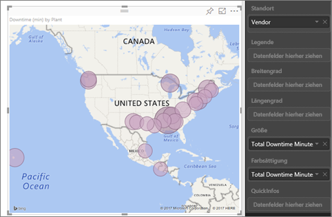
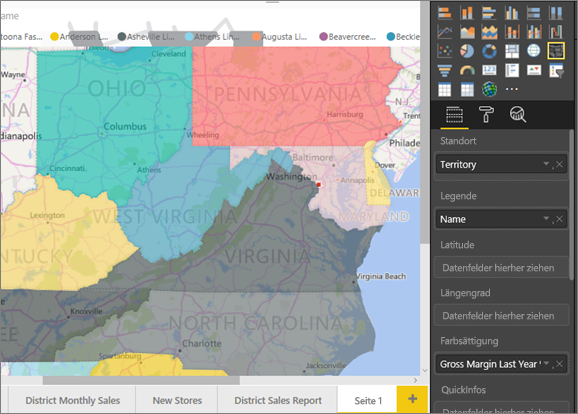
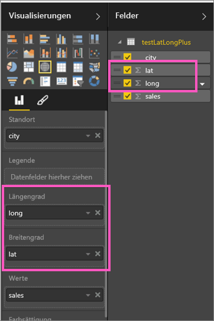
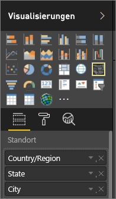

# Tipps und Tricks für Power BI-Kartenvisualisierungen
Power BI arbeitet mit Bing Maps zusammen, um Standardkartenkoordinaten bereitzustellen (ein Prozess, der als Geocodierung bezeichnet wird), sodass Sie Karten erstellen können. Beide identifizieren mit Algorithmen den richtigen Standort, manchmal ist es jedoch lediglich eine bestmögliche Schätzung. Wenn Power BI allein keine eigene Kartenvisualisierung erstellen kann, wird auf Bing Maps zurückgegriffen. 

Sie oder der Administrator müssen möglicherweise die Firewall aktualisieren, um den Zugriff auf die von Bing für die Geocodierung verwendeten URLs zuzulassen.  Diese URLs lauten:
* https://dev.virtualearth.net/REST/V1/Locations
* https://platform.bing.com/geo/spatial/v1/public/Geodata
* https://www.bing.com/api/maps/mapcontrol

Befolgen Sie die nachstehenden Tipps, um die Wahrscheinlichkeit einer korrekten Geocodierung zu erhöhen. Orientieren Sie sich an der ersten Gruppe von Tipps, wenn Sie auf das Dataset selbst zugreifen können. Die zweite Gruppe von Tipps betrifft Aktionen, die Sie in Power BI ausführen können, wenn Sie keinen Zugriff auf das Dataset haben. Und die letzte Gruppe ist eine Liste mit URLs.

## An Bing Maps gesendete Informationen
Der Power BI-Dienst und Power BI Desktop senden die Geodaten an Bing, die Bing zum Erstellen der Kartenvisualisierung benötigt. Dies kann die Daten in den Buckets **Standort**, **Breitengrad** und **Längengrad** sowie geografische Felder in jedem der Buckets **Berichtsstufenfilter**, **Filter auf Seitenebene** oder **Filter auf visueller Ebene** umfassen. Welche Daten genau gesendet werden, variiert je nach Kartentyp. Weitere Informationen finden Sie in der [Bing Maps-Datenschutzerklärung](https://go.microsoft.com/fwlink/?LinkID=248686).

* Für Karten (Blasendiagrammkarten) werden, wenn Breiten- und Längengrad bereitgestellt werden, keine Daten an Bing gesendet. Andernfalls werden alle Daten in „Standort“ und in den Filterbuckets an Bing gesendet.     
* Flächenkartogramme erfordern ein Feld im Bucket „Standort“, auch wenn Breiten- und Längengrad angegeben werden. Alle Daten in den Buckets „Standort“, „Breitengrad“ und „Längengrad“ werden an Bing gesendet.
  
    Im folgenden Beispiel wird das Feld **Vendor** für Geocodierung verwendet, somit werden alle Lieferantendaten an Bing gesendet. Daten aus den Bucktes **Größe** und **Farbsättigung** werden nicht an Bing gesendet.
  
    
  
    Im folgenden zweiten Beispiel wird das Feld **Gebiet** für Geocodierung verwendet, somit werden alle Gebietsdaten an Bing gesendet. Daten aus den Buckets **Legende** und **Farbsättigung** werden nicht an Bing gesendet.
  
    

## Im Dataset: Tipps zur Verbesserung des zugrunde liegenden Datasets
Wenn Sie Zugriff auf das Dataset haben, das zum Erstellen der Kartenvisualisierung verwendet wird, können Sie durch das Beachten einiger Hinweise die Wahrscheinlichkeit einer richtigen Geocodierung erhöhen.

**1. Kategorisieren von geografischen Feldern in Power BI Desktop**

In Power BI Desktop können Sie sicherstellen, dass Felder richtig geocodiert sind, indem Sie die *Datenkategorie* der Datenfelder festlegen. Wählen Sie die gewünschte Tabelle aus, wechseln Sie zum Menüband **Erweitert**, und legen Sie dann die **Datenkategorie** auf **Adresse**, **Ort**, **Kontinent**, **Land/Region**, **Landkreis**, **Postleitzahl**, **Bundesland** oder **Kanton** fest. Diese Datentypkategorien helfen Bing, das Datum richtig zu codieren. Weitere Informationen finden Sie unter [Datenkategorisierung in Power BI Desktop](../desktop-data-categorization.md). Wenn Sie eine Liveverbindung mit SQL Server Analysis Services herstellen, müssen Sie die Kategorisierung von Daten außerhalb von Power BI mit [SQL Server Data Tools (SSDT)](https://docs.microsoft.com/sql/ssdt/download-sql-server-data-tools-ssdt) festlegen.

**2. Verwenden mehrerer Standortspalten**    
 Manchmal reicht es trotz Einstellen der Datenkategorien für die Zuordnung nicht aus, dass Bing Ihre Absichten richtig errät. Einige Bezeichnungen sind mehrdeutig, wenn der Ort in mehreren Ländern oder Regionen vorhanden ist. So gibt es beispielsweise ***Southampton*** in England sowie in den Bundesstaaten Pennsylvania und New York.

In Power BI wird Bings [Vorlagendienst für unstrukturierte URLs](https://msdn.microsoft.com/library/ff701714.aspx) verwendet, um die Koordinaten für Breitengrad und Längengrad anhand einer Menge von Adresswerten für ein beliebiges Land zu bestimmen. Enthalten Ihre Daten nicht genügend Standortdaten, fügen Sie diese Spalten hinzu, und kategorisieren Sie diese entsprechend.

 Wenn z.B. nur eine Spalte für „Ort“ vorhanden ist, ist die Geocodierung für Bing möglicherweise schwierig auszuführen. Fügen Sie weitere Geospalten hinzu, um den Standort eindeutig festzulegen.  Manchmal muss dem Dataset lediglich eine weitere Standortspalte hinzugefügt werden, in diesem Fall „Bundesland/Kanton“. Und vergessen Sie nicht die ordnungsgemäße Kategorisierung der Spalte, siehe Punkt 1 weiter oben.

Stellen Sie sicher, dass jedes Feld nur die spezifischen Informationen für die Kategorisierung enthält.  Beispielsweise sollte das Standortfeld „Ort“ **Southampton** lauten, nicht **Southampton, New York**.  Adressfelder für den Standort sollten ebenfalls **1 Microsoft Way** und nicht **1 Microsoft Way, Redmond, WA** lauten.

**3. Verwenden Sie bestimmte Breiten- und Längengrade**

Fügen Sie dem Dataset Breitengrad- und Längengradwerte hinzu. Hierdurch wird jede Mehrdeutigkeit aufgelöst, und Ergebnisse werden schneller zurückgegeben. Breiten- und Längengradfelder müssen im *Dezimalzahl* format sein, das Sie im Datenmodell festlegen können.

<iframe width="560" height="315" src="https://www.youtube.com/embed/ajTPGNpthcg" frameborder="0" allowfullscreen></iframe>

**4. Verwenden der Ortskategorie für Spalten mit vollständigen Standortinformationen**

Auch wenn die Verwendung von geografischen Hierarchien in Karten empfohlen wird, können Sie die Datenkategorisierung auf **Ort** festlegen, wenn Sie eine einzelne Standortspalte mit vollständigen geografische Informationen verwenden müssen. Wenn es sich bei den Daten in der Spalte z.B. um vollständige Adressen handelt (beispielsweise „1 Microsoft Way, Redmond Washington 98052“), ist diese generalisierte Datenkategorie am besten für Bing geeignet. 

## In Power BI: Tipps für bessere Ergebnisse bei Verwendung von Kartenvisualisierungen
**1. Verwenden Sie Breiten- und Längengradfelder (sofern vorhanden)**

Wenn in Power BI das verwendete Dataset Felder für Längen- und Breitengrad enthält, nutzen Sie diese!  Power BI bietet spezielle Buckets, die es erleichtern, Kartendaten eindeutig zu machen. Ziehen Sie das Feld mit den Breitengraddaten in den Bereich **Visualisierungen > Breitengrad**.  Führen Sie für den Längengrad die gleichen Schritte aus. Wenn Sie dies tun, müssen Sie auch das Feld *Ortsangabe* beim Erstellen der Visualisierungen ausfüllen. Andernfalls werden die Daten standardmäßig aggregiert, beispielsweise würden der Breiten- und Längengrad auf Bundesstaatebene und nicht Ortsebene kombiniert.

 

## Verwenden Sie geografische Hierarchien, um einen Drilldown auf unterschiedliche Ebenen des Standorts ausführen zu können.
Wenn das Dataset bereits verschiedene Ebenen von Standortdaten aufweist, können Sie und Ihre Kollegen mit Power BI *geografische Hierarchien* erstellen. Ziehen Sie zu diesem Zweck mehrere Felder in den Bucket **Standort**. Durch diese gemeinsame Verwendung der Felder wird aus ihnen eine geografische Hierarchie. Im folgenden Beispiel wurden die folgenden geografischen Felder hinzugefügt: „Land/Region“, „Bundesstaat“ und „Ort“. Sie und Ihre Kollegen können in Power BI mithilfe dieser geografischen Hierarchie Drilldowns und Drillups ausführen.

  

   

Beim Drilling in geografischen Hierarchien müssen Sie wissen, wie die einzelnen Drillschaltflächen funktionieren und welche Informationen an Bing Maps gesendet werden. 

* Mit der Drillschaltfläche ganz rechts (Drillmodus ) können Sie einen Kartenstandort auswählen und Ebene für Ebene einen Drilldown zu diesem Standort ausführen. Wenn Sie z.B. Drilldown aktivieren und auf Nordamerika klicken, gehen Sie in der Hierarchie nach unten weiter zur nächsten Ebene, den Bundesstaaten in Nordamerika. Für die Geocodierung sendet Power BI nur Daten zu Ländern und Bundesstaaten in Nordamerika an Bing Maps.  
* Auf der linken Seite stehen zwei weitere Drilloptionen zur Verfügung. Mit der ersten Option  wird ein Drillvorgang zur nächsten Ebene in der Hierarchie für alle Standorte gleichzeitig durchgeführt. Wenn Sie z.B. gerade Länder betrachten und mit dieser Option zur nächsten Ebene (Staaten) wechseln, zeigt Power BI Daten zu Bundesstaaten für alle Länder an. Für die Geocodierung sendet Power BI für alle Standorte Daten zum Bundesstaat (nicht zum Land) an Bing Maps. Diese Option ist nützlich, wenn die einzelnen Ebenen in der Hierarchie keine Beziehung zur Ebene darüber haben. 
* Die zweite Option  ähnelt einem Drilldown, mit dem Unterschied, dass Sie nicht auf die Karte klicken müssen.  Die Ansicht wird nach unten zur nächsten Ebene der Hierarchie erweitert, wobei der Kontext der aktuellen Ebene gespeichert wird. Wenn Sie z.B. gerade Länder betrachten und dieses Symbol auswählen, navigieren Sie in der Hierarchie nach unten auf die nächste Ebene, die Bundesstaaten. Für die Geocodierung sendet Power BI Daten für jeden Bundesstaat und das entsprechende Land, damit die Geocodierung in Bing Maps genauer erfolgen kann. Bei den meisten Karten verwenden Sie diese Option oder die Option „Drilldown“ ganz rechts, damit Sie so viele Informationen wie möglich an Bing senden und genaue Standortinformationen abrufen können. 

## Nächste Schritte
[Drilldown in einer Visualisierung in Power BI](../consumer/end-user-drill.md)

[Power Bi-Visualisierung](power-bi-report-visualizations.md)

Weitere Fragen? [Wenden Sie sich an die Power BI-Community](http://community.powerbi.com/)

