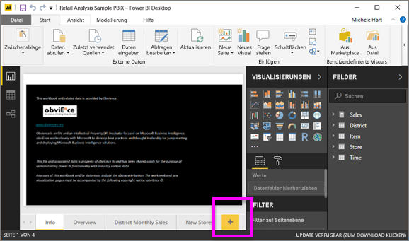
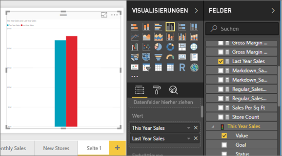
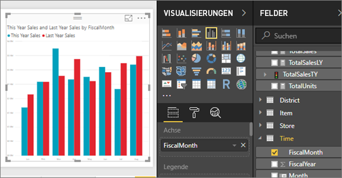
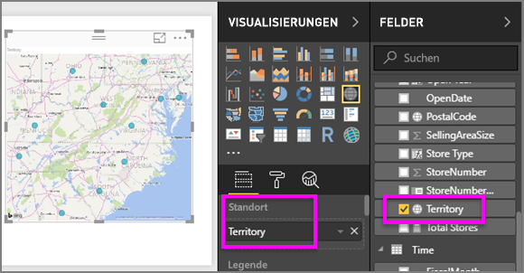
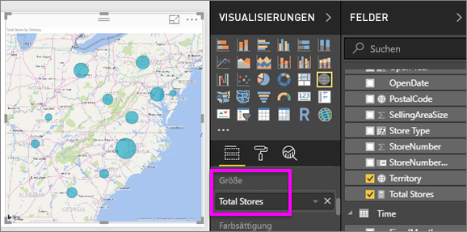
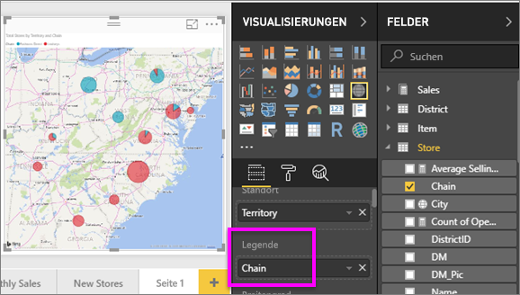

# Teil 2 – Hinzufügen von Visualisierungen zu einem Power BI-Bericht
In [Teil 1](power-bi-report-add-visualizations-ii.md) haben Sie eine einfache Visualisierung erstellt, indem Sie Kontrollkästchen neben Feldnamen aktiviert haben.  In Teil 2 lernen Sie, wie Sie Drag &amp; Drop verwenden und die Funktionen der Bereiche **Felder** und **Visualisierungen** nutzen, um Visualisierungen zu erstellen und zu ändern.

### Voraussetzungen
- [Teil 1](power-bi-report-add-visualizations-ii.md)
- Power BI Desktop: Mithilfe des Power BI-Diensts bzw. Power BI Desktop können Visualisierungen zu Berichten hinzugefügt werden. Dieses Tutorial verwendet Power BI Desktop. 
- [Analysebeispiel für den Einzelhandel](http://download.microsoft.com/download/9/6/D/96DDC2FF-2568-491D-AAFA-AFDD6F763AE3/Retail%20Analysis%20Sample%20PBIX.pbix)

## Erstellen einer neuen Visualisierung
In diesem Tutorial verwenden wir unser Dataset mit Einzelhandelsdaten und erstellen einige wichtige Visualisierungen.

### Öffnen Sie einen Bericht, und fügen Sie eine neue leere Seite hinzu.
1. Öffnen Sie die .PBIX-Datei mit dem Analysebeispiel für den Einzelhandel in Power BI Desktop. 
      

2. Fügen Sie eine neue Seite hinzu, indem Sie das gelbe Pluszeichen am unteren Rand des Zeichenbereichs auswählen.

### Fügen Sie eine Visualisierung hinzu, mit der der Umsatz dieses Jahres mit dem Umsatz des Vorjahrs verglichen wird.
1. Wählen Sie in der Tabelle **Verkäufe** zunächst **Verkäufe in diesem Jahr** > **Wert** und dann **Verkäufe im letzten Jahr** aus. Power BI erstellt ein Säulendiagramm.  Dies sieht interessant aus, und Sie möchten noch mehr erfahren. Wie hoch sind die Verkäufe pro Monat?  
   
   
2. Ziehen Sie aus der Zeittabelle **FiscalMonth** in den Bereich **Achse**.  
   
3. [Ändern Sie die Visualisierung](power-bi-report-change-visualization-type.md) in ein Flächendiagramm.  Es gibt viele Arten von Visualisierung, aus denen Sie wählen können. In den dazugehörigen [Beschreibungen, Tipps für bewährte Methoden und Tutorials](power-bi-visualization-types-for-reports-and-q-and-a.md) finden Sie Hilfe zum Auswählen des geeigneten Typs. Klicken Sie im Bereich „Visualisierungen“ auf das Symbol für das Flächendiagramm .
4. Sortieren Sie die Visualisierungen, indem Sie auf die Auslassungspunkte klicken und **Sortieren nach FiscalMonth** auswählen.
5. [Ändern Sie die Größe der Visualisierung](power-bi-visualization-move-and-resize.md), indem Sie die Visualisierung auswählen und einen der Konturkreise per Ziehbewegung verschieben. Machen Sie die Visualisierung so breit, dass die Scrollleiste ausgeblendet wird, und klein genug, damit noch Platz für eine weitere Visualisierung ist.
   
   
6. [Speichern Sie den Bericht](../service-report-save.md).

### Hinzufügen einer Kartenvisualisierung für Verkäufe nach Standort
1. Wählen Sie in der Tabelle **Geschäft** **Gebiet** aus. Power BI erkennt, dass „Gebiet“ ein Ort ist, und erstellt eine Kartenvisualisierung.  
   
2. Ziehen Sie **Läden gesamt** in den Bereich „Werte“.  
   
3. Fügen Sie eine Legende hinzu.  Ziehen Sie **Kette** in den Bereich „Legende“, um die Daten nach dem Namen des Geschäfts anzuzeigen.  
   

## Nächste Schritte
* Weitere Informationen zu [Visualisierungen in Power BI-Berichten](power-bi-report-visualizations.md).  
* Weitere Fragen? [Wenden Sie sich an die Power BI-Community](http://community.powerbi.com/)

